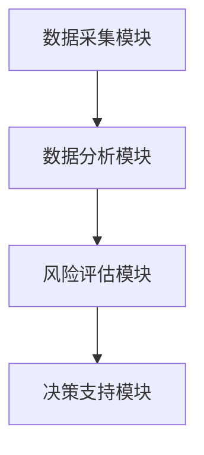

                 


# 利用多智能体系统进行全面的地缘政治风险评估

## 关键词：
多智能体系统, 地缘政治风险评估, 分布式计算, 地缘政治分析, 风险管理, 多智能体协作, 系统架构设计

## 摘要：
本文详细探讨了利用多智能体系统进行全面的地缘政治风险评估的方法。首先，文章介绍了多智能体系统的定义、特点及其在地缘政治风险评估中的应用前景。接着，分析了多智能体系统的通信协议、任务分配和决策机制等核心概念，并通过数学模型和公式详细阐述了地缘政治风险评估的算法原理。最后，通过具体的案例分析，展示了多智能体系统在地缘政治风险评估中的实际应用，并总结了系统架构设计和最佳实践的建议。本文旨在为地缘政治风险评估提供一种创新的方法论和实践指导。

---

## 第1章: 多智能体系统与地缘政治风险评估的背景介绍

### 1.1 多智能体系统的定义与特点

#### 1.1.1 多智能体系统的定义
多智能体系统（Multi-Agent System, MAS）是由多个相互作用的智能体组成的系统，这些智能体能够通过通信和协作完成复杂的任务。智能体是指能够感知环境、做出决策并采取行动的实体。

#### 1.1.2 多智能体系统的核心特点
- **自主性**：每个智能体都具有自主决策的能力。
- **反应性**：智能体能够实时感知环境并做出反应。
- **协作性**：多个智能体能够通过通信和协作完成共同目标。
- **分布性**：智能体之间分布在网络中，不存在中心化的控制节点。

#### 1.1.3 多智能体系统与传统单智能体系统的区别
- **单智能体系统**：由单一智能体完成任务，决策集中化，适合简单任务。
- **多智能体系统**：由多个智能体协作完成任务，适合复杂、分布式的问题。

### 1.2 地缘政治风险评估的定义与特点

#### 1.2.1 地缘政治风险的定义
地缘政治风险是指在特定地区或国家之间由于政治、经济、社会、文化等因素的变化而可能导致的政治不稳定或冲突的可能性。

#### 1.2.2 地缘政治风险的核心要素
- **政治因素**：政府稳定性、政策变化、选举等。
- **经济因素**：经济状况、贸易关系、资源分配等。
- **社会因素**：民族矛盾、社会动荡、公众舆论等。
- **文化因素**：宗教冲突、文化差异等。

#### 1.2.3 地缘政治风险评估的复杂性与挑战
- **不确定性**：地缘政治风险受到多种复杂因素的影响，难以预测。
- **动态性**：风险因素会随着时间和环境的变化而变化。
- **多维度性**：需要综合考虑政治、经济、社会等多个维度。

### 1.3 多智能体系统在地缘政治风险评估中的应用前景

#### 1.3.1 多智能体系统的优势
- **分布式计算能力**：能够处理大规模、复杂的地缘政治数据。
- **协作能力**：多个智能体可以协同分析不同维度的风险因素。
- **实时性**：能够实时感知和响应地缘政治的变化。

#### 1.3.2 多智能体系统在地缘政治风险评估中的潜在应用领域
- **国际关系分析**：分析国家间的互动和潜在冲突。
- **区域稳定评估**：评估特定地区的政治稳定性。
- **危机管理**：在危机发生时快速响应并制定应对策略。

#### 1.3.3 多智能体系统应用的挑战与机遇
- **挑战**：智能体之间的通信和协作需要高效的协议支持，且数据隐私和安全问题需要解决。
- **机遇**：通过多智能体系统的协作，能够更全面、更精准地评估地缘政治风险。

---

## 第2章: 多智能体系统的核心概念与联系

### 2.1 多智能体系统的通信协议

#### 2.1.1 通信协议的定义
通信协议是指智能体之间进行信息交换的规则和格式。通信协议决定了智能体之间如何传递数据、解析数据以及如何进行交互。

#### 2.1.2 常见的通信协议类型
- **基于消息的通信协议**：智能体之间通过消息传递信息，如HTTP、MQTT等。
- **基于服务的通信协议**：智能体之间通过调用服务接口进行通信，如SOAP、RESTful等。

#### 2.1.3 通信协议在地缘政治风险评估中的应用
在地缘政治风险评估中，智能体之间需要实时交换政治、经济、社会等数据，通信协议的高效性和可靠性至关重要。

### 2.2 多智能体系统的任务分配

#### 2.2.1 任务分配的定义
任务分配是指将整体任务分解为多个子任务，并分配给不同的智能体完成。

#### 2.2.2 常见的任务分配算法
- **基于角色的分配**：根据智能体的职责分配任务。
- **基于能力的分配**：根据智能体的能力分配任务。
- **基于优先级的分配**：根据任务的优先级分配智能体。

#### 2.2.3 任务分配在地缘政治风险评估中的应用
在地缘政治风险评估中，任务分配可以用于将不同的风险因素分析任务分配给不同的智能体。

### 2.3 多智能体系统的决策机制

#### 2.3.1 决策机制的定义
决策机制是指智能体根据环境信息做出决策的规则和方法。

#### 2.3.2 常见的决策机制类型
- **基于规则的决策机制**：根据预定义的规则做出决策。
- **基于推理的决策机制**：通过逻辑推理做出决策。
- **基于学习的决策机制**：通过机器学习模型做出决策。

#### 2.3.3 决策机制在地缘政治风险评估中的应用
在地缘政治风险评估中，智能体需要根据收集到的政治、经济、社会等数据，通过决策机制评估风险级别。

---

## 第3章: 多智能体系统的算法原理

### 3.1 多智能体系统的核心算法

#### 3.1.1 分布式计算算法
分布式计算算法是指在分布式系统中进行计算的算法，如分布式一致性算法（如Paxos、Raft）、分布式事务算法等。

#### 3.1.2 协作算法
协作算法是指多个智能体通过协作完成任务的算法，如分布式任务分配算法、分布式优化算法等。

#### 3.1.3 聚合算法
聚合算法是指将多个智能体的结果聚合起来，形成最终结果的算法，如分布式共识算法、分布式投票算法等。

### 3.2 算法原理的数学模型

#### 3.2.1 分布式计算的数学模型
分布式计算的数学模型通常包括状态空间、转移函数、通信模型等。

#### 3.2.2 协作算法的数学模型
协作算法的数学模型通常包括任务分配模型、协作模型、结果聚合模型等。

#### 3.2.3 聚合算法的数学模型
聚合算法的数学模型通常包括一致性模型、共识模型等。

---

## 第4章: 地缘政治风险评估的数学模型与公式

### 4.1 地缘政治风险评估的核心公式

#### 4.1.1 风险值计算公式
$$ \text{风险值} = \sum_{i=1}^{n} w_i \times f_i $$

其中，$w_i$ 是第 $i$ 个风险因素的权重，$f_i$ 是第 $i$ 个风险因素的值。

#### 4.1.2 风险概率计算公式
$$ P(\text{风险发生}) = \sum_{i=1}^{n} p_i \times w_i $$

其中，$p_i$ 是第 $i$ 个风险因素发生的概率，$w_i$ 是第 $i$ 个风险因素的权重。

#### 4.1.3 风险影响评估公式
$$ \text{风险影响} = \sum_{i=1}^{n} i_i \times w_i $$

其中，$i_i$ 是第 $i$ 个风险因素的影响程度，$w_i$ 是第 $i$ 个风险因素的权重。

### 4.2 地缘政治风险评估的层次分析法

#### 4.2.1 层次分析法的定义
层次分析法（Analytic Hierarchy Process, AHP）是一种用于结构化决策问题的分析方法，适用于多因素决策问题。

#### 4.2.2 层次分析法的计算步骤
1. 构建层次结构模型。
2. 构建比较矩阵。
3. 计算权重向量。
4. 计算一致性检验。

#### 4.2.3 层次分析法在地缘政治风险评估中的应用
通过层次分析法，可以将复杂的地缘政治风险因素分解为多个层次，并通过权重计算确定每个因素的重要性。

---

## 第5章: 多智能体系统与地缘政治风险评估的系统架构设计

### 5.1 系统架构设计

#### 5.1.1 系统功能模块
- **数据采集模块**：采集政治、经济、社会等数据。
- **数据分析模块**：对数据进行分析和处理。
- **风险评估模块**：根据分析结果评估风险级别。
- **决策支持模块**：提供决策支持和建议。

#### 5.1.2 系统架构图


#### 5.1.3 系统交互流程
1. 数据采集模块通过通信协议采集数据。
2. 数据分析模块对数据进行处理和分析。
3. 风险评估模块根据分析结果评估风险级别。
4. 决策支持模块根据风险评估结果提供决策支持。

### 5.2 系统实现细节

#### 5.2.1 数据采集模块
数据采集模块通过多种数据源（如API、数据库）采集政治、经济、社会等数据。

#### 5.2.2 数据分析模块
数据分析模块使用层次分析法、聚类分析等方法对数据进行分析和处理。

#### 5.2.3 风险评估模块
风险评估模块根据分析结果计算风险值、风险概率和风险影响。

#### 5.2.4 决策支持模块
决策支持模块根据风险评估结果提供应对策略和建议。

---

## 第6章: 项目实战——基于多智能体系统的地缘政治风险评估

### 6.1 项目背景

#### 6.1.1 项目目标
评估中东地区的地缘政治风险。

#### 6.1.2 项目需求
- 数据采集：采集中东地区的政治、经济、社会等数据。
- 数据分析：分析数据，评估风险级别。
- 决策支持：提供应对策略和建议。

### 6.2 环境配置

#### 6.2.1 系统环境
- 操作系统：Linux
- 编程语言：Python
- 开发工具：Jupyter Notebook
- 依赖库：requests、pandas、numpy、scikit-learn

#### 6.2.2 数据源
- 数据采集：通过API获取中东地区的政治、经济、社会数据。
- 数据存储：存储在MySQL数据库中。

### 6.3 核心代码实现

#### 6.3.1 数据采集模块
```python
import requests

def fetch_data(api_key):
    url = "https://api.example.com/geopolitical_data"
    headers = {"Authorization": f"Bearer {api_key}"}
    response = requests.get(url, headers=headers)
    return response.json()
```

#### 6.3.2 数据分析模块
```python
import pandas as pd
import numpy as np

def analyze_data(data):
    df = pd.DataFrame(data)
    # 数据预处理
    df.dropna(inplace=True)
    # 层次分析法计算权重
    # （此处省略详细层次分析法的实现代码）
    return df
```

#### 6.3.3 风险评估模块
```python
def assess_risk(data):
    risk_scores = []
    for item in data:
        score = sum(w * f for w, f in zip(weights, item))
        risk_scores.append(score)
    return risk_scores
```

#### 6.3.4 决策支持模块
```python
def provide_recommendations(risk_scores):
    recommendations = []
    for score in risk_scores:
        if score > 0.8:
            recommendations.append("高风险，建议采取预防措施")
        elif score > 0.5:
            recommendations.append("中风险，建议监测")
        else:
            recommendations.append("低风险，建议保持观察")
    return recommendations
```

### 6.4 案例分析

#### 6.4.1 数据采集与处理
通过API获取中东地区的政治、经济、社会数据，并进行清洗和预处理。

#### 6.4.2 风险评估
根据层次分析法计算风险值，评估中东地区的地缘政治风险级别。

#### 6.4.3 决策支持
根据风险评估结果，提供应对策略和建议。

---

## 第7章: 总结与展望

### 7.1 总结

#### 7.1.1 多智能体系统的应用价值
多智能体系统通过分布式计算和协作能力，能够高效、精准地评估地缘政治风险。

#### 7.1.2 项目实战的经验总结
通过项目实战，验证了多智能体系统在地缘政治风险评估中的可行性和有效性。

### 7.2 展望

#### 7.2.1 技术发展趋势
- 更智能化的决策机制。
- 更高效的通信协议。
- 更精准的风险评估模型。

#### 7.2.2 应用领域的扩展
- 国际贸易风险评估。
- 区域经济稳定分析。
- 全球化背景下的地缘政治风险管理。

### 7.3 最佳实践 tips

#### 7.3.1 数据质量的重要性
数据的质量直接影响风险评估的准确性，因此需要确保数据的完整性和准确性。

#### 7.3.2 系统安全性的保障
多智能体系统的通信和协作需要确保数据的安全性和隐私性。

#### 7.3.3 系统可扩展性的设计
在设计系统时，需要考虑系统的可扩展性，以便应对未来更多的智能体和更复杂的风险评估任务。

---

## 参考文献
（此处可以根据实际需要添加相关文献）

---

通过本文的详细探讨，我们可以看到，多智能体系统在地缘政治风险评估中具有重要的应用价值。通过合理的设计和实现，多智能体系统能够帮助我们更全面、更精准地评估地缘政治风险，为决策者提供有力的支持。

