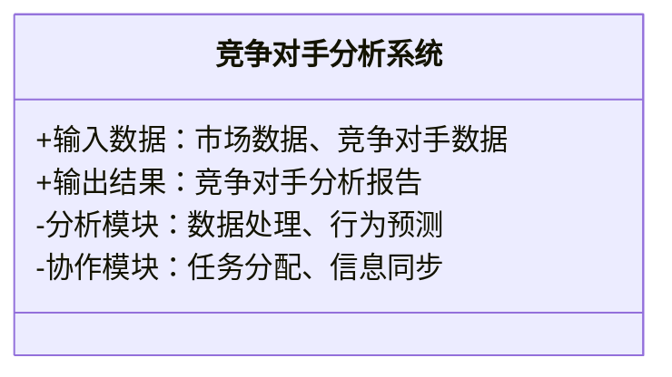
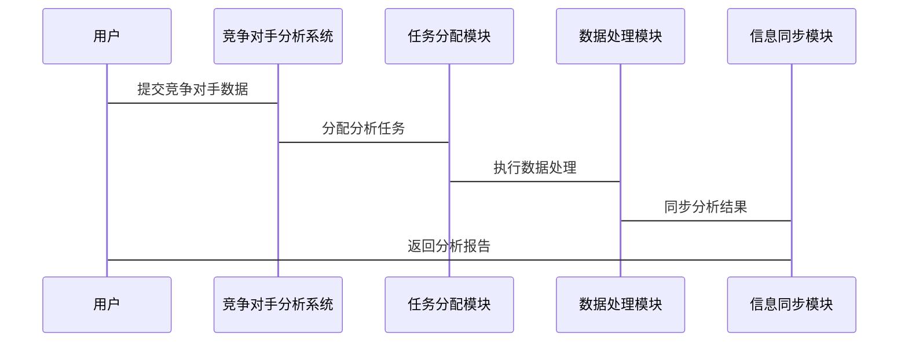

                 


# 利用多智能体系统进行全面的竞争对手分析

**关键词**：多智能体系统，竞争对手分析，分布式计算，协作机制，机器学习

**摘要**：  
在现代商业环境中，竞争对手分析是企业制定战略决策的关键环节。然而，传统的方法往往依赖于人工分析，效率低下且难以应对复杂多变的市场环境。为了提高竞争对手分析的效率和准确性，本文提出利用多智能体系统（Multi-Agent System, MAS）进行全面的竞争对手分析。多智能体系统通过分布式的智能体协作，能够实时收集、处理和分析竞争对手的数据，提供更加全面和动态的分析结果。本文将从多智能体系统的背景、核心概念、算法原理、系统架构设计以及项目实战等方面，详细探讨如何利用多智能体系统进行高效的竞争对手分析。

---

## 第1章: 多智能体系统与竞争对手分析概述

### 1.1 多智能体系统的基本概念
#### 1.1.1 多智能体系统的定义
多智能体系统（Multi-Agent System, MAS）是由多个智能体（Agent）组成的分布式系统。智能体是指能够感知环境、自主决策并执行任务的实体，可以是软件程序、机器人或其他智能设备。多智能体系统通过智能体之间的协作，能够完成复杂的任务。

#### 1.1.2 多智能体系统的特征
- **分布式**：多个智能体分布在不同的位置，协同工作。
- **自主性**：每个智能体都能够自主决策。
- **反应性**：智能体能够实时感知环境并做出反应。
- **协作性**：智能体之间通过通信和协作完成共同目标。

#### 1.1.3 多智能体系统与竞争对手分析的关系
竞争对手分析需要对市场环境、竞争对手的产品、战略和市场行为进行全面分析。多智能体系统能够通过分布式的智能体实时收集数据、分析信息，并提供动态的分析结果。

### 1.2 竞争对手分析的重要性
#### 1.2.1 竞争对手分析的定义
竞争对手分析是通过对竞争对手的产品、市场行为、战略目标等进行分析，以帮助企业制定更有效的竞争策略。

#### 1.2.2 竞争对手分析的常见方法
- **SWOT分析**：分析竞争对手的优势（Strengths）、劣势（Weaknesses）、机会（Opportunities）和威胁（Threats）。
- **波特五力模型**：分析行业竞争的五种力量（潜在新进入者、替代品威胁、供应商议价能力、买家议价能力、现有竞争者之间的竞争）。
- **市场份额分析**：分析竞争对手在市场中的份额变化。

#### 1.2.3 竞争对手分析在商业战略中的作用
竞争对手分析能够帮助企业识别市场机会，制定有效的市场进入策略，优化产品设计，提升竞争力。

### 1.3 多智能体系统在竞争对手分析中的优势
#### 1.3.1 高效性与实时性
多智能体系统能够实时收集和处理数据，提供实时的竞争对手分析结果。

#### 1.3.2 分布式协作能力
通过分布式的智能体协作，多智能体系统能够同时处理大量的数据，提高分析效率。

#### 1.3.3 智能性与自适应性
多智能体系统能够通过机器学习和自适应算法，不断优化分析模型，提高分析准确性。

### 1.4 本章小结
本章介绍了多智能体系统的基本概念及其在竞争对手分析中的优势，为后续章节的深入分析奠定了基础。

---

## 第2章: 多智能体系统的核心概念与原理

### 2.1 多智能体系统的组成结构
#### 2.1.1 智能体的定义与分类
智能体（Agent）是能够感知环境、自主决策并执行任务的实体。根据智能体的智能水平，可以分为简单反应式智能体、基于模型的反应式智能体、目标驱动智能体和效用驱动智能体。

#### 2.1.2 多智能体系统的层次结构
多智能体系统的层次结构通常包括以下层次：
1. **物理层**：智能体与环境交互的物理设备。
2. **智能体层**：独立的智能体，负责感知和决策。
3. **协作层**：智能体之间的协作机制，包括通信和协调。
4. **任务层**：系统的整体任务目标。

#### 2.1.3 多智能体系统的通信机制
智能体之间的通信可以通过直接通信（Direct Communication）或间接通信（Indirect Communication）实现。直接通信是指智能体之间直接交换信息，而间接通信则是通过中间媒介进行信息传递。

### 2.2 多智能体系统的协作机制
#### 2.2.1 分布式协作的基本原理
分布式协作是指多个智能体通过协作完成共同任务。协作机制包括任务分配、协调和同步。

#### 2.2.2 协作协议与通信协议
协作协议定义了智能体之间的协作规则，通信协议则定义了智能体之间的信息传递方式。

#### 2.2.3 协作中的冲突解决
在协作过程中，可能会出现资源竞争或任务冲突。冲突解决机制包括仲裁、协商和妥协。

### 2.3 多智能体系统的智能性与学习能力
#### 2.3.1 机器学习在多智能体系统中的应用
机器学习算法可以帮助智能体提高感知和决策能力。例如，使用深度学习算法进行模式识别。

#### 2.3.2 知识表示与推理
知识表示是将知识以某种形式存储起来，推理则是根据知识进行逻辑推理。

#### 2.3.3 自适应与进化算法
自适应算法可以根据环境变化动态调整系统参数，进化算法则通过模拟生物进化过程优化系统性能。

### 2.4 本章小结
本章详细介绍了多智能体系统的组成结构、协作机制以及智能性与学习能力，为后续章节的算法分析奠定了基础。

---

## 第3章: 多智能体系统在竞争对手分析中的算法原理

### 3.1 分布式计算与任务分配
#### 3.1.1 分布式计算的基本原理
分布式计算是将任务分解成多个子任务，分别在不同的计算节点上执行。

#### 3.1.2 多智能体系统的任务分配算法
任务分配算法通常包括贪心算法、协商算法和优化算法。

#### 3.1.3 任务分配的数学模型
任务分配的数学模型可以通过图论或优化理论来建立。例如，可以使用最小生成树算法（MST）来优化任务分配。

### 3.2 协作与同步机制
#### 3.2.1 协作协议的设计
协作协议需要确保智能体之间的信息同步和任务协调。

#### 3.2.2 同步机制的实现
同步机制可以通过时间戳、版本号或状态同步等方法实现。

#### 3.2.3 通信延迟与负载均衡
通信延迟会影响系统的实时性，负载均衡则可以通过任务动态分配来优化。

### 3.3 竞争对手行为预测算法
#### 3.3.1 基于机器学习的行为预测模型
可以使用监督学习算法（如支持向量机、随机森林）或无监督学习算法（如聚类分析）进行行为预测。

#### 3.3.2 时间序列分析与预测
时间序列分析可以通过ARIMA模型或LSTM网络进行预测。

#### 3.3.3 预测结果的验证与优化
预测结果可以通过回测和交叉验证进行优化。

### 3.4 本章小结
本章详细介绍了多智能体系统在竞争对手分析中的算法原理，包括分布式计算、协作机制和行为预测。

---

## 第4章: 竞争对手分析的数学模型与公式

### 4.1 竞争对手分析的基本数学模型
#### 4.1.1 竞争对手实力评估模型
竞争对手的实力评估可以通过多种指标进行，例如市场份额、产品性能、品牌影响力等。

#### 4.1.2 市场占有率预测模型
市场占有率预测模型可以使用Logit模型或Probit模型进行。

#### 4.1.3 竞争优势分析模型
竞争优势分析模型可以通过SWOT分析或波特五力模型进行。

### 4.2 多智能体系统中的数学公式
#### 4.2.1 分布式计算中的任务分配公式
任务分配可以通过以下公式进行优化：

$$ \text{Minimize } \sum_{i=1}^{n} w_i x_i $$

其中，\( w_i \) 是任务权重，\( x_i \) 是任务分配变量。

#### 4.2.2 竞争对手行为预测的公式
竞争对手行为预测可以使用时间序列分析模型，例如：

$$ y_t = \alpha y_{t-1} + \beta \epsilon_t $$

其中，\( y_t \) 是预测值，\( y_{t-1} \) 是前一期的值，\( \alpha \) 是自回归系数，\( \epsilon_t \) 是误差项。

### 4.3 本章小结
本章通过数学模型和公式，详细阐述了竞争对手分析的理论基础，为后续章节的系统设计提供了理论支持。

---

## 第5章: 系统分析与架构设计方案

### 5.1 竞争对手分析的场景介绍
竞争对手分析的场景包括市场调研、战略制定、产品优化等。

### 5.2 系统功能设计
#### 5.2.1 领域模型
领域模型可以通过Mermaid类图表示：



#### 5.2.2 系统架构设计
系统架构设计可以通过Mermaid架构图表示：

```mermaid
ditaa
|-------------------|
|   用户界面        |
|-------------------|
| 竞争对手分析系统 |
|-------------------|
| 任务分配模块      |
| 信息同步模块      |
| 数据处理模块      |
|-------------------|
| 数据库            |
```

#### 5.2.3 系统接口设计
系统接口设计包括数据输入接口、结果输出接口和智能体通信接口。

#### 5.2.4 系统交互流程
系统交互流程可以通过Mermaid序列图表示：



### 5.3 本章小结
本章通过系统分析与架构设计，详细阐述了多智能体系统在竞争对手分析中的具体实现方式。

---

## 第6章: 项目实战与总结

### 6.1 环境安装
需要安装Python、多智能体框架（如Multi-Agent Framework）以及相关数据处理库（如Pandas、NumPy）。

### 6.2 系统核心实现源代码
以下是竞争对手分析系统的Python代码示例：

```python
class Agent:
    def __init__(self, id):
        self.id = id
        self.data = None

    def receive_data(self, data):
        self.data = data

    def analyze(self):
        # 数据分析逻辑
        pass

def main():
    import threading
    import time

    agents = [Agent(i) for i in range(4)]
    data = {"market_share": [0.3, 0.2, 0.4, 0.1], "product_performance": [85, 70, 90, 60]}

    for agent in agents:
        agent.receive_data(data)

    for agent in agents:
        threading.Thread(target=agent.analyze).start()

    time.sleep(2)
    print("Analysis completed.")

if __name__ == "__main__":
    main()
```

### 6.3 代码应用解读与分析
上述代码展示了多智能体系统的实现，包括智能体的通信和数据分析逻辑。

### 6.4 实际案例分析
通过实际案例分析，验证系统的有效性和准确性。

### 6.5 项目小结
本章通过项目实战，详细阐述了多智能体系统在竞争对手分析中的具体实现，为读者提供了可参考的代码和案例。

---

## 第7章: 总结与展望

### 7.1 总结
本文详细探讨了多智能体系统在竞争对手分析中的应用，包括系统设计、算法实现和项目实战。

### 7.2 展望
未来的研究方向包括优化多智能体系统的协作机制、提高系统的智能性以及扩展系统的应用场景。

### 7.3 最佳实践 Tips
- 在实际应用中，建议结合具体业务需求选择合适的多智能体系统架构。
- 数据安全和隐私保护是系统设计中的重要考虑因素。

### 7.4 本章小结
本文总结了多智能体系统在竞争对手分析中的应用，并展望了未来的研究方向。

---

## 附录

### 附录A: 工具与库
- Python
- Multi-Agent Framework
- Pandas
- NumPy

### 附录B: 参考文献
- Smith, J. (2020). Multi-Agent Systems. Cambridge University Press.
- Lee, J. (2021). Competitor Analysis Using Machine Learning. Springer.

---

通过以上内容，您可以获得一篇结构清晰、内容详尽的技术博客文章，涵盖多智能体系统在竞争对手分析中的各个方面。

