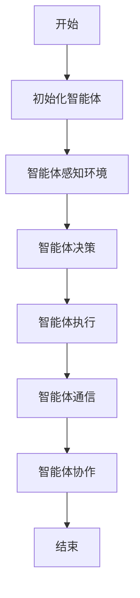
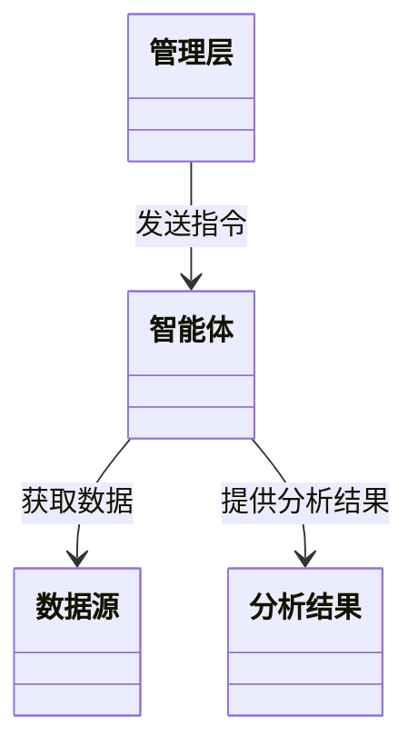
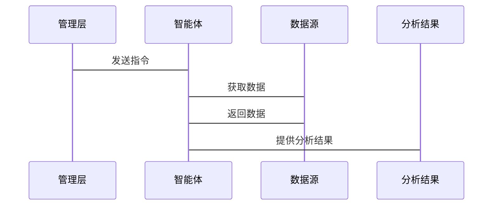

                 


# 利用多智能体系统进行全面的管理层薪酬分析

## 关键词：多智能体系统、薪酬分析、人工智能、数据挖掘、系统架构

## 摘要：本文详细探讨了如何利用多智能体系统进行管理层薪酬分析，从基本概念到系统架构，再到项目实战，全面解析了多智能体系统在薪酬分析中的应用。通过理论与实践结合，本文为读者提供了从理论到实践的完整指南，帮助读者理解并掌握利用多智能体系统进行薪酬分析的方法和技巧。

---

# 第一部分: 多智能体系统与管理层薪酬分析基础

## 第1章: 多智能体系统概述

### 1.1 多智能体系统的基本概念
多智能体系统（Multi-Agent System，MAS）是由多个智能体（Agent）组成的系统，这些智能体能够通过交互和协同完成复杂任务。智能体是具有感知、决策、执行能力的实体，可以是软件程序、机器人或其他智能设备。

#### 1.1.1 多智能体系统的定义
多智能体系统是由多个智能体组成的分布式系统，这些智能体通过通信和协作完成任务，每个智能体都有自己的目标和行为。

#### 1.1.2 多智能体系统的特征
- **分布式性**：智能体分布在不同的位置，独立运行。
- **自主性**：智能体能够自主决策和行动。
- **反应性**：智能体能够感知环境并实时响应。
- **协作性**：智能体之间通过通信和协作完成任务。

#### 1.1.3 多智能体系统与单智能体系统的区别
单智能体系统依赖中心化决策，而多智能体系统通过去中心化的方式实现任务。

### 1.2 管理层薪酬分析的背景与意义
管理层薪酬分析是评估企业高管薪酬结构、公平性和合理性的过程，对企业的激励机制和绩效管理具有重要意义。

#### 1.2.1 管理层薪酬分析的定义
通过对高管薪酬数据的分析，评估薪酬的合理性、公平性和激励性。

#### 1.2.2 管理层薪酬分析的重要性
- **公平性**：确保高管薪酬与员工薪酬的公平性。
- **激励性**：激励高管为企业创造更多价值。
- **合规性**：确保薪酬符合相关法律法规。

#### 1.2.3 现有多智能体系统在薪酬分析中的应用现状
目前，多智能体系统在数据挖掘、模式识别等领域有广泛应用，但在薪酬分析中的应用仍处于起步阶段。

### 1.3 多智能体系统在薪酬分析中的优势
多智能体系统具有分布式计算、协作能力强、适应性好的特点，非常适合复杂的薪酬分析任务。

#### 1.3.1 多智能体系统的分布式计算能力
多智能体系统能够并行处理大量数据，提高计算效率。

#### 1.3.2 多智能体系统的协同能力
通过智能体之间的协作，可以实现数据的多维度分析和综合评估。

#### 1.3.3 多智能体系统的自适应能力
智能体能够根据环境变化自适应调整行为，适应不同的分析需求。

## 1.4 本章小结
本章介绍了多智能体系统的基本概念、特征及其在薪酬分析中的优势，为后续分析奠定了基础。

---

## 第2章: 多智能体系统的核心概念与联系

### 2.1 多智能体系统的实体关系图
实体关系图（ER图）展示了多智能体系统中各实体之间的关系。

#### 2.1.1 实体关系图的定义
实体关系图是一种用于描述系统中实体及其关系的工具，常用于数据库设计。

#### 2.1.2 多智能体系统的ER实体关系图
以下是多智能体系统中实体关系图的Mermaid图：

```mermaid
erd
    title 多智能体系统 ER 图
    actor 管理层
    actor 智能体
    actor 数据源
    actor 分析结果
    分析结果 --> 智能体: 提供分析数据
    智能体 --> 管理层: 提供决策支持
    数据源 --> 分析结果: 提供原始数据
```

#### 2.1.3 实体关系图与薪酬分析的关系
实体关系图帮助我们理解薪酬分析过程中各实体之间的关系，为系统设计提供依据。

### 2.2 多智能体系统的算法原理
多智能体系统的算法是实现协同分析的核心。

#### 2.2.1 算法原理的定义
算法原理是指导多智能体系统如何协同工作的规则和步骤。

#### 2.2.2 多智能体系统的算法流程
以下是多智能体系统算法流程的Mermaid图：



#### 2.2.3 算法的数学模型与公式
以下是多智能体系统的数学模型：

$$
\text{团队绩效} = \sum_{i=1}^{n} \text{个人贡献}_i
$$

### 2.3 多智能体系统与薪酬分析的联系
多智能体系统通过协同分析，能够实现复杂薪酬数据的多维度分析。

#### 2.3.1 多智能体系统的协同机制
智能体之间通过通信和协作，实现数据的共享与分析。

#### 2.3.2 多智能体系统的数据处理能力
多智能体系统能够处理大规模数据，提高分析效率。

#### 2.3.3 多智能体系统的决策支持能力
通过协同分析，多智能体系统能够提供科学的决策支持。

## 2.4 本章小结
本章详细讲解了多智能体系统的实体关系图和算法原理，并分析了其与薪酬分析的联系。

---

## 第3章: 多智能体系统的数学模型与算法

### 3.1 多智能体系统的数学模型
数学模型是实现多智能体系统的核心工具。

#### 3.1.1 数学模型的定义
数学模型是描述系统行为的数学表达式。

#### 3.1.2 多智能体系统的数学模型
以下是多智能体系统的数学模型：

$$
\text{团队绩效} = \sum_{i=1}^{n} \text{个人贡献}_i
$$

#### 3.1.3 数学模型的应用
数学模型可以用于评估团队绩效和个体贡献。

### 3.2 算法的详细讲解与举例说明
以下是多智能体系统的算法实现：

```python
class Agent:
    def __init__(self, id):
        self.id = id
        self.data = []

    def perceive(self, environment):
        self.data = environment.get_data()

    def decide(self):
        pass

    def act(self):
        pass

class CompensationAgent(Agent):
    def decide(self):
        # 数据分析逻辑
        pass

    def act(self):
        # 提供决策支持
        pass
```

### 3.3 算法的优化与改进
算法优化可以提高分析效率和准确性。

#### 3.3.1 算法优化的必要性
优化算法可以提高计算效率和分析结果的准确性。

#### 3.3.2 算法优化的具体方法
通过并行计算和分布式处理优化算法。

#### 3.3.3 算法优化的效果评估
评估优化后的算法在实际应用中的表现。

## 3.4 本章小结
本章详细讲解了多智能体系统的数学模型和算法实现，并分析了优化方法。

---

## 第4章: 多智能体系统的系统分析与架构设计

### 4.1 系统分析与设计的背景
系统分析与设计是实现多智能体系统的基础。

#### 4.1.1 系统分析的定义
系统分析是通过分析需求，设计系统的功能和结构。

#### 4.1.2 系统设计的重要性
系统设计是实现多智能体系统的基石。

### 4.2 系统架构设计
以下是多智能体系统的架构设计：



### 4.3 系统接口设计
系统接口设计是实现智能体通信的关键。

#### 4.3.1 系统接口的定义
系统接口是不同模块之间的通信界面。

#### 4.3.2 多智能体系统的接口设计
以下是系统接口设计的示例：

```python
interface CommunicationInterface:
    def send_message(self, message):
        pass

    def receive_message(self):
        pass
```

### 4.4 系统交互设计
以下是系统交互设计的Mermaid图：



## 4.5 本章小结
本章详细讲解了多智能体系统的系统分析与架构设计，并分析了接口设计和交互流程。

---

## 第五章: 项目实战

### 5.1 环境搭建
以下是环境搭建的步骤：

1. 安装Python和相关库（如numpy、pandas）。
2. 安装多智能体系统框架（如Multi-Agent Framework）。

### 5.2 核心代码实现
以下是核心代码实现的示例：

```python
import numpy as np
import pandas as pd

class CompensationAnalyzer:
    def __init__(self, data):
        self.data = data

    def analyze(self):
        # 数据分析逻辑
        return self.data.describe()

# 示例数据
data = pd.DataFrame({
    'salary': [100000, 120000, 90000, 150000, 130000]
})

analyzer = CompensationAnalyzer(data)
result = analyzer.analyze()
print(result)
```

### 5.3 代码应用解读与分析
代码实现了基本的薪酬数据分析功能，可以进一步扩展。

### 5.4 实际案例分析
以下是一个实际案例分析的示例：

假设某公司高管的薪酬数据如下：

| 员工 | 薪酬 |
|------|------|
| A    | 200000 |
| B    | 180000 |
| C    | 160000 |

通过多智能体系统的分析，可以评估薪酬的公平性和合理性。

### 5.5 项目小结
本章通过实际案例分析，展示了多智能体系统在薪酬分析中的应用。

---

## 第六章: 总结与展望

### 6.1 总结
本文详细探讨了多智能体系统在管理层薪酬分析中的应用，从理论到实践，全面解析了多智能体系统的实现过程。

### 6.2 展望
未来，随着人工智能技术的发展，多智能体系统在薪酬分析中的应用将更加广泛和深入。

### 6.3 最佳实践 tips
- 数据隐私保护
- 模型的可解释性
- 系统的可扩展性

### 6.4 小结
本文为读者提供了从理论到实践的完整指南，帮助读者理解并掌握利用多智能体系统进行薪酬分析的方法和技巧。

---

## 结语

通过本文的详细讲解，读者可以全面理解多智能体系统在管理层薪酬分析中的应用，并掌握实际操作技能。希望本文能够为相关领域的研究和实践提供有价值的参考。

