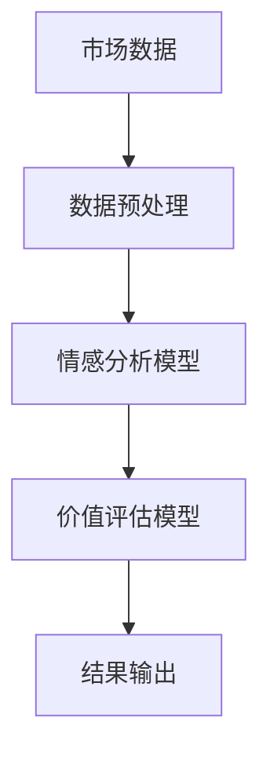
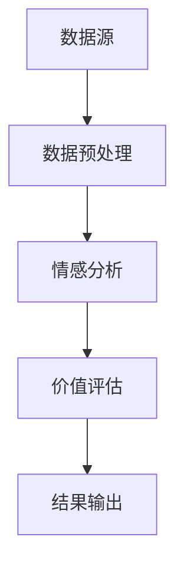
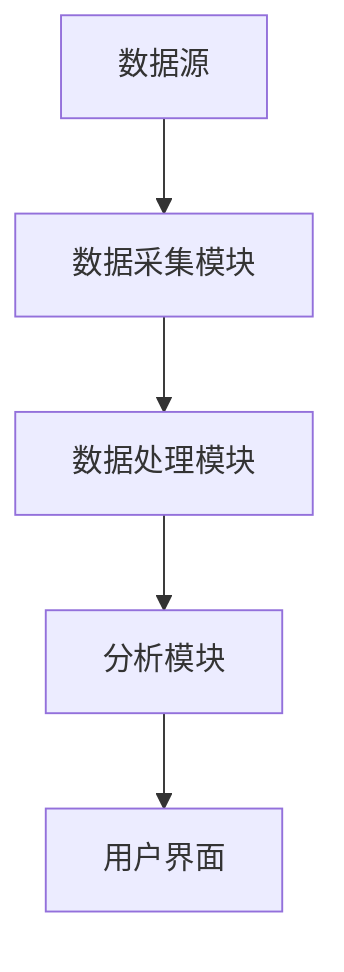

                 


# 利用多智能体系统进行实时市场情绪分析和价值评估

## 关键词：
多智能体系统、市场情绪分析、实时分析、价值评估、金融应用

## 摘要：
本文探讨了利用多智能体系统在实时市场情绪分析和价值评估中的应用。通过分析多智能体系统的协同优势，结合情感分析和价值评估的数学模型，构建了一个高效的实时分析系统。文章详细讲解了系统架构设计、算法原理及项目实战，展示了多智能体系统在金融领域的强大应用潜力。

---

# 第一部分: 背景与概述

## 第1章: 多智能体系统与实时市场分析概述

### 1.1 多智能体系统的背景与概念
- **1.1.1 多智能体系统的基本概念**
  - 多智能体系统（Multi-Agent System, MAS）是由多个智能体组成的系统，每个智能体具有自主性、反应性和协作性。
  - 智能体可以是软件程序，能够感知环境并采取行动，实现特定目标。

- **1.1.2 多智能体系统的特征与优势**
  - 特征：分布性、协作性、反应性、主动性。
  - 优势：提高系统的容错性和适应性，增强问题解决能力。

- **1.1.3 多智能体系统在金融领域的应用**
  - 用于实时数据分析、市场预测和投资决策支持。

### 1.2 实时市场情绪分析的背景与意义
- **1.2.1 市场情绪分析的定义与作用**
  - 市场情绪分析是通过分析新闻、社交媒体等数据，判断市场参与者的情绪状态。
  - 作用：帮助投资者做出更明智的决策，预测市场波动。

- **1.2.2 传统市场情绪分析方法的局限性**
  - 数据处理速度慢，难以实时分析。
  - 情感分析模型不够精确，难以捕捉细微情绪变化。

- **1.2.3 实时分析的需求与挑战**
  - 需求：快速响应市场变化，提供实时数据支持。
  - 挑战：数据量大、类型多样，分析难度高。

### 1.3 多智能体系统在市场情绪分析中的应用前景
- **1.3.1 多智能体系统的优势**
  - 分布式计算能力，提高数据处理速度。
  - 各智能体协同工作，提升分析精度。

- **1.3.2 市场情绪分析的实时性要求**
  - 快速处理海量数据，确保分析结果的实时性。
  - 系统需具备高可用性和稳定性。

- **1.3.3 结合多智能体系统的解决方案**
  - 分布式架构：多个智能体分别处理不同数据源。
  - 协作机制：智能体之间共享信息，优化分析结果。

---

## 第2章: 问题背景与目标

### 2.1 问题背景
- **2.1.1 当前市场情绪分析的痛点**
  - 数据量大，处理复杂。
  - 实时性要求高，传统方法难以满足。

- **2.1.2 多智能体系统的优势**
  - 分布式计算，提高效率。
  - 协作能力强，优化分析结果。

- **2.1.3 问题的边界与外延**
  - 研究边界：实时市场情绪分析和价值评估。
  - 外延：扩展到其他领域，如社交网络分析。

### 2.2 核心问题描述
- **2.2.1 实时数据处理的需求**
  - 快速处理和分析数据，提供实时反馈。
  - 数据来源多样，包括文本、语音和图像。

- **2.2.2 多智能体协同的必要性**
  - 分散处理任务，减少计算压力。
  - 智能协同，提升分析准确性。

- **2.2.3 系统的实时性和准确性要求**
  - 实时性：秒级响应，确保数据新鲜度。
  - 准确性：高精度分析，减少误判。

### 2.3 问题解决思路
- **2.3.1 多智能体协同的基本框架**
  - 中央协调器管理智能体，分配任务。
  - 智能体之间通过消息传递协作。

- **2.3.2 数据流与信息处理流程**
  - 数据采集：多源数据获取。
  - 预处理：清洗和转换数据。
  - 分析：情感分析和价值评估。
  - 输出：实时反馈给用户。

- **2.3.3 系统架构的设计思路**
  - 分层架构：数据层、计算层、应用层。
  - 智能体分布部署，提高系统可用性。

---

## 第3章: 核心概念与联系

### 3.1 核心概念原理
- **3.1.1 多智能体系统的定义与组成**
  - 多个智能体协同工作，每个智能体有独立的目标和决策机制。
  - 系统通过智能体间的通信和协作，实现整体目标。

- **3.1.2 市场情绪分析的基本原理**
  - 通过自然语言处理技术，分析文本数据，提取情绪特征。
  - 使用机器学习模型，训练情感分类器，预测市场情绪。

- **3.1.3 价值评估的数学模型**
  - 情感评分模型：综合多个特征，计算市场情绪评分。
  - 价值评估模型：基于情绪评分和其他因素，预测资产价值。

### 3.2 核心概念对比分析
- **3.2.1 不同市场情绪分析方法的对比**
  | 方法 | 描述 | 优点 | 缺点 |
  |------|------|------|------|
  | 基于规则 | 使用预定义规则进行分类 | 实现简单 | 精度低 |
  | 机器学习 | 使用训练数据自动学习分类器 | 精度高 | 需大量数据 |
  | 深度学习 | 使用神经网络模型 | 处理复杂数据 | 计算资源需求高 |

- **3.2.2 多智能体系统与其他技术的对比**
  - 传统单智能体系统：处理能力有限，难以应对复杂任务。
  - 多智能体系统：分布式计算，协作能力强，适合复杂场景。

- **3.2.3 实时性与准确性的权衡分析**
  - 高实时性可能导致精度下降。
  - 高精度需要更多计算资源，可能影响实时性。

### 3.3 ER实体关系图


### 3.4 核心概念的数学模型
- **3.4.1 情感评分模型**
  $$ \text{情感评分} = \sum_{i=1}^{n} w_i \cdot f_i(x_i) $$
  其中，$w_i$ 是第 $i$ 个特征的权重，$f_i(x_i)$ 是第 $i$ 个特征的函数。

- **3.4.2 价值评估模型**
  $$ \text{价值评估} = \alpha \cdot \text{情感评分} + \beta \cdot \text{市场指标} $$
  其中，$\alpha$ 和 $\beta$ 是调整参数，市场指标包括市盈率、成交量等。

---

## 第4章: 算法原理讲解

### 4.1 算法概述
- 多智能体协同算法用于实时市场情绪分析，每个智能体负责特定数据源的处理。
- 使用分布式计算框架，提高数据处理效率。

### 4.2 算法步骤
1. 数据采集：智能体从不同数据源获取市场相关数据。
2. 数据预处理：清洗和转换数据，提取有用特征。
3. 情感分析：使用机器学习模型，对文本数据进行情感分类。
4. 价值评估：结合情感评分和其他市场指标，计算资产价值。
5. 结果输出：将分析结果实时反馈给用户。

### 4.3 算法流程图


### 4.4 数学模型与公式
- **情感分析模型**
  $$ \text{概率} = \frac{1}{1 + e^{- (\theta \cdot x + b)}} $$
  其中，$\theta$ 是权重向量，$x$ 是输入特征，$b$ 是偏置。

- **价值评估模型**
  $$ \text{价值} = \alpha \cdot \text{情感评分} + \beta \cdot \text{技术指标} $$
  其中，$\alpha$ 和 $\beta$ 是调整参数。

### 4.5 代码实现
```python
import numpy as np
from sklearn.linear_model import LogisticRegression

# 情感分析模型
class SentimentAnalyzer:
    def __init__(self):
        self.model = LogisticRegression()
    
    def train(self, X, y):
        self.model.fit(X, y)
    
    def predict(self, X):
        return self.model.predict(X)

# 多智能体协同
class MultiAgentSystem:
    def __init__(self, agents):
        self.agents = agents
    
    def process_data(self, data):
        for agent in self.agents:
            agent.process(data)
    
    def get_sentiment(self):
        results = [agent.get_sentiment() for agent in self.agents]
        return np.mean(results)
```

---

## 第5章: 系统架构设计

### 5.1 问题场景介绍
- 系统需实时处理股票市场的多源数据，包括新闻、社交媒体和交易数据。
- 系统需要快速分析数据，提供实时市场情绪和价值评估结果。

### 5.2 系统功能设计
- 数据采集模块：从不同数据源获取市场数据。
- 数据处理模块：清洗和转换数据，提取特征。
- 分析模块：情感分析和价值评估。
- 输出模块：将结果反馈给用户界面。

### 5.3 系统架构设计
- **分层架构**
  - 数据层：负责数据的采集和存储。
  - 计算层：进行数据处理和分析。
  - 应用层：提供用户接口和结果展示。

### 5.4 系统架构图


### 5.5 系统接口设计
- 数据接口：定义数据格式和通信协议。
- 模块间接口：定义各模块之间的交互方式。
- 用户接口：提供友好的用户界面，展示分析结果。

### 5.6 系统交互流程
1. 用户提交请求，系统开始数据采集。
2. 数据处理模块清洗数据，提取特征。
3. 分析模块进行情感分析和价值评估。
4. 结果输出模块将结果反馈给用户。

---

## 第6章: 项目实战

### 6.1 环境安装
- 安装必要的库：numpy、scikit-learn、beautifulsoup4、requests。

### 6.2 核心代码实现
```python
import requests
from bs4 import BeautifulSoup
import numpy as np
from sklearn.feature_extraction.text import TfidfVectorizer
from sklearn.linear_model import LogisticRegression

# 数据采集
def fetch_data(url):
    response = requests.get(url)
    return response.text

# 数据预处理
def preprocess(text):
    soup = BeautifulSoup(text, 'html.parser')
    content = soup.get_text()
    return content

# 情感分析
vectorizer = TfidfVectorizer()
model = LogisticRegression()

# 多智能体协同
class Agent:
    def __init__(self, role):
        self.role = role
    
    def process(self, data):
        if self.role == 'collector':
            self.data = data
        elif self.role == 'analyzer':
            X = vectorizer.fit_transform([self.data])
            self.sentiment = model.predict(X)[0]

agents = [Agent('collector'), Agent('analyzer')]
system = MultiAgentSystem(agents)
system.process_data('市场数据')
sentiment = system.get_sentiment()
```

### 6.3 代码解读
- **数据采集**：使用requests库获取网页数据。
- **数据预处理**：使用BeautifulSoup提取文本内容。
- **情感分析**：使用TF-IDF进行特征提取，Logistic回归模型进行分类。
- **多智能体协同**：两个智能体分别负责数据采集和分析，协同工作。

### 6.4 实际案例分析
- 案例1：分析一条新闻的情绪，输出情感评分。
- 案例2：综合多条数据，评估某股票的价值。

---

## 第7章: 总结与展望

### 7.1 最佳实践 tips
- 数据预处理是关键，确保数据质量。
- 模型选择要根据具体任务，优化参数。
- 系统设计要考虑扩展性和可维护性。

### 7.2 小结
本文详细介绍了多智能体系统在实时市场情绪分析和价值评估中的应用，从理论到实践，展示了系统的构建过程和实际效果。

### 7.3 注意事项
- 数据隐私和安全问题需重视。
- 系统性能优化，提高处理速度。
- 智能体间的通信机制要可靠。

### 7.4 拓展阅读
- 多智能体系统在金融领域的其他应用。
- 深度学习在情感分析中的应用。
- 分布式系统的设计与优化。

---

通过以上目录结构，文章系统地介绍了多智能体系统在实时市场情绪分析和价值评估中的应用，从背景到实践，层层深入，帮助读者全面理解相关技术和方法。

