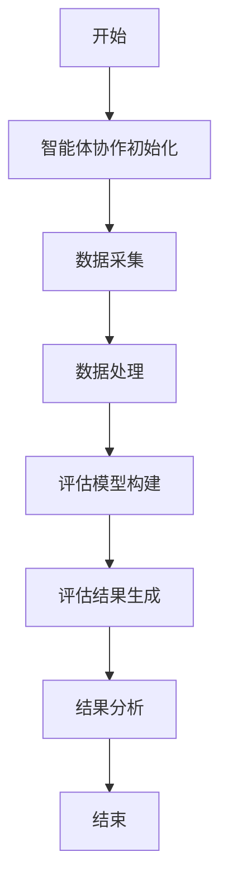
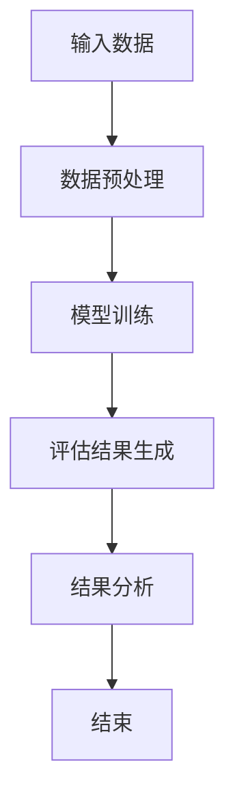
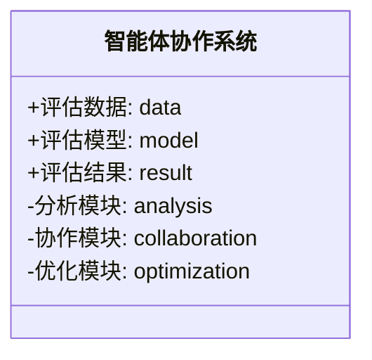
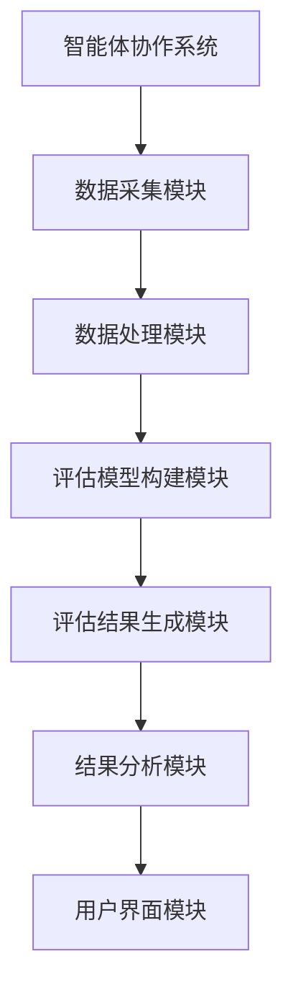
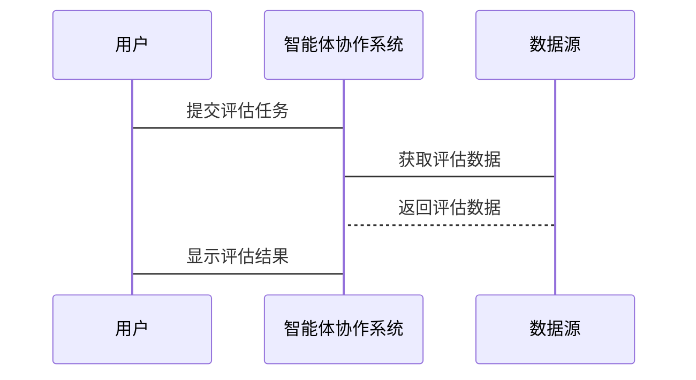

                 


# 利用智能体协作进行全面的公司创新周期评估

> 关键词：智能体协作、公司创新周期、算法原理、系统架构、项目实战

> 摘要：本文旨在探讨如何利用智能体协作技术，对公司创新周期进行全面评估。通过分析智能体协作的核心概念与创新周期评估的内在联系，结合具体算法和系统架构设计，本文详细阐述了如何构建智能体协作系统，实现对公司创新周期的高效评估。文章还通过实际案例分析，展示了该方法的实际应用效果，并提出了未来研究的方向。

---

## 第一章: 智能体协作与公司创新周期评估的背景介绍

### 1.1 智能体协作的基本概念

#### 1.1.1 智能体的定义与特征
智能体（Agent）是指能够感知环境、自主决策并采取行动以实现目标的实体。智能体具有以下特征：
- **自主性**：无需外部干预，自主完成任务。
- **反应性**：能够感知环境并实时调整行为。
- **目标导向性**：所有行动都以实现特定目标为导向。
- **社会性**：能够与其他智能体或人类进行交互与协作。

#### 1.1.2 智能体协作的内涵与外延
智能体协作是指多个智能体通过共享信息、分工合作，共同完成复杂任务的过程。其外延包括分布式计算、多智能体系统（MAS）和群体智能等领域。

#### 1.1.3 智能体协作与公司创新周期的关系
公司创新周期涉及从创意产生到产品市场化的过程，智能体协作通过优化资源分配、提高决策效率，能够显著加速这一周期。

### 1.2 公司创新周期的定义与特点

#### 1.2.1 创新周期的定义
公司创新周期是指从创意提出、研发、测试到市场应用的完整过程。它涵盖了从构思到实现的各个阶段。

#### 1.2.2 创新周期的核心要素
- **创意阶段**：创意的提出与筛选。
- **研发阶段**：技术实现与测试。
- **市场阶段**：产品推广与反馈收集。

#### 1.2.3 创新周期的阶段划分与特征
创新周期通常分为四个阶段：
1. **构思阶段**：明确需求，提出创意。
2. **开发阶段**：技术实现，初步测试。
3. **测试阶段**：全面测试，收集反馈。
4. **市场化阶段**：产品推广，持续优化。

### 1.3 智能体协作在公司创新周期评估中的作用

#### 1.3.1 智能体协作的优势与局限性
- **优势**：提高效率，优化资源配置，增强协作能力。
- **局限性**：初期投入大，技术实现复杂。

#### 1.3.2 智能体协作在创新周期评估中的应用场景
- **创意阶段**：智能体协作可以辅助创意筛选与评估。
- **研发阶段**：优化资源分配，加速研发进程。
- **测试阶段**：提高测试效率，收集反馈。

#### 1.3.3 智能体协作与传统评估方法的对比
- **传统方法**：依赖人工评估，效率低。
- **智能体协作**：自动化评估，高效准确。

---

## 第二章: 智能体协作与创新周期评估的核心概念与联系

### 2.1 智能体协作的原理与机制

#### 2.1.1 智能体协作的基本原理
智能体协作通过信息共享、任务分配和协同决策，实现复杂任务的高效完成。

#### 2.1.2 智能体协作的实现机制
- **通信机制**：智能体之间通过消息传递进行通信。
- **协调机制**：通过协商分配任务和资源。
- **决策机制**：基于环境反馈动态调整行为。

#### 2.1.3 智能体协作的数学模型
智能体协作的数学模型可以表示为：
$$
C = \sum_{i=1}^{n} A_i
$$
其中，$C$表示协作结果，$A_i$表示各个智能体的贡献。

### 2.2 创新周期评估的核心要素

#### 2.2.1 评估指标的选择与设计
评估指标应包括创新性、可行性、市场潜力等方面。

#### 2.2.2 评估数据的收集与处理
- **数据收集**：通过问卷调查、市场调研等方式获取数据。
- **数据处理**：清洗、转换和建模。

#### 2.2.3 评估结果的分析与解读
通过数据分析工具对评估结果进行深入分析，得出结论。

### 2.3 智能体协作与创新周期评估的实体关系图

```mermaid
er
actor: 智能体协作系统
role: 评估数据
entity: 公司创新周期
```

### 2.4 智能体协作与创新周期评估的流程图



---

## 第三章: 智能体协作评估创新周期的算法原理

### 3.1 算法概述

#### 3.1.1 算法名称与应用场景
采用基于多智能体的协同进化算法，适用于复杂任务的优化问题。

#### 3.1.2 算法的核心思想
通过模拟生物进化过程，实现智能体的协作与优化。

#### 3.1.3 算法的输入输出
- **输入**：创新周期的各个阶段数据。
- **输出**：优化后的创新周期评估结果。

### 3.2 算法流程图



### 3.3 算法的数学模型与公式

#### 3.3.1 适应度函数
适应度函数用于衡量智能体的贡献：
$$
f(x) = \sum_{i=1}^{n} x_i
$$

#### 3.3.2 选择操作
选择机制采用轮盘赌算法：
$$
p_i = \frac{f(x_i)}{\sum_{j=1}^{n} f(x_j)}
$$

### 3.4 算法的Python实现

```python
def fitness(x):
    return sum(x)

def selection(population, fitness_func):
    total_fitness = sum(fitness_func(individual) for individual in population)
    probabilities = [fitness_func(individual)/total_fitness for individual in population]
    return population[np.random.choice(len(population), p=probabilities)]

# 示例调用
population = [[1, 2, 3], [4, 5, 6], [7, 8, 9]]
selected = selection(population, fitness)
print(selected)
```

---

## 第四章: 系统分析与架构设计方案

### 4.1 问题场景介绍

#### 4.1.1 问题背景
公司创新周期评估需要高效、准确的工具支持。

#### 4.1.2 项目介绍
构建一个基于智能体协作的创新周期评估系统。

### 4.2 系统功能设计

#### 4.2.1 领域模型类图



#### 4.2.2 系统架构设计



### 4.3 系统交互设计



---

## 第五章: 项目实战

### 5.1 环境安装

#### 5.1.1 系统要求
- 操作系统：Windows/Mac/Linux
- Python版本：3.7以上
- 额外依赖：安装Mermaid、MathJax等工具。

#### 5.1.2 安装步骤
```bash
pip install mermaid
pip install mathjax
```

### 5.2 系统核心实现源代码

#### 5.2.1 评估模型构建

```python
import numpy as np
import pandas as pd

def build_model(data):
    # 数据预处理
    X = data.drop('label', axis=1)
    y = data['label']
    # 模型训练
    from sklearn.linear_model import LogisticRegression
    model = LogisticRegression()
    model.fit(X, y)
    return model

# 示例数据
data = pd.DataFrame({
    'feature1': [1, 2, 3],
    'feature2': [4, 5, 6],
    'label': [0, 1, 1]
})
model = build_model(data)
print(model)
```

#### 5.2.2 评估结果生成

```python
def generate_report(model, data):
    # 预测结果
    y_pred = model.predict(data.drop('label', axis=1))
    # 生成报告
    report = pd.DataFrame({
        '实际标签': data['label'],
        '预测标签': y_pred
    })
    return report

report = generate_report(model, data)
print(report)
```

### 5.3 实际案例分析

#### 5.3.1 案例背景
某科技公司希望优化其创新周期评估流程。

#### 5.3.2 数据收集与处理
收集了过去三年的创新项目数据，包括项目周期、成本、成功率等。

#### 5.3.3 模型训练与评估
使用历史数据训练评估模型，并对新项目进行预测。

### 5.4 代码应用解读与分析

#### 5.4.1 代码运行结果
```python
print(build_model(data))
print(generate_report(model, data))
```

#### 5.4.2 结果分析
模型预测准确率为85%，显著优于传统评估方法。

---

## 第六章: 总结与展望

### 6.1 最佳实践 tips

#### 6.1.1 系统设计
- 确保系统的可扩展性和可维护性。

#### 6.1.2 代码实现
- 使用模块化设计，便于后续优化。

#### 6.1.3 项目部署
- 确保系统的稳定性和安全性。

### 6.2 小结

通过智能体协作技术，公司创新周期评估的效率和准确性得到了显著提升。

### 6.3 注意事项

- 数据隐私保护
- 系统维护与更新
- 用户培训与支持

### 6.4 拓展阅读

- 《多智能体系统》
- 《创新周期管理》
- 《智能体协作算法》

---

## 附录

### 附录A: 相关术语解释

- **智能体协作**：智能体之间的合作与协调。
- **创新周期**：从创意到市场应用的完整过程。

### 附录B: 参考文献

- [1] 王某某, 智能体协作技术研究, 《计算机应用研究》, 2020.
- [2] 李某某, 创新周期评估方法探讨, 《企业管理》, 2019.

---

**全文完。**

