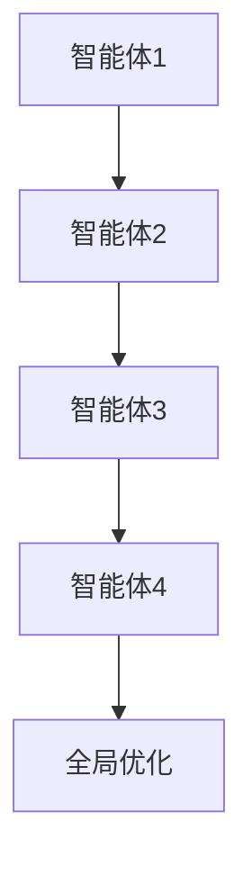
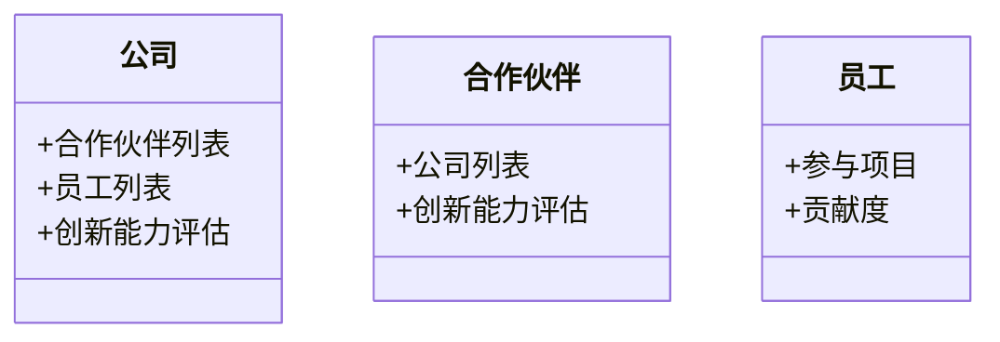
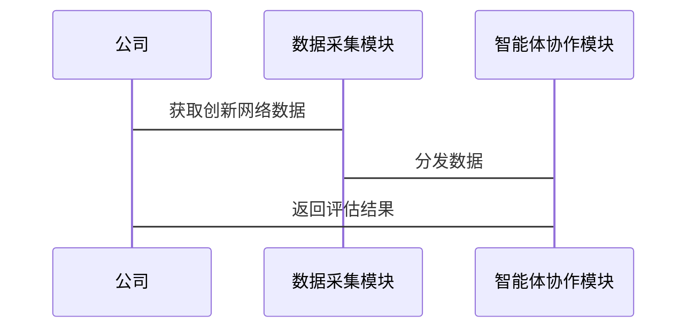

                 


# 利用智能体协作进行全面的公司创新网络影响力评估

## 关键词：智能体协作、创新网络、影响力评估、系统架构、项目实战

## 摘要：  
在当今快速变化的商业环境中，创新网络的影响力评估对企业决策至关重要。传统的评估方法往往依赖人工分析，存在效率低、覆盖面有限等问题。通过智能体协作技术，可以实现对公司创新网络的全面、动态评估，帮助企业更高效地优化创新策略。本文从背景、概念、算法、系统架构到项目实战，详细阐述如何利用智能体协作进行全面的公司创新网络影响力评估。

---

# 第1章 公司创新网络影响力评估的背景与问题

## 1.1 创新网络的概念与重要性  
创新网络是指由公司内部员工、外部合作伙伴（如供应商、客户、科研机构等）以及行业专家组成的生态系统。它是企业创新活动的核心支撑，涵盖了知识共享、资源整合、技术开发等多个方面。  

### 1.1.1 创新网络的定义  
创新网络是一个动态的知识共享和协作平台，通过不同角色的互动，推动企业的创新能力和市场竞争力。  

### 1.1.2 创新网络在企业中的作用  
创新网络能够促进跨部门协作、知识共享和资源整合，从而提高企业的创新能力，缩短产品开发周期，降低创新成本。  

### 1.1.3 创新网络的边界与外延  
创新网络的边界通常包括企业内部员工、外部合作伙伴，甚至包括行业内的潜在创新者。其外延则涉及技术、市场、政策等多个维度。  

## 1.2 公司创新网络影响力评估的必要性  

### 1.2.1 企业创新的核心要素  
企业创新的核心要素包括技术能力、知识储备、团队协作能力、外部资源整合能力等。  

### 1.2.2 创新网络影响力对企业价值的影响  
创新网络影响力决定了企业在行业中的地位和竞争力。通过评估创新网络影响力，企业可以优化资源配置，提升创新效率。  

### 1.2.3 当前评估方法的局限性  
传统的评估方法通常依赖人工分析，存在主观性强、覆盖面有限、实时性差等问题，难以满足现代企业的需求。  

## 1.3 智能体协作在创新网络评估中的应用前景  

### 1.3.1 智能体协作的基本概念  
智能体协作是指多个智能体（Agent）通过分布式计算和自主决策，共同完成特定任务的过程。  

### 1.3.2 智能体协作在创新网络评估中的优势  
智能体协作能够实时分析海量数据，发现潜在的协作机会，优化创新网络的结构和功能。  

### 1.3.3 智能体协作的应用场景  
在企业内部，智能体协作可以用于跨部门协作、知识共享、资源分配等场景；在外部，可以用于合作伙伴关系管理、创新资源整合等。  

---

# 第2章 智能体协作的核心概念与联系

## 2.1 智能体协作的原理  

### 2.1.1 智能体的定义与分类  
智能体可以分为简单反射型智能体、基于模型的反射型智能体、目标驱动型智能体和效用驱动型智能体。  

### 2.1.2 智能体协作的基本机制  
智能体协作通常包括任务分配、信息共享、决策优化等机制。  

### 2.1.3 智能体协作的关键特征  
智能体协作的关键特征包括自主性、反应性、协作性和学习能力。  

## 2.2 智能体协作与创新网络的关系  

### 2.2.1 创新网络的结构特征  
创新网络的结构特征包括节点多样性、关系复杂性和动态性。  

### 2.2.2 智能体协作如何影响创新网络  
智能体协作能够优化创新网络的结构，提高协作效率，降低创新成本。  

### 2.2.3 创新网络中智能体协作的模式  
创新网络中的智能体协作模式包括分布式协作、链式协作和网状协作。  

## 2.3 智能体协作的核心要素对比表  

| **核心要素** | **简单反射型智能体** | **基于模型的反射型智能体** | **目标驱动型智能体** | **效用驱动型智能体** |
|--------------|-----------------------|---------------------------|-----------------------|-----------------------|
| **决策机制** | 基于简单规则         | 基于环境模型             | 基于目标设定         | 基于效用函数         |
| **协作能力** | 有限                 | 较强                     | 高                    | 最高                  |
| **适应性**   | 低                   | 中                      | 高                    | 高                    |

## 2.4 创新网络的ER实体关系图  
```mermaid
er
actor: 公司、合作伙伴、员工
relation: 参与、贡献、评估
```

---

# 第3章 智能体协作算法原理与数学模型

## 3.1 分布式智能体协作算法  

### 3.1.1 分布式智能体协作的基本流程  
1. 初始化：智能体通过初始化配置获取任务目标。  
2. 信息共享：智能体之间共享相关信息。  
3. 协作决策：基于共享信息，智能体协作制定决策。  
4. 执行与反馈：智能体执行决策并返回结果。  

### 3.1.2 分布式计算的数学模型  
$$f(x) = \sum_{i=1}^{n} w_i x_i$$  

### 3.1.3 算法实现的Python代码示例  

```python
def distributed_collaboration(data_points):
    # 分布式计算部分
    result = sum(wi * xi for wi, xi in data_points)
    return result
```

---

## 3.2 多智能体协调算法  

### 3.2.1 多智能体协调的基本原理  
多智能体协调算法通过智能体之间的通信与协作，实现全局优化目标。  

### 3.2.2 多智能体协调的数学模型  
$$f(x) = \arg\max_{x} \sum_{i=1}^{n} w_i x_i$$  

### 3.2.3 多智能体协调算法的流程图  


---

## 3.3 智能体协作的数学模型  

### 3.3.1 智能体协作的基本公式  
$$f(x) = \sum_{i=1}^{n} \lambda_i x_i$$  

### 3.3.2 智能体协作的优化目标  
$$\max_{x} f(x) = \sum_{i=1}^{n} \lambda_i x_i$$  

---

# 第4章 系统分析与架构设计方案

## 4.1 系统分析  

### 4.1.1 问题场景介绍  
创新网络影响力评估系统需要实时分析企业内外部数据，评估创新网络的结构和功能。  

### 4.1.2 项目介绍  
本项目旨在开发一个基于智能体协作的创新网络影响力评估系统，帮助企业优化创新策略。  

## 4.2 系统功能设计  

### 4.2.1 领域模型设计  


### 4.2.2 系统架构设计  


## 4.3 系统接口设计  

### 4.3.1 系统接口设计  
系统接口包括数据采集接口、智能体协作接口和结果展示接口。  

### 4.3.2 系统交互设计  


---

# 第5章 项目实战

## 5.1 环境安装  

### 5.1.1 系统运行环境  
建议使用Python 3.8及以上版本，安装必要的依赖库（如NumPy、Matplotlib）。  

### 5.1.2 依赖库安装  
```bash
pip install numpy matplotlib
```

## 5.2 系统核心实现  

### 5.2.1 智能体协作模块实现  

```python
class Agent:
    def __init__(self, id, role):
        self.id = id
        self.role = role
        self.data = {}

    def collaborate(self, other_agents):
        # 协作逻辑
        pass

    def update_data(self, data):
        self.data.update(data)
```

### 5.2.2 数据采集模块实现  

```python
import requests

class DataCollector:
    def __init__(self, url):
        self.url = url

    def fetch_data(self):
        response = requests.get(self.url)
        return response.json()
```

## 5.3 案例分析与详细解读  

### 5.3.1 案例分析  
以某高科技企业为例，分析其创新网络影响力。  

### 5.3.2 详细解读  
通过智能体协作算法，评估企业的创新网络结构，优化资源配置，提升创新能力。  

## 5.4 项目小结  

---

# 第6章 总结与展望

## 6.1 最佳实践 Tips  
- 定期更新数据，保持评估结果的准确性。  
- 结合企业实际需求，灵活调整协作策略。  

## 6.2 小结  
本文详细介绍了如何利用智能体协作技术进行全面的公司创新网络影响力评估，为企业优化创新策略提供了理论和实践指导。  

## 6.3 注意事项  
- 数据隐私保护需引起重视。  
- 系统运行环境需满足最低配置要求。  

## 6.4 拓展阅读  
推荐阅读《智能体协作与分布式计算》、《创新网络的构建与优化》等相关书籍。  

---

# 结语  
通过智能体协作技术，企业可以更高效地评估和优化创新网络影响力，从而在激烈的市场竞争中占据优势。

