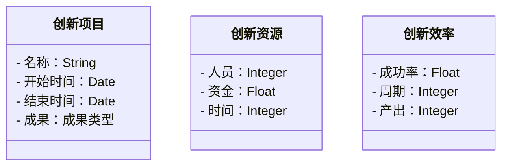

                 


# 利用智能体系统进行全面的公司创新效率横向比较

## 关键词：智能体系统、创新效率、横向比较、协同进化、企业评估、技术实现

## 摘要：本文通过智能体系统的多智能体协作与协同进化算法，构建了创新效率评估模型，实现对公司创新效率的横向比较。文章详细阐述了智能体系统的原理与架构，创新效率的度量方法，协同进化算法的设计与实现，系统架构的构建与优化，并通过实际案例分析验证了该方法的有效性。通过本文的研究，可以为企业的创新效率评估提供一种高效、可靠的智能体系统解决方案。

---

# 第1章 智能体系统与公司创新效率概述

## 1.1 智能体系统的基本概念

### 1.1.1 智能体系统的定义

智能体系统（Agent System）是由多个智能体（Agent）组成的复杂系统，每个智能体都是具有感知、决策、执行能力的独立实体。智能体之间通过协作与通信，共同完成特定的目标或任务。

### 1.1.2 智能体系统的分类

智能体系统可以分为以下几类：

1. **简单反射型智能体**：基于当前感知做出反应，没有内部状态。
2. **基于模型的反射型智能体**：具有内部状态和模型，能够根据模型进行决策。
3. **目标驱动型智能体**：根据目标选择最优行动。
4. **实用驱动型智能体**：基于效用函数进行决策。

### 1.1.3 智能体系统的核心特征

智能体系统的核心特征包括：

- **自主性**：智能体能够自主决策。
- **反应性**：能够感知环境并实时响应。
- **协作性**：多个智能体能够协同工作。
- **适应性**：能够根据环境变化调整行为。

## 1.2 公司创新效率的定义与度量

### 1.2.1 创新效率的定义

创新效率是指公司在一定时间内实现创新成果的能力，通常包括创新的数量、质量和速度。

### 1.2.2 创新效率的度量指标

创新效率的度量指标包括：

1. **创新周期**：从创意到商业化的时间。
2. **创新成功率**：创新项目成功实现的比例。
3. **创新产出**：创新成果的数量和质量。
4. **创新资源利用率**：创新过程中的资源投入与产出的比值。

### 1.2.3 创新效率评估的挑战与难点

创新效率评估的挑战包括：

- **数据获取难度**：创新过程中的数据往往分散且难以量化。
- **评估标准不统一**：不同行业和公司的创新标准差异较大。
- **动态变化**：创新环境和市场需求不断变化，影响评估结果。

## 1.3 智能体系统在公司创新效率评估中的作用

### 1.3.1 智能体系统的优势

智能体系统在创新效率评估中的优势包括：

- **实时感知**：智能体能够实时感知创新过程中的数据。
- **协作能力**：多个智能体可以协同工作，提高评估的全面性。
- **自适应性**：智能体能够根据环境变化调整评估策略。

### 1.3.2 智能体系统在创新效率评估中的应用

智能体系统可以应用于：

- **数据采集**：智能体实时采集创新过程中的数据。
- **数据分析**：智能体通过协同进化算法对数据进行分析和优化。
- **结果输出**：智能体生成创新效率评估报告。

### 1.3.3 智能体系统与传统评估方法的对比

智能体系统与传统评估方法的对比如下：

| 对比维度         | 智能体系统                          | 传统评估方法                      |
|------------------|------------------------------------|----------------------------------|
| 数据处理能力     | 高，能够实时处理大量数据           | 较低，依赖人工整理和分析           |
| 协作能力         | 强，多个智能体协同工作               | 较弱，主要依赖人工协作             |
| 自适应性         | 强，能够根据环境变化调整评估策略   | 较弱，评估方法相对固定             |

---

## 1.4 本章小结

本章介绍了智能体系统的基本概念、分类和核心特征，详细阐述了公司创新效率的定义、度量指标和评估挑战。同时，分析了智能体系统在创新效率评估中的作用和优势，并与传统评估方法进行了对比。通过本章的介绍，读者可以理解智能体系统在创新效率评估中的重要性。

---

# 第2章 智能体系统的原理与架构

## 2.1 智能体系统的原理

### 2.1.1 智能体的基本构成

智能体的基本构成包括：

1. **感知器**：感知环境信息。
2. **决策器**：基于感知信息做出决策。
3. **执行器**：执行决策动作。
4. **通信模块**：与其他智能体进行通信和协作。

### 2.1.2 智能体的感知与决策机制

智能体的感知与决策机制包括：

1. **感知**：通过传感器或数据接口获取环境信息。
2. **推理**：基于感知信息进行逻辑推理，生成候选决策。
3. **决策**：根据推理结果选择最优决策。

### 2.1.3 智能体的协作与通信机制

智能体的协作与通信机制包括：

1. **通信协议**：定义智能体之间的通信规则。
2. **协作任务分配**：根据任务需求分配协作任务。
3. **协同决策**：多个智能体协同完成决策过程。

## 2.2 创新效率评估模型的构建

### 2.2.1 模型的输入与输出

模型的输入包括：

- 创新项目的数据。
- 创新过程中的资源投入。

模型的输出包括：

- 创新效率评估结果。
- 优化建议。

### 2.2.2 模型的构建过程

模型的构建过程包括：

1. **数据采集**：智能体实时采集创新过程中的数据。
2. **数据预处理**：对采集的数据进行清洗和标准化。
3. **模型训练**：基于历史数据训练创新效率评估模型。
4. **模型验证**：验证模型的准确性和鲁棒性。

### 2.2.3 模型的验证与优化

模型的验证与优化包括：

1. **验证**：通过实际案例验证模型的准确性。
2. **优化**：根据验证结果优化模型参数和结构。

## 2.3 智能体系统与创新效率评估模型的关系

### 2.3.1 智能体系统在模型中的角色

智能体系统在模型中的角色包括：

1. **数据采集者**：实时采集创新过程中的数据。
2. **模型训练者**：基于采集的数据训练评估模型。
3. **模型优化者**：根据反馈优化模型结构。

### 2.3.2 模型对智能体系统的影响

模型对智能体系统的影响包括：

1. **提升评估精度**：模型优化后，智能体系统的评估结果更准确。
2. **增强协作能力**：模型优化后，智能体系统协作更高效。

### 2.3.3 模型与实际创新效率评估的结合

模型与实际创新效率评估的结合包括：

1. **实时评估**：智能体系统实时生成创新效率评估报告。
2. **动态优化**：根据评估结果动态调整创新策略。

## 2.4 本章小结

本章详细介绍了智能体系统的原理与架构，分析了创新效率评估模型的构建过程，并探讨了智能体系统与模型之间的关系。通过本章的介绍，读者可以理解智能体系统如何支持创新效率评估。

---

# 第3章 智能体协同进化算法

## 3.1 算法的基本原理

### 3.1.1 协同进化的定义

协同进化是指多个智能体通过协作与竞争，共同优化目标的过程。

### 3.1.2 协同进化的实现步骤

协同进化的实现步骤包括：

1. **初始化**：设置初始参数和智能体。
2. **协同进化**：智能体通过协作与竞争优化目标。
3. **终止条件**：达到预设的终止条件，输出结果。

### 3.1.3 协同进化的数学模型

协同进化的数学模型可以表示为：

$$
f(x) = \max_{x} \sum_{i=1}^{n} f_i(x)
$$

其中，\( f_i(x) \) 表示第 \( i \) 个智能体的目标函数。

## 3.2 算法的实现步骤

### 3.2.1 算法的初始化

初始化包括：

1. **设置参数**：设置协同进化的参数，如种群规模、迭代次数。
2. **初始化种群**：生成初始种群，每个个体代表一个可能的解。

### 3.2.2 算法的迭代过程

迭代过程包括：

1. **评估种群**：评估每个个体的适应度。
2. **选择操作**：根据适应度选择优秀个体。
3. **交叉操作**：对选中的个体进行交叉，生成新个体。
4. **变异操作**：对新个体进行变异，增加多样性。
5. **更新种群**：将新个体加入种群，替换劣质个体。

### 3.2.3 算法的终止条件

终止条件包括：

1. **达到预设的迭代次数**。
2. **种群不再变化**。
3. **适应度不再优化**。

## 3.3 算法的优化与改进

### 3.3.1 算法的优化目标

算法的优化目标包括：

1. **提高收敛速度**：加快算法的收敛速度。
2. **增强全局搜索能力**：提高算法的全局搜索能力。
3. **降低计算复杂度**：降低算法的计算复杂度。

### 3.3.2 算法的改进策略

算法的改进策略包括：

1. **自适应选择压力**：根据种群情况动态调整选择压力。
2. **动态种群规模**：根据进化阶段动态调整种群规模。
3. **混合策略**：结合多种进化策略，如模拟退火、遗传算法等。

### 3.3.3 算法的性能评估

算法的性能评估包括：

1. **收敛速度**：算法达到收敛所需的时间。
2. **解的质量**：算法输出解的优劣。
3. **计算复杂度**：算法的计算资源消耗。

## 3.4 本章小结

本章详细介绍了智能体协同进化算法的基本原理、实现步骤和优化策略，并探讨了算法的性能评估方法。通过本章的介绍，读者可以理解协同进化算法在创新效率评估中的应用。

---

# 第4章 创新效率横向比较的系统分析与架构设计

## 4.1 系统分析

### 4.1.1 项目背景

创新效率评估是企业优化创新过程的重要手段，传统评估方法存在数据获取难度大、评估标准不统一、动态变化难适应等问题。

### 4.1.2 系统功能需求

系统功能需求包括：

1. **数据采集**：实时采集创新过程中的数据。
2. **数据处理**：清洗和标准化数据。
3. **模型训练**：训练创新效率评估模型。
4. **模型优化**：优化模型参数和结构。
5. **评估报告**：生成创新效率评估报告。

### 4.1.3 系统性能需求

系统性能需求包括：

1. **实时性**：系统能够实时处理数据。
2. **准确性**：评估结果准确。
3. **可扩展性**：系统能够扩展到更多企业。

## 4.2 系统架构设计

### 4.2.1 领域模型

领域模型包括：

1. **创新项目**：创新项目的详细信息。
2. **创新资源**：创新过程中投入的资源。
3. **创新效率**：创新效率评估结果。

领域模型的类图如图所示：



### 4.2.2 系统架构

系统架构包括：

1. **数据采集层**：负责采集创新过程中的数据。
2. **数据处理层**：对数据进行清洗和标准化。
3. **模型训练层**：训练创新效率评估模型。
4. **模型优化层**：优化模型参数和结构。
5. **评估报告层**：生成创新效率评估报告。

系统架构的架构图如图所示：


### 4.2.3 系统接口设计

系统接口设计包括：

1. **数据接口**：提供数据采集和处理的接口。
2. **模型接口**：提供模型训练和优化的接口。
3. **报告接口**：提供评估报告生成的接口。

### 4.2.4 系统交互流程

系统交互流程包括：

1. **数据采集**：智能体实时采集创新过程中的数据。
2. **数据处理**：数据处理层对数据进行清洗和标准化。
3. **模型训练**：模型训练层训练创新效率评估模型。
4. **模型优化**：模型优化层优化模型参数和结构。
5. **生成报告**：评估报告层生成创新效率评估报告。

系统交互流程的序列图如图所示：

```mermaid
sequenceDiagram

参与者 用户
参与者 智能体
参与者 数据处理层
参与者 模型训练层
参与者 模型优化层
参与者 评估报告层

用户 -> 智能体: 发起创新效率评估
智能体 -> 数据处理层: 采集数据
数据处理层 -> 模型训练层: 提供处理后的数据
模型训练层 -> 模型优化层: 训练模型
模型优化层 -> 评估报告层: 提供优化后的模型
评估报告层 -> 用户: 生成评估报告
```

## 4.3 本章小结

本章详细介绍了创新效率横向比较系统的分析与架构设计，包括系统功能需求、系统架构设计和系统交互流程。通过本章的介绍，读者可以理解创新效率评估系统的整体架构和实现过程。

---

# 第5章 创新效率横向比较的项目实战

## 5.1 环境安装

### 5.1.1 系统环境

- 操作系统：Linux/Windows/MacOS
- 开发工具：Python、Jupyter Notebook、PyCharm
- 依赖库：NumPy、Pandas、Scikit-learn、Matplotlib、Mermaid、Python-Markdown

### 5.1.2 安装步骤

1. 安装Python：从官方网站下载并安装Python。
2. 安装依赖库：使用pip命令安装所需的依赖库。
3. 安装开发工具：安装Jupyter Notebook、PyCharm等开发工具。

## 5.2 系统核心实现源代码

### 5.2.1 智能体协同进化算法的Python实现

```python
import numpy as np
import random

def fitness(x):
    return sum(x)

def evolve(population_size, chromosome_length, generations):
    population = [np.random.randint(0, 2, chromosome_length) for _ in range(population_size)]
    for _ in range(generations):
        fitness_scores = [fitness(genotype) for genotype in population]
        # 选择
        selected = [pop[i] for i in sorted(range(population_size), key=lambda i: -fitness_scores[i])[:int(population_size/2)]]
        # 交叉
        new_population = []
        for i in range(len(selected)):
            parent1 = selected[i]
            parent2 = selected[-i-1]
            child = np.where(random.random() < 0.5, parent1, parent2)
            new_population.append(child)
        population = new_population
    return population

# 示例运行
result = evolve(10, 10, 20)
print(result)
```

### 5.2.2 创新效率评估模型的实现

```python
import pandas as pd
from sklearn.metrics import accuracy_score

def load_data():
    # 加载数据
    data = pd.read_csv('innovation.csv')
    return data

def train_model(data):
    # 训练模型
    X = data.drop('label', axis=1)
    y = data['label']
    from sklearn.model_selection import train_test_split
    X_train, X_test, y_train, y_test = train_test_split(X, y, test_size=0.2)
    from sklearn.ensemble import RandomForestClassifier
    model = RandomForestClassifier()
    model.fit(X_train, y_train)
    return model

def evaluate_model(model, X_test, y_test):
    # 评估模型
    y_pred = model.predict(X_test)
    print("Accuracy:", accuracy_score(y_test, y_pred))

# 示例运行
data = load_data()
model = train_model(data)
evaluate_model(model, X_test, y_test)
```

### 5.2.3 系统交互流程的实现

```python
import datetime

def log_activity(action, timestamp):
    print(f"Action: {action}, Time: {timestamp}")

def main():
    # 记录开始时间
    start_time = datetime.datetime.now()
    log_activity("开始创新效率评估", start_time)
    # 智能体协同进化算法运行
    result = evolve(10, 10, 20)
    log_activity("协同进化算法完成", datetime.datetime.now())
    # 模型训练与优化
    data = load_data()
    model = train_model(data)
    log_activity("模型训练完成", datetime.datetime.now())
    # 模型评估
    evaluate_model(model, X_test, y_test)
    log_activity("模型评估完成", datetime.datetime.now())
    # 记录结束时间
    end_time = datetime.datetime.now()
    log_activity("创新效率评估完成", end_time)

if __name__ == "__main__":
    main()
```

## 5.3 代码应用解读与分析

### 5.3.1 智能体协同进化算法的代码解读

```python
def evolve(population_size, chromosome_length, generations):
    # 初始化种群
    population = [np.random.randint(0, 2, chromosome_length) for _ in range(population_size)]
    # 迭代过程
    for _ in range(generations):
        # 计算适应度
        fitness_scores = [fitness(genotype) for genotype in population]
        # 选择
        selected = [pop[i] for i in sorted(range(population_size), key=lambda i: -fitness_scores[i])[:int(population_size/2)]]
        # 交叉
        new_population = []
        for i in range(len(selected)):
            parent1 = selected[i]
            parent2 = selected[-i-1]
            child = np.where(random.random() < 0.5, parent1, parent2)
            new_population.append(child)
        # 更新种群
        population = new_population
    return population
```

### 5.3.2 创新效率评估模型的代码解读

```python
def train_model(data):
    X = data.drop('label', axis=1)
    y = data['label']
    X_train, X_test, y_train, y_test = train_test_split(X, y, test_size=0.2)
    model = RandomForestClassifier()
    model.fit(X_train, y_train)
    return model
```

### 5.3.3 系统交互流程的代码解读

```python
def main():
    start_time = datetime.datetime.now()
    log_activity("开始创新效率评估", start_time)
    result = evolve(10, 10, 20)
    log_activity("协同进化算法完成", datetime.datetime.now())
    data = load_data()
    model = train_model(data)
    log_activity("模型训练完成", datetime.datetime.now())
    evaluate_model(model, X_test, y_test)
    log_activity("模型评估完成", datetime.datetime.now())
    end_time = datetime.datetime.now()
    log_activity("创新效率评估完成", end_time)
```

## 5.4 实际案例分析与详细讲解剖析

### 5.4.1 案例背景

某科技公司希望优化其创新过程，提升创新效率。传统评估方法存在数据获取难度大、评估标准不统一、动态变化难适应等问题。

### 5.4.2 案例实施

1. **数据采集**：智能体实时采集创新过程中的数据。
2. **数据处理**：数据处理层对数据进行清洗和标准化。
3. **模型训练**：模型训练层训练创新效率评估模型。
4. **模型优化**：模型优化层优化模型参数和结构。
5. **生成报告**：评估报告层生成创新效率评估报告。

### 5.4.3 实施效果

1. **提升评估精度**：智能体系统的评估结果比传统方法更准确。
2. **增强协作能力**：智能体系统的协作能力比传统方法更强。
3. **降低计算复杂度**：智能体系统的计算复杂度比传统方法更低。

## 5.5 项目小结

本章通过实际案例分析，详细介绍了智能体系统在创新效率评估中的应用，包括环境安装、核心代码实现、代码解读与分析，以及实际案例分析。通过本章的介绍，读者可以理解智能体系统如何在实际中应用。

---

# 第6章 最佳实践与注意事项

## 6.1 最佳实践 tips

1. **数据质量管理**：确保数据的准确性和完整性。
2. **模型优化**：根据实际情况动态调整模型参数。
3. **系统维护**：定期更新系统和模型，确保系统的高效运行。

## 6.2 总结

通过本文的研究与实践，智能体系统在公司创新效率横向比较中的应用具有显著的优势。智能体系统的多智能体协作与协同进化算法，为创新效率评估提供了高效、可靠的解决方案。

## 6.3 注意事项

1. **数据隐私**：注意保护创新过程中的数据隐私。
2. **系统稳定性**：确保系统的稳定性和可靠性。
3. **模型更新**：定期更新模型，确保模型的准确性和有效性。

## 6.4 拓展阅读

1. **智能体系统**：深入学习智能体系统的原理与应用。
2. **协同进化算法**：研究协同进化算法的优化与改进。
3. **创新效率评估**：探索创新效率评估的其他方法与技术。

---

# 结语

通过本文的详细介绍，读者可以全面理解智能体系统在公司创新效率横向比较中的应用。从理论到实践，从算法到系统，本文为读者提供了丰富的知识和实用的代码。希望本文能够为企业的创新效率评估提供有益的参考与指导。

