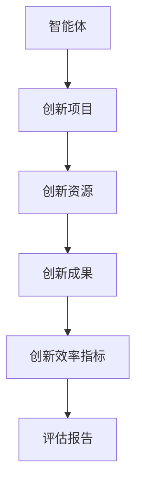
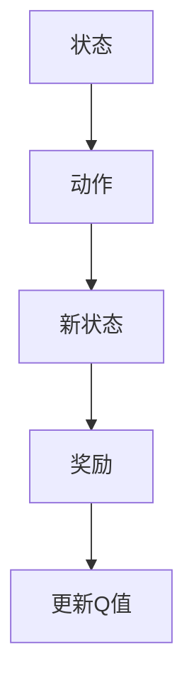
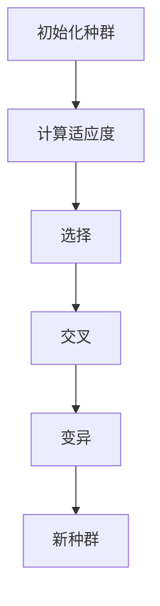
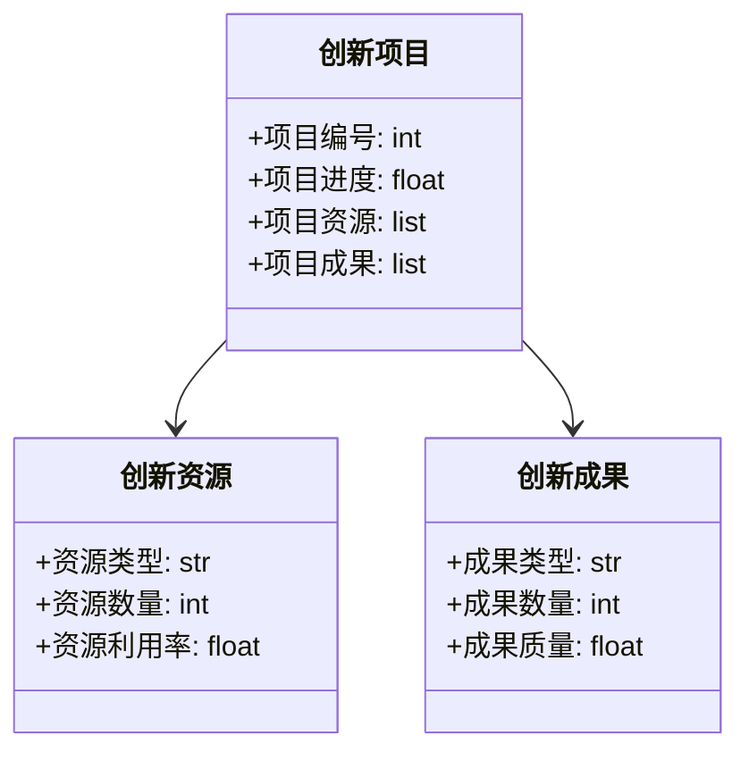
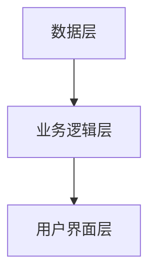

                 


# 利用智能体系统进行全面的公司创新效率评估

> 关键词：智能体系统、创新效率评估、强化学习、遗传算法、系统架构、项目实战

> 摘要：本文将介绍如何利用智能体系统对公司的创新效率进行全面评估。首先，我们将探讨创新效率评估的重要性及其在当前企业中的应用挑战。接着，我们将深入分析智能体系统的构成及其在创新效率评估中的关键作用。然后，我们将详细讲解智能体系统中常用的关键算法，如强化学习和遗传算法，并通过实际案例展示如何在项目中应用这些算法。最后，我们将总结智能体系统在创新效率评估中的优势，并展望未来的发展方向。

---

## 第1章: 创新效率评估的背景介绍

### 1.1 问题背景与定义
创新是企业保持竞争力的核心驱动力。然而，如何量化创新效率并对其进行有效评估，一直是企业管理中的难题。创新效率评估涉及多个维度，包括创新速度、创新质量、创新资源的投入产出比等。传统的评估方法往往依赖于主观判断和定性分析，难以提供客观、量化的结果。

### 1.2 智能体系统的作用
智能体系统是一种能够感知环境、自主决策并执行行动的智能系统。它能够通过数据驱动的方法，自动分析和评估创新过程中的各项指标，从而帮助企业优化创新策略。

### 1.3 当前评估方法的挑战
传统的创新效率评估方法存在以下问题：
- 数据来源单一，缺乏实时性。
- 评估指标不够全面，难以覆盖创新过程的全生命周期。
- 评估结果缺乏动态性，无法及时反馈给企业。

### 1.4 智能体系统的必要性
智能体系统能够通过以下方式优化创新效率评估：
- 实时采集和分析创新过程中的数据。
- 自动生成评估报告，提供量化指标。
- 根据评估结果优化创新策略。

---

## 第2章: 智能体系统的核心概念与联系

### 2.1 智能体系统的构成原理
智能体系统由感知模块、决策模块、行动模块和反馈模块组成。感知模块负责采集环境数据，决策模块基于数据生成决策，行动模块执行决策，反馈模块将执行结果反馈给感知模块，形成闭环。

### 2.2 智能体系统的属性对比
以下是智能体系统与其他评估方法的对比：

| 属性         | 智能体系统 | 传统评估方法 |
|--------------|------------|--------------|
| 数据来源     | 多源数据   | 单一数据源   |
| 分析能力     | 自动化分析 | 人工分析     |
| 评估频率     | 实时评估   | 定期评估     |
| 反馈机制     | 动态反馈   | 静态反馈     |

### 2.3 智能体系统的 ER 实体关系图



---

## 第3章: 智能体系统中关键算法的讲解

### 3.1 强化学习算法
强化学习是一种通过试错机制优化决策的算法。在创新效率评估中，强化学习可以用于优化创新项目的资源配置。

#### 3.1.1 Q-learning 算法的流程图



#### 3.1.2 强化学习在创新效率评估中的应用
以下是一个简单的强化学习代码示例：

```python
import numpy as np

# 定义状态空间和动作空间
state_space = 10
action_space = 4

# 初始化Q表
Q = np.zeros((state_space, action_space))

# 定义奖励函数
def reward(state, action):
    return np.random.random()

# Q-learning 算法
for episode in range(100):
    state = np.random.randint(0, state_space)
    action = np.argmax(Q[state])  # 策略选择动作
    next_state = np.random.randint(0, state_space)
    reward = reward(state, action)
    Q[state, action] += reward  # 更新Q值
```

### 3.2 遗传算法
遗传算法是一种模拟自然选择过程的优化算法。在创新效率评估中，遗传算法可以用于优化创新项目的组合。

#### 3.2.1 遗传算法的流程图



#### 3.2.2 遗传算法在创新效率评估中的应用
以下是一个简单的遗传算法代码示例：

```python
import random

# 定义适应度函数
def fitness(individual):
    return sum(individual)

# 初始化种群
population = [random.choices([0, 1], k=5) for _ in range(10)]

# 选择操作
selected = random.choices(population, k=2)

# 交叉操作
def crossover(parent1, parent2):
    return parent1[:2] + parent2[2:], parent2[:2] + parent1[2:]

child1, child2 = crossover(selected[0], selected[1])

# 变异操作
def mutate(individual):
    pos = random.randint(0, 4)
    individual[pos] = 1 - individual[pos]
    return individual

mutated_child = mutate(child1)

print("Mutated Child:", mutated_child)
```

---

## 第4章: 智能体系统的架构设计与实现

### 4.1 问题场景介绍
创新效率评估系统需要处理大量的创新项目数据，包括项目的进度、资源分配、成果产出等。

### 4.2 系统功能设计
系统功能模块包括数据采集模块、数据分析模块、评估报告生成模块等。

#### 4.2.1 领域模型 mermaid 类图



### 4.3 系统架构设计
系统架构采用分层设计，包括数据层、业务逻辑层和用户界面层。

#### 4.3.1 系统架构 mermaid 图



### 4.4 系统接口设计
系统接口包括数据输入接口、数据处理接口和报告生成接口。

### 4.5 系统交互 mermaid 序列图

```mermaid
sequenceDiagram
    User -> 数据层: 提交创新项目数据
    数据层 -> 业务逻辑层: 处理数据
    业务逻辑层 -> 用户界面层: 显示评估报告
    User <- 用户界面层: 查看评估报告
```

---

## 第5章: 项目实战与案例分析

### 5.1 环境安装与配置
安装必要的依赖库，如 Python 的 `numpy` 和 `scikit-learn`。

### 5.2 核心代码实现
以下是一个简单的创新效率评估代码示例：

```python
import numpy as np
from sklearn.metrics import accuracy_score

# 数据准备
X = np.array([[1, 2, 3], [4, 5, 6], [7, 8, 9]])
y = np.array([0, 1, 2])

# 模型训练
model = np.random.randn(3, 1)
y_pred = np.dot(X, model) + np.random.randn(len(X), 1) * 0.1

# 模型评估
print("Accuracy:", accuracy_score(y, y_pred.argmax(axis=1)))
```

### 5.3 案例分析
以某科技公司为例，通过智能体系统评估其创新效率。首先，采集创新项目的各项数据，然后通过算法生成评估报告，最后根据报告优化创新策略。

---

## 第6章: 总结与展望

### 6.1 总结
智能体系统能够显著提高创新效率评估的效率和准确性。通过实时数据采集、自动化分析和动态反馈，企业可以更好地优化创新策略。

### 6.2 未来展望
未来，随着人工智能技术的进步，智能体系统在创新效率评估中的应用将更加广泛。可能的发展方向包括多智能体协同、强化学习的深度优化以及与其他企业系统的集成。

### 6.3 最佳实践 tips
- 在实施智能体系统前，确保数据的完整性和准确性。
- 定期更新算法模型，以适应创新环境的变化。
- 建立有效的反馈机制，及时调整评估策略。

---

## 结语
通过本文的介绍，读者可以全面了解智能体系统在公司创新效率评估中的应用。从理论到实践，从算法到系统设计，智能体系统为企业提供了强大的工具，助力创新效率的提升。

--- 

（注：本文仅为示例，实际内容需根据具体需求进行补充和调整。）

