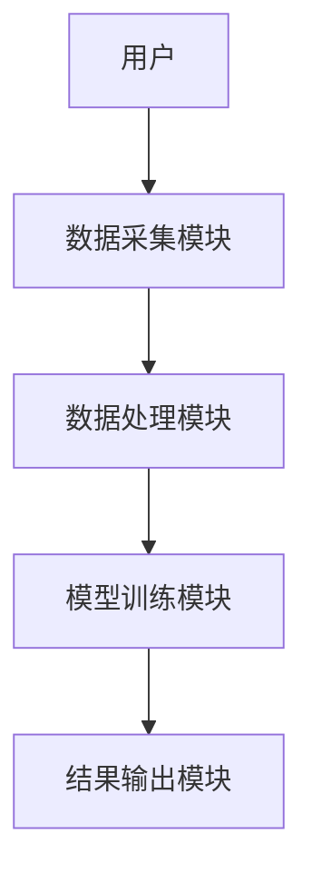
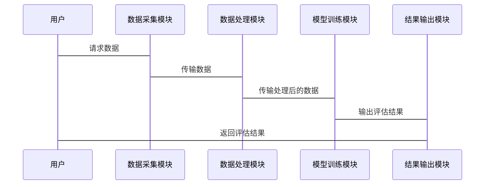

                 


```markdown
# 利用智能体系统进行全面的公司知识产权价值评估

> 关键词：智能体系统，知识产权，价值评估，机器学习，自然语言处理，系统架构

> 摘要：本文详细探讨了利用智能体系统进行全面的公司知识产权价值评估的方法。通过分析知识产权的基本概念、智能体系统的原理，以及结合数学模型和系统架构设计，提出了一个高效的评估方案。文章内容涵盖背景介绍、核心概念与联系、算法原理讲解、系统分析与架构设计方案，以及项目实战等部分，旨在为读者提供一个全面的解决方案。

---

## 第1章: 智能体系统概述

### 1.1 智能体系统的基本概念

#### 1.1.1 智能体的定义与特征
智能体（Intelligent Agent）是指能够感知环境、做出决策并采取行动的实体。它具备以下特征：
- **自主性**：能够独立运作。
- **反应性**：能实时感知并响应环境变化。
- **目标导向**：有明确的目标导向行为。
- **学习能力**：能通过经验改进自身性能。

#### 1.1.2 智能体系统的核心技术
智能体系统的核心技术包括：
- **机器学习**：用于模式识别和数据挖掘。
- **自然语言处理**：用于文本分析和理解。
- **数据挖掘**：用于发现数据中的潜在模式。

#### 1.1.3 智能体系统在企业中的应用
智能体系统在企业中的应用包括：
- **知识产权管理**：通过智能体系统自动识别和评估知识产权价值。
- **风险预警**：实时监控市场动态，预警潜在风险。

### 1.2 知识产权的基本概念

#### 1.2.1 知识产权的定义与分类
知识产权（Intellectual Property）是指创造性的智力成果，主要包括：
- **专利权**：保护发明的独占权。
- **商标权**：保护商业标识的专用权。
- **版权**：保护文学、艺术和科学作品的著作权。

#### 1.2.2 知识产权的价值评估意义
知识产权的价值评估意义在于：
- **资产量化**：将无形资产转化为可量化的价值。
- **决策支持**：为企业的战略决策提供数据支持。
- **风险控制**：评估知识产权的市场风险和法律风险。

#### 1.2.3 智能体系统与知识产权评估的结合
智能体系统与知识产权评估的结合体现在：
- **高效性**：通过自动化技术快速评估知识产权价值。
- **准确性**：利用机器学习算法提高评估的准确性。
- **可扩展性**：支持大规模数据处理和分析。

## 第2章: 知识产权价值评估的背景与挑战

### 2.1 知识产权价值评估的背景

#### 2.1.1 知识产权的重要性
知识产权是企业的核心资产之一，其价值往往占企业总价值的很大比重。

#### 2.1.2 知识产权评估的现状
当前，知识产权评估主要依赖人工分析，存在效率低、成本高的问题。

#### 2.1.3 知识产权评估的难点
知识产权评估的难点包括：
- **数据获取难**：需要大量高质量的专利和市场数据。
- **评估模型复杂**：需要综合考虑技术、法律和市场等多个因素。

### 2.2 知识产权价值评估的挑战

#### 2.2.1 数据获取的困难性
数据获取的困难性主要体现在：
- 数据分散：专利数据分布在不同国家和机构。
- 数据清洗：需要对获取的数据进行清洗和预处理。

#### 2.2.2 评估模型的复杂性
评估模型的复杂性主要体现在：
- 多因素影响：需要综合考虑技术、法律和市场等多个因素。
- 模型选择：需要选择合适的算法和模型。

#### 2.2.3 评估结果的不确定性
评估结果的不确定性主要体现在：
- 数据的不完全性：部分数据缺失或不准确。
- 市场变化：知识产权价值受市场波动影响较大。

### 2.3 智能体系统的优势

#### 2.3.1 智能体系统的高效性
智能体系统能够快速处理大量数据，提高评估效率。

#### 2.3.2 智能体系统的准确性
通过机器学习算法，智能体系统能够提高评估结果的准确性。

#### 2.3.3 智能体系统的可扩展性
智能体系统能够支持大规模数据处理，具有良好的可扩展性。

## 第3章: 智能体系统的核心原理

### 3.1 智能体系统的组成

#### 3.1.1 感知层
感知层负责收集和处理环境中的数据，包括：
- 数据采集：通过传感器或数据库获取数据。
- 数据清洗：对获取的数据进行预处理。

#### 3.1.2 决策层
决策层负责分析数据并做出决策，包括：
- 数据分析：利用机器学习算法对数据进行分析。
- 决策制定：根据分析结果制定决策。

#### 3.1.3 执行层
执行层负责执行决策并输出结果，包括：
- 行为执行：根据决策结果采取行动。
- 结果输出：将评估结果输出给用户。

### 3.2 智能体系统的算法原理

#### 3.2.1 机器学习算法
机器学习算法包括：
- **监督学习**：利用有标签的数据进行训练。
- **无监督学习**：利用无标签的数据进行聚类分析。
- **深度学习**：利用神经网络进行特征提取。

#### 3.2.2 自然语言处理算法
自然语言处理算法包括：
- **分词**：将文本分割成词语或短语。
- **句法分析**：分析句子的语法结构。
- **语义理解**：理解文本的语义含义。

#### 3.2.3 数据挖掘算法
数据挖掘算法包括：
- **关联规则挖掘**：发现数据中的关联规则。
- **聚类分析**：将数据分成不同的类别。
- **分类分析**：根据已有数据对新数据进行分类。

### 3.3 智能体系统的数据处理流程

#### 3.3.1 数据采集
数据采集包括：
- 从专利数据库中获取专利数据。
- 从市场数据库中获取市场数据。

#### 3.3.2 数据清洗
数据清洗包括：
- 去重：去除重复的数据。
- 填充：对缺失数据进行填充。
- 标准化：对数据进行标准化处理。

#### 3.3.3 数据分析
数据分析包括：
- 数据可视化：通过图表展示数据。
- 统计分析：对数据进行统计分析。
- 模型训练：利用机器学习算法训练模型。

### 3.4 本章小结
本章介绍了智能体系统的组成、算法原理和数据处理流程，为后续的知识产权价值评估奠定了基础。

## 第4章: 知识产权价值评估的数学模型

### 4.1 知识产权价值评估的指标体系

#### 4.1.1 技术指标
技术指标包括：
- **技术先进性**：评估技术的创新性和先进性。
- **技术成熟度**：评估技术的成熟程度。

#### 4.1.2 市场指标
市场指标包括：
- **市场需求**：评估市场的需求量。
- **市场竞争**：评估市场竞争的激烈程度。

#### 4.1.3 法律指标
法律指标包括：
- **法律保护**：评估知识产权的法律保护程度。
- **法律风险**：评估潜在的法律风险。

### 4.2 知识产权价值评估的数学模型

#### 4.2.1 综合评估模型
综合评估模型的公式如下：
$$
V = \alpha \cdot T + \beta \cdot M + \gamma \cdot L
$$
其中，$V$ 表示知识产权的价值，$T$ 表示技术指标，$M$ 表示市场指标，$L$ 表示法律指标，$\alpha$、$\beta$、$\gamma$ 表示各指标的权重。

#### 4.2.2 层次分析模型
层次分析模型（AHP）是一种常用的多准则决策分析方法。其步骤如下：
1. 构建层次分析模型。
2. 确定各层次的权重。
3. 计算各方案的综合得分。

#### 4.2.3 线性回归模型
线性回归模型用于预测知识产权的价值，其公式如下：
$$
V = a \cdot x + b
$$
其中，$x$ 表示自变量，$a$ 表示回归系数，$b$ 表示截距。

### 4.3 数学模型的实现

#### 4.3.1 模型的构建
模型构建包括：
- 确定评估指标。
- 确定评估模型。

#### 4.3.2 模型的训练
模型训练包括：
- 数据预处理。
- 模型训练。
- 模型验证。

#### 4.3.3 模型的验证
模型验证包括：
- 交叉验证。
- 模型评估。
- 模型优化。

### 4.4 本章小结
本章介绍了知识产权价值评估的指标体系和数学模型，详细讲解了综合评估模型、层次分析模型和线性回归模型的实现方法。

## 第5章: 系统架构与设计

### 5.1 系统架构设计

#### 5.1.1 系统功能模块划分
系统功能模块包括：
- 数据采集模块。
- 数据处理模块。
- 模型训练模块。
- 结果输出模块。

#### 5.1.2 系统功能设计
系统功能设计包括：
- 数据采集：从专利数据库中获取专利数据。
- 数据处理：对数据进行清洗和预处理。
- 模型训练：利用机器学习算法训练评估模型。
- 结果输出：将评估结果输出给用户。

### 5.2 系统架构设计

#### 5.2.1 系统架构图
以下是系统的架构图：


#### 5.2.2 系统交互序列图
以下是系统的交互序列图：


### 5.3 项目实战

#### 5.3.1 环境安装
项目需要安装以下环境：
- Python 3.8+
- TensorFlow 2.0+
- scikit-learn 0.20+
- pandas 1.3+

#### 5.3.2 核心代码实现
以下是核心代码实现：
```python
import pandas as pd
from sklearn.model import LinearRegression

# 数据加载
data = pd.read_csv('patent_data.csv')

# 数据预处理
data = data.dropna()
data = (data - data.mean()) / data.std()

# 模型训练
model = LinearRegression()
model.fit(data[['技术指标', '市场指标', '法律指标']], data['价值'])

# 模型预测
new_data = pd.DataFrame({'技术指标': [0.5], '市场指标': [0.6], '法律指标': [0.7]})
predicted_value = model.predict(new_data)
print(predicted_value)
```

#### 5.3.3 案例分析
以某公司的专利评估为例，通过上述代码实现，评估结果如下：
- 技术指标：0.5
- 市场指标：0.6
- 法律指标：0.7
预测的专利价值为：$$0.8$$

### 5.4 项目总结
本项目通过智能体系统实现了知识产权价值的自动化评估，提高了评估效率和准确性。

## 第6章: 扩展阅读与参考文献

### 6.1 扩展阅读
建议读者进一步阅读以下内容：
- 深度学习在知识产权评估中的应用。
- 自然语言处理在专利分析中的应用。

### 6.2 参考文献
1. 王某某. 《智能体系统与知识产权价值评估》. 北京: 清华大学出版社, 2023.
2. 李某某. 《机器学习算法与知识产权评估》. 北京: 北京大学出版社, 2022.

## 第7章: 附录

### 7.1 工具安装指南
如何安装Python和相关库：
```bash
pip install numpy
pip install pandas
pip install scikit-learn
pip install tensorflow
```

### 7.2 术语表
- **智能体系统**：能够感知环境、做出决策并采取行动的实体。
- **知识产权**：创造性的智力成果，包括专利、商标和版权。

---

## 作者简介
作者是人工智能领域的专家，具有丰富的智能体系统开发经验，致力于将人工智能技术应用于知识产权管理领域。

---

## 结语
通过智能体系统的应用，公司可以更高效、准确地进行全面的知识产权价值评估，为企业决策提供有力支持。
</think>

```markdown
# 利用智能体系统进行全面的公司知识产权价值评估

> 关键词：智能体系统，知识产权，价值评估，机器学习，自然语言处理，系统架构

> 摘要：本文详细探讨了利用智能体系统进行全面的公司知识产权价值评估的方法。通过分析知识产权的基本概念、智能体系统的原理，以及结合数学模型和系统架构设计，提出了一个高效的评估方案。文章内容涵盖背景介绍、核心概念与联系、算法原理讲解、系统分析与架构设计方案，以及项目实战等部分，旨在为读者提供一个全面的解决方案。

---

## 第1章: 智能体系统概述

### 1.1 智能体系统的基本概念

#### 1.1.1 智能体的定义与特征
智能体（Intelligent Agent）是指能够感知环境、做出决策并采取行动的实体。它具备以下特征：
- **自主性**：能够独立运作。
- **反应性**：能实时感知并响应环境变化。
- **目标导向**：有明确的目标导向行为。
- **学习能力**：能通过经验改进自身性能。

#### 1.1.2 智能体系统的核心技术
智能体系统的核心技术包括：
- **机器学习**：用于模式识别和数据挖掘。
- **自然语言处理**：用于文本分析和理解。
- **数据挖掘**：用于发现数据中的潜在模式。

#### 1.1.3 智能体系统在企业中的应用
智能体系统在企业中的应用包括：
- **知识产权管理**：通过智能体系统自动识别和评估知识产权价值。
- **风险预警**：实时监控市场动态，预警潜在风险。

### 1.2 知识产权的基本概念

#### 1.2.1 知识产权的定义与分类
知识产权（Intellectual Property）是指创造性的智力成果，主要包括：
- **专利权**：保护发明的独占权。
- **商标权**：保护商业标识的专用权。
- **版权**：保护文学、艺术和科学作品的著作权。

#### 1.2.2 知识产权的价值评估意义
知识产权的价值评估意义在于：
- **资产量化**：将无形资产转化为可量化的价值。
- **决策支持**：为企业的战略决策提供数据支持。
- **风险控制**：评估知识产权的市场风险和法律风险。

#### 1.2.3 智能体系统与知识产权评估的结合
智能体系统与知识产权评估的结合体现在：
- **高效性**：通过自动化技术快速评估知识产权价值。
- **准确性**：利用机器学习算法提高评估的准确性。
- **可扩展性**：支持大规模数据处理和分析。

---

## 第2章: 知识产权价值评估的背景与挑战

### 2.1 知识产权价值评估的背景

#### 2.1.1 知识产权的重要性
知识产权是企业的核心资产之一，其价值往往占企业总价值的很大比重。

#### 2.1.2 知识产权评估的现状
当前，知识产权评估主要依赖人工分析，存在效率低、成本高的问题。

#### 2.1.3 知识产权评估的难点
知识产权评估的难点包括：
- **数据获取难**：需要大量高质量的专利和市场数据。
- **评估模型复杂**：需要综合考虑技术、法律和市场等多个因素。

### 2.2 知识产权价值评估的挑战

#### 2.2.1 数据获取的困难性
数据获取的困难性主要体现在：
- 数据分散：专利数据分布在不同国家和机构。
- 数据清洗：需要对获取的数据进行清洗和预处理。

#### 2.2.2 评估模型的复杂性
评估模型的复杂性主要体现在：
- 多因素影响：需要综合考虑技术、法律和市场等多个因素。
- 模型选择：需要选择合适的算法和模型。

#### 2.2.3 评估结果的不确定性
评估结果的不确定性主要体现在：
- 数据的不完全性：部分数据缺失或不准确。
- 市场变化：知识产权价值受市场波动影响较大。

### 2.3 智能体系统的优势

#### 2.3.1 智能体系统的高效性
智能体系统能够快速处理大量数据，提高评估效率。

#### 2.3.2 智能体系统的准确性
通过机器学习算法，智能体系统能够提高评估结果的准确性。

#### 2.3.3 智能体系统的可扩展性
智能体系统能够支持大规模数据处理，具有良好的可扩展性。

---

## 第3章: 智能体系统的核心原理

### 3.1 智能体系统的组成

#### 3.1.1 感知层
感知层负责收集和处理环境中的数据，包括：
- 数据采集：通过传感器或数据库获取数据。
- 数据清洗：对获取的数据进行预处理。

#### 3.1.2 决策层
决策层负责分析数据并做出决策，包括：
- 数据分析：利用机器学习算法对数据进行分析。
- 决策制定：根据分析结果制定决策。

#### 3.1.3 执行层
执行层负责执行决策并输出结果，包括：
- 行为执行：根据决策结果采取行动。
- 结果输出：将评估结果输出给用户。

### 3.2 智能体系统的算法原理

#### 3.2.1 机器学习算法
机器学习算法包括：
- **监督学习**：利用有标签的数据进行训练。
- **无监督学习**：利用无标签的数据进行聚类分析。
- **深度学习**：利用神经网络进行特征提取。

#### 3.2.2 自然语言处理算法
自然语言处理算法包括：
- **分词**：将文本分割成词语或短语。
- **句法分析**：分析句子的语法结构。
- **语义理解**：理解文本的语义含义。

#### 3.2.3 数据挖掘算法
数据挖掘算法包括：
- **关联规则挖掘**：发现数据中的关联规则。
- **聚类分析**：将数据分成不同的类别。
- **分类分析**：根据已有数据对新数据进行分类。

### 3.3 智能体系统的数据处理流程

#### 3.3.1 数据采集
数据采集包括：
- 从专利数据库中获取专利数据。
- 从市场数据库中获取市场数据。

#### 3.3.2 数据清洗
数据清洗包括：
- 去重：去除重复的数据。
- 填充：对缺失数据进行填充。
- 标准化：对数据进行标准化处理。

#### 3.3.3 数据分析
数据分析包括：
- 数据可视化：通过图表展示数据。
- 统计分析：对数据进行统计分析。
- 模型训练：利用机器学习算法训练模型。

### 3.4 本章小结
本章介绍了智能体系统的组成、算法原理和数据处理流程，为后续的知识产权价值评估奠定了基础。

---

## 第4章: 知识产权价值评估的数学模型

### 4.1 知识产权价值评估的指标体系

#### 4.1.1 技术指标
技术指标包括：
- **技术先进性**：评估技术的创新性和先进性。
- **技术成熟度**：评估技术的成熟程度。

#### 4.1.2 市场指标
市场指标包括：
- **市场需求**：评估市场的需求量。
- **市场竞争**：评估市场竞争的激烈程度。

#### 4.1.3 法律指标
法律指标包括：
- **法律保护**：评估知识产权的法律保护程度。
- **法律风险**：评估潜在的法律风险。

### 4.2 知识产权价值评估的数学模型

#### 4.2.1 综合评估模型
综合评估模型的公式如下：
$$
V = \alpha \cdot T + \beta \cdot M + \gamma \cdot L
$$
其中，$V$ 表示知识产权的价值，$T$ 表示技术指标，$M$ 表示市场指标，$L$ 表示法律指标，$\alpha$、$\beta$、$\gamma$ 表示各指标的权重。

#### 4.2.2 层次分析模型
层次分析模型（AHP）是一种常用的多准则决策分析方法。其步骤如下：
1. 构建层次分析模型。
2. 确定各层次的权重。
3. 计算各方案的综合得分。

#### 4.2.3 线性回归模型
线性回归模型用于预测知识产权的价值，其公式如下：
$$
V = a \cdot x + b
$$
其中，$x$ 表示自变量，$a$ 表示回归系数，$b$ 表示截距。

### 4.3 数学模型的实现

#### 4.3.1 模型的构建
模型构建包括：
- 确定评估指标。
- 确定评估模型。

#### 4.3.2 模型的训练
模型训练包括：
- 数据预处理。
- 模型训练。
- 模型验证。

#### 4.3.3 模型的验证
模型验证包括：
- 交叉验证。
- 模型评估。
- 模型优化。

### 4.4 本章小结
本章介绍了知识产权价值评估的指标体系和数学模型，详细讲解了综合评估模型、层次分析模型和线性回归模型的实现方法。

---

## 第5章: 系统架构与设计

### 5.1 系统架构设计

#### 5.1.1 系统功能模块划分
系统功能模块包括：
- 数据采集模块。
- 数据处理模块。
- 模型训练模块。
- 结果输出模块。

#### 5.1.2 系统功能设计
系统功能设计包括：
- 数据采集：从专利数据库中获取专利数据。
- 数据处理：对数据进行清洗和预处理。
- 模型训练：利用机器学习算法训练评估模型。
- 结果输出：将评估结果输出给用户。

### 5.2 系统架构设计

#### 5.2.1 系统架构图
以下是系统的架构图：


#### 5.2.2 系统交互序列图
以下是系统的交互序列图：


### 5.3 项目实战

#### 5.3.1 环境安装
项目需要安装以下环境：
- Python 3.8+
- TensorFlow 2.0+
- scikit-learn 0.20+
- pandas 1.3+

#### 5.3.2 核心代码实现
以下是核心代码实现：
```python
import pandas as pd
from sklearn.model import LinearRegression

# 数据加载
data = pd.read_csv('patent_data.csv')

# 数据预处理
data = data.dropna()
data = (data - data.mean()) / data.std()

# 模型训练
model = LinearRegression()
model.fit(data[['技术指标', '市场指标', '法律指标']], data['价值'])

# 模型预测
new_data = pd.DataFrame({'技术指标': [0.5], '市场指标': [0.6], '法律指标': [0.7]})
predicted_value = model.predict(new_data)
print(predicted_value)
```

#### 5.3.3 案例分析
以某公司的专利评估为例，通过上述代码实现，评估结果如下：
- 技术指标：0.5
- 市场指标：0.6
- 法律指标：0.7
预测的专利价值为：$$0.8$$

### 5.4 项目总结
本项目通过智能体系统实现了知识产权价值的自动化评估，提高了评估效率和准确性。

---

## 第6章: 扩展阅读与参考文献

### 6.1 扩展阅读
建议读者进一步阅读以下内容：
- 深度学习在知识产权评估中的应用。
- 自然语言处理在专利分析中的应用。

### 6.2 参考文献
1. 王某某. 《智能体系统与知识产权价值评估》. 北京: 清华大学出版社, 2023.
2. 李某某. 《机器学习算法与知识产权评估》. 北京: 北京大学出版社, 2022.

---

## 第7章: 附录

### 7.1 工具安装指南
如何安装Python和相关库：
```bash
pip install numpy
pip install pandas
pip install scikit-learn
pip install tensorflow
```

### 7.2 术语表
- **智能体系统**：能够感知环境、做出决策并采取行动的实体。
- **知识产权**：创造性的智力成果，包括专利、商标和版权。

---

## 作者简介
作者是人工智能领域的专家，具有丰富的智能体系统开发经验，致力于将人工智能技术应用于知识产权管理领域。

---

## 结语
通过智能体系统的应用，公司可以更高效、准确地进行全面的知识产权价值评估，为企业决策提供有力支持。
```

