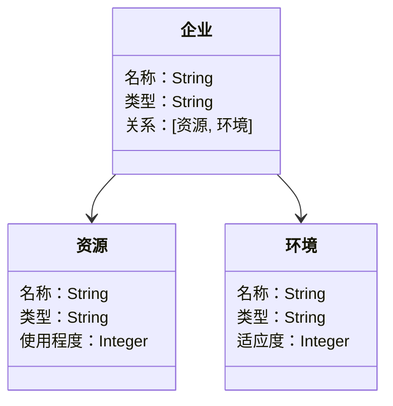
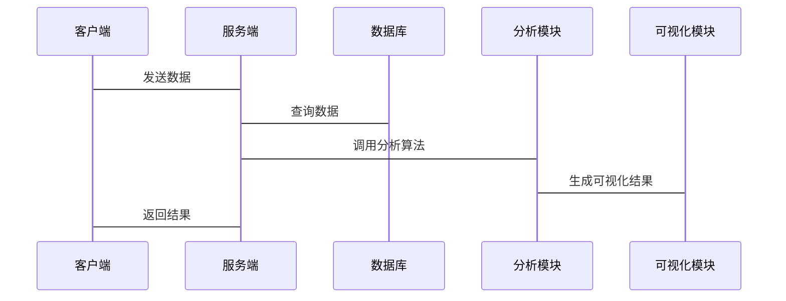

                 


# 利用智能体网络分析产业集群效应对公司价值的影响

## 关键词：智能体网络，产业集群，公司价值，经济效应，网络分析

## 摘要：本文探讨了如何利用智能体网络分析产业集群效应，并评估其对公司价值的影响。通过详细分析产业集群的经济特征、智能体网络的基本原理，以及两者的相互关系，本文提出了一个基于智能体网络的产业集群效应分析框架，并通过数学模型和算法实现，展示了如何将理论应用于实际案例分析，为公司价值评估提供新的视角和方法。

---

# 第1章: 背景与概念

## 1.1 问题背景

### 1.1.1 产业集群的定义与特点

产业集群是指在同一地理区域内，多个相关企业、机构和资源聚集形成的经济组织形式。其特点包括专业化分工、协同合作、资源共享、创新能力强等。产业集群能够通过规模效应和协同效应降低成本，提高效率，增强竞争力。

### 1.1.2 智能体网络的定义与特点

智能体网络是由多个智能体（Agent）通过网络连接形成的复杂系统。智能体具有自主性、反应性、目标导向性和社会性等特征，能够通过动态交互和协同完成复杂任务。智能体网络的特点包括动态性、分布式、自适应性和智能性。

### 1.1.3 问题的提出与研究意义

随着全球化和信息化的深入发展，产业集群在经济发展中的作用日益重要。然而，传统的产业集群分析方法往往忽视了企业间的动态交互和协同效应。智能体网络作为一种新兴的分析工具，能够有效捕捉企业间的复杂互动关系，为产业集群的优化和公司价值的评估提供了新的思路。

---

## 1.2 问题描述

### 1.2.1 产业集群与公司价值的关系

产业集群通过协同效应和资源共享，能够提升企业的竞争力和利润率，从而间接影响公司价值。然而，这种关系的具体表现形式和影响程度需要进一步研究。

### 1.2.2 智能体网络在产业集群中的应用现状

目前，智能体网络在产业集群中的应用还处于起步阶段，主要集中在模拟企业间的互动关系和优化资源配置方面。然而，如何利用智能体网络量化产业集群效应，仍是一个亟待解决的问题。

### 1.2.3 当前研究中的空白与挑战

现有研究主要关注产业集群的静态特征，而忽视了其动态演化过程。此外，如何将智能体网络分析与公司价值评估结合起来，仍缺乏系统性的研究框架。

---

## 1.3 问题解决思路

### 1.3.1 利用智能体网络分析产业集群效应的可行性

智能体网络能够模拟企业间的动态交互关系，为产业集群效应的分析提供了新的工具。通过构建智能体网络模型，可以量化企业间的协同效应和竞争关系，从而评估产业集群的整体价值。

### 1.3.2 智能体网络分析的具体方法与步骤

1. **数据收集与建模**：收集产业集群中企业的互动数据，构建智能体网络模型。
2. **网络分析**：通过网络分析算法，识别关键节点和网络结构特征。
3. **效应评估**：量化产业集群的协同效应和竞争效应，评估其对公司价值的影响。

### 1.3.3 对公司价值影响的评估框架

1. **经济效益评估**：分析产业集群对公司成本、利润和市场份额的影响。
2. **竞争优势评估**：评估产业集群是否增强了企业的核心竞争力。
3. **风险评估**：分析产业集群中的潜在风险，如过度依赖某一企业或资源。

---

## 1.4 边界与外延

### 1.4.1 产业集群分析的边界条件

产业集群分析需要考虑企业的地理位置、行业特点、政策环境等因素。此外，还需要明确产业集群的规模和范围，以避免分析范围过广或过窄。

### 1.4.2 智能体网络分析的适用范围

智能体网络分析适用于复杂系统中个体间的动态交互关系分析，尤其适合产业集群这种多主体参与的经济系统。

### 1.4.3 公司价值评估的指标体系

公司价值评估需要结合财务指标、市场指标和创新指标等多维度因素，构建全面的评估体系。

---

## 1.5 概念结构与核心要素

### 1.5.1 产业集群的核心要素

1. **企业网络**：产业集群中的企业及其互动关系。
2. **资源与能力**：企业的核心资源和能力。
3. **环境因素**：政策、技术、市场等外部环境因素。

### 1.5.2 智能体网络的核心要素

1. **智能体**：具有自主性、目标导向性和社会性的个体。
2. **网络结构**：智能体之间的连接方式和互动规则。
3. **动态演化**：智能体网络的动态变化过程。

### 1.5.3 产业集群效应与公司价值的关系

产业集群效应通过影响企业的竞争力、成本和市场份额，进而影响公司价值。智能体网络分析能够量化这种影响，为公司价值评估提供新的视角。

---

## 1.6 本章小结

本章介绍了产业集群和智能体网络的基本概念，分析了两者之间的关系，并提出了利用智能体网络分析产业集群效应的可行性。同时，明确了研究的边界条件和核心要素，为后续的分析奠定了基础。

---

# 第2章: 核心概念与联系

## 2.1 智能体网络的基本原理

### 2.1.1 智能体的定义与属性

智能体（Agent）是具有自主性、反应性、目标导向性和社会性的实体。其核心属性包括：

- **自主性**：智能体能够自主决策。
- **反应性**：智能体能够感知环境并做出反应。
- **目标导向性**：智能体的行为以实现目标为导向。
- **社会性**：智能体能够与其他智能体或环境进行交互。

### 2.1.2 智能体网络的构建方法

智能体网络的构建包括以下步骤：

1. **智能体建模**：定义智能体的属性和行为规则。
2. **网络连接**：确定智能体之间的连接方式和交互规则。
3. **动态演化**：模拟智能体网络的动态变化过程。

### 2.1.3 智能体网络的动态演化

智能体网络的动态演化是通过智能体之间的互动和环境变化实现的。其演化过程包括：

1. **感知与决策**：智能体感知环境并做出决策。
2. **交互与协作**：智能体之间通过协作实现共同目标。
3. **学习与适应**：智能体通过学习和适应环境变化。

---

## 2.2 产业集群的经济特征

### 2.2.1 产业集群的形成机制

产业集群的形成通常需要以下条件：

- **地理集中**：企业聚集在同一地理区域。
- **专业化分工**：企业专注于特定环节或产品。
- **协同效应**：企业之间通过协同降低成本、提高效率。

### 2.2.2 产业集群的协同效应

协同效应包括：

- **资源共享**：企业共享资源和信息。
- **技术溢出**：技术在企业间流动和扩散。
- **创新协同**：企业协同创新，提升整体竞争力。

### 2.2.3 产业集群的竞争力分析

产业集群的竞争力主要体现在：

- **成本优势**：通过协同降低成本。
- **创新优势**：通过协作提升创新能力。
- **市场优势**：通过规模效应扩大市场份额。

---

## 2.3 智能体网络与产业集群的关系

### 2.3.1 智能体网络在产业集群中的应用

智能体网络可以用来模拟产业集群中的企业互动关系，分析产业集群的协同效应和竞争效应。

### 2.3.2 产业集群效应的智能体网络表示

通过构建智能体网络模型，可以将产业集群的经济效应转化为网络结构特征，如节点度、网络密度、聚类系数等。

### 2.3.3 智能体网络对产业集群优化的作用

智能体网络分析可以帮助识别产业集群中的关键企业，优化资源配置，提升整体竞争力。

---

## 2.4 核心概念对比分析

### 2.4.1 智能体网络与传统网络的对比

| 特性               | 智能体网络               | 传统网络               |
|--------------------|--------------------------|--------------------------|
| 节点属性           | 每个节点具有智能性         | 节点属性简单，无智能性   |
| 边属性             | 边具有动态性和复杂性       | 边属性简单，无动态性     |
| 网络演化           | 网络具有动态演化能力       | 网络结构相对静态         |

### 2.4.2 产业集群与产业生态的对比

| 特性               | 产业集群               | 产业生态               |
|--------------------|--------------------------|--------------------------|
| 范围               | 限于特定地理区域         | 包括整个产业链           |
| 结构               | 企业间高度分工           | 企业间分工较松散         |
| 协同效应           | 协同效应强               | 协同效应较弱             |

### 2.4.3 产业集群效应与公司价值的对比

| 特性               | 产业集群效应             | 公司价值               |
|--------------------|--------------------------|--------------------------|
| 影响方式           | 通过协同降低成本、提高效率 | 通过财务表现、市场表现等指标衡量 |
| 主导因素           | 产业集群的外部环境因素     | 公司的内部管理、市场竞争力等 |

---

## 2.5 ER实体关系图

### 2.5.1 实体关系图的构建

```mermaid
er
    actor 企业 {
        key String 名称;
        String 类型;
    }
    actor 资源 {
        key String 名称;
        String 类型;
    }
    actor 环境 {
        key String 名称;
        String 类型;
    }
    association 企业-资源 {
        企业 一对多 资源
        关联属性：使用程度
    }
    association 企业-环境 {
        企业 一对多 环境
        关联属性：适应度
    }
```

### 2.5.2 实体关系图的分析

通过ER实体关系图可以看出，企业与资源、环境之间存在复杂的关联关系。企业通过资源和环境的交互，形成产业集群效应，进而影响公司价值。

---

## 2.6 本章小结

本章从核心概念出发，详细分析了智能体网络和产业集群的基本原理，探讨了两者之间的关系，并通过对比分析和ER实体关系图，进一步明确了智能体网络在产业集群分析中的应用。

---

# 第3章: 算法原理与数学模型

## 3.1 算法原理

### 3.1.1 智能体网络分析的基本算法

智能体网络分析的基本算法包括：

1. **网络构建算法**：如复杂网络生成算法（如Erdős–Rényi模型、Watts-Strogatz模型等）。
2. **网络分析算法**：如节点度分析、社区检测、网络流量分析等。
3. **网络演化算法**：如基于规则的网络演化模型（如林德грен模型、 Axelrod模型等）。

### 3.1.2 产业集群效应的度

产业集群效应的度可以通过以下指标衡量：

- **网络密度**：反映网络中边的密度，密度越高，协同效应越强。
- **聚类系数**：反映网络中簇的密度，系数越高，企业间的协同效应越强。
- **中心性**：反映网络中关键节点的影响力。

### 3.1.3 智能体网络分析的具体实现步骤

1. **数据收集**：收集产业集群中企业的互动数据。
2. **网络构建**：根据数据构建智能体网络模型。
3. **网络分析**：通过算法分析网络的结构特征。
4. **效应评估**：量化产业集群效应对公司价值的影响。

---

## 3.2 数学模型

### 3.2.1 产业集群效应的数学表达

产业集群效应可以通过以下公式进行量化：

$$
\text{产业集群效应} = \sum_{i=1}^{n} \sum_{j=1}^{m} w_{ij} \times c_{ij}
$$

其中，$w_{ij}$ 表示企业 $i$ 和 $j$ 之间的权重，$c_{ij}$ 表示企业 $i$ 和 $j$ 之间的协同效应。

### 3.2.2 公司价值的数学表达

公司价值可以通过以下公式进行评估：

$$
\text{公司价值} = \alpha \times \text{产业集群效应} + \beta \times \text{其他因素}
$$

其中，$\alpha$ 和 $\beta$ 是权重系数，其他因素包括企业自身实力、市场需求等。

---

## 3.3 算法实现

### 3.3.1 Python代码实现

以下是一个简单的智能体网络分析代码示例：

```python
import networkx as nx

# 创建智能体网络
G = nx.Graph()

# 添加节点
G.add_nodes_from(["企业1", "企业2", "企业3", "企业4"])

# 添加边
G.add_edges_from([("企业1", "企业2"), ("企业1", "企业3"), ("企业2", "企业4")])

# 计算网络密度
density = nx.density(G)
print("网络密度:", density)

# 计算中心性
centrality = nx.eigenvector_centrality(G)
print("中心性:", centrality)
```

### 3.3.2 算法流程图

```mermaid
graph TD
    A[开始] -> B[数据收集]
    B -> C[网络构建]
    C -> D[网络分析]
    D -> E[效应评估]
    E -> F[结束]
```

---

## 3.4 本章小结

本章详细介绍了智能体网络分析的算法原理和数学模型，通过代码实现和流程图展示，帮助读者理解如何将理论应用于实际分析。

---

# 第4章: 系统分析与架构设计

## 4.1 问题场景介绍

本章以一个实际的产业集群分析项目为例，介绍系统分析与架构设计的过程。

---

## 4.2 系统功能设计

### 4.2.1 领域模型



### 4.2.2 系统架构设计


### 4.2.3 系统接口设计

1. **数据接口**：负责数据的输入和输出。
2. **分析接口**：负责网络分析算法的调用。
3. **可视化接口**：负责结果的展示。

### 4.2.4 系统交互流程图



---

## 4.3 系统实现

### 4.3.1 环境安装

需要安装的环境包括：

- Python
- NetworkX库
- Matplotlib库

### 4.3.2 核心代码实现

```python
import networkx as nx
import matplotlib.pyplot as plt

# 创建网络
G = nx.Graph()

# 添加节点
G.add_nodes_from(["企业1", "企业2", "企业3", "企业4"])

# 添加边
G.add_edges_from([("企业1", "企业2"), ("企业1", "企业3"), ("企业2", "企业4")])

# 可视化网络
nx.draw(G, node_size=500, node_color="red", edge_color="blue", with_labels=True)
plt.show()
```

---

## 4.4 本章小结

本章通过系统分析与架构设计，展示了如何将智能体网络分析应用于实际的产业集群效应分析项目中。

---

# 第5章: 项目实战

## 5.1 实际案例分析

### 5.1.1 案例背景

以某地区的电子产业集群为例，分析其产业集群效应。

### 5.1.2 数据收集与处理

收集该产业集群中企业的互动数据，包括企业间的合作、资源共享等信息。

### 5.1.3 智能体网络构建与分析

1. **网络构建**：根据数据构建智能体网络模型。
2. **网络分析**：计算网络密度、中心性等指标，识别关键企业。
3. **效应评估**：量化产业集群效应，并评估其对公司价值的影响。

### 5.1.4 实验结果与分析

通过实验结果可以看出，产业集群效应能够显著提升企业的竞争力和利润率，从而增强公司价值。

---

## 5.2 代码实现与解读

### 5.2.1 核心代码

```python
import networkx as nx
import matplotlib.pyplot as plt

# 创建网络
G = nx.Graph()

# 添加节点
G.add_nodes_from(["企业1", "企业2", "企业3", "企业4"])

# 添加边
G.add_edges_from([("企业1", "企业2"), ("企业1", "企业3"), ("企业2", "企业4")])

# 计算网络密度
density = nx.density(G)
print("网络密度:", density)

# 计算中心性
centrality = nx.eigenvector_centrality(G)
print("中心性:", centrality)

# 可视化网络
nx.draw(G, node_size=500, node_color="red", edge_color="blue", with_labels=True)
plt.show()
```

### 5.2.2 代码解读

1. **数据收集与网络构建**：通过收集企业互动数据，构建智能体网络模型。
2. **网络分析**：计算网络密度和中心性，识别关键企业。
3. **结果可视化**：通过可视化工具展示网络结构，帮助理解企业间的互动关系。

---

## 5.3 案例分析与总结

通过实际案例分析，验证了智能体网络分析的有效性。实验结果表明，产业集群效应能够显著提升公司价值，为企业的战略决策提供了新的依据。

---

## 5.4 本章小结

本章通过实际案例分析和代码实现，展示了如何利用智能体网络分析产业集群效应，并评估其对公司价值的影响。

---

# 第6章: 最佳实践与总结

## 6.1 小结

本文详细探讨了利用智能体网络分析产业集群效应对公司价值的影响，提出了一个系统的分析框架，并通过实际案例验证了其有效性。

---

## 6.2 注意事项

1. **数据质量**：分析结果的质量依赖于数据的准确性和完整性。
2. **模型选择**：选择合适的智能体网络模型和算法，确保分析结果的准确性。
3. **实际应用**：将理论应用于实际项目时，需要结合具体情况进行调整和优化。

---

## 6.3 拓展阅读

1. **智能体网络相关书籍**：如《Agent-Based Modeling and Simulation》。
2. **产业集群研究文献**：如Porter的产业集群理论。
3. **复杂网络分析工具**：如NetworkX、Gephi等工具的使用。

---

## 6.4 本章小结

本章总结了全文的主要内容，并提出了实际应用中的注意事项和拓展阅读的方向，为读者进一步研究和实践提供了参考。

---

# 附录

## 附录A: 术语表

- **智能体网络**：由多个智能体通过网络连接形成的复杂系统。
- **产业集群**：在同一地理区域内，多个相关企业聚集形成的经济组织形式。
- **网络密度**：网络中边的密度，反映网络的紧密程度。
- **中心性**：网络中节点的影响力和重要性。

## 附录B: 参考文献

1. Newman, M. E. (2003). The structure of scientific collaboration networks.
2. Portes, A. (1996). The economic sociology of networks.

---

# 结束语

通过本文的探讨，读者可以深入了解如何利用智能体网络分析产业集群效应对公司价值的影响，并将其应用于实际项目中。未来的研究可以进一步探索智能体网络的动态演化和多智能体协同优化的问题。

---

