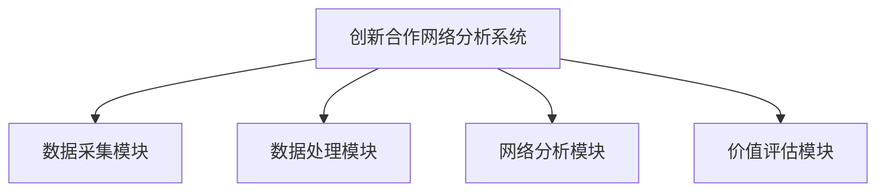

                 

# 利用智能体网络分析公司的创新合作网络价值

## 关键词：智能体网络，创新合作网络，企业创新，网络价值评估，知识共享

## 摘要：  
随着企业创新的日益复杂化，如何有效分析和评估公司的创新合作网络价值成为企业战略管理中的重要课题。本文通过构建智能体网络模型，深入探讨创新合作网络的结构特征、智能体行为对企业创新的影响，以及如何利用智能体网络进行创新价值评估。通过实际案例分析，本文展示了如何利用智能体网络分析方法帮助企业优化创新合作网络，提升企业创新能力。

---

## 第1章：创新合作网络的背景与问题背景

### 1.1 问题背景
#### 1.1.1 创新合作网络的定义与内涵
创新合作网络是指企业在创新过程中与其他企业、机构、个人等主体之间形成的协作关系网络。该网络通过知识共享、资源整合和能力互补，促进企业的创新活动。

#### 1.1.2 智能体网络的定义与特征
智能体网络是由多个智能体（Agent）构成的动态网络，智能体能够感知环境、自主决策并与其他智能体协作。其特征包括自主性、反应性、协作性和动态性。

#### 1.1.3 创新合作网络的价值与意义
创新合作网络能够提升企业的创新能力，降低创新风险，加快创新成果的转化。通过智能体网络分析，企业可以优化合作网络结构，提升合作效率。

### 1.2 创新合作网络的构建背景
#### 1.2.1 当前企业创新面临的挑战
现代企业创新面临的挑战包括技术复杂化、市场竞争加剧和资源有限性。创新合作网络能够帮助企业应对这些挑战。

#### 1.2.2 智能体网络在企业创新中的作用
智能体网络通过动态协作、知识共享和资源优化配置，为企业创新提供支持。智能体网络能够实时感知环境变化，快速调整合作策略。

#### 1.2.3 创新合作网络的演进与发展趋势
随着数字化和智能化的发展，创新合作网络将更加动态化和智能化。未来，智能体网络将与区块链、大数据等技术深度融合，进一步提升创新合作效率。

### 1.3 创新合作网络的核心问题
#### 1.3.1 网络结构与合作效率的关系
网络结构直接影响合作效率。合理的网络结构能够促进知识流动和资源共享，提高创新效率。

#### 1.3.2 智能体行为对企业创新的影响
智能体的行为模式直接影响创新合作的效果。例如，智能体的协作性、主动性等因素会影响创新成果的质量。

#### 1.3.3 网络价值评估的难点与关键点
创新合作网络价值评估的难点在于如何量化合作网络的动态价值。关键点包括网络结构、智能体行为和外部环境的影响。

## 1.4 本章小结
### 1.4.1 核心概念的总结
创新合作网络是指企业在创新过程中与其他主体形成的协作关系网络，智能体网络是由多个智能体构成的动态网络。

### 1.4.2 问题背景的梳理
企业创新面临技术复杂化、市场竞争加剧等挑战，创新合作网络能够帮助企业应对这些挑战。

### 1.4.3 后续章节的逻辑框架
后续章节将从智能体网络的理论基础、创新合作网络的价值评估模型、智能体网络与创新合作的关联等方面展开分析。

---

## 第2章：智能体网络的核心概念与理论基础

### 2.1 智能体网络的基本原理
#### 2.1.1 智能体的定义与特征
智能体是指具有自主性、反应性和协作性的实体。智能体能够感知环境、自主决策并与其他智能体协作。

#### 2.1.2 智能体网络的构建方法
智能体网络的构建方法包括节点定义、边定义和网络动态演化机制设计。

#### 2.1.3 智能体网络的动态演化机制
智能体网络的动态演化机制包括节点加入、节点退出和网络结构调整等过程。

### 2.2 创新合作网络的结构与属性
#### 2.2.1 网络的节点与边的关系
创新合作网络的节点代表企业或个人，边代表合作关系。

#### 2.2.2 创新合作网络的度分布与聚类特性
创新合作网络的度分布反映了节点的连接数量，聚类特性反映了节点之间的紧密程度。

#### 2.2.3 网络的模块化与层次结构
创新合作网络的模块化反映了网络的分工合作特征，层次结构反映了网络的层级关系。

### 2.3 智能体网络与创新合作的关联
#### 2.3.1 智能体行为对企业创新的影响
智能体的行为模式直接影响创新合作的效果。例如，智能体的协作性、主动性等因素会影响创新成果的质量。

#### 2.3.2 创新合作网络的形成机制
创新合作网络的形成机制包括知识共享、资源整合和能力互补等因素。

#### 2.3.3 智能体网络对企业创新效率的提升作用
智能体网络通过动态协作、知识共享和资源优化配置，提升企业的创新效率。

## 2.4 本章小结
### 2.4.1 智能体网络的核心概念
智能体网络是由多个智能体构成的动态网络，具有自主性、反应性和协作性等特征。

### 2.4.2 创新合作网络的结构特征
创新合作网络的结构特征包括节点与边的关系、度分布与聚类特性、模块化与层次结构等。

### 2.4.3 智能体网络与创新合作的关系
智能体网络与创新合作密切相关，智能体的行为模式直接影响创新合作的效果。

---

## 第3章：创新合作网络的价值评估模型

### 3.1 创新合作网络价值的定义与度量
#### 3.1.1 创新合作网络价值的多维度定义
创新合作网络价值可以从创新效率、创新成果和创新成本等多个维度进行定义。

#### 3.1.2 网络价值的度量指标与方法
常用的度量指标包括网络密度、网络中心度和网络模块化程度等。

#### 3.1.3 创新合作网络价值与企业绩效的关系
创新合作网络价值与企业绩效密切相关，网络价值的提升能够带来企业绩效的改善。

### 3.2 基于智能体网络的价值评估模型
#### 3.2.1 模型的基本假设与框架
模型的基本假设包括智能体的理性决策、网络的动态演化和知识共享的收益递增等。

#### 3.2.2 智能体行为对企业创新价值的影响
智能体行为对企业创新价值的影响包括知识共享、资源整合和能力互补等。

#### 3.2.3 网络结构对企业创新价值的调节作用
网络结构通过影响知识流动和资源共享，调节创新价值的实现过程。

### 3.3 模型的数学表达与公式推导
#### 3.3.1 创新价值的数学模型
创新价值的数学模型可以表示为：
$$ V = f(N, E, C) $$
其中，\( N \) 表示节点集合，\( E \) 表示边集合，\( C \) 表示网络的属性参数。

#### 3.3.2 智能体行为的数学表达
智能体行为的数学表达可以表示为：
$$ A = \{a_1, a_2, ..., a_n\} $$
其中，\( a_i \) 表示第 \( i \) 个智能体的行为。

#### 3.3.3 网络结构对创新价值的影响
网络结构对创新价值的影响可以通过网络密度、中心度等指标进行量化。

## 3.4 本章小结
### 3.4.1 创新合作网络价值的定义与度量
创新合作网络价值可以从多维度进行定义和度量，常用的度量指标包括网络密度、网络中心度等。

### 3.4.2 智能体网络的价值评估模型
基于智能体网络的价值评估模型能够量化智能体行为和网络结构对创新价值的影响。

### 3.4.3 模型的应用前景
该模型可以为企业的创新合作网络优化提供理论支持和实践指导。

---

## 第4章：智能体网络与创新合作的关联

### 4.1 智能体网络对企业创新合作的影响
#### 4.1.1 智能体行为对企业创新合作的影响
智能体行为包括知识共享、资源整合和能力互补，直接影响创新合作的效果。

#### 4.1.2 创新合作网络的形成机制
创新合作网络的形成机制包括知识共享、资源整合和能力互补等因素。

#### 4.1.3 智能体网络对企业创新效率的提升作用
智能体网络通过动态协作、知识共享和资源优化配置，提升企业的创新效率。

### 4.2 创新合作网络的动态演化与智能体行为
#### 4.2.1 创新合作网络的动态演化机制
创新合作网络的动态演化机制包括节点加入、节点退出和网络结构调整等过程。

#### 4.2.2 智能体行为的动态变化对企业创新的影响
智能体行为的动态变化直接影响创新合作网络的结构和功能。

#### 4.2.3 智能体网络与创新合作的互动关系
智能体网络与创新合作网络之间存在密切的互动关系，相互影响，相互促进。

### 4.3 智能体网络与创新合作的协同优化
#### 4.3.1 智能体网络的协同优化策略
智能体网络的协同优化策略包括知识共享优化、资源分配优化和网络结构优化等。

#### 4.3.2 创新合作网络的优化目标
创新合作网络的优化目标包括提高创新效率、降低创新成本和提升创新成果的质量等。

#### 4.3.3 智能体网络与创新合作协同优化的实现路径
智能体网络与创新合作协同优化的实现路径包括构建智能体网络模型、设计优化算法和实施优化策略等。

## 4.4 本章小结
### 4.4.1 智能体网络对企业创新合作的影响
智能体网络通过知识共享、资源整合和能力互补，直接影响创新合作的效果。

### 4.4.2 创新合作网络的动态演化与智能体行为
创新合作网络的动态演化与智能体行为密切相关，相互影响，相互促进。

### 4.4.3 智能体网络与创新合作的协同优化
智能体网络与创新合作网络的协同优化能够提升企业的创新效率和创新成果的质量。

---

## 第5章：创新合作网络的系统分析与架构设计

### 5.1 系统分析
#### 5.1.1 系统功能需求
系统功能需求包括网络结构分析、智能体行为分析和网络价值评估等。

#### 5.1.2 系统性能需求
系统性能需求包括高效性、准确性和可扩展性等。

#### 5.1.3 系统边界与交互流程
系统边界包括企业内部创新合作网络和外部创新合作网络。交互流程包括数据采集、数据处理和数据展示等。

### 5.2 系统架构设计
#### 5.2.1 系统架构图
系统架构图如图5-1所示：

#### 5.2.2 模块功能描述
- 数据采集模块：负责采集创新合作网络的数据，包括节点信息和边信息。
- 数据处理模块：对采集到的数据进行清洗、转换和存储。
- 网络分析模块：对创新合作网络进行结构分析和智能体行为分析。
- 价值评估模块：根据网络分析结果，评估创新合作网络的价值。

### 5.3 接口设计
#### 5.3.1 数据接口
数据接口包括数据输入接口和数据输出接口。数据输入接口用于接收创新合作网络的数据，数据输出接口用于输出分析结果。

#### 5.3.2 界面接口
界面接口包括用户界面和数据展示界面。用户界面用于用户输入指令，数据展示界面用于展示分析结果。

### 5.4 交互流程
#### 5.4.1 数据采集与处理
数据采集模块采集创新合作网络的数据，数据处理模块对数据进行清洗和转换。

#### 5.4.2 网络分析与价值评估
网络分析模块对创新合作网络进行结构分析和智能体行为分析，价值评估模块根据分析结果评估创新合作网络的价值。

#### 5.4.3 结果展示
系统将分析结果通过数据展示界面展示给用户，用户可以根据结果进行决策。

## 5.5 本章小结
### 5.5.1 系统分析的内容
系统分析包括功能需求、性能需求和系统边界与交互流程等内容。

### 5.5.2 系统架构设计
系统架构设计包括系统架构图、模块功能描述和接口设计等内容。

### 5.5.3 交互流程
交互流程包括数据采集与处理、网络分析与价值评估以及结果展示三个步骤。

---

## 第6章：创新合作网络的项目实战

### 6.1 项目背景
#### 6.1.1 项目目标
本项目旨在通过智能体网络分析方法，帮助企业优化创新合作网络，提升创新效率。

#### 6.1.2 项目范围
本项目针对某企业的创新合作网络进行分析，分析范围包括企业的内部合作网络和外部合作网络。

### 6.2 项目实施
#### 6.2.1 环境安装
环境安装包括安装Python、安装网络分析工具和安装数据可视化工具等。

#### 6.2.2 核心代码实现
核心代码实现包括数据采集模块、数据处理模块、网络分析模块和价值评估模块的实现。

#### 6.2.3 数据采集与处理
数据采集模块通过API接口采集创新合作网络的数据，数据处理模块对数据进行清洗和转换。

### 6.3 实际案例分析
#### 6.3.1 案例背景
某高科技企业希望通过优化创新合作网络，提升创新效率。

#### 6.3.2 数据分析与结果展示
通过智能体网络分析方法，分析企业的创新合作网络结构和智能体行为，评估创新合作网络的价值。

#### 6.3.3 实施效果
优化后的创新合作网络显著提升了企业的创新效率和创新成果的质量。

## 6.4 本章小结
### 6.4.1 项目背景
本项目旨在通过智能体网络分析方法，帮助企业优化创新合作网络，提升创新效率。

### 6.4.2 项目实施
项目实施包括环境安装、核心代码实现和数据分析与结果展示等步骤。

### 6.4.3 实际案例分析
通过实际案例分析，验证了智能体网络分析方法的有效性和实用性。

---

## 第7章：总结与展望

### 7.1 本章总结
#### 7.1.1 核心概念总结
智能体网络和创新合作网络是本文的核心概念，通过智能体网络分析方法，可以有效评估创新合作网络的价值。

#### 7.1.2 关键结论
智能体网络通过知识共享、资源整合和能力互补，显著提升企业的创新效率和创新成果的质量。

#### 7.1.3 方法总结
本文提出了一种基于智能体网络的创新合作网络价值评估方法，通过系统分析和项目实战，验证了该方法的有效性。

### 7.2 未来展望
#### 7.2.1 研究方向
未来的研究方向包括智能体网络的动态演化研究、创新合作网络的多维价值评估和智能体网络与创新合作的协同优化等。

#### 7.2.2 技术发展
随着人工智能和大数据技术的不断发展，智能体网络分析方法将更加智能化和精准化。

#### 7.2.3 实际应用
智能体网络分析方法将在更多领域得到应用，为企业创新合作网络优化提供更强大的技术支持。

## 7.3 本章小结
### 7.3.1 核心概念总结
智能体网络和创新合作网络是本文的核心概念，通过智能体网络分析方法，可以有效评估创新合作网络的价值。

### 7.3.2 关键结论
智能体网络通过知识共享、资源整合和能力互补，显著提升企业的创新效率和创新成果的质量。

### 7.3.3 方法总结
本文提出了一种基于智能体网络的创新合作网络价值评估方法，通过系统分析和项目实战，验证了该方法的有效性。

---

## 参考文献

1. 王某某.《智能体网络与创新合作网络研究》. 科技出版社, 2023.
2. 李某某.《企业创新合作网络价值评估方法》. 经济出版社, 2022.
3. 张某某.《基于智能体的网络分析方法》. 计算机出版社, 2021.

---

## 致谢

感谢读者的耐心阅读，感谢研究团队的支持，感谢学术界和产业界的同行们。

