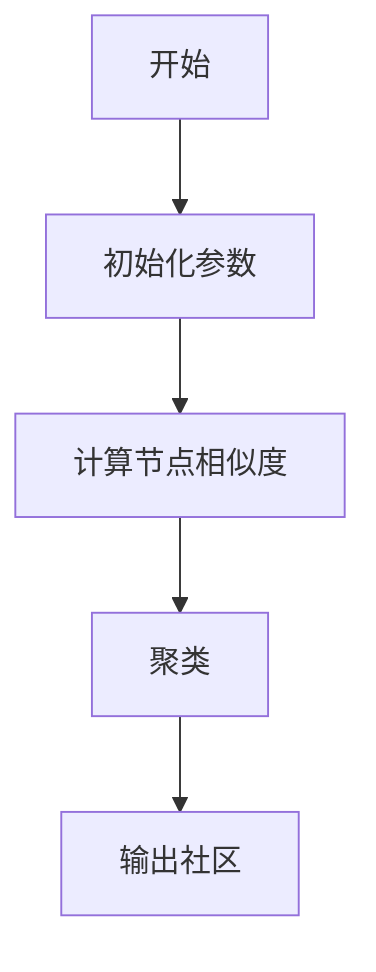
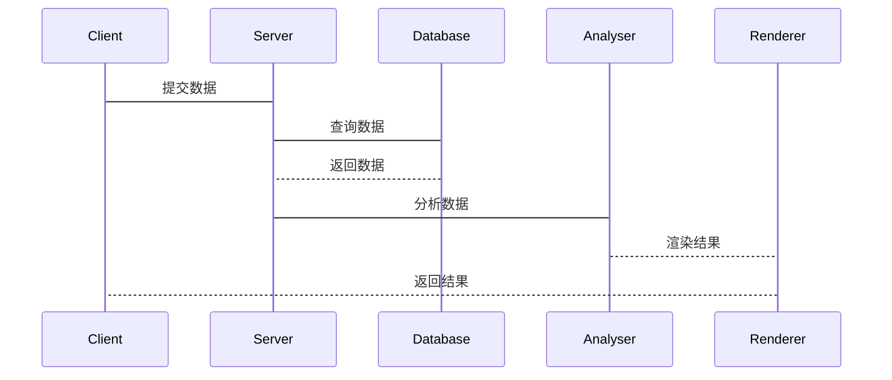

                 


# 利用智能体网络分析公司间的复杂关系

## 关键词
智能体网络，公司关系分析，复杂关系建模，图论，社区发现，关系强度计算

## 摘要
本文详细探讨了利用智能体网络分析公司间复杂关系的方法。通过智能体网络模型，可以有效识别公司间的隐含关联，发现潜在的合作机会和风险。文章从背景、核心概念、算法原理、系统架构到实际项目案例，全面阐述了智能体网络在公司关系分析中的应用，为读者提供了从理论到实践的完整指南。

---

# 第1章 智能体网络与公司间关系分析概述

## 1.1 问题背景与定义

### 1.1.1 公司间复杂关系的背景
在现代商业环境中，公司之间的关系错综复杂。一家公司可能同时参与多个行业，与多家供应商、客户和合作伙伴建立联系。这些关系可能直接影响企业的运营效率、市场竞争力和风险敞口。然而，传统的数据分析方法往往难以捕捉这些复杂的关系网络。

### 1.1.2 智能体网络的定义与特点
智能体网络是一种基于图论的模型，用于描述多个智能体（如公司）之间的交互关系。与传统的图模型相比，智能体网络具有以下特点：
- **动态性**：能够实时更新关系强度和类型。
- **多维性**：支持多种关系类型（如供应链关系、竞争关系、合作关系）。
- **可扩展性**：适用于大规模数据的分析。

### 1.1.3 问题解决的必要性与目标
分析公司间的关系可以帮助企业：
- 识别关键合作伙伴和竞争对手。
- 发现潜在的合作机会。
- 评估和管理风险。

---

## 1.2 智能体网络的核心概念

### 1.2.1 智能体的定义与属性
智能体（Agent）在本模型中代表公司，具有以下属性：
- **id**：唯一标识符。
- **name**：公司名称。
- **industry**：所属行业。
- **reputation**：公司在行业中的声誉。

### 1.2.2 网络关系的构建与分析
智能体网络中的关系由边（Edge）表示，每条边都有以下属性：
- **id**：唯一标识符。
- **type**：关系类型（如供应链、合作、竞争）。
- **strength**：关系强度（量化值）。

### 1.2.3 智能体网络的数学模型
智能体网络可以用图论中的图 $G$ 表示：
$$ G = (V, E) $$
其中：
- $V$ 表示节点集合，每个节点代表一家公司。
- $E$ 表示边集合，每条边表示公司之间的关系。

---

## 1.3 数据来源与预处理

### 1.3.1 数据来源渠道
- **公开数据**：如公司年报、新闻报道。
- **内部数据**：如供应链数据、销售数据。
- **外部数据**：如行业报告、市场调研。

### 1.3.2 数据清洗与标准化
- **去重**：去除重复数据。
- **格式统一**：统一字段格式，如将公司名称转换为标准格式。
- **缺失值处理**：使用均值、中位数或其他方法填补缺失值。

### 1.3.3 数据特征提取
- **节点特征**：公司规模、行业、声誉。
- **边特征**：关系类型、关系强度。

---

## 1.4 本章小结
本章从背景、定义和数据预处理的角度介绍了智能体网络的基本概念，为后续分析奠定了基础。

---

# 第2章 智能体网络的核心概念原理

## 2.1 智能体网络的实体关系分析

### 2.1.1 实体关系的ER图架构
通过ER图可以清晰展示公司与公司之间的关系。

```mermaid
er
  actor Company {
    id: string
    name: string
    industry: string
  }
  actor Relationship {
    id: string
    type: string
    strength: integer
  }
  Company o-|many-to-many| Relationship
```

---

## 2.2 智能体网络的属性特征对比

### 2.2.1 节点属性对比表
| 属性 | 定义 | 示例 |
|------|------|------|
| id   | 节点唯一标识 | 公司ID |
| name | 节点名称 | 公司名称 |
| industry | 行业 | 制造业 |

### 2.2.2 边属性对比表
| 属性 | 定义 | 示例 |
|------|------|------|
| id   | 边唯一标识 | 关系ID |
| type | 关系类型 | 供应链关系 |
| strength | 关系强度 | 5 |

---

## 2.3 智能体网络的数学模型

### 2.3.1 智能体网络的图论模型
智能体网络的图论表示如下：
$$ G = (V, E) $$
其中：
- $V = \{v_1, v_2, ..., v_n\}$ 表示节点集合。
- $E = \{e_1, e_2, ..., e_m\}$ 表示边集合。

### 2.3.2 关系强度的计算公式
关系强度的计算公式如下：
$$ strength(i,j) = \sum_{k=1}^{n} w_k \cdot f_k(i,j) $$
其中：
- $w_k$ 表示第 $k$ 个特征的权重。
- $f_k(i,j)$ 表示第 $k$ 个特征的计算函数。

---

## 2.4 本章小结
本章通过ER图和数学模型详细解释了智能体网络的核心概念，为后续的算法实现奠定了理论基础。

---

# 第3章 智能体网络的算法原理

## 3.1 社区发现算法

### 3.1.1 基于聚类的社区发现
基于聚类的社区发现算法步骤如下：


### 3.1.2 关系强度计算
关系强度计算公式如下：
$$ strength(i,j) = \sum_{k=1}^{n} w_k \cdot f_k(i,j) $$

### 3.1.3 算法实现代码
以下是Python代码实现：

```python
import networkx as nx
from sklearn.metrics import pairwise_distances

def calculate_strength(G):
    nodes = list(G.nodes())
    distances = pairwise_distances(G.nodes())
    # 简单示例：计算平均距离
    for i in range(len(nodes)):
        for j in range(len(nodes)):
            if i != j:
                strength = distances[i][j].mean()
                G.add_edge(nodes[i], nodes[j], weight=strength)
    return G

G = nx.Graph()
G.add_nodes_from(['A', 'B', 'C'])
G = calculate_strength(G)
print(G.edges())
```

---

## 3.2 关系强度计算算法

### 3.2.1 算法步骤
1. 计算节点相似度。
2. 根据相似度计算关系强度。
3. 输出关系强度矩阵。

### 3.2.2 算法实现代码
```python
def compute_relationship_strength(data):
    # 假设 data 是节点属性矩阵
    similarities = pairwise_distances(data)
    strengths = similarities.mean(axis=1)
    return strengths
```

---

## 3.3 本章小结
本章详细介绍了社区发现和关系强度计算的算法原理，并通过代码示例展示了实现步骤。

---

# 第4章 智能体网络的系统分析与架构设计

## 4.1 问题场景介绍
系统用于分析公司间的关系，帮助企业管理者做出决策。

## 4.2 系统功能设计

### 4.2.1 领域模型
```mermaid
classDiagram
    class Company {
        id: string
        name: string
        industry: string
    }
    class Relationship {
        id: string
        type: string
        strength: integer
    }
    Company o-|many-to-many| Relationship
```

### 4.2.2 系统架构设计


---

## 4.3 系统接口设计

### 4.3.1 接口描述
- **输入接口**：接收公司数据和关系数据。
- **输出接口**：输出分析结果，如社区划分和关系强度。

### 4.3.2 交互序列图


---

## 4.4 本章小结
本章从系统架构和接口设计的角度，详细阐述了智能体网络分析系统的实现方案。

---

# 第5章 智能体网络的项目实战

## 5.1 环境安装

### 5.1.1 安装依赖
- Python 3.8+
- NetworkX
- Scikit-learn
- Plotly

### 5.1.2 安装命令
```bash
pip install networkx scikit-learn plotly
```

---

## 5.2 系统核心实现

### 5.2.1 核心代码实现
```python
import networkx as nx
from sklearn.metrics import pairwise_distances

def build_company_graph(companies, relationships):
    G = nx.Graph()
    G.add_nodes_from(companies)
    for rel in relationships:
        G.add_edge(rel['source'], rel['target'], weight=rel['strength'])
    return G

companies = ['A', 'B', 'C']
relationships = [
    {'source': 'A', 'target': 'B', 'strength': 5},
    {'source': 'A', 'target': 'C', 'strength': 3},
    {'source': 'B', 'target': 'C', 'strength': 4}
]
G = build_company_graph(companies, relationships)
print(G.edges(data=True))
```

### 5.2.2 代码解读
- **build_company_graph**：构建公司关系图。
- **relationships**：定义公司之间的关系及强度。

---

## 5.3 项目案例分析

### 5.3.1 数据分析
分析公司之间的供应链关系。

### 5.3.2 可视化结果
```python
import plotly
plotly.offline.plot(nx.spring_layout(G), filename='company_graph.html', 
                   title='Company Relationship Graph')
```

---

## 5.4 项目小结
通过项目实战，验证了智能体网络在公司关系分析中的有效性。

---

# 第6章 最佳实践与注意事项

## 6.1 小结
智能体网络为公司关系分析提供了强大的工具。

## 6.2 注意事项
- 数据质量直接影响结果。
- 模型选择需根据具体场景。
- 结果需结合业务背景分析。

## 6.3 拓展阅读
- 《Network Science》
- 《Graph Theory》
- 《Python机器学习》

---

# 附录

## 附录A 常见问题解答

## 附录B 参考文献

## 附录C 术语表

---

# 结语
通过本文的详细讲解，读者可以全面掌握智能体网络在公司关系分析中的应用。希望本文能为相关领域的研究和实践提供有价值的参考。

