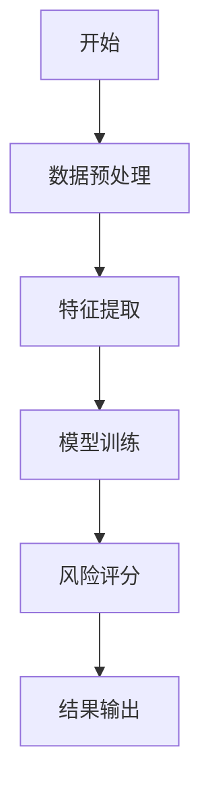
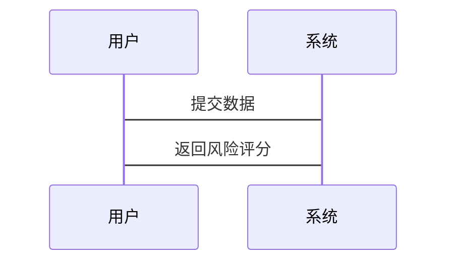

                 


# 利用智能体网络分析公司间的隐藏关联风险

## 关键词：智能体网络、公司关联风险、网络分析、风险评估、人工智能

## 摘要：本文探讨了利用智能体网络分析公司间的隐藏关联风险的方法，从基础概念、算法原理到系统架构，再到项目实战，详细阐述了如何通过智能体网络模型构建、数据预处理、关联风险评分模型、系统设计与实现，最终完成公司间关联风险的智能分析。

---

# 第1章 智能体网络与关联风险分析概述

## 1.1 智能体网络的定义与特点

### 1.1.1 智能体网络的定义
智能体网络（Agent Network）是由多个智能体（Agent）通过交互和协作构成的复杂网络。智能体是具有感知、决策和执行能力的实体，可以是软件程序、系统或组织。

### 1.1.2 智能体网络的核心特点
智能体网络具有以下特点：
1. **自主性**：智能体能够独立决策。
2. **反应性**：能够根据环境变化动态调整行为。
3. **协作性**：多个智能体可以协同完成任务。
4. **动态性**：网络结构和关系随时间变化。

### 1.1.3 智能体网络与传统网络分析的区别
智能体网络不仅关注节点之间的连接，还关注节点的智能行为和动态关系。

## 1.2 公司间关联风险分析的背景与意义

### 1.2.1 关联风险分析的背景
随着全球化和信息化的推进，公司之间的关联性增强，隐藏的关联风险也日益显著。

### 1.2.2 公司间关联风险分析的重要性
识别隐藏的关联风险有助于企业规避潜在风险，提升风险管理能力。

### 1.2.3 智能体网络在关联风险分析中的作用
智能体网络能够捕捉和分析公司之间的隐性关联，提供风险评估和预警。

## 1.3 本章小结

---

# 第2章 智能体网络分析的核心概念

## 2.1 智能体网络的核心要素

### 2.1.1 智能体的定义与属性
智能体具有以下属性：
- **标识**：唯一标识符。
- **角色**：在系统中的角色。
- **关系**：与其他智能体的交互关系。

### 2.1.2 智能体之间的关系与互动
智能体之间的关系可以是协作、竞争或中立。

### 2.1.3 智能体网络的构建过程
包括数据收集、关系建模和网络构建三个阶段。

## 2.2 关联风险分析的数学模型与公式

### 2.2.1 关联风险分析的数学模型
关联风险分析模型如下：
$$ R = \sum_{i=1}^{n} w_i \cdot r_i $$
其中，$w_i$ 是第 $i$ 个特征的权重，$r_i$ 是第 $i$ 个特征的风险评分。

### 2.2.2 关联风险评分公式
$$ R_{score} = \frac{\sum_{i=1}^{n} w_i \cdot r_i}{\sum_{i=1}^{n} w_i} $$

## 2.3 智能体网络的ER实体关系图

```mermaid
er
actor:
    id: string
    name: string
    role: string
    relation: string
```

## 2.4 本章小结

---

# 第3章 智能体网络分析的算法原理

## 3.1 关联风险分析的算法选择

### 3.1.1 常见的关联分析算法
包括关联规则挖掘、图分析算法和机器学习算法。

### 3.1.2 基于智能体网络的关联分析算法
选择适合智能体网络的算法，如图谱分析和聚类算法。

## 3.2 关联风险分析的算法实现

### 3.2.1 算法流程



## 3.3 算法实现的Python代码示例

```python
import networkx as nx

def calculate_association_score(graph):
    scores = {}
    for node in graph.nodes():
        score = 0
        for neighbor in graph.neighbors(node):
            score += graph[node][neighbor]['weight']
        scores[node] = score / len(graph.neighbors(node))
    return scores
```

---

# 第4章 系统架构与设计

## 4.1 系统功能设计

### 4.1.1 功能模块
包括数据采集、数据处理、分析模块和结果展示。

## 4.2 系统架构设计

### 4.2.1 系统架构图


## 4.3 系统接口设计

### 4.3.1 数据接口
包括数据输入和输出接口设计。

## 4.4 系统交互设计

### 4.4.1 用户与系统交互流程



---

# 第5章 项目实战与案例分析

## 5.1 环境安装

### 5.1.1 安装依赖
安装所需的Python库，如networkx和matplotlib。

## 5.2 系统核心实现源代码

### 5.2.1 数据处理代码

```python
import pandas as pd

data = pd.read_csv('data.csv')
```

### 5.2.2 分析代码

```python
from networkx import algorithms

scores = algorithms.closeness_centrality(graph)
```

## 5.3 案例分析

### 5.3.1 实际案例
分析某行业内的公司间关联风险。

---

# 第6章 总结与展望

## 6.1 总结
智能体网络在公司间关联风险分析中的应用价值。

## 6.2 未来展望
结合图神经网络等技术，提升分析能力。

---

通过以上步骤，我们可以系统地分析公司间的隐藏关联风险，为企业的风险管理提供支持。

