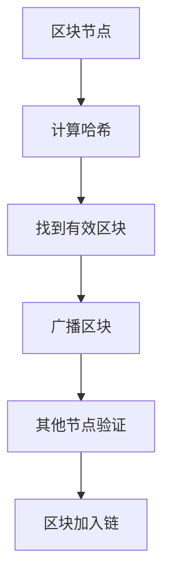
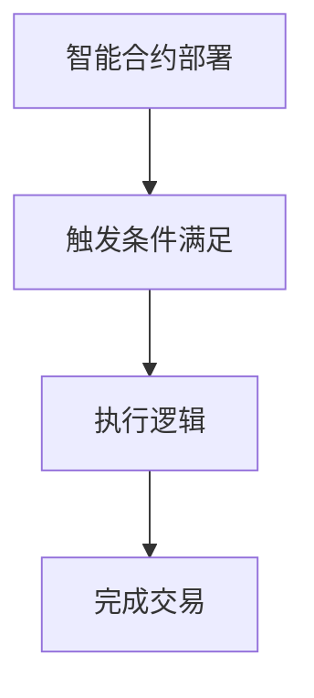
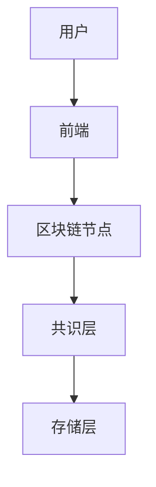

                 


# 区块链在金融数据安全中的创新应用

> 关键词：区块链，金融数据安全，加密算法，智能合约，共识机制

> 摘要：本文深入探讨了区块链技术在金融数据安全中的创新应用。通过分析区块链的核心技术，如共识机制、加密算法和智能合约，展示了其在支付、借贷和供应链金融等领域的应用潜力。文章详细讲解了区块链的安全机制，系统架构设计，并通过实战案例展示了其在金融领域的实际应用。最后，本文总结了当前的技术挑战和未来的发展方向。

---

# 第一部分: 区块链与金融数据安全概述

## 第1章: 区块链的基本概念与特点

### 1.1 区块链的定义与核心要素

#### 1.1.1 区块链的定义
区块链是一种去中心化的分布式账本技术，通过加密算法和共识机制确保数据的安全性和一致性。其核心特点包括去中心化、不可篡改和可追溯。

#### 1.1.2 区块链的核心要素：去中心化、不可篡改、可追溯
- **去中心化**：区块链通过分布式节点实现数据的去中心化存储，避免单点故障。
- **不可篡改**：通过加密算法和共识机制，确保数据一旦记录无法被篡改。
- **可追溯**：区块链上的每笔交易都有时间戳和哈希值，便于追踪和审计。

#### 1.1.3 区块链的分类与应用场景
区块链主要分为公链、私链和联盟链。公链如比特币用于去中心化支付，私链常用于企业内部数据管理，联盟链则应用于多个机构协作的场景，如供应链金融。

### 1.2 金融数据安全的挑战与需求

#### 1.2.1 金融数据的敏感性
金融数据涉及个人隐私和商业机密，一旦泄露或被篡改，可能导致严重的经济损失和信任危机。

#### 1.2.2 传统金融数据安全的痛点
- **中心化机构的单点风险**：传统金融系统依赖中心化机构，存在单点故障风险。
- **数据孤岛与信息不对称**：不同机构之间的数据难以共享，导致信息不对称，增加交易成本和风险。

#### 1.2.3 区块链技术在金融数据安全中的优势
- **去中心化特性如何提升安全性**：通过分布式存储，避免单点攻击。
- **不可篡改性如何保障数据完整性**：防止数据被恶意篡改，确保数据真实可靠。
- **可追溯性如何优化金融流程**：便于审计和追踪，提高透明度。

---

## 第2章: 区块链的核心技术与安全机制

### 2.1 区块链的核心技术原理

#### 2.1.1 共识机制
共识机制是区块链的核心技术之一，用于确保所有节点达成一致。

- **共识机制的定义与分类**
  - 共识机制用于在分布式系统中达成一致，常见的有POW、POS、DPOS等。
- **常见共识算法：POW、POS、DPOS**
  - **POW（工作量证明）**：通过计算哈希值来竞争记账权，安全性高但效率较低。
  - **POS（权益证明）**：根据持币量分配记账权，节能环保但存在“富者愈富”的风险。
  - **DPOS（ delegated proof of stake）**：通过投票选举记账人，效率高但依赖选举机制。

- **共识机制的安全性分析**
  - 共识机制需确保多数节点诚实或被激励正确参与。



#### 2.1.2 加密算法
加密算法是保障区块链数据安全的关键。

- **加密算法的分类与应用场景**
  - 对称加密（如AES）用于快速加密和解密。
  - 非对称加密（如RSA、 ECC）用于数字签名和身份验证。
- **椭圆曲线加密与数字签名**
  - 椭圆曲线加密（ECC）在有限资源下提供高强度加密。
  - 数字签名用于验证数据完整性和真实性。

- **加密算法对金融数据安全的保障**
  - 通过加密确保数据传输和存储的安全性，防止数据泄露和篡改。

#### 2.1.3 智能合约
智能合约是区块链上的自动执行程序，用于自动化业务逻辑。

- **智能合约的定义与特点**
  - 智能合约部署在区块链上，自动执行预设的逻辑。
- **智能合约的执行流程**
  - 编写、部署、触发、执行和终止。

- **智能合约在金融中的应用**
  - 自动化金融交易、支付和借贷流程，降低人为干预风险。



### 2.2 区块链的安全机制与风险管理

#### 2.2.1 区块链的安全性分析
- **安全性优势**：通过去中心化和加密算法，区块链降低了数据被篡改的风险。
- **安全性挑战**：如51%攻击、私钥泄露等。

#### 2.2.2 区块链中的风险管理
- **风险管理的定义与分类**
  - 风险包括技术风险、操作风险和市场风险。
- **风险管理策略**
  - 风险分散、风险控制和风险转移。

#### 2.2.3 区块链的安全性测试与优化
- **安全性测试的方法与工具**
  - 模糊测试、渗透测试和性能测试。
- **安全性优化策略**
  - 提升共识机制的安全性，优化智能合约代码。

---

## 第3章: 区块链在金融数据安全中的创新应用

### 3.1 区块链在支付与清算中的应用

#### 3.1.1 支付领域的区块链应用
- **区块链支付的流程与特点**
  - 点对点交易、跨境支付、实时结算。
- **区块链支付的优势与挑战**
  - 优势：高效、低成本、透明。
  - 挑战：交易速度、可扩展性。

### 3.2 区块链在借贷与供应链金融中的应用

#### 3.2.1 供应链金融的区块链解决方案
- **供应链金融的核心问题**
  - 信息不对称、信任缺失。
- **区块链的应用场景**
  - 贸易融资、应收账款融资。

---

## 第4章: 区块链系统的架构与实现

### 4.1 系统架构设计

#### 4.1.1 系统功能设计
- **系统功能模块**
  - 账户管理、交易处理、智能合约执行。

#### 4.1.2 系统架构图



#### 4.1.3 接口设计与交互流程
- **接口设计**
  - API用于智能合约调用和交易广播。
- **交互流程**
  - 用户发起交易，智能合约自动执行，区块链节点达成共识并记录。

---

## 第5章: 项目实战

### 5.1 环境搭建与核心代码实现

#### 5.1.1 环境搭建
- **工具安装**：安装Python、Solidity、 Ganache等。

#### 5.1.2 核心代码实现
- **智能合约实现**

```solidity
// SPDX-License-Identifier: MIT
pragma solidity ^0.8.0;

contract FinanceContract {
    mapping(address => uint256) public balances;

    function deposit(uint256 amount) external {
        balances[msg.sender] += amount;
    }

    function withdraw(uint256 amount) external {
        require(balances[msg.sender] >= amount, "Insufficient balance");
        balances[msg.sender] -= amount;
    }
}
```

- **智能合约测试**

```python
from brownie import *

def test():
    contract = FinanceContract.deploy()
    contract.deposit(100)
    assert contract.balances(accounts[0]) == 100
    contract.withdraw(50)
    assert contract.balances(accounts[0]) == 50
```

---

## 第6章: 扩展与展望

### 6.1 技术前沿与未来趋势
- **技术前沿**：零知识证明、Layer 2扩展解决方案。
- **未来趋势**：区块链与人工智能结合，提升数据分析能力。

### 6.2 最佳实践与注意事项
- **安全性**：确保智能合约代码经过严格审计。
- **合规性**：遵守当地金融监管法规。
- **可扩展性**：优化系统性能，提升交易吞吐量。

---

## 小结

区块链技术通过去中心化、加密算法和智能合约，为金融数据安全提供了创新解决方案。本文从技术原理到实际应用，全面分析了区块链在金融领域的潜力和挑战。未来，随着技术的进步和监管的完善，区块链将在金融数据安全中发挥更大作用。

---

# 结束语

区块链技术的不断发展为金融数据安全带来了新的机遇和挑战。通过本文的分析，读者可以深入了解区块链在金融领域的应用潜力，并为实际项目提供参考和指导。

--- 

如果需要更详细的扩展或特定部分的深入分析，请随时告知！

