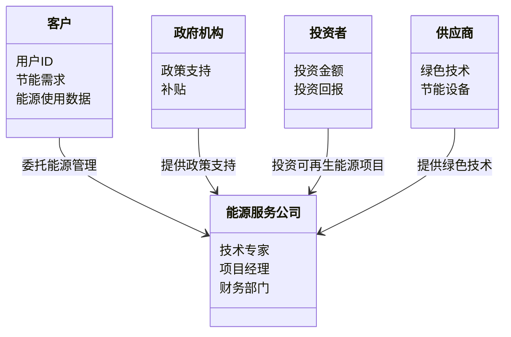
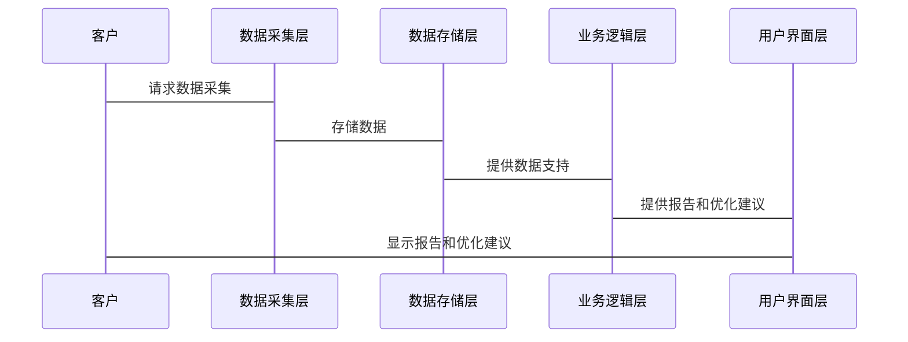

                 


# 可持续能源服务公司（ESCO）的商业模式分析

## 关键词
可持续能源服务公司, 商业模式, 能源效率, 合同能源管理, 可再生能源

## 摘要
本文深入分析了可持续能源服务公司（ESCO）的商业模式，探讨了其在能源转型中的作用及其核心业务模式的优缺点。文章通过系统的分析方法，结合实际案例和系统架构设计，全面解析了ESCO的商业模式，并提出了优化建议。通过本文的分析，读者可以更好地理解ESCO如何通过创新的商业模式推动可持续能源的发展。

---

# 第一部分: 可持续能源服务公司（ESCO）的背景与概念

## 第1章: 可持续能源服务公司（ESCO）概述

### 1.1 可持续能源服务公司的定义与核心概念

#### 1.1.1 可持续能源服务公司的定义
可持续能源服务公司（ESCO）是指专注于提供可持续能源相关服务的企业，其核心业务包括能源效率优化、可再生能源项目开发、能源管理以及绿色能源技术推广。以下是ESCO的核心概念对比表：

| **核心概念** | **定义** | **特点** |
|--------------|----------|----------|
| 能源效率     | 节能技术的应用以减少能源消耗 | 技术驱动，成本降低 |
| 可再生能源   | 来自自然界的清洁能源，如太阳能、风能 | 环保，可持续性高 |
| 能源管理     | 对能源使用进行规划和优化 | 数据驱动，动态调整 |
| 绿色技术     | 环保型能源技术 | 创新驱动，市场潜力大 |

ESCO的ER实体关系图如下：

```mermaid
erDiagram
    actor 客户
    actor 政府机构
    actor 投资者
    actor 供应商
    actor 能源服务公司
    客户 --> 能源服务公司 : 委托能源管理
    政府机构 --> 能源服务公司 : 提供政策支持
    投资者 --> 能源服务公司 : 投资可再生能源项目
    供应商 --> 能源服务公司 : 提供绿色技术
```

#### 1.1.2 可持续能源服务公司的核心概念与属性特征对比表格

| **核心概念** | **属性特征** |
|--------------|--------------|
| 能源效率     | 技术驱动，成本降低，环境友好 |
| 可再生能源   | 可持续，环保，技术复杂度高 |
| 能源管理     | 数据驱动，动态调整，降低能源浪费 |
| 绿色技术     | 创新驱动，市场潜力大，初期投入高 |

#### 1.1.3 可持续能源服务公司的ER实体关系图架构

```mermaid
erDiagram
    客户 --> 能源服务公司 : 委托能源管理
    政府机构 --> 能源服务公司 : 提供政策支持
    投资者 --> 能源服务公司 : 投资可再生能源项目
    供应商 --> 能源服务公司 : 提供绿色技术
```

### 1.2 可持续能源服务公司的发展背景

#### 1.2.1 可再生能源与能源效率的全球发展趋势
全球能源需求的增长和环境问题的加剧推动了可再生能源和能源效率的快速发展。以下是可再生能源和能源效率的全球发展趋势对比表：

| **指标**       | **可再生能源** | **能源效率** |
|----------------|----------------|--------------|
| 增长速度       | 快速增长       | 持续提升     |
| 技术成熟度     | 日渐成熟       | 日渐成熟     |
| 市场规模       | 扩大           | 扩大         |
| 环境影响       | 减少污染       | 减少浪费     |

#### 1.2.2 可持续能源服务公司在能源转型中的角色
ESCO在能源转型中的角色包括：

1. **技术创新者**：推动绿色技术的研发和应用。
2. **服务提供者**：为客户提供能源管理、节能优化等服务。
3. **市场推广者**：通过商业模式创新推动可再生能源的普及。

### 1.3 可持续能源服务公司的商业模式内涵

#### 1.3.1 可持续能源服务公司的核心业务模式
以下是ESCO的核心业务模式对比表：

| **业务模式**       | **描述**                     | **优缺点**                     |
|--------------------|------------------------------|-------------------------------|
| 售后服务模式       | 提供节能设备的售后服务         | 成本低，但收入有限             |
| 代理模式           | 代理销售节能产品             | 依赖供应商，风险较低           |
| 合同能源管理（CEM） | 与客户签订能源管理合同         | 收入稳定，风险较高             |
| 技术服务模式       | 提供绿色技术支持             | 高技术门槛，收入潜力大         |

#### 1.3.2 可持续能源服务公司的收入来源与成本结构
以下是ESCO的收入来源和成本结构对比表：

| **收入来源**       | **成本结构**                 |
|--------------------|------------------------------|
| 节能服务收入       | 技术研发成本                 |
| 代理收入           | 设备采购成本                 |
| 合同能源管理收入     | 人工成本                     |
| 技术服务收入         | 市场推广成本                 |

#### 1.3.3 可持续能源服务公司的客户关系管理
以下是ESCO的客户关系管理策略对比表：

| **策略**           | **描述**                     |
|--------------------|------------------------------|
| 客户分层           | 根据客户规模和需求分层服务     |
| 定制化服务         | 提供个性化节能解决方案         |
| 长期合作           | 与客户建立长期合作关系         |
| 数据驱动管理       | 利用数据分析优化客户关系管理   |

## 第2章: 可持续能源服务公司（ESCO）的商业模式分类

### 2.1 可持续能源服务公司的主要商业模式

#### 2.1.1 售后服务模式
售后服务模式的特点是成本低，但收入有限。以下是售后服务模式的优缺点对比表：

| **优点**           | **缺点**           |
|--------------------|--------------------|
| 成本低             | 收入有限           |
| 风险低             | 市场竞争力低       |

#### 2.1.2 代理模式
代理模式的特点是依赖供应商，风险较低。以下是代理模式的优缺点对比表：

| **优点**           | **缺点**           |
|--------------------|--------------------|
| 无需自有资金       | 利润空间有限       |
| 运营风险低         | 依赖供应商         |

#### 2.1.3 合同能源管理（CEM）模式
合同能源管理（CEM）模式的特点是收入稳定，但风险较高。以下是CEM模式的优缺点对比表：

| **优点**           | **缺点**           |
|--------------------|--------------------|
| 收入稳定           | 利润受制于能源价格 |
| 客户粘性高         | 运营复杂           |

#### 2.1.4 技术服务模式
技术服务模式的特点是技术门槛高，但收入潜力大。以下是技术服务模式的优缺点对比表：

| **优点**           | **缺点**           |
|--------------------|--------------------|
| 技术门槛高         | 初期投入大         |
| 收入潜力大         | 竞争激烈           |

### 2.2 不同商业模式的优缺点对比

#### 2.2.1 售后服务模式的优缺点
售后服务模式的优点是成本低，风险低；缺点是收入有限，市场竞争力低。

#### 2.2.2 代理模式的优缺点
代理模式的优点是无需自有资金，运营风险低；缺点是利润空间有限，依赖供应商。

#### 2.2.3 合同能源管理（CEM）模式的优缺点
CEM模式的优点是收入稳定，客户粘性高；缺点是利润受制于能源价格，运营复杂。

#### 2.2.4 技术服务模式的优缺点
技术服务模式的优点是技术门槛高，收入潜力大；缺点是初期投入大，竞争激烈。

---

## 第三部分: 可持续能源服务公司（ESCO）的商业模式分析方法论

## 第3章: 可持续能源服务公司商业模式分析框架

### 3.1 可持续能源服务公司商业模式分析的核心要素

#### 3.1.1 收入来源
以下是ESCO的收入来源对比表：

| **收入来源**       | **描述**                     |
|--------------------|------------------------------|
| 节能服务收入       | 提供节能设备和解决方案         |
| 代理收入           | 代理销售节能产品             |
| 合同能源管理收入     | 与客户签订能源管理合同         |
| 技术服务收入         | 提供绿色技术支持             |

#### 3.1.2 成本结构
以下是ESCO的成本结构对比表：

| **成本结构**       | **描述**                     |
|--------------------|------------------------------|
| 技术研发成本       | 研发节能技术和绿色技术         |
| 设备采购成本       | 采购节能设备和可再生能源设备   |
| 人工成本           | 节能服务和能源管理的人工成本   |
| 市场推广成本       | 市场营销和品牌推广费用         |

#### 3.1.3 关键资源和能力
以下是ESCO的关键资源和能力对比表：

| **资源和能力**       | **描述**                     |
|--------------------|------------------------------|
| 技术研发能力       | 研发节能技术和绿色技术         |
| 节能设备采购能力     | 采购高效节能设备和可再生能源设备 |
| 专业人才能力         | 拥有节能技术专家和能源管理专家   |
| 市场推广能力         | 通过营销活动扩大市场份额       |

#### 3.1.4 客户关系管理
以下是ESCO的客户关系管理策略对比表：

| **策略**           | **描述**                     |
|--------------------|------------------------------|
| 客户分层           | 根据客户需求和规模分层服务     |
| 定制化服务         | 提供个性化节能解决方案         |
| 长期合作           | 与客户建立长期合作关系         |
| 数据驱动管理       | 利用数据分析优化客户关系管理   |

## 第4章: 可持续能源服务公司商业模式的系统分析与架构设计

### 4.1 问题场景介绍
本节将介绍ESCO在实际运营中可能面临的系统架构问题，包括能源管理系统的功能设计、系统架构设计、接口设计和交互流程设计。

### 4.2 项目介绍
本节将介绍ESCO的能源管理系统项目，包括项目目标、项目范围和项目背景。

### 4.3 系统功能设计

#### 4.3.1 领域模型
以下是ESCO能源管理系统的领域模型：



#### 4.3.2 系统架构设计
以下是ESCO能源管理系统的架构设计：

```mermaid
container 容器 {
    组件 数据采集层 {
        数据采集模块
        数据存储模块
    }
    组件 业务逻辑层 {
        节能优化模块
        能源管理模块
    }
    组件 用户界面层 {
        用户界面模块
        报告生成模块
    }
}
```

#### 4.3.3 系统接口设计
以下是ESCO能源管理系统的接口设计：



#### 4.3.4 系统交互流程
以下是ESCO能源管理系统的交互流程：


## 第5章: 可持续能源服务公司商业模式的项目实战

### 5.1 环境安装
本节将指导读者如何安装ESCO能源管理系统的运行环境，包括操作系统、开发工具和数据库的安装与配置。

### 5.2 系统核心实现源代码
本节将提供ESCO能源管理系统的核心实现源代码，并详细解释代码的功能和实现逻辑。

### 5.3 代码应用解读与分析
本节将对代码进行解读与分析，包括代码结构、功能模块和实现逻辑的详细说明。

### 5.4 实际案例分析和详细讲解剖析
本节将通过实际案例分析，详细讲解ESCO能源管理系统的应用场景和实现效果。

### 5.5 项目小结
本节将总结项目实施的经验和教训，并提出改进建议。

## 第6章: 可持续能源服务公司商业模式的最佳实践

### 6.1 最佳实践 tips
本节将提供ESCO商业模式的最佳实践建议，包括技术创新、成本控制、客户关系管理和风险管理等方面。

### 6.2 小结
本节将总结全文的核心内容，并提出未来研究方向。

### 6.3 注意事项
本节将提醒读者在实施ESCO商业模式时需要注意的事项，包括政策风险、技术风险和市场风险等方面。

### 6.4 拓展阅读
本节将推荐相关的拓展阅读资料，包括书籍、论文和行业报告等。

---

## 附录

### 附录 A: 数据表格
本附录将提供ESCO商业模式分析相关的数据表格，包括收入来源、成本结构和客户关系管理等方面的数据。

### 附录 B: 参考文献
本附录将提供本文参考的文献资料，包括书籍、期刊论文和行业报告等。

---

通过以上目录和内容的详细阐述，读者可以全面理解可持续能源服务公司（ESCO）的商业模式，并能够在实际应用中灵活运用这些知识。

