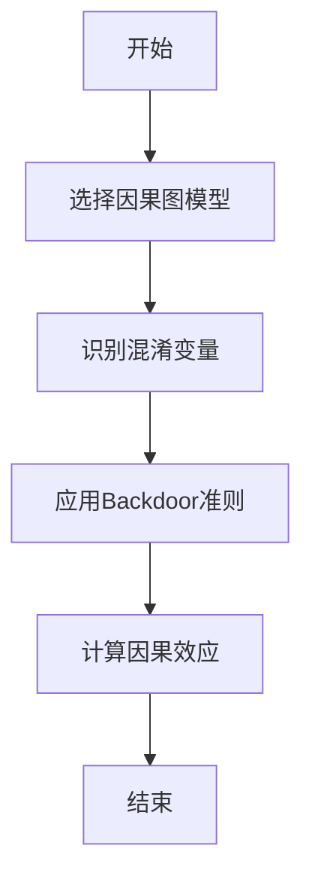

                 


# 因果推断：增强AI Agent的因果理解

## 关键词
因果推断, AI Agent, 强化学习, 因果图模型, 系统建模

## 摘要
因果推断是人工智能领域的重要分支，它帮助AI Agent理解因果关系，从而做出更合理的决策。本文从因果推断的基本概念出发，详细探讨了其在AI Agent设计中的应用，包括因果图模型、核心算法、强化学习中的因果推断，以及系统的因果建模与分析。通过实际案例展示因果推断在项目中的应用，帮助读者掌握这一技术的核心与实践。

---

## 第一部分: 因果推断的基本概念

### 第1章: 因果推断的基本概念

#### 1.1 因果关系与相关性的区别
因果关系和相关性是两个不同的概念。相关性表示变量之间的统计关联，而因果关系则表示一个变量对另一个变量的影响。例如，吃药（X）可能导致病情好转（Y），这种关系是因果关系，而相关性可能只是表明X和Y在数据上存在关联，但不一定有因果关系。

#### 1.2 因果推断的重要性
因果推断在AI Agent中至关重要，因为它允许Agent不仅仅依赖相关性，还能理解因果关系，从而做出更智能的决策。例如，在医疗领域，AI Agent需要理解药物（X）是否真正导致病情好转（Y），而不仅仅是两者相关。

#### 1.3 因果推断的背景
因果推断起源于哲学和统计学，近年来随着机器学习的发展，逐渐成为AI的重要组成部分。因果推断的核心是通过数据和逻辑推理，发现因果关系，从而指导决策。

---

### 第2章: 因果图模型

#### 2.1 因果图的基本结构
因果图（Causal Graph）是一种有向无环图（DAG），用于表示变量之间的因果关系。例如，X -> Y 表示X是Y的直接原因。

#### 2.2 因果图的构建
构建因果图需要明确变量之间的因果关系。例如，在医疗场景中，药物X可能导致病情好转Y，同时可能受到患者年龄Z的影响。因此，因果图可能包括X -> Y，Z -> Y，以及X <- Z。

#### 2.3 因果图的属性分析
因果图的属性分析包括识别因果路径、检测混淆变量等。例如，X和Y之间的路径可能受到Z的影响，因此Z是混淆变量。

---

### 第3章: 因果推断的核心算法

#### 3.1 潜在结果框架
潜在结果框架（Potential Outcome Framework）是因果推断的基础。例如，对于每个个体i，潜在结果Y_i是在给定处理X的情况下，个体的响应结果。

#### 3.2 因果推断的经典算法
- **Backdoor准则**：用于识别因果效应，通过调整后门调整量来消除混淆变量的影响。
- **Do-Why框架**：通过干预和反事实推理来推断因果关系。
- **穿透性检验**：用于验证因果图中的穿透性条件，确保因果推断的正确性。

#### 3.3 算法流程图
以下是一个因果推断算法的流程图：



---

### 第4章: 强化学习中的因果推断

#### 4.1 强化学习与因果推断的关系
强化学习（Reinforcement Learning）中的因果推断可以帮助AI Agent理解动作与结果之间的因果关系，从而做出更优决策。例如，在游戏AI中，动作X可能导致奖励Y，但可能受到环境状态Z的影响。

#### 4.2 因果推断在AI Agent设计中的应用
- **状态空间建模**：因果图用于建模状态之间的因果关系。
- **动作选择**：因果推理用于选择最优动作，考虑因果关系而非相关性。
- **价值评估**：因果推断用于评估动作的价值，避免混淆变量的影响。

---

### 第5章: 系统的因果建模与分析

#### 5.1 系统因果建模的基本方法
系统因果建模需要构建系统的因果图，分析系统的因果关系，并验证模型的正确性。例如，在交通系统中，因果图可以表示交通信号灯（X）对车流量（Y）的影响，同时受到天气（Z）的影响。

#### 5.2 系统因果建模的实践
- **领域模型的构建**：根据领域知识构建因果图。
- **系统因果模型的优化**：通过验证和调整模型，确保因果关系的正确性。
- **系统因果模型的应用**：将模型应用于实际系统中，进行因果分析和决策支持。

---

### 第6章: 项目实战

#### 6.1 环境安装
安装必要的库，如`doWhy`、`pymc`等，用于因果推断的分析。

#### 6.2 核心实现代码
以下是一个因果推断的Python代码示例：

```python
import dowhy

# 构建因果图
graph = dowhy.CausalGraph()
graph.add_edge("X", "Y")
graph.add_edge("Z", "Y")
graph.add_edge("Z", "X")

# 应用Backdoor准则
backdoor_set = graph.get_backdoor_set("X", "Y")
print(backdoor_set)  # 输出 Z
```

#### 6.3 案例分析
以医疗领域为例，分析药物X对病情Y的影响，同时考虑患者年龄Z。通过因果推断，得出X对Y的因果效应，从而指导治疗方案。

---

### 第7章: 总结与展望

#### 7.1 总结
因果推断为AI Agent提供了理解因果关系的能力，使其能够做出更智能的决策。通过因果图模型和核心算法，AI Agent可以在复杂系统中进行因果分析和优化。

#### 7.2 展望
未来，因果推断将在更多领域得到应用，如自动驾驶、医疗、金融等。随着技术的发展，因果推断将更加精确和高效。

#### 7.3 最佳实践
- 在设计AI Agent时，考虑因果关系的重要性。
- 使用因果图模型进行系统建模和分析。
- 应用因果推断算法优化决策过程。

---

通过以上章节的内容，读者可以全面了解因果推断在增强AI Agent中的应用，从理论到实践，掌握因果推断的核心技术和实际应用。

