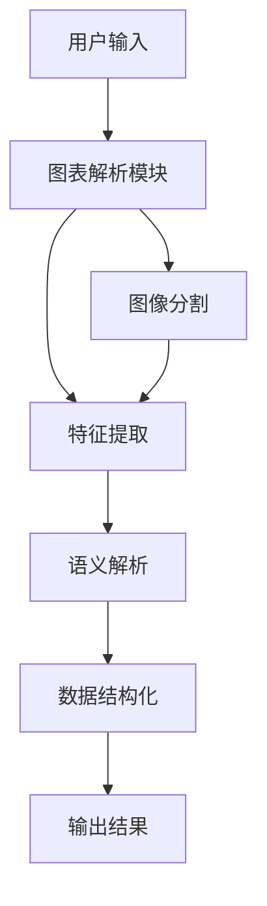
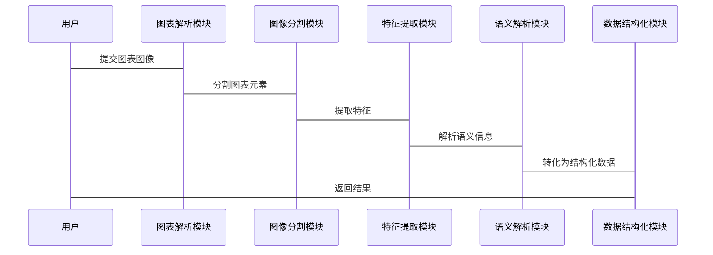

                 


# 图表理解技术：增强AI Agent的数据分析能力

---

## 关键词：  
图表理解技术、AI Agent、数据分析能力、深度学习、数据可视化、自然语言处理、图表解析

---

## 摘要：  
图表理解技术是增强AI Agent数据分析能力的关键技术之一。通过解析和理解复杂的图表信息，AI Agent能够更高效地从数据中提取有价值的信息，从而提升决策能力和智能化水平。本文将从图表理解技术的核心概念、算法原理、系统架构设计、项目实战等多方面展开分析，帮助读者全面理解图表理解技术，并掌握其在AI Agent中的实际应用。

---

## 第一部分：图表理解技术基础

### 第1章：图表理解技术概述

#### 1.1 图表理解技术的背景与意义  
随着数据可视化技术的快速发展，图表已成为数据表达和信息传递的重要方式。然而，如何让AI系统能够自动理解图表中的信息，成为一个亟待解决的问题。图表理解技术通过结合图像处理、自然语言处理和深度学习等技术，能够将图表中的信息转化为结构化数据，从而为AI Agent提供更强大的数据分析能力。  

#### 1.2 图表的基本类型与特点  
图表的种类繁多，常见的包括柱状图、折线图、饼图、散点图等。每种图表都有其独特的视觉特征和信息传递方式。例如，柱状图适用于比较不同类别之间的数值差异，而折线图则适合展示数据随时间的变化趋势。图表的设计原则包括清晰性、简洁性和信息密度等，这些原则直接影响图表的理解效果。  

#### 1.3 图表理解技术在AI Agent中的价值  
AI Agent需要从复杂的数据源中提取信息，而图表理解技术能够帮助其快速解析非结构化数据中的关键信息。通过图表理解技术，AI Agent可以更好地理解用户意图，提供更精准的数据分析结果。此外，图表理解技术还能够提升AI Agent的交互能力，使其能够与用户更自然地进行数据可视化对话。

---

## 第二部分：图表理解的核心概念与原理

### 第2章：图表理解的核心概念

#### 2.1 数据可视化基础  
数据可视化是将数据转化为图形或图像的过程，目的是帮助人们更直观地理解和分析数据。图表理解技术的核心目标是通过计算机视觉和自然语言处理技术，自动解析图表中的信息。  

#### 2.2 图表解析的关键要素  
图表解析的关键要素包括：  
1. **图表结构**：包括标题、坐标轴、数据点等元素。  
2. **视觉特征**：包括颜色、形状、字体等，这些特征能够传递额外的信息。  
3. **语义信息**：图表中数据的含义和上下文信息。  

#### 2.3 图表理解的流程与框架  
图表理解的流程通常包括以下几个步骤：  
1. **图像分割**：识别图表中的各个元素。  
2. **特征提取**：提取图表元素的视觉特征。  
3. **信息抽取**：解析图表中的语义信息。  
4. **数据结构化**：将解析的信息转化为结构化数据。  

---

## 第三部分：图表理解技术的算法原理

### 第3章：图表理解的算法基础

#### 3.1 图像处理与特征提取  
图像处理是图表理解的基础。通过图像分割技术，可以将图表中的元素（如标题、坐标轴、数据点等）分离出来。特征提取则通过卷积神经网络（CNN）等深度学习技术，提取图表元素的视觉特征。  

#### 3.2 图文结合的图表理解  
图表通常包含文本和图像两部分信息。通过OCR技术提取图表中的文字信息，并结合图像信息进行语义解析，可以更准确地理解图表内容。  

#### 3.3 图表理解的深度学习模型  
基于深度学习的图表理解模型通常采用端到端的架构。例如，可以使用编码器-解码器模型，将图表图像编码为结构化数据，或者使用Transformer模型进行语义解析。  

---

## 第四部分：系统分析与架构设计

### 第4章：AI Agent的系统架构设计

#### 4.1 问题场景介绍  
本文将设计一个基于图表理解技术的AI Agent系统，该系统能够从复杂图表中提取信息，并生成结构化数据输出。  

#### 4.2 系统功能设计  
- **图像分割模块**：识别图表中的各个元素。  
- **特征提取模块**：提取图表元素的视觉特征。  
- **语义解析模块**：解析图表中的语义信息。  
- **数据结构化模块**：将解析的信息转化为结构化数据。  

#### 4.3 系统架构设计  
以下是系统的架构图：



#### 4.4 系统接口设计  
系统接口设计包括：  
1. 用户输入接口：接收图表图像和相关文本信息。  
2. 输出接口：返回结构化数据或解析结果。  

#### 4.5 系统交互设计  
以下是系统的交互流程图：



---

## 第五部分：项目实战

### 第5章：基于图表理解技术的AI Agent实现

#### 5.1 环境安装  
- 安装Python 3.8及以上版本。  
- 安装深度学习框架（如TensorFlow或PyTorch）。  
- 安装图像处理库（如OpenCV和Pillow）。  
- 安装OCR工具（如Tesseract和pytesseract）。  

#### 5.2 核心代码实现  

以下是图表解析模块的核心代码示例：

```python
import cv2
from PIL import Image
import pytesseract

def extract_text_from_image(image_path):
    # 使用OCR提取文本信息
    img = Image.open(image_path)
    text = pytesseract.image_to_string(img)
    return text

def image_segmentation(image_path):
    # 使用OpenCV进行图像分割
    img = cv2.imread(image_path)
    gray = cv2.cvtColor(img, cv2.COLOR_BGR2GRAY)
    # 使用Canny边缘检测
    edges = cv2.Canny(gray, 100, 200)
    return edges

if __name__ == "__main__":
    image_path = "chart.png"
    text = extract_text_from_image(image_path)
    print("提取的文本信息：", text)
    edges = image_segmentation(image_path)
    cv2.imwrite("edges.png", edges)
```

#### 5.3 案例分析与总结  
通过上述代码实现的图表解析模块，能够从图表中提取文本信息，并进行图像分割。结合深度学习模型，可以进一步提升解析的准确性和效率。  

---

## 第六部分：总结与拓展

### 第6章：图表理解技术的总结与展望

#### 6.1 最佳实践 tips  
- 在实际应用中，建议结合多模态数据（如图像和文本）进行图表解析。  
- 使用预训练模型可以有效降低开发成本。  

#### 6.2 小结  
图表理解技术是增强AI Agent数据分析能力的重要技术。通过结合图像处理、深度学习和自然语言处理等技术，可以实现对复杂图表的自动解析，从而提升AI Agent的智能化水平。  

#### 6.3 注意事项  
- 在处理复杂图表时，需要注意模型的泛化能力和鲁棒性。  
- 数据标注和清洗是模型训练的关键步骤。  

#### 6.4 拓展阅读  
- 推荐阅读《Deep Learning for Image Processing》和《Data Visualization with Python》。  

---

通过以上内容，我们详细分析了图表理解技术的核心概念、算法原理和系统架构设计，并通过实际案例展示了如何实现一个基于图表理解技术的AI Agent系统。希望本文能够为读者提供有价值的参考，进一步推动图表理解技术的发展与应用。

