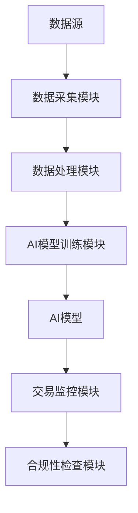
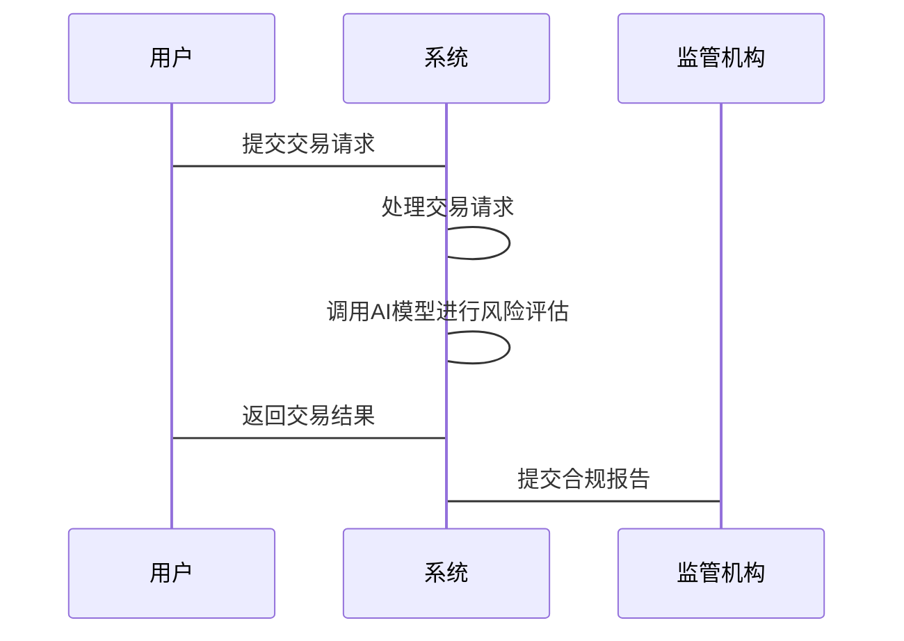

                 


# 在AI应用中遵守金融法规的重要性与方法

**关键词**：AI技术、金融法规、合规要求、数据隐私、反洗钱、系统设计、算法优化

**摘要**：随着人工智能技术在金融领域的广泛应用，合规性问题日益重要。本文系统地分析了AI在金融中的应用现状，详细探讨了金融法规的基本框架与合规要求，重点讲解了AI算法的透明性与可解释性问题，数据隐私与保护的法律框架，反洗钱与反欺诈的法规要求。通过数学模型、算法优化和系统设计，本文提出了AI金融合规系统的架构与实现方法，为金融行业提供了理论依据和实践指导。

---

## 第1章: AI在金融领域的应用现状与合规挑战

### 1.1 AI在金融领域的应用现状
#### 1.1.1 人工智能在金融行业的应用领域
人工智能技术在金融行业的应用广泛，包括智能投顾、信用评估、风险控制、欺诈检测、算法交易等。

#### 1.1.2 当前AI技术在金融中的优势与不足
优势：
- 高效性：AI能够快速处理大量数据，提高决策效率。
- 准确性：通过机器学习模型，可以提高预测和分类的准确性。
- 个性化：基于用户行为和数据，提供个性化的服务。

不足：
- 黑箱问题：AI模型的可解释性较差，影响合规性。
- 数据依赖：模型性能依赖于数据质量，可能存在过拟合问题。

#### 1.1.3 金融行业对AI技术的需求与痛点
- 需求：提升服务效率、降低风险、优化客户体验。
- 痛点：数据隐私风险、算法偏见、合规性挑战。

### 1.2 金融法规的基本框架与合规要求
#### 1.2.1 金融行业的核心法规与监管要求
- 反洗钱（AML）：防止洗钱和恐怖融资。
- 反欺诈：防止金融欺诈行为。
- 数据隐私：保护用户数据不被滥用。

#### 1.2.2 数据隐私与保护的法律框架
- 《通用数据保护条例》（GDPR）：欧盟的数据隐私保护法规。
- 《加州消费者隐私法案》（CCPA）：美国加州的数据隐私保护法规。

#### 1.2.3 反洗钱与反欺诈的法规要求
- 交易监控：实时监控异常交易。
- 客户身份识别（KYC）：确保客户身份的真实性。
- 报告机制：及时向监管机构报告可疑交易。

### 1.3 AI应用中的合规问题与风险
#### 1.3.1 AI算法的透明性与可解释性问题
- 黑箱模型：AI算法的决策过程不透明，影响合规性。
- 可解释性：需要模型能够解释其决策过程，以符合监管要求。

#### 1.3.2 数据使用中的隐私与合规风险
- 数据泄露：AI系统可能因为数据泄露而违反隐私保护法规。
- 数据滥用：数据被用于不符合法规的目的。

#### 1.3.3 AI决策的法律责任与合规挑战
- 责任归属：AI系统出现错误决策时，责任归属不明确。
- 合规性审查：AI系统需要通过合规性审查，确保符合相关法规。

## 第2章: 金融法规与AI系统的交互关系

### 2.1 金融法规的核心要素与属性特征
- 数据隐私：保护用户数据不被未经授权的访问。
- 交易监控：实时监控交易行为，防止洗钱和欺诈。
- 客户身份识别：确保客户身份的真实性。

### 2.2 AI系统的核心原理与技术特征
- 数据处理：收集、存储和处理大量金融数据。
- 模型训练：使用机器学习算法训练模型，实现特定任务。
- 可解释性：模型需要能够解释其决策过程。

### 2.3 金融法规与AI系统的实体关系图
```mermaid
er
actor: 用户
model: AI模型
data: 数据
regulation: 相关法规
```

## 第3章: AI应用中的合规算法与数学模型

### 3.1 监督学习算法的合规性分析
#### 3.1.1 监督学习的基本原理
- 数据集：包含输入特征和标签。
- 模型训练：通过最小化预测值与真实值的差异来优化模型参数。

#### 3.1.2 监督学习中的数据隐私问题
- 数据泄露：训练数据可能被攻击者利用，导致隐私泄露。
- 数据匿名化：对数据进行匿名化处理，减少隐私风险。

#### 3.1.3 监督学习的可解释性优化
- 特征重要性：分析模型中各个特征的重要性，解释模型决策。
- 解释性模型：使用线性回归等解释性更强的模型，提高可解释性。

### 3.2 非监督学习算法的合规性分析
#### 3.2.1 非监督学习的基本原理
- 数据聚类：将相似的数据点归为一类。
- 异常检测：识别数据中的异常点。

#### 3.2.2 非监督学习中的数据匿名化处理
- 数据脱敏：对数据进行脱敏处理，确保隐私安全。
- 隐私保护：在聚类过程中保护用户隐私。

#### 3.2.3 非监督学习的透明性优化
- 聚类结果解释：解释聚类结果，确保合规性。
- 算法可解释性：选择可解释性更强的非监督学习算法，提高透明性。

### 3.3 强化学习算法的合规性分析
#### 3.3.1 强化学习的基本原理
- 状态空间：系统的当前状态。
- 动作空间：系统可以执行的动作。
- 奖励函数：定义每个动作的奖励值。

#### 3.3.2 强化学习中的合规性挑战
- 策略透明性：强化学习模型的决策过程不透明，影响合规性。
- 动作责任：强化学习模型的决策可能引发法律责任问题。

#### 3.3.3 强化学习的透明性优化
- 状态解释：解释强化学习模型的决策状态，提高透明性。
- 策略可解释性：选择策略可解释的强化学习算法，确保合规性。

### 3.4 合规算法的数学模型与公式
#### 3.4.1 监督学习的损失函数
$$ L = \frac{1}{n}\sum_{i=1}^{n}(y_i - \hat{y}_i)^2 $$

#### 3.4.2 非监督学习的聚类算法
$$ \text{目标函数} = \sum_{i=1}^{n}\sum_{j=1}^{k}w_{ij}d_{ij} $$

#### 3.4.3 强化学习的策略函数
$$ \pi(a|s) = P(\text{采取动作}a|\text{状态}s) $$

## 第4章: AI金融合规系统的架构与实现

### 4.1 系统需求与目标
#### 4.1.1 系统目标与功能需求
- 数据隐私保护：确保数据在系统中安全存储和传输。
- 交易监控：实时监控交易行为，防止洗钱和欺诈。
- 客户身份识别：确保客户身份的真实性。

#### 4.1.2 系统的边界与外延
- 系统边界：系统内部处理的数据和功能。
- 系统外延：与外部系统的接口和数据交换。

### 4.2 系统功能设计
#### 4.2.1 数据采集与处理模块
- 数据采集：从多种数据源采集数据。
- 数据清洗：对数据进行清洗，去除噪声数据。
- 数据转换：将数据转换为适合模型训练的格式。

#### 4.2.2 AI模型
- 模型训练：使用机器学习算法训练模型。
- 模型部署：将训练好的模型部署到生产环境。
- 模型监控：实时监控模型性能，及时发现和修复问题。

### 4.3 系统架构设计


### 4.4 系统交互设计


## 第5章: 项目实战

### 5.1 环境安装
- 安装Python和相关库（如scikit-learn、TensorFlow、Keras）。

### 5.2 系统核心实现源代码
#### 5.2.1 数据处理代码
```python
import pandas as pd
import numpy as np

# 数据加载
data = pd.read_csv('financial_data.csv')

# 数据清洗
data.dropna(inplace=True)
data.drop_duplicates(inplace=True)

# 数据转换
data['label'] = data['label'].map({'正常': 0, '异常': 1})
```

#### 5.2.2 AI模型训练代码
```python
from sklearn.model import DecisionTreeClassifier

# 模型训练
model = DecisionTreeClassifier()
model.fit(X_train, y_train)

# 模型预测
y_pred = model.predict(X_test)
```

### 5.3 代码应用解读与分析
- 数据处理：清洗和转换数据，确保数据符合模型输入格式。
- 模型训练：使用决策树算法训练分类模型，实现交易行为分类。
- 模型评估：评估模型性能，确保模型符合合规要求。

### 5.4 实际案例分析和详细讲解剖析
- 案例：反洗钱检测系统。
- 实施步骤：
  1. 数据采集：收集交易数据。
  2. 数据处理：清洗和转换数据。
  3. 模型训练：训练分类模型，识别异常交易。
  4. 系统部署：将模型部署到生产环境，实时监控交易行为。
  5. 合规性检查：定期检查系统，确保符合相关法规。

## 第6章: 最佳实践、小结、注意事项、拓展阅读

### 6.1 最佳实践
- 数据隐私保护：采用数据脱敏技术，确保数据安全。
- 模型可解释性：选择可解释性更强的算法，提高系统透明性。
- 系统监控：实时监控系统性能，及时发现和修复问题。

### 6.2 小结
本文系统地分析了AI在金融领域的应用现状，详细探讨了金融法规的基本框架与合规要求，重点讲解了AI算法的透明性与可解释性问题，数据隐私与保护的法律框架，反洗钱与反欺诈的法规要求。通过数学模型、算法优化和系统设计，本文提出了AI金融合规系统的架构与实现方法，为金融行业提供了理论依据和实践指导。

### 6.3 注意事项
- 数据隐私：在数据处理过程中，必须严格遵守数据隐私保护法规。
- 模型透明性：确保AI模型的决策过程透明，能够解释其决策。
- 系统合规性：定期检查系统，确保系统符合相关法规。

### 6.4 拓展阅读
- 《金融监管与人工智能》：深入探讨AI在金融监管中的应用。
- 《数据隐私保护》：详细讲解数据隐私保护的理论与实践。
- 《算法优化与可解释性》：系统地分析算法优化与可解释性问题。

---

**结语**：随着人工智能技术的不断发展，AI在金融领域的应用前景广阔。然而，合规性问题也随之而来。本文通过系统地分析AI在金融中的应用现状，详细探讨了金融法规的基本框架与合规要求，提出了AI金融合规系统的架构与实现方法。未来，随着技术的进步，AI在金融领域的合规应用将更加广泛和深入。

