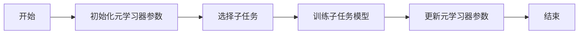
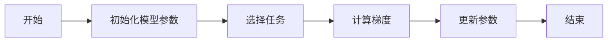
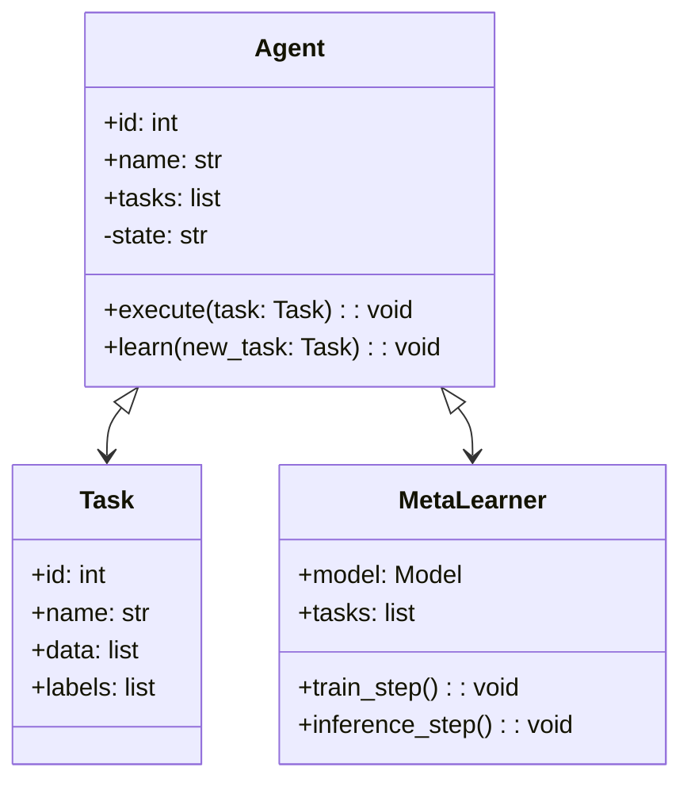
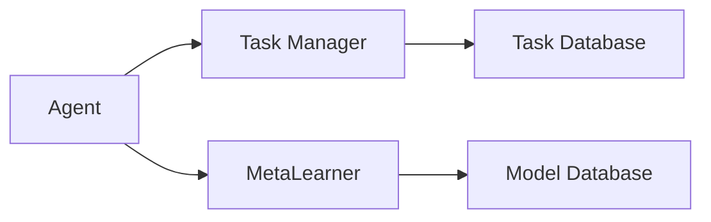
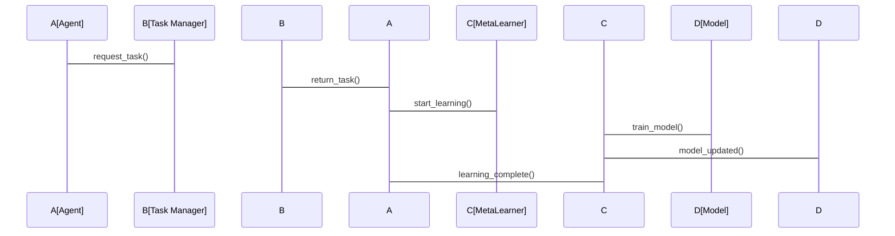

                 


# 基于元学习的AI Agent个性化定制技术

> 关键词：元学习、AI Agent、个性化定制、动态适应、自适应系统

> 摘要：本文探讨了基于元学习的AI Agent个性化定制技术，分析了元学习的基本原理及其在AI Agent中的应用，详细讲解了个性化定制的核心概念与实现方法，结合实际案例，深入分析了系统架构设计和项目实战，并总结了最佳实践和未来研究方向。

---

## 第一部分: 基于元学习的AI Agent个性化定制概述

### 第1章: 基于元学习的AI Agent个性化定制概述

#### 1.1 问题背景与技术挑战
##### 1.1.1 AI Agent的定义与核心功能
AI Agent（人工智能代理）是指能够感知环境、自主决策并执行任务的智能体。其核心功能包括感知、推理、规划、学习和执行。

##### 1.1.2 个性化定制的需求与重要性
个性化定制是指根据用户需求或特定场景，对AI Agent的功能、行为或参数进行调整。其重要性体现在提升用户体验、适应多样化的应用场景以及提高系统效率。

##### 1.1.3 元学习在AI Agent中的作用
元学习是一种允许AI Agent快速适应新任务的学习方法。通过元学习，AI Agent可以在有限的数据和时间内，快速掌握新任务，从而实现个性化定制。

#### 1.2 核心概念与技术优势
##### 1.2.1 元学习的基本原理
元学习通过学习如何学习，能够在新任务中快速调整模型参数，减少对新数据的依赖。其核心在于构建一个元学习器，能够指导子学习器在特定任务中进行优化。

##### 1.2.2 AI Agent的个性化定制方法
个性化定制方法包括基于规则的定制、基于模型的定制和基于学习的定制。元学习属于基于学习的定制，能够动态调整模型以适应个性化需求。

##### 1.2.3 元学习与个性化定制的结合优势
元学习能够快速适应新任务，个性化定制则提供了灵活的调整能力。两者的结合使得AI Agent能够在多样化的场景中高效运行。

#### 1.3 应用场景与案例分析
##### 1.3.1 个性化推荐系统中的应用
通过元学习，AI Agent可以根据用户的实时反馈快速调整推荐策略，提供更精准的推荐结果。

##### 1.3.2 自然语言处理中的定制化模型
元学习可以用于训练定制化的NLP模型，例如个性化文本生成或情感分析，满足特定领域的需求。

##### 1.3.3 元学习在动态环境中的优势
在动态环境中，元学习可以帮助AI Agent快速适应环境变化，例如在自动驾驶中实时调整驾驶策略。

#### 1.4 本章小结
本章介绍了元学习的基本概念、个性化定制的需求以及两者结合在AI Agent中的应用优势，为后续内容奠定了基础。

---

## 第二部分: 元学习与个性化定制的核心概念

### 第2章: 元学习的基本原理与实现

#### 2.1 元学习的核心概念
##### 2.1.1 元学习的定义与特点
元学习是一种高层次的学习方法，旨在通过学习多个任务来提升对新任务的适应能力。其特点包括快速适应、通用性和数据高效性。

##### 2.1.2 元学习与传统机器学习的对比
传统机器学习依赖大量数据和任务特定的训练，而元学习通过跨任务学习，能够在新任务中快速调整。

##### 2.1.3 元学习的数学模型与公式
元学习的数学模型通常涉及优化目标函数，例如：
$$ \min_{\theta} \sum_{i=1}^{N} \mathbb{E}_{(x,y)} \left[ \mathcal{L}(\theta, x, y) \right] $$
其中，$\theta$ 是元学习器的参数，$\mathcal{L}$ 是损失函数。

#### 2.2 个性化定制的核心原理
##### 2.2.1 定制化模型的构建过程
个性化定制需要根据用户需求或场景特征，构建或调整AI Agent的模型结构或参数。

##### 2.2.2 用户需求分析与特征提取
通过分析用户的特征（如行为模式、偏好等），提取关键特征用于模型定制。

##### 2.2.3 模型的动态调整与优化
个性化定制需要动态调整模型参数，以适应实时变化的用户需求或环境条件。

#### 2.3 元学习与个性化定制的结合
##### 2.3.1 元学习在个性化定制中的应用
元学习能够快速调整模型参数，满足个性化需求，例如在推荐系统中实时调整推荐策略。

##### 2.3.2 元学习与个性化定制的对比分析
通过对比分析，可以更好地理解两者的特点和适用场景。

##### 2.3.3 元学习与个性化定制的协同优化
协同优化是通过结合元学习和个性化定制的优势，提升AI Agent的整体性能。

---

## 第三部分: 算法原理讲解

### 第3章: 元学习算法的原理与实现

#### 3.1 基于Meta-LSTM的元学习算法
##### 3.1.1 Meta-LSTM的定义与特点
Meta-LSTM是一种基于循环神经网络的元学习算法，能够在新任务中快速调整模型参数。

##### 3.1.2 Meta-LSTM的算法流程


##### 3.1.3 Meta-LSTM的Python实现
```python
def meta_learning(meta_model, task_model, tasks):
    for task in tasks:
        # 训练子任务模型
        task_loss = train_task_model(task_model, task)
        # 更新元学习器参数
        meta_optimizer.zero_grad()
        meta_loss = compute_meta_loss(meta_model, task_model)
        meta_loss.backward()
        meta_optimizer.step()
    return meta_model
```

#### 3.2 基于MAML的元学习算法
##### 3.2.1 MAML的定义与特点
MAML（Meta-Automated Learning）是一种通过优化初始化参数来实现快速适应新任务的元学习算法。

##### 3.2.2 MAML的算法流程


##### 3.2.3 MAML的Python实现
```python
def maml_learning(model, optimizer, tasks):
    for task in tasks:
        # 计算梯度
        task_loss = train_task_model(model, task)
        task_loss.backward()
        # 更新模型参数
        optimizer.step()
        optimizer.zero_grad()
    return model
```

#### 3.3 元学习算法的数学模型与公式
##### 3.3.1 Meta-LSTM的数学模型
Meta-LSTM的损失函数通常包括任务损失和元损失：
$$ \mathcal{L}_{\text{meta}} = \mathcal{L}_{\text{task}} + \lambda \mathcal{L}_{\text{meta}} $$
其中，$\lambda$ 是调节参数。

##### 3.3.2 MAML的数学模型
MAML的目标函数为：
$$ \min_{\theta} \mathbb{E}_{(x,y)} \left[ \mathcal{L}(\theta, x, y) \right] $$
其中，$\theta$ 是模型的初始参数。

---

## 第四部分: 系统分析与架构设计方案

### 第4章: 系统架构设计与实现

#### 4.1 系统功能设计
##### 4.1.1 领域模型类图


##### 4.1.2 系统架构图


#### 4.2 系统接口设计
##### 4.2.1 Agent与Task的交互接口
- `get_task()`：获取当前任务
- `execute_task(task)`：执行特定任务

##### 4.2.2 MetaLearner与Model的交互接口
- `train_model(task)`：训练模型
- `update_meta_params()`：更新元学习参数

#### 4.3 系统交互序列图


---

## 第五部分: 项目实战

### 第5章: 个性化AI Agent的项目实战

#### 5.1 环境安装与配置
##### 5.1.1 安装依赖
- 安装Python、TensorFlow、Keras、Scikit-learn
- 安装Jupyter Notebook用于开发和测试

##### 5.1.2 安装代码库
- 克隆GitHub代码仓库
- 安装依赖项：`pip install -r requirements.txt`

#### 5.2 核心代码实现
##### 5.2.1 元学习器的实现
```python
class MetaLearner:
    def __init__(self, model):
        self.model = model
        self.optimizer = Adam(model.parameters(), lr=1e-3)
    
    def train_step(self, task):
        # 前向传播
        outputs = self.model(task.input)
        # 计算损失
        loss = task.criterion(outputs, task.target)
        # 反向传播
        loss.backward()
        self.optimizer.step()
        self.optimizer.zero_grad()
```

##### 5.2.2 个性化定制模块的实现
```python
class PersonalizedAgent:
    def __init__(self, meta_learner):
        self.meta_learner = meta_learner
    
    def customize_task(self, task):
        # 调整任务参数
        self.meta_learner.train_step(task)
        # 返回定制化模型
        return self.meta_learner.model
```

#### 5.3 代码解读与分析
##### 5.3.1 元学习器的训练过程
- 通过`train_step`方法，元学习器在每个任务上进行训练
- 使用Adam优化器更新模型参数

##### 5.3.2 个性化定制模块的实现细节
- `customize_task`方法根据具体任务调整模型参数
- 返回定制化的模型供后续使用

#### 5.4 实际案例分析与实现
##### 5.4.1 案例背景
假设我们有一个个性化推荐系统，需要根据用户的实时行为调整推荐策略。

##### 5.4.2 案例实现
```python
# 定义任务
class RecommendationTask:
    def __init__(self, input, target):
        self.input = input
        self.target = target
        self.criterion = nn.BCELoss()
    
    def forward(self, model):
        return model(self.input)
    
    def loss(self, outputs):
        return self.criterion(outputs, self.target)

# 初始化元学习器
meta_learner = MetaLearner(PersonalizedModel(input_dim, output_dim))

# 定制化模型
agent = PersonalizedAgent(meta_learner)
customized_model = agent.customize_task(RecommendationTask(input_data, target_labels))
```

##### 5.4.3 案例分析
- 通过元学习，模型能够快速适应用户的个性化需求
- 实现了动态调整推荐策略，提升了用户体验

#### 5.5 项目小结
本章通过实际案例展示了基于元学习的个性化定制技术在AI Agent中的应用，详细讲解了项目的实现过程和代码细节。

---

## 第六部分: 总结与展望

### 第6章: 总结与展望

#### 6.1 最佳实践与小结
- 元学习能够快速适应新任务，适合个性化定制需求
- 在实现过程中，需注意模型的泛化能力和计算效率

#### 6.2 注意事项与建议
- 确保数据质量和多样性，避免过拟合
- 定期更新模型参数，保持系统性能

#### 6.3 未来研究方向
- 探索更高效的元学习算法
- 研究多模态数据的个性化定制方法
- 结合边缘计算，实现分布式个性化定制

---

# 附录

## 附录A: 常用数学符号与公式

## 附录B: 代码库与工具

## 附录C: 参考文献与拓展阅读

---

通过以上目录结构和内容规划，我们可以系统地撰写一篇基于元学习的AI Agent个性化定制技术的深度技术博客文章，涵盖从理论到实践的各个方面，确保内容详实、逻辑清晰。

