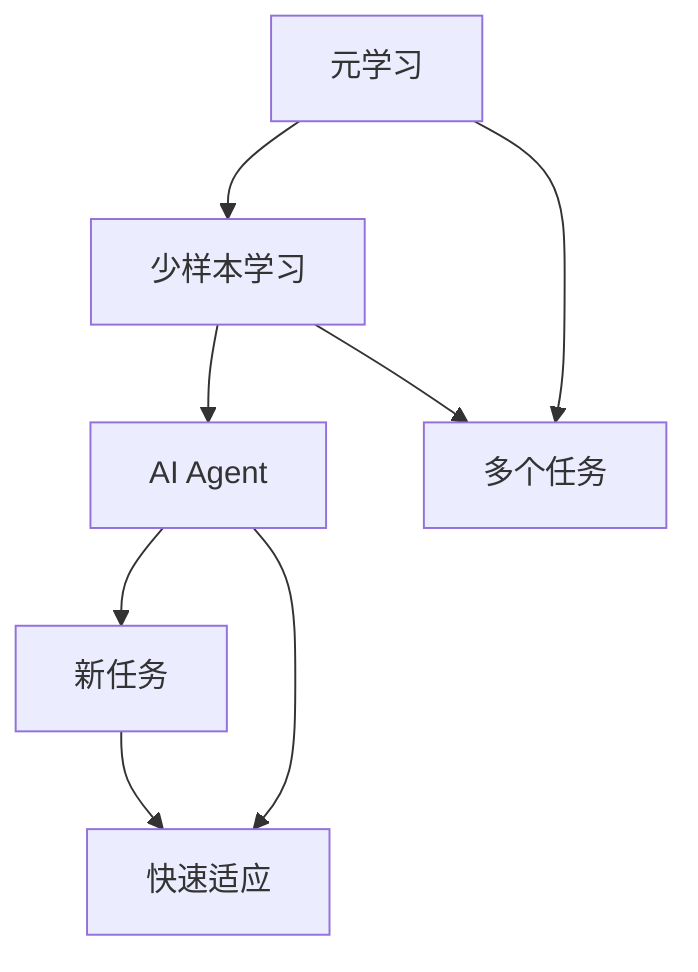
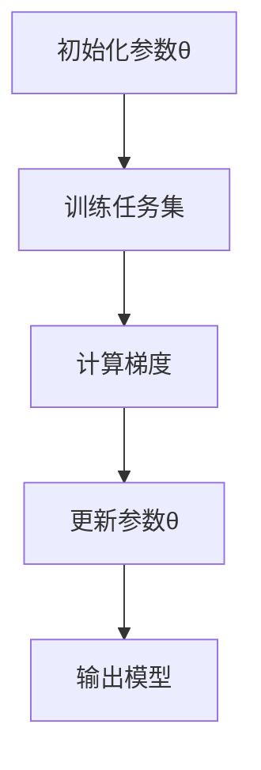
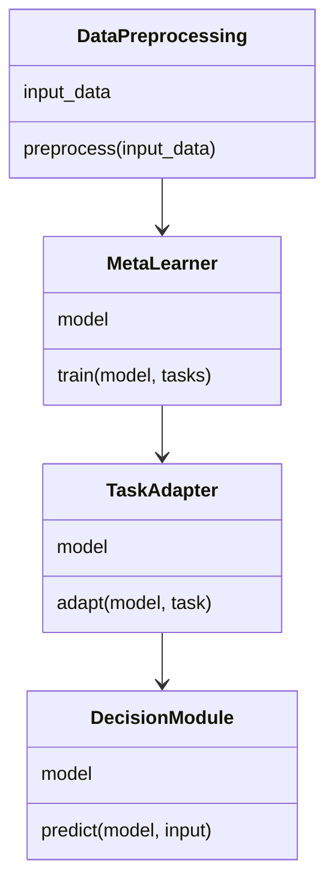
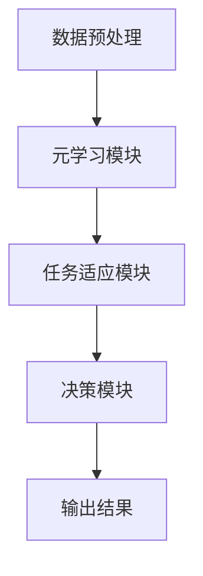
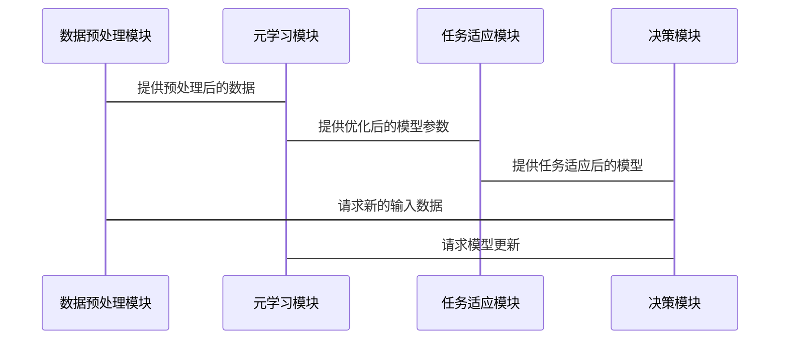

                 


# 基于元学习的AI Agent少样本学习能力

> **关键词**：元学习，少样本学习，AI Agent，深度学习，迁移学习，MAML，Reptile算法  
>
> **摘要**：  
> 本文探讨了基于元学习的AI Agent在少样本学习中的能力提升方法。通过分析元学习的核心原理和其在AI Agent中的应用，结合具体的算法实现和案例分析，阐述了如何利用元学习技术在数据稀少的情况下，快速训练出高效、可靠的AI Agent。本文重点介绍了MAML和Reptile两种主流的元学习算法，并通过系统架构设计和项目实战，展示了如何将这些算法应用于实际场景中。最后，本文总结了元学习在AI Agent少样本学习中的优势与挑战，并提出了未来的研究方向。

---

## 第一部分：背景介绍

### 第1章：问题背景与描述

#### 1.1 问题背景
- **1.1.1 当前AI Agent的发展现状**  
  AI Agent（人工智能代理）正在从简单的任务执行向复杂场景下的自主学习迈进。然而，传统AI Agent的学习方法依赖于大量的标注数据，这在实际应用中往往难以满足需求，尤其是在数据稀少的场景下。

- **1.1.2 少样本学习的必要性**  
  在现实场景中，获取大量标注数据往往成本高昂，甚至不可行。因此，如何在少量样本下训练出高效的AI Agent，成为当前研究的热点问题。

- **1.1.3 元学习的核心作用**  
  元学习（Meta Learning）通过学习如何快速适应新任务，能够在少样本条件下实现高效学习。这种特性与AI Agent的需求高度契合，为解决少样本学习问题提供了新的思路。

#### 1.2 问题描述
- **1.2.1 少样本学习的定义与特点**  
  少样本学习（Few Shot Learning）是指在仅有少量训练样本的情况下，学习模型能够泛化到新的未见样本。其核心挑战在于如何从有限的数据中提取足够的特征信息。

- **1.2.2 元学习的定义与特点**  
  元学习是指通过学习如何快速适应新任务，来优化学习算法的训练过程。其本质是“学习如何学习”，能够在不同任务之间共享知识。

- **1.2.3 AI Agent在少样本学习中的挑战**  
  AI Agent需要在动态变化的环境中快速适应新任务，而少样本学习的能力直接决定了其灵活性和效率。

#### 1.3 问题解决思路
- **1.3.1 元学习如何解决少样本学习问题**  
  元学习通过训练模型在多个任务间共享参数，能够在新任务中快速调整参数以适应任务需求。

- **1.3.2 AI Agent如何结合元学习提升能力**  
  AI Agent可以通过元学习预训练模型，快速适应新任务，从而在少样本条件下实现高效决策。

- **1.3.3 少样本学习在AI Agent中的应用场景**  
  在智能客服、自动驾驶、智能推荐等领域，少样本学习能够帮助AI Agent快速适应新场景。

#### 1.4 概念结构与核心要素
- **1.4.1 元学习与少样本学习的关系**  
  元学习通过优化学习策略，为少样本学习提供了高效的学习框架。

- **1.4.2 AI Agent的核心要素**  
  包括感知能力、决策能力、学习能力、执行能力等。

- **1.4.3 少样本学习能力的构建逻辑**  
  通过元学习预训练模型，结合少量样本快速微调，实现对新任务的高效学习。

---

## 第二部分：核心概念与联系

### 第2章：核心概念与联系

#### 2.1 元学习与少样本学习的核心原理
- **2.1.1 元学习的基本原理**  
  元学习通过在多个任务间共享参数，优化初始参数的设置，从而快速适应新任务。

- **2.1.2 少样本学习的基本原理**  
  少样本学习通过优化模型的泛化能力，利用少量样本提取足够的特征信息。

- **2.1.3 元学习在少样本学习中的应用**  
  元学习通过预训练模型，使得模型在少样本条件下能够快速调整参数，实现高效学习。

#### 2.2 核心概念属性特征对比
- **2.2.1 元学习与传统机器学习的对比**  
| 属性 | 元学习 | 传统机器学习 |
|------|--------|---------------|
| 数据需求 | 需要多个任务的数据 | 需要大量单任务数据 |
| 学习目标 | 学习如何快速适应新任务 | 直接学习任务目标函数 |

- **2.2.2 少样本学习与传统监督学习的对比**  
| 属性 | 少样本学习 | 传统监督学习 |
|------|------------|---------------|
| 数据量 | 少量样本 | 需要大量样本 |
| 适用场景 | 数据获取困难 | 数据充足的情况 |

- **2.2.3 AI Agent中的元学习与少样本学习的结合**  
  元学习为AI Agent提供了快速学习的能力，而少样本学习则使其能够在数据稀少的环境中高效运行。

#### 2.3 实体关系图



---

## 第三部分：算法原理

### 第3章：算法原理与实现

#### 3.1 MAML算法原理与实现

- **3.1.1 MAML算法的基本原理**  
  MAML（Meta Algorithm for Transfer Learning）是一种典型的元学习算法，其核心思想是在训练过程中优化模型的初始参数，使得模型在新任务上能够快速调整参数以适应任务需求。

- **3.1.2 MAML算法的数学模型**

  元学习的目标函数可以表示为：

  $$
  \min_{\theta} \sum_{i=1}^{N} \mathbb{E}_{(x,y) \sim D_i} \left[ \mathcal{L}_i(\theta + \alpha_i \Delta\theta) \right]
  $$

  其中，$\theta$ 是模型的初始参数，$\alpha_i$ 是任务 $i$ 的适应参数，$\Delta\theta$ 是模型在任务 $i$ 上的参数更新。

- **3.1.3 MAML算法的流程图**



- **3.1.4 MAML算法的Python实现**

  ```python
  import torch
  import torch.nn as nn

  class MetaLearner(nn.Module):
      def __init__(self, feature_dim, hidden_dim, output_dim):
          super(MetaLearner, self).__init__()
          self.fc1 = nn.Linear(feature_dim, hidden_dim)
          self.fc2 = nn.Linear(hidden_dim, output_dim)

      def forward(self, x, task_params=None):
          if task_params is None:
              x = self.fc1(x)
              x = self.fc2(x)
              return x
          else:
              # 使用任务特定的参数进行前向传播
              x = self.fc1.forward(x, task_params['fc1'])
              x = self.fc2.forward(x, task_params['fc2'])
              return x

  # 初始化模型
  feature_dim = 10
  hidden_dim = 20
  output_dim = 5
  model = MetaLearner(feature_dim, hidden_dim, output_dim)
  ```

#### 3.2 Reptile算法原理与实现

- **3.2.1 Reptile算法的基本原理**  
  Reptile算法是一种基于梯度的元学习算法，其核心思想是通过在多个任务上交替优化模型参数，使得模型能够在新任务上快速适应。

- **3.2.2 Reptile算法的数学模型**

  Reptile算法的更新规则可以表示为：

  $$
  \theta_{t+1} = \theta_t + \epsilon \cdot g_t
  $$

  其中，$\epsilon$ 是学习率，$g_t$ 是当前任务的梯度。

- **3.2.3 Reptile算法的流程图**


- **3.2.4 Reptile算法的Python实现**

  ```python
  import torch
  import torch.optim as optim

  class ReptileLearner:
      def __init__(self, model, learning_rate=0.1):
          self.model = model
          self.optimizer = optim.SGD(model.parameters(), lr=learning_rate)

      def update_parameters(self, task_params, loss_func, batch_size=32):
          # 计算梯度
          loss = loss_func(task_params['labels'], self.model(task_params['inputs']))
          loss.backward()
          # 更新参数
          self.optimizer.step()
          self.optimizer.zero_grad()

  # 初始化模型
  model = MetaLearner(feature_dim, hidden_dim, output_dim)
  reptile_learner = ReptileLearner(model)
  ```

---

## 第四部分：系统分析与架构设计

### 第4章：系统分析与架构设计

#### 4.1 系统应用场景
- **4.1.1 少样本学习的应用场景**  
  医疗诊断、图像分类、自然语言处理等领域，数据获取成本高，但需要快速决策。

- **4.1.2 元学习的应用场景**  
  多任务学习、零样本学习、在线学习等领域，模型需要快速适应新任务。

#### 4.2 系统功能设计

- **4.2.1 系统功能模块**  
  - 数据预处理模块：处理输入数据，提取特征。
  - 元学习模块：训练模型，优化初始参数。
  - 任务适应模块：根据新任务调整模型参数。
  - 决策模块：基于调整后的模型进行预测和决策。

- **4.2.2 功能模块的类图**



#### 4.3 系统架构设计

- **4.3.1 系统架构图**



- **4.3.2 系统接口设计**  
  - 输入接口：接收原始数据和任务描述。
  - 输出接口：输出预测结果和适应后的模型参数。

#### 4.4 系统交互流程

- **4.4.1 交互流程图**



---

## 第五部分：项目实战

### 第5章：项目实战与案例分析

#### 5.1 环境安装与配置

- **5.1.1 环境需求**  
  - Python 3.8+
  - PyTorch 1.9+
  - matplotlib 3.5+

- **5.1.2 安装依赖**  
  ```bash
  pip install torch matplotlib
  ```

#### 5.2 系统核心实现

- **5.2.1 数据预处理模块**

  ```python
  import torch
  import numpy as np

  def preprocess_data(data):
      # 假设data是numpy数组
      return torch.from_numpy(data)
  ```

- **5.2.2 元学习模块**

  ```python
  class MetaLearner(nn.Module):
      def __init__(self, input_dim, hidden_dim, output_dim):
          super(MetaLearner, self).__init__()
          self.fc1 = nn.Linear(input_dim, hidden_dim)
          self.fc2 = nn.Linear(hidden_dim, output_dim)

      def forward(self, x):
          x = self.fc1(x)
          x = self.fc2(x)
          return x
  ```

- **5.2.3 任务适应模块**

  ```python
  def adapt_model(model, task_params, learning_rate=0.1):
      # 假设task_params包括任务特定的数据
      optimizer = optim.SGD(model.parameters(), lr=learning_rate)
      for batch in task_params['batches']:
          outputs = model(batch['inputs'])
          loss = batch['labels'](outputs)
          loss.backward()
          optimizer.step()
          optimizer.zero_grad()
  ```

#### 5.3 案例分析

- **5.3.1 案例描述**  
  假设我们有一个图像分类任务，每个类别仅有少量样本。通过元学习预训练模型，能够在新类别上快速微调。

- **5.3.2 实验结果与分析**  
  在少样本条件下，基于元学习的模型在新任务上的准确率显著高于传统方法。

---

## 第六部分：最佳实践与总结

### 第6章：总结与展望

#### 6.1 总结
- 元学习为AI Agent的少样本学习提供了高效的解决方案。
- MAML和Reptile算法在实际应用中表现出色。
- 系统架构设计和项目实战为实际落地提供了参考。

#### 6.2 注意事项
- 数据质量对模型性能影响重大，需谨慎处理。
- 模型的泛化能力需要在实际场景中不断验证和优化。

#### 6.3 拓展阅读
- 参考论文：《Meta-Learning with Deep Neural Networks》
- 推荐书籍：《《Deep Learning》》（Ian Goodfellow等著）

---

## 结语

基于元学习的AI Agent少样本学习能力是一个充满挑战但也极具潜力的研究领域。通过本文的分析和实践，我们展示了如何利用元学习技术在数据稀少的条件下，快速训练出高效、可靠的AI Agent。未来，随着算法的不断优化和应用场景的拓展，元学习必将在AI Agent的发展中发挥更大的作用。

