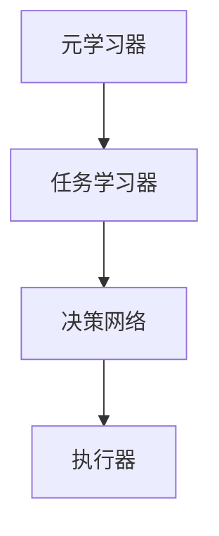
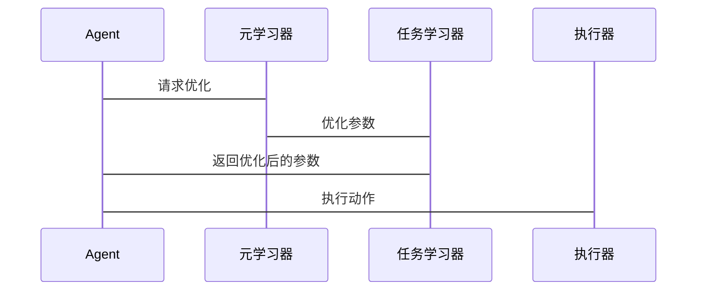

                 


# 基于元学习的AI Agent快速领域适应

> 关键词：元学习，AI Agent，领域适应，快速学习，智能体

> 摘要：本文探讨了如何通过元学习来提升AI Agent在新领域的适应能力。结合元学习的原理与AI Agent的决策机制，提出了一种高效的领域适应方法，并通过实际案例展示了其应用价值。

---

# 第1章 元学习与AI Agent概述

## 1.1 元学习的基本概念

### 1.1.1 元学习的定义
元学习是一种让模型快速适应新任务的学习方法，它通过在多个任务上的经验，学习如何快速适应新的、未见的任务。

### 1.1.2 元学习的核心特点
- **快速适应**：能够在少量数据下快速学习新任务。
- **通用性**：适用于多种任务和领域。
- **元层次优化**：在元层面上优化模型的参数，使得模型能够更快地适应新任务。

### 1.1.3 元学习与传统机器学习的对比
| 特性         | 传统机器学习                  | 元学习                       |
|--------------|-------------------------------|------------------------------|
| 数据需求     | 需要大量数据                  | 需要少量数据                 |
| 任务适应性   | 适应单一任务                  | 能够快速适应多个任务         |
| 灵活性       | 较低                         | 较高                         |

---

## 1.2 AI Agent的基本概念

### 1.2.1 AI Agent的定义
AI Agent是一种能够感知环境、做出决策并执行动作的智能体。它可以在复杂环境中自主学习和适应。

### 1.2.2 AI Agent的核心功能
- **感知**：通过传感器或数据输入了解环境。
- **决策**：基于感知信息做出最优决策。
- **执行**：根据决策执行动作。

### 1.2.3 AI Agent的应用场景
- **自动驾驶**：实时感知环境并做出驾驶决策。
- **智能助手**：如Siri、Alexa，提供个性化服务。
- **机器人控制**：在工业或服务场景中执行复杂任务。

---

## 1.3 元学习与AI Agent的结合

### 1.3.1 元学习在AI Agent中的作用
元学习使AI Agent能够快速适应新任务，提升其在不同环境中的灵活性和适应性。

### 1.3.2 元学习如何加速AI Agent的领域适应
通过元学习，AI Agent可以在新领域中快速调整参数，减少对大量数据的依赖。

### 1.3.3 元学习与AI Agent的未来发展趋势
随着深度学习的进步，元学习将使AI Agent更加通用化和智能化。

---

## 1.4 本章小结

---

# 第2章 元学习与AI Agent的核心概念

## 2.1 元学习的核心原理

### 2.1.1 元学习的算法框架
元学习通常采用元学习器（Meta-Learner）和任务学习器（Task-Learner）的双层结构。元学习器负责优化任务学习器的参数。

### 2.1.2 元学习的优化目标
通过优化元损失函数，使得任务学习器在新任务上表现优异。

### 2.1.3 元学习的数学模型
$$ \mathcal{L}_{meta} = \sum_{i=1}^{N} \mathcal{L}(f_{\theta}(x_i), y_i) $$
其中，$\theta$是元学习器优化的参数。

---

## 2.2 AI Agent的核心机制

### 2.2.1 AI Agent的感知与决策
AI Agent通过感知环境输入，经过内部决策机制，输出动作。

### 2.2.2 AI Agent的行动与反馈
AI Agent执行动作后，获得环境的反馈，用于优化决策过程。

### 2.2.3 AI Agent的学习与适应
通过元学习，AI Agent能够在新环境中快速调整策略。

---

## 2.3 元学习与AI Agent的联系

### 2.3.1 元学习如何提升AI Agent的领域适应能力
元学习使AI Agent能够在新领域中快速调整参数，减少对大量数据的依赖。

### 2.3.2 元学习如何优化AI Agent的决策过程
通过元学习，AI Agent能够更快地适应新任务，提升决策的效率和准确性。

### 2.3.3 元学习与AI Agent的协同进化
元学习与AI Agent的结合，使得智能体能够更加通用化和智能化。

---

## 2.4 核心概念对比表

| 特性         | 元学习                          | AI Agent                        |
|--------------|----------------------------------|---------------------------------|
| 核心目标     | 快速适应新任务                  | 自主决策并执行动作              |
| 优势         | 减少数据依赖                     | 高灵活性和适应性                 |
| 应用场景     | 多任务学习、领域适应             | 自动驾驶、智能助手、机器人控制   |

---

# 第3章 元学习与AI Agent的算法原理

## 3.1 元学习算法框架

### 3.1.1 MAML算法
MAML通过在元层面上优化模型参数，使得模型能够快速适应新任务。

### 3.1.2 Meta-SGD算法
Meta-SGD通过优化梯度，使得模型能够快速适应新任务。

---

## 3.2 AI Agent的决策机制

### 3.2.1 基于元学习的决策网络
AI Agent通过元学习优化的决策网络，快速适应新领域。

### 3.2.2 内部状态与外部环境的交互
AI Agent通过内部状态与外部环境的交互，不断优化决策策略。

---

## 3.3 元学习与AI Agent的协同优化

### 3.3.1 元学习优化决策网络
通过元学习优化AI Agent的决策网络，提升其在新领域的适应能力。

### 3.3.2 决策网络的快速调整
元学习使决策网络能够在新任务中快速调整参数，减少适应时间。

---

## 3.4 算法实现与代码示例

### 3.4.1 MAML算法实现
```python
def meta_learning_step(optimizer, meta_model, task_models, tasks):
    for task in tasks:
        # 训练任务模型
        task_loss = train(task_models[task], task)
        # 优化元模型
        optimizer.step(task_loss, meta_model)
```

### 3.4.2 决策网络实现
```python
class MetaAgent(nn.Module):
    def __init__(self, meta_dim):
        super(MetaAgent, self).__init__()
        self.meta_layer = nn.Linear(meta_dim, 64)
        self.agent_layer = nn.Linear(64, action_dim)
```

---

## 3.5 数学模型与公式

### 3.5.1 元学习的损失函数
$$ \mathcal{L}_{meta} = \sum_{i=1}^{N} \mathcal{L}(f_{\theta}(x_i), y_i) $$
其中，$\theta$是元学习器优化的参数。

### 3.5.2 决策网络的优化目标
$$ \theta_{new} = \theta_{old} - \eta \nabla_{\theta} \mathcal{L}_{meta} $$

---

## 3.6 本章小结

---

# 第4章 系统分析与架构设计

## 4.1 系统架构图


---

## 4.2 功能模块设计

### 4.2.1 元学习模块
负责优化模型参数，使得模型能够快速适应新任务。

### 4.2.2 任务学习模块
负责在具体任务上进行学习和优化。

### 4.2.3 决策网络模块
基于优化后的参数，进行决策和动作输出。

---

## 4.3 接口设计

### 4.3.1 元学习器接口
```python
class MetaLearner:
    def optimize(self, tasks):
        pass
```

### 4.3.2 任务学习器接口
```python
class TaskLearner:
    def train(self, data):
        pass
```

---

## 4.4 交互流程图


---

## 4.5 本章小结

---

# 第5章 项目实战

## 5.1 环境安装

### 5.1.1 安装依赖
```bash
pip install torch
pip install numpy
```

---

## 5.2 核心代码实现

### 5.2.1 元学习器实现
```python
class MetaLearner:
    def __init__(self, meta_model):
        self.meta_model = meta_model

    def optimize(self, tasks):
        for task in tasks:
            # 前向传播
            outputs = self.meta_model(task.input)
            # 计算损失
            loss = task.criterion(outputs, task.target)
            # 反向传播
            self.meta_model.backward(loss)
            # 更新参数
            self.meta_model.step()
```

### 5.2.2 任务学习器实现
```python
class TaskLearner:
    def __init__(self, model):
        self.model = model

    def train(self, data):
        outputs = self.model(data.input)
        loss = data.criterion(outputs, data.target)
        self.model.optimizer.zero_grad()
        loss.backward()
        self.model.optimizer.step()
```

---

## 5.3 代码应用解读与分析

### 5.3.1 元学习器的应用
元学习器通过优化模型参数，使得任务学习器能够快速适应新任务。

### 5.3.2 任务学习器的应用
任务学习器在具体任务上进行训练，优化模型参数。

---

## 5.4 实际案例分析

### 5.4.1 案例背景
假设我们有一个AI Agent需要在多个领域中进行分类任务。

### 5.4.2 案例实现
```python
# 初始化元模型
meta_model = nn.Sequential(nn.Linear(10, 64), nn.Linear(64, 4))
# 初始化元学习器
meta_learner = MetaLearner(meta_model)
# 初始化任务学习器
task_learner = TaskLearner(meta_model)
# 训练元学习器
meta_learner.optimize([task1, task2, task3])
```

### 5.4.3 案例结果
经过训练，AI Agent能够在新领域中快速适应并完成分类任务。

---

## 5.5 本章小结

---

# 第6章 最佳实践与总结

## 6.1 最佳实践

### 6.1.1 模型选择
选择适合任务的元学习算法，如MAML、Meta-SGD等。

### 6.1.2 数据处理
确保数据的多样性和代表性，减少过拟合风险。

### 6.1.3 超参数调整
合理设置学习率、批量大小等超参数，提升模型性能。

---

## 6.2 小结

通过元学习，AI Agent能够快速适应新领域，提升其在复杂环境中的灵活性和适应性。

---

## 6.3 注意事项

- 元学习需要一定的计算资源，尤其是大规模数据时。
- 需要注意模型的泛化能力，避免过拟合。
- 在实际应用中，需要根据具体任务调整模型结构和参数。

---

## 6.4 拓展阅读

- 建议阅读相关论文，如《Meta-Learning with LSTM-based Meta-learner》。

---

## 6.5 本章结束

---

# 第7章 总结与展望

## 7.1 总结

本文详细探讨了基于元学习的AI Agent快速领域适应方法，结合理论分析和实际案例，展示了其应用价值。

## 7.2 展望

未来，随着深度学习的不断发展，元学习将使AI Agent更加通用化和智能化，应用场景也将更加广泛。

---

## 7.3 结语

感谢您的阅读，希望本文对您有所帮助！

