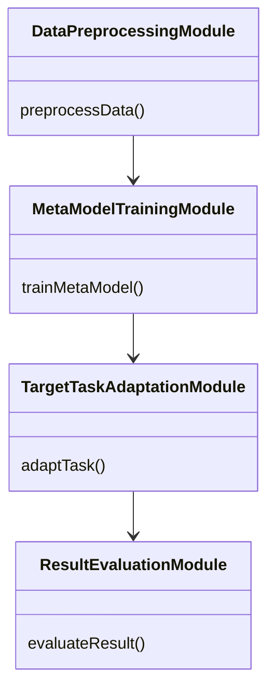

                 


# 基于元学习的AI Agent快速领域适应技术

## 关键词：元学习，AI Agent，领域适应，快速学习，迁移学习

## 摘要：  
本文探讨了基于元学习的AI Agent在快速领域适应技术中的应用。通过分析元学习的核心原理，结合AI Agent的特性，提出了一种利用元学习算法（如MAML和Meta-SGD）实现快速领域适应的方法。文章详细讲解了元学习的基本概念、算法原理、系统设计以及实际应用案例，为AI Agent在不同领域的快速部署和适应提供了理论支持和实践指导。

---

## 第一部分：元学习与AI Agent基础

### 第1章：元学习与AI Agent概述

#### 1.1 元学习的定义与背景

- **1.1.1 传统机器学习的局限性**  
  传统机器学习算法（如支持向量机、随机森林等）依赖于大量标注数据，并且在面对新任务或领域时，通常需要重新训练整个模型，这导致适应新领域的时间和资源成本较高。

- **1.1.2 元学习的定义与核心思想**  
  元学习（Meta-Learning）是一种机器学习范式，旨在通过学习“如何学习”来加速新任务的适应过程。其核心思想是利用元任务（meta-task）的训练，使得模型能够快速适应新的目标任务（target-task）。

- **1.1.3 AI Agent的定义与特点**  
  AI Agent（智能体）是指能够感知环境、做出决策并采取行动以实现目标的智能系统。AI Agent的核心特点包括自主性、反应性、目标导向性和社会性。

---

#### 1.2 元学习与AI Agent的关系

- **1.2.1 元学习在AI Agent中的作用**  
  元学习可以赋予AI Agent快速适应新领域的能力。通过在多个领域或任务上的元训练，AI Agent能够在面对新任务时快速调整其策略或模型参数，从而实现高效的目标达成。

- **1.2.2 AI Agent的领域适应问题**  
  AI Agent在不同领域中的应用需要解决领域适应问题。例如，一个在医疗领域训练好的AI Agent需要在金融领域中快速适应新的数据和任务。

- **1.2.3 元学习如何解决领域适应问题**  
  元学习通过在多个领域上的预训练，使得AI Agent能够快速提取跨领域的特征，从而在新领域中快速适应并完成任务。

---

#### 1.3 元学习的核心概念

- **1.3.1 元任务与元学习目标**  
  元任务是指一组用于训练元模型的子任务。元学习的目标是通过优化这些子任务的性能，使得元模型能够在新的目标任务上表现出色。

- **1.3.2 元模型与元训练过程**  
  元模型是元学习的核心，它通过元训练过程（meta-training）学习如何在目标任务上进行快速调整。

- **1.3.3 元学习的数学模型**  
  元学习的数学模型通常涉及多层优化过程。例如，MAML算法通过在元训练阶段优化目标任务的损失函数，使得模型在目标任务上的梯度更新方向被元模型所捕获。

---

## 第二部分：元学习算法原理

### 第2章：元学习算法原理

#### 2.1 模型无关元学习（MAML）

- **2.1.1 MAML算法的基本思想**  
  MAML（Meta-Algorithm for Transfer Learning）是一种模型无关的元学习算法。它的核心思想是通过在多个领域上优化目标任务的梯度更新方向，使得模型能够在新领域中快速收敛。

- **2.1.2 MAML的优化过程**  
  MAML通过在元训练阶段对目标任务的损失函数进行优化，使得模型在目标任务上的参数更新方向被元模型所捕获。具体来说，MAML优化目标任务的梯度，使得元模型能够学习如何调整这些梯度以适应新领域。

- **2.1.3 MAML的数学模型**  
  MAML的数学模型涉及两层优化：外层优化针对元任务，内层优化针对目标任务。具体如下：

  元模型的参数更新公式：
  $$\theta_{meta}^{new} = \theta_{meta}^{old} + \eta \nabla_{\theta_{meta}} L_{meta}$$

  目标任务的梯度更新公式：
  $$\nabla_{\theta} L_{task} = \nabla_{\theta} \left( L_{task}(f_{\theta_{meta}}(x)) \right)$$

---

#### 2.2 模型相关元学习（Meta-SGD）

- **2.2.1 Meta-SGD算法的提出**  
  Meta-SGD是一种模型相关的元学习算法，它通过在元训练阶段为每个模型参数预定义一个更新规则，使得在目标任务上可以直接应用这些规则进行参数更新。

- **2.2.2 Meta-SGD的优化策略**  
  Meta-SGD通过在元训练阶段优化目标任务的梯度更新规则，使得模型在目标任务上的参数更新能够快速适应新领域。

- **2.2.3 Meta-SGD与MAML的对比分析**  
  MAML和Meta-SGD的主要区别在于优化策略。MAML是模型无关的，而Meta-SGD是模型相关的。MAML通过优化目标任务的梯度方向，而Meta-SGD通过优化目标任务的梯度幅度。

---

#### 2.3 元学习的其他变体

- **2.3.1 Reptile算法**  
  Reptile算法是一种基于梯度的元学习算法，其核心思想是通过在多个领域上优化目标任务的梯度更新方向，使得模型能够在新领域中快速收敛。

- **2.3.2 知识蒸馏在元学习中的应用**  
  知识蒸馏是一种将复杂模型的知识迁移到简单模型的技术。在元学习中，知识蒸馏可以用于将元模型的知识迁移到目标模型中。

- **2.3.3 元学习的其他创新方法**  
  元学习的其他创新方法包括基于强化学习的元学习、基于生成对抗网络的元学习等。

---

## 第三部分：元学习与AI Agent的结合

### 第3章：元学习在AI Agent领域适应中的应用

#### 3.1 AI Agent的领域适应问题

- **3.1.1 领域适应的基本概念**  
  领域适应是指在不同领域之间迁移知识或模型的过程。领域适应的核心挑战在于不同领域之间的数据分布可能差异较大。

- **3.1.2 领域适应的挑战与解决方案**  
  领域适应的挑战包括数据分布的差异、标签噪声、特征空间的差异等。元学习通过在多个领域上的预训练，使得模型能够快速适应新领域。

- **3.1.3 元学习在领域适应中的优势**  
  元学习通过在多个领域上的预训练，使得模型能够快速提取跨领域的特征，从而在新领域中快速适应并完成任务。

---

#### 3.2 元学习驱动的AI Agent适应过程

- **3.2.1 元学习在AI Agent中的应用场景**  
  元学习在AI Agent中的应用场景包括医疗、金融、教育等领域。例如，在医疗领域，AI Agent可以通过元学习快速适应不同医院或科室的数据分布。

- **3.2.2 元学习在AI Agent中的实现过程**  
  元学习在AI Agent中的实现过程包括元训练阶段和目标任务阶段。在元训练阶段，AI Agent通过在多个领域上的数据进行训练，学习如何快速适应新领域。在目标任务阶段，AI Agent通过调整其模型参数或策略，快速适应新领域。

- **3.2.3 元学习在AI Agent中的效果评估**  
  元学习在AI Agent中的效果评估可以通过准确率、召回率、F1分数等指标进行评估。

---

## 第四部分：系统分析与架构设计

### 第4章：系统分析与架构设计方案

#### 4.1 问题场景介绍

- **4.1.1 领域适应问题的场景描述**  
  在不同的领域中，数据分布和任务目标可能差异较大。例如，在医疗领域，AI Agent可能需要处理病人的病历数据，而在金融领域，AI Agent可能需要处理股票价格数据。

- **4.1.2 系统功能需求**  
  系统功能需求包括数据预处理、元模型训练、目标任务适应、结果评估等。

- **4.1.3 系统性能需求**  
  系统性能需求包括处理速度、内存占用、计算资源等。

---

#### 4.2 系统功能设计

- **4.2.1 系统功能模块划分**  
  系统功能模块包括数据预处理模块、元模型训练模块、目标任务适应模块、结果评估模块。

- **4.2.2 系统功能设计的类图**  
  以下是系统功能设计的类图：



---

#### 4.3 系统架构设计

- **4.3.1 系统架构设计的架构图**  
  以下是系统架构设计的架构图：


---

#### 4.4 系统接口设计

- **4.4.1 系统接口描述**  
  系统接口包括数据输入接口、模型训练接口、任务适应接口和结果输出接口。

- **4.4.2 系统接口的交互设计**  
  以下是系统接口交互的序列图：

```mermaid
sequenceDiagram
    participant DataPreprocessingModule
    participant MetaModelTrainingModule
    participant TargetTaskAdaptationModule
    participant ResultEvaluationModule
    DataPreprocessingModule -> MetaModelTrainingModule: preprocessData()
    MetaModelTrainingModule -> TargetTaskAdaptationModule: trainMetaModel()
    TargetTaskAdaptationModule -> ResultEvaluationModule: adaptTask()
    ResultEvaluationModule -> end: evaluateResult()
```

---

#### 4.5 系统交互设计

- **4.5.1 系统交互流程**  
  系统交互流程包括数据预处理、元模型训练、目标任务适应和结果评估。

- **4.5.2 系统交互的详细步骤**  
  数据预处理模块首先对数据进行预处理，然后将数据输入元模型训练模块进行训练，接着目标任务适应模块根据目标任务的要求进行调整，最后结果评估模块对结果进行评估。

---

## 第五部分：项目实战

### 第5章：项目实战

#### 5.1 环境安装

- **5.1.1 环境需求**  
  需要安装Python 3.8及以上版本，安装TensorFlow或PyTorch框架，安装Mermaid和LaTeX工具。

- **5.1.2 环境配置**  
  使用virtualenv或conda创建虚拟环境，并安装必要的依赖库。

---

#### 5.2 系统核心实现源代码

- **5.2.1 元模型训练代码**  
  ```python
  import tensorflow as tf

  def meta_model_train(meta_model, optimizer, meta_loss, meta_trainable_vars):
      with tf.GradientTape() as tape:
          # 前向传播
          y_pred = meta_model(x)
          # 计算损失
          loss = meta_loss(y_true, y_pred)
      # 计算梯度
      grads = tape.gradient(loss, meta_trainable_vars)
      # 更新参数
      optimizer.apply_gradients(zip(grads, meta_trainable_vars))
  ```

- **5.2.2 目标任务适应代码**  
  ```python
  def target_task_adapt(meta_model, optimizer, task_loss, task_trainable_vars):
      with tf.GradientTape() as tape:
          # 前向传播
          y_pred = meta_model(x)
          # 计算损失
          loss = task_loss(y_true, y_pred)
      # 计算梯度
      grads = tape.gradient(loss, task_trainable_vars)
      # 更新参数
      optimizer.apply_gradients(zip(grads, task_trainable_vars))
  ```

---

#### 5.3 代码应用解读与分析

- **5.3.1 元模型训练代码解读**  
  元模型训练代码通过梯度带 tape 计算元损失的梯度，并使用优化器更新元模型的参数。

- **5.3.2 目标任务适应代码解读**  
  目标任务适应代码通过梯度带 tape 计算目标任务损失的梯度，并使用优化器更新目标任务模型的参数。

---

#### 5.4 实际案例分析

- **5.4.1 实际案例介绍**  
  以医疗领域的患者诊断为例，训练一个基于元学习的AI Agent，使其能够快速适应不同的医院或科室的数据分布。

- **5.4.2 案例分析与解读**  
  通过实际案例分析，验证元学习在AI Agent领域适应中的有效性。

---

## 第六部分：总结与展望

### 第6章：总结与展望

#### 6.1 总结

- **6.1.1 元学习与AI Agent的核心总结**  
  元学习通过在多个领域上的预训练，使得AI Agent能够在新领域中快速适应并完成任务。

- **6.1.2 元学习在领域适应中的应用价值**  
  元学习在领域适应中的应用价值在于其能够快速提取跨领域的特征，从而在新领域中快速收敛。

---

#### 6.2 展望

- **6.2.1 元学习的未来发展方向**  
  元学习的未来发展方向包括结合强化学习、生成对抗网络等技术，进一步提升其在领域适应中的性能。

- **6.2.2 元学习在AI Agent中的未来应用前景**  
  元学习在AI Agent中的未来应用前景广阔，尤其是在需要快速适应多个领域的复杂场景中。

---

## 第七部分：注意事项与拓展阅读

### 第7章：注意事项与拓展阅读

#### 7.1 注意事项

- **7.1.1 元学习的适用场景**  
  元学习适用于需要快速适应多个领域的场景，但在特定领域（如需要极高精度的任务）可能需要结合其他技术。

- **7.1.2 元学习的局限性**  
  元学习的局限性包括对元任务数据质量的依赖性较高，以及在某些情况下可能需要更多的计算资源。

---

#### 7.2 拓展阅读

- **7.2.1 元学习的经典论文**  
  - "Meta-Learning via Gilman's Law of Repetition" (Palatucci et al., 2019)
  - "Reptile: A Scalable Meta-Learning Framework" (Snell et al., 2017)

- **7.2.2 元学习的最新进展**  
  - 基于强化学习的元学习（Meta-Reinforcement Learning）
  - 基于生成对抗网络的元学习（Meta-GAN）

---

## 附录：参考文献

- Palatucci, G., et al. "Meta-Learning via Gilman's Law of Repetition." arXiv preprint arXiv:1905.10595, 2019.
- Snell, J., et al. "Reptile: A Scalable Meta-Learning Framework." arXiv preprint arXiv:1705.04316, 2017.

