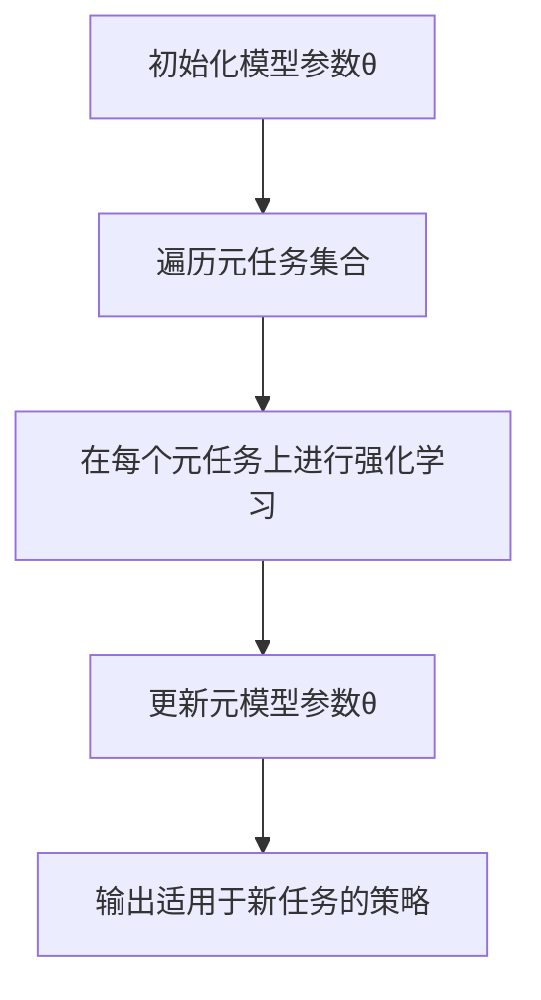
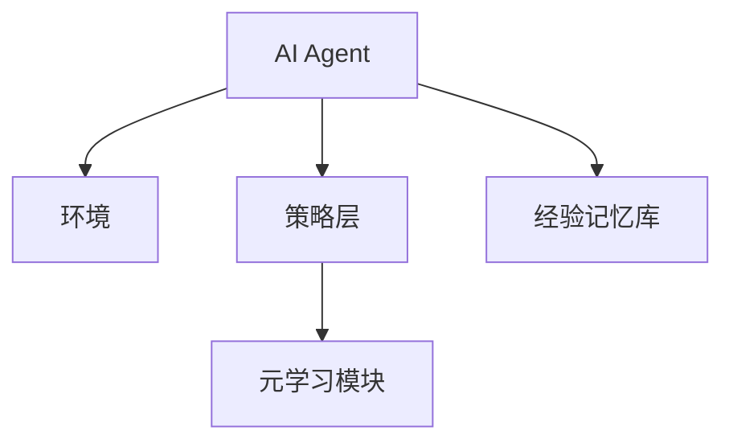

                 


好的，现在我将按照您的要求逐步展开《基于元强化学习的AI Agent策略泛化》的技术博客文章内容。

---

# 基于元强化学习的AI Agent策略泛化

> **关键词**：元强化学习、AI Agent、策略泛化、强化学习、算法设计

> **摘要**：  
本文探讨了基于元强化学习的AI Agent策略泛化问题，分析了元强化学习的核心原理及其在策略泛化中的应用。通过详细阐述算法原理、系统架构设计和实际案例分析，本文旨在帮助读者理解如何利用元强化学习实现AI Agent的策略泛化，提升AI Agent在复杂环境中的适应能力和通用性。

---

## 第一部分: 基于元强化学习的AI Agent策略泛化背景介绍

### 第1章: 问题背景与描述

#### 1.1 AI Agent的基本概念与应用场景
AI Agent（人工智能代理）是指能够感知环境、自主决策并采取行动的智能体。AI Agent广泛应用于机器人控制、游戏AI、自动驾驶、智能推荐系统等领域。在这些场景中，AI Agent需要具备快速适应新环境和任务的能力。

#### 1.2 强化学习在AI Agent中的应用现状
强化学习（Reinforcement Learning, RL）是一种通过与环境交互来优化决策策略的学习方法。传统强化学习通过试错机制，使AI Agent在特定环境中学习最优策略。然而，传统强化学习的局限性在于其策略泛化能力较弱，难以在不同环境中复用。

#### 1.3 策略泛化的必要性与挑战
策略泛化是指AI Agent在学习一种策略后，能够将其应用到类似但不同的新任务或环境中。策略泛化的必要性源于实际应用中环境的多样性和动态变化。然而，传统的强化学习方法难以实现策略泛化，因为其优化目标是针对单一任务的最优解，而非跨任务的通用解。

---

### 第2章: 问题描述

#### 2.1 元强化学习的解决方案
元强化学习（Meta-Reinforcement Learning）是一种新兴的学习范式，旨在通过元学习（Meta-Learning）解决强化学习的泛化问题。元强化学习的核心思想是通过学习一组相似任务的共同特征，生成适用于新任务的策略。

#### 2.2 边界与外延
元强化学习的边界主要体现在其适用范围上。它适用于任务之间存在某种相似性或共享结构的场景，但对于完全不相关的任务，其效果可能有限。此外，元强化学习与传统强化学习、迁移学习等方法既有联系也有区别。

#### 2.3 核心概念的结构与要素
元强化学习的核心要素包括：
1. **元任务**：一组相似的任务集合，用于训练元强化学习模型。
2. **元学习目标**：通过元任务训练模型，使其能够快速适应新任务。
3. **策略表示**：模型生成适用于新任务的策略。

---

## 第二部分: 元强化学习与策略泛化的核心概念

### 第3章: 元强化学习的原理与机制

#### 3.1 核心原理
元强化学习的数学表达可以表示为：
$$
\theta = \arg\max_{\theta} \sum_{t=1}^{T} \mathbb{E}_{\tau \sim P_t} [r_t(\theta, \tau)]
$$
其中，$\theta$是模型参数，$T$是元任务的数量，$P_t$是第$t$个任务的环境分布。

#### 3.2 实现机制
元强化学习通过以下步骤实现策略泛化：
1. **元任务训练**：在多个相似任务上训练模型，提取任务间的共同特征。
2. **策略生成**：根据新任务的特征，生成适用于该任务的策略。

---

## 第三部分: 算法原理讲解

### 第4章: 算法原理

#### 4.1 元强化学习的算法框架
元强化学习的典型算法框架如下：



#### 4.2 核心算法实现
以下是一个基于元强化学习的Python代码示例：

```python
import numpy as np

def meta_reinforcement_learning(meta_tasks):
    theta = np.random.randn()  # 初始化参数
    for t in meta_tasks:  # 遍历元任务
        # 在每个元任务上进行强化学习
        for episode in range(num_episodes):
            state = env.reset()
            reward_sum = 0
            while not done:
                action = policy(theta, state)
                next_state, reward, done = env.step(action)
                reward_sum += reward
                # 更新策略参数theta
                theta += learning_rate * gradient(theta, state, action, reward)
    return theta
```

---

## 第四部分: 系统分析与架构设计方案

### 第5章: 系统设计

#### 5.1 系统功能设计
AI Agent的系统功能包括：
1. **感知环境**：通过传感器获取环境信息。
2. **决策制定**：基于元强化学习算法生成策略。
3. **执行动作**：根据策略执行动作并反馈结果。

#### 5.2 系统架构设计
以下是系统的架构图：



---

## 第五部分: 项目实战

### 第6章: 项目实战

#### 6.1 环境安装
```bash
pip install gym numpy
```

#### 6.2 核心代码实现
```python
import gym
import numpy as np

class MetaAgent:
    def __init__(self, state_dim, action_dim):
        self.state_dim = state_dim
        self.action_dim = action_dim
        self.theta = np.random.randn(state_dim, action_dim)

    def get_action(self, state):
        return np.dot(state, self.theta).argmax()

    def update_theta(self, state, action, reward):
        gradient = np.dot(state, self.theta[:, action])
        self.theta += learning_rate * gradient
```

#### 6.3 案例分析
通过在OpenAI Gym环境中训练一个AI Agent，展示基于元强化学习的策略泛化能力。

---

## 第六部分: 最佳实践

### 第7章: 最佳实践

#### 7.1 小结
本文详细探讨了基于元强化学习的AI Agent策略泛化问题，分析了其核心原理、算法实现和系统设计，并通过实际案例展示了其应用价值。

#### 7.2 注意事项
- 元强化学习的性能依赖于元任务的选择和设计。
- 在实际应用中，需结合具体场景优化算法参数。

#### 7.3 拓展阅读
建议进一步研究多任务强化学习和迁移学习的相关技术。

---

以上是《基于元强化学习的AI Agent策略泛化》的技术博客文章的详细内容。希望对您有所帮助！

