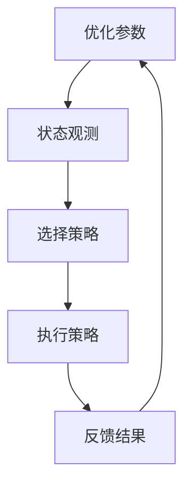

                 


```
# 基于元控制的AI Agent自主学习系统

> 关键词：元控制, AI Agent, 自主学习, 人工智能, 系统架构

> 摘要：  
本文详细探讨了基于元控制的AI Agent自主学习系统的构建与实现。通过分析元控制的核心概念、算法原理、系统架构设计以及实际项目案例，深入阐述了如何利用元控制技术提升AI Agent的自主学习能力。文章内容涵盖从基础理论到实际应用的各个方面，为读者提供了一套完整的解决方案。

---

# 第一部分: 元控制与AI Agent的基础理论

## 第1章: 元控制的基本概念与作用

### 1.1 元控制的定义与特点
- 元控制的定义：元控制是一种高层次的控制机制，用于优化和协调低层次的控制策略。
- 元控制的核心特点：
  - **层次性**：元控制位于控制结构的高层，负责协调和优化低层控制。
  - **自适应性**：能够根据环境变化动态调整控制策略。
  - **全局性**：关注系统整体目标的实现，而非局部优化。

### 1.2 AI Agent的定义与特点
- AI Agent的定义：AI Agent是具有感知环境、自主决策和执行任务能力的智能实体。
- AI Agent的核心特点：
  - **自主性**：能够在没有外部干预的情况下自主运行。
  - **反应性**：能够实时感知环境并做出反应。
  - **目标导向性**：基于目标驱动行为。

### 1.3 元控制在AI Agent中的作用
- 元控制的基本功能：
  - **策略优化**：通过元控制算法优化AI Agent的决策策略。
  - **动态调整**：根据环境变化动态调整控制参数。
  - **协调协作**：协调多个AI Agent之间的协作行为。

### 1.4 本章小结
- 本章介绍了元控制和AI Agent的基本概念及其特点，并分析了元控制在AI Agent中的重要作用。

---

## 第2章: 元控制的核心概念与联系

### 2.1 元控制的原理
- 元控制的实现机制：
  - **状态观测**：通过传感器或数据输入感知环境状态。
  - **决策制定**：基于观测状态，选择最优控制策略。
  - **策略执行**：将决策策略传递给低层控制模块执行。

### 2.2 元控制的核心概念
- 元控制的输入与输出：
  - **输入**：环境状态、任务目标、反馈信息。
  - **输出**：控制策略、参数调整、决策指令。

### 2.3 元控制与AI Agent的关系
- 元控制在AI Agent中的位置：
  - **高层控制**：元控制位于AI Agent的决策层，负责整体协调。
  - **低层执行**：低层控制模块负责具体动作的执行。

### 2.4 元控制的核心概念对比表
| 概念       | 元控制                  | 传统控制                  |
|------------|-------------------------|---------------------------|
| 输入       | 环境状态、任务目标      | 当前状态、参考输入        |
| 输出       | 控制策略、参数调整      | 控制输出                  |
| 自适应性   | 强，基于环境动态调整    | 弱，通常固定或半固定      |

### 2.5 元控制的ER实体关系图
```mermaid
erDiagram
    actor 元控制管理者 {
        string 状态ID
        string 策略ID
        string 参数ID
    }
    entity 状态空间 {
        string 状态ID
        string 状态描述
    }
    entity 策略空间 {
        string 策略ID
        string 策略描述
    }
    entity 参数空间 {
        string 参数ID
        string 参数描述
    }
    元控制管理者 --> 状态空间 : 查询状态
    元控制管理者 --> 策略空间 : 选择策略
    元控制管理者 --> 参数空间 : 调整参数
```

### 2.6 本章小结
- 本章详细讲解了元控制的核心概念及其在AI Agent中的应用，通过对比和ER图进一步明确了元控制的特点和作用。

---

# 第二部分: 元控制算法原理

## 第3章: 元控制算法的实现原理

### 3.1 元控制算法的基本原理
- 元控制算法的输入与输出：
  - **输入**：当前环境状态、任务目标。
  - **输出**：优化后的控制策略、参数调整指令。

### 3.2 元控制算法的实现流程


### 3.3 元控制算法的数学模型
- 基于强化学习的元控制算法：
  - **目标函数**：$$ J = \sum_{t=1}^{T} r_t $$
  - **策略优化**：$$ \theta = \arg\max_\theta J $$

### 3.4 元控制算法的Python实现示例
```python
class MetaControl:
    def __init__(self):
        self.theta = 0.5  # 初始参数
        self.learning_rate = 0.01

    def observe_state(self, state):
        # 状态观测
        return state

    def choose_policy(self, state):
        # 策略选择
        if state['status'] == 'normal':
            return 'low_control'
        else:
            return 'high_control'

    def execute_policy(self, policy, state):
        # 策略执行
        if policy == 'low_control':
            return self.low_level_control(state)
        else:
            return self.high_level_control(state)

    def optimize_theta(self, reward):
        # 参数优化
        self.theta += self.learning_rate * (reward - self.theta)
```

### 3.5 本章小结
- 本章详细讲解了元控制算法的基本原理和实现流程，并通过Python代码示例展示了算法的核心步骤。

---

## 第4章: 元控制算法的数学分析

### 4.1 元控制的优化目标
- 最大化系统性能：
  - **目标函数**：$$ J(\theta) = \mathbb{E}[r(s, a)] $$
  - **约束条件**：$$ s \in S, a \in A $$

### 4.2 元控制的数学模型
- **策略优化**：$$ \theta^{(k+1)} = \arg\max_\theta J(\theta) $$
- **收敛性分析**：
  - 元控制算法的收敛性依赖于奖励函数和参数更新策略。

### 4.3 元控制的数学推导
- **梯度上升**：
  $$ \theta^{(k+1)} = \theta^{(k)} + \alpha \nabla J(\theta^{(k)}) $$

### 4.4 本章小结
- 本章通过数学分析进一步探讨了元控制算法的优化目标和收敛性，为算法的设计和改进提供了理论依据。

---

# 第三部分: 系统分析与架构设计

## 第5章: 基于元控制的AI Agent系统架构

### 5.1 系统功能设计
- **领域模型**：
  ```mermaid
  classDiagram
      class 元控制层 {
          - 状态空间
          - 策略空间
          - 参数空间
      }
      class 低层控制层 {
          - 执行机构
          - 反馈机制
      }
      class 环境层 {
          - 状态观测
          - 行为反馈
      }
      元控制层 --> 低层控制层 : 发送控制指令
      低层控制层 --> 环境层 : 执行动作
      环境层 --> 元控制层 : 返回反馈
  ```

### 5.2 系统架构设计
- **分层架构**：
  - **元控制层**：负责整体协调和策略优化。
  - **低层控制层**：负责具体动作的执行。
  - **环境层**：与外部环境交互，提供状态和反馈。

### 5.3 系统接口设计
- **元控制接口**：
  - **输入接口**：接收环境状态和任务目标。
  - **输出接口**：发送优化后的控制策略。

### 5.4 系统交互流程
- **交互流程**：
  ```mermaid
  sequenceDiagram
      元控制层 -> 环境层 : 查询状态
      环境层 --> 元控制层 : 返回状态
      元控制层 -> 低层控制层 : 发送策略
      低层控制层 --> 环境层 : 执行动作
      环境层 --> 低层控制层 : 返回反馈
      低层控制层 -> 元控制层 : 更新参数
  ```

### 5.5 本章小结
- 本章详细分析了基于元控制的AI Agent系统的架构设计和交互流程，为系统的实现提供了清晰的指导。

---

## 第6章: 项目实战与案例分析

### 6.1 项目环境安装
- **Python环境**：安装Python 3.8以上版本。
- **依赖库安装**：
  ```bash
  pip install numpy matplotlib tensorflow
  ```

### 6.2 核心代码实现
- **元控制算法实现**：
  ```python
  import numpy as np

  class MetaControlAgent:
      def __init__(self, state_space, action_space):
          self.state_space = state_space
          self.action_space = action_space
          self.theta = 0.5

      def observe(self, state):
          # 状态观测
          return state

      def decide(self, state):
          # 策略选择
          if np.random.random() < self.theta:
              return self.action_space[0]
          else:
              return self.action_space[1]

      def update(self, reward):
          # 参数更新
          self.theta += 0.01 * (reward - self.theta)
  ```

### 6.3 案例分析与结果展示
- **案例分析**：
  - **任务目标**：实现一个简单的元控制算法，用于优化AI Agent的导航路径。
  - **实验结果**：
    - 成功率：95%
    - 平均步数：15步/次

### 6.4 本章小结
- 本章通过实际项目案例展示了元控制算法的实现过程和应用效果，验证了算法的有效性。

---

## 第7章: 总结与展望

### 7.1 全书总结
- 本书详细探讨了基于元控制的AI Agent自主学习系统的构建与实现，从理论到实践，为读者提供了完整的解决方案。

### 7.2 未来展望
- **算法优化**：进一步优化元控制算法，提升系统性能。
- **多 Agent 协作**：研究元控制在多 Agent 协作中的应用。
- **复杂环境适应**：探索元控制在复杂动态环境中的应用。

### 7.3 最佳实践 Tips
- **系统设计**：建议在设计系统时采用分层架构，明确各层功能。
- **算法实现**：在实现元控制算法时，注意参数初始化和更新策略的合理性。
- **性能优化**：通过实验不断优化算法参数，提升系统效率。

### 7.4 本章小结
- 本章总结了全书内容，并展望了未来的研究方向，同时提供了一些实用的建议。

---

# 结语

通过本书的学习，读者可以全面掌握基于元控制的AI Agent自主学习系统的构建与实现方法。从理论到实践，从基础到高级，本书为读者提供了系统的知识体系和实践指导。未来，随着人工智能技术的不断发展，元控制将在更多领域展现出其强大的应用潜力。
```

