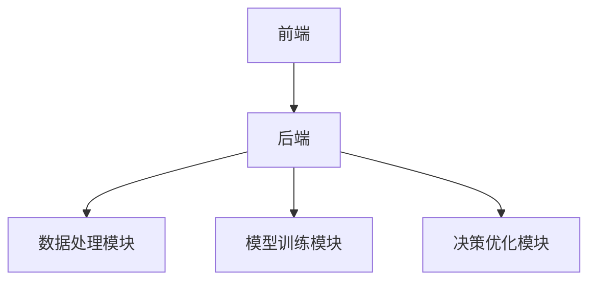
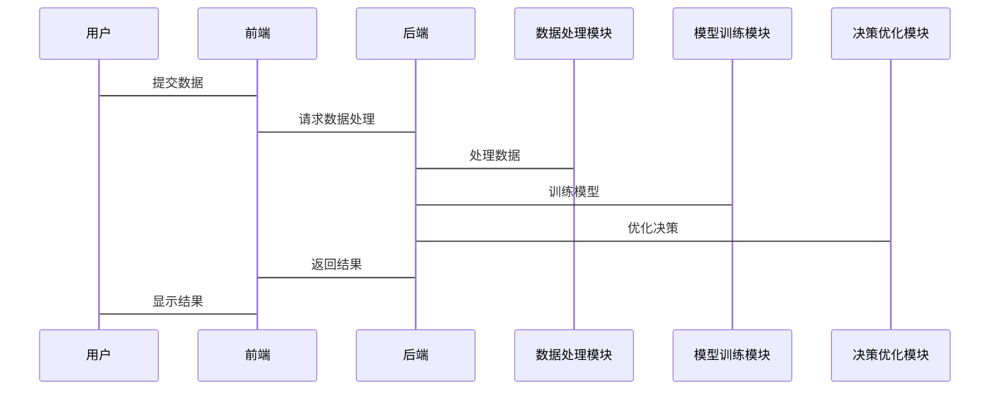

                 


# 基于图卷积网络的AI Agent社交网络分析

> 关键词：图卷积网络、AI Agent、社交网络分析、算法原理、系统架构、项目实战

> 摘要：本文将详细介绍基于图卷积网络的AI Agent在社交网络分析中的应用。从核心概念、算法原理、系统架构到项目实战，系统地阐述如何利用图卷积网络提升AI Agent在社交网络分析中的性能与效果。

---

## 第1章: 社交网络分析与AI Agent概述

### 1.1 社交网络分析的核心概念

#### 1.1.1 社交网络的定义与特点
社交网络是由节点（个体或组织）及其之间的关系构成的图结构。节点代表用户，边代表用户之间的连接或互动。社交网络具有以下特点：
- **节点多样性**：节点可以是个人、组织、地点等。
- **边的权重性**：边可以有权重，表示关系的强度或频率。
- **动态性**：社交网络是动态变化的，用户行为和关系会随时间变化。

#### 1.1.2 AI Agent的基本概念与功能
AI Agent（智能体）是指在计算机系统中，能够感知环境并采取行动以实现目标的实体。AI Agent的核心功能包括：
- **感知环境**：通过传感器或其他数据源获取信息。
- **决策与行动**：基于感知的信息，做出决策并执行行动。
- **学习与适应**：通过机器学习算法不断优化自身的决策能力。

#### 1.1.3 图卷积网络的基本知识
图卷积网络（Graph Convolutional Networks, GCN）是一种专门用于处理图结构数据的深度学习模型。其核心思想是将图的节点特征与其邻居特征进行聚合，生成新的节点表示。

### 1.2 社交网络分析的背景与应用

#### 1.2.1 社交网络分析的背景
在大数据时代，社交网络分析已成为理解社会结构、用户行为和信息传播的重要手段。随着社交媒体的普及，社交网络数据呈现出爆炸式增长，如何高效分析这些数据成为亟待解决的问题。

#### 1.2.2 社交网络分析的主要应用领域
- **社交影响力分析**：识别具有影响力的用户。
- **社群划分**：将用户划分为不同的社群。
- **信息传播预测**：预测信息在社交网络中的传播趋势。
- **异常检测**：发现网络中的异常行为。

#### 1.2.3 AI Agent在社交网络分析中的作用
AI Agent可以作为社交网络分析的工具，帮助用户自动执行以下任务：
- **实时监控**：实时监测社交网络中的信息动态。
- **自动化决策**：基于社交网络数据做出自动化决策。
- **个性化推荐**：为用户提供个性化的内容推荐。

### 1.3 图卷积网络与AI Agent的结合

#### 1.3.1 图卷积网络的基本原理
图卷积网络通过聚合节点及其邻居的特征，生成节点的高层次表示。其核心公式为：
$$ h^{(l+1)} = \text{ReLU}(\theta^{(l)} \cdot (A \cdot h^{(l)}) ) $$
其中，$A$是邻接矩阵，$h^{(l)}$是第$l$层的节点表示。

#### 1.3.2 AI Agent在社交网络分析中的应用场景
- **用户画像构建**：基于社交网络数据构建用户画像。
- **情感分析**：分析用户在社交网络中的情感倾向。
- **社交网络优化**：优化社交网络的结构和功能。

#### 1.3.3 图卷积网络在AI Agent中的应用优势
- **高效性**：图卷积网络能够高效处理大规模图数据。
- **准确性**：通过聚合多层特征，图卷积网络能够捕捉到复杂的网络结构信息。
- **可解释性**：图卷积网络的决策过程相对可解释。

---

## 第2章: 图卷积网络的核心概念与原理

### 2.1 图卷积网络的基本概念

#### 2.1.1 图的表示与图论基础
图由节点和边组成，可以用邻接矩阵或邻接列表表示。邻接矩阵$A$是一个$n \times n$的矩阵，其中$A_{i,j} = 1$表示节点$i$和$j$之间有边相连。

#### 2.1.2 图卷积网络的基本概念与特点
图卷积网络是一种深度学习模型，专门用于处理图结构数据。其特点包括：
- **局部性**：每个节点的特征更新依赖于其邻居节点。
- **全局性**：通过多层传播，图卷积网络能够捕捉到全局的网络结构信息。

#### 2.1.3 图卷积网络的核心组件与功能
图卷积网络的核心组件包括：
- **输入层**：接收节点的初始特征。
- **隐藏层**：通过聚合邻居节点的特征，生成新的节点表示。
- **输出层**：生成最终的节点表示或分类结果。

### 2.2 图卷积网络的数学模型与公式

#### 2.2.1 图的邻接矩阵表示
邻接矩阵$A$可以表示节点之间的连接关系。例如，对于一个包含$n$个节点的图，邻接矩阵$A$是一个$n \times n$的矩阵，其中$A_{i,j} = 1$表示节点$i$和$j$之间有边相连。

#### 2.2.2 图卷积网络的传播规则
图卷积网络的传播规则可以表示为：
$$ h^{(l+1)} = \text{ReLU}(\theta^{(l)} \cdot (A \cdot h^{(l)}) ) $$
其中，$\theta^{(l)}$是第$l$层的参数，$h^{(l)}$是第$l$层的节点表示。

#### 2.2.3 图卷积网络的数学公式推导
图卷积网络的数学公式推导可以通过以下步骤完成：
1. **初始化**：输入层的节点特征$h^{(0)}$。
2. **传播**：通过多层传播，生成新的节点表示。
3. **激活**：使用激活函数（如ReLU）进行非线性变换。

### 2.3 图卷积网络的算法流程

#### 2.3.1 图卷积网络的输入与输出
输入：图的邻接矩阵$A$和初始节点特征$h^{(0)}$。
输出：最终的节点表示$h^{(L)}$。

#### 2.3.2 图卷积网络的前向传播过程
前向传播过程包括以下几个步骤：
1. **邻接矩阵乘法**：$A \cdot h^{(l)}$。
2. **参数乘法**：$\theta^{(l)} \cdot (A \cdot h^{(l)})$。
3. **激活函数**：$\text{ReLU}(\cdot)$。

#### 2.3.3 图卷积网络的训练与优化
图卷积网络的训练过程包括：
1. **损失函数定义**：常用的损失函数包括交叉熵损失和均方误差。
2. **梯度计算**：使用反向传播算法计算梯度。
3. **参数更新**：使用优化算法（如Adam）更新参数。

---

## 第3章: AI Agent的基本原理与功能

### 3.1 AI Agent的定义与分类

#### 3.1.1 AI Agent的定义与特点
AI Agent是一种能够感知环境并采取行动以实现目标的实体。其特点包括：
- **自主性**：能够在没有外部干预的情况下自主运行。
- **反应性**：能够根据环境变化做出实时反应。
- **学习能力**：能够通过学习优化自身的决策能力。

#### 3.1.2 AI Agent的主要分类与应用场景
AI Agent可以根据功能和应用场景分为以下几类：
- **简单反射型AI Agent**：基于预定义规则做出反应。
- **基于模型的反射型AI Agent**：基于环境模型做出决策。
- **目标驱动型AI Agent**：根据目标驱动行为。
- **实用驱动型AI Agent**：根据效用函数做出决策。

#### 3.1.3 AI Agent的核心功能与能力
AI Agent的核心功能包括：
- **感知环境**：通过传感器或其他数据源获取信息。
- **决策与行动**：基于感知的信息，做出决策并执行行动。
- **学习与适应**：通过机器学习算法不断优化自身的决策能力。

### 3.2 AI Agent的决策机制

#### 3.2.1 基于图卷积网络的决策模型
AI Agent可以通过图卷积网络构建决策模型，利用图结构数据进行决策。例如，在社交网络分析中，AI Agent可以基于用户之间的关系网络做出推荐决策。

#### 3.2.2 AI Agent的多目标决策过程
AI Agent可以通过多目标优化算法，在多个目标之间找到平衡点，做出最优决策。

#### 3.2.3 基于图卷积网络的决策优化方法
通过图卷积网络，AI Agent可以聚合多层特征，捕捉复杂的网络结构信息，从而优化决策过程。

### 3.3 AI Agent的交互与学习机制

#### 3.3.1 AI Agent的交互方式与特点
AI Agent可以通过以下方式与环境交互：
- **基于规则的交互**：根据预定义规则进行交互。
- **基于模型的交互**：根据环境模型进行交互。
- **基于学习的交互**：通过学习优化交互策略。

#### 3.3.2 基于图卷积网络的学习机制
AI Agent可以通过图卷积网络进行学习，利用图结构数据的特征进行模型训练和优化。

#### 3.3.3 AI Agent的自适应学习能力
AI Agent可以通过自适应学习算法，根据环境变化动态调整自身的学习策略，提升决策能力。

---

## 第4章: 图卷积网络在社交网络分析中的应用

### 4.1 社交网络分析的核心问题

#### 4.1.1 社交网络的表示与建模
社交网络可以通过图结构数据进行表示，节点代表用户，边代表用户之间的关系。

#### 4.1.2 社交网络中的信息传播
信息传播是社交网络分析中的重要问题，可以通过图卷积网络进行建模和预测。

#### 4.1.3 社交网络中的社群划分
社群划分是将社交网络中的用户划分为不同的社群，可以通过图卷积网络进行优化。

### 4.2 基于图卷积网络的社交网络分析方法

#### 4.2.1 图卷积网络在社交网络中的应用
图卷积网络可以应用于社交网络的用户画像构建、情感分析、信息传播预测等领域。

#### 4.2.2 图卷积网络的社交网络分析流程
1. **数据预处理**：将社交网络数据转换为图结构数据。
2. **模型训练**：使用图卷积网络进行模型训练。
3. **结果分析**：基于模型输出进行结果分析和可视化。

#### 4.2.3 图卷积网络的社交网络分析优势
- **高效性**：图卷积网络能够高效处理大规模图数据。
- **准确性**：通过聚合多层特征，图卷积网络能够捕捉到复杂的网络结构信息。
- **可解释性**：图卷积网络的决策过程相对可解释。

### 4.3 基于AI Agent的社交网络分析系统

#### 4.3.1 AI Agent在社交网络分析中的角色
AI Agent可以在社交网络分析中担任多种角色，如数据收集、信息分析、决策优化等。

#### 4.3.2 基于AI Agent的社交网络分析流程
1. **数据收集**：AI Agent通过传感器或其他数据源获取社交网络数据。
2. **数据分析**：AI Agent利用图卷积网络对数据进行分析和建模。
3. **决策优化**：AI Agent基于分析结果优化决策过程。

#### 4.3.3 AI Agent的社交网络分析优势
- **自动化**：AI Agent能够自动执行数据收集、分析和决策过程。
- **智能化**：AI Agent可以通过学习优化自身的分析和决策能力。
- **实时性**：AI Agent能够实时监控社交网络动态，做出实时反应。

---

## 第5章: 图卷积网络与AI Agent结合的系统架构设计

### 5.1 系统功能设计

#### 5.1.1 系统概述
基于图卷积网络的AI Agent社交网络分析系统是一个能够自动执行社交网络数据分析和决策优化的智能化系统。

#### 5.1.2 系统功能模块
系统功能模块包括：
- **数据收集模块**：负责收集社交网络数据。
- **数据处理模块**：负责对数据进行预处理和特征提取。
- **模型训练模块**：负责训练图卷积网络模型。
- **决策优化模块**：负责基于模型输出优化决策过程。

#### 5.1.3 系统功能流程
1. 数据收集：通过API或其他数据源获取社交网络数据。
2. 数据处理：将数据转换为图结构数据，提取节点和边的特征。
3. 模型训练：使用图卷积网络对数据进行训练，生成节点表示。
4. 决策优化：基于节点表示进行决策优化，输出结果。

### 5.2 系统架构设计

#### 5.2.1 系统架构概述
系统架构包括前端和后端两部分，前端负责用户交互，后端负责数据处理和模型训练。

#### 5.2.2 系统架构图


#### 5.2.3 系统接口设计
系统接口包括：
- 数据接口：用于数据的输入和输出。
- 模型接口：用于模型的训练和推理。
- 决策接口：用于决策结果的输出和展示。

### 5.3 系统交互设计

#### 5.3.1 系统交互流程
1. 用户通过前端界面输入社交网络数据。
2. 数据处理模块对数据进行预处理和特征提取。
3. 模型训练模块训练图卷积网络模型。
4. 决策优化模块基于模型输出优化决策过程。
5. 决策结果通过前端界面展示给用户。

#### 5.3.2 系统交互图


---

## 第6章: 项目实战

### 6.1 项目概述

#### 6.1.1 项目背景
本项目旨在利用图卷积网络和AI Agent技术，构建一个高效的社交网络分析系统。

#### 6.1.2 项目目标
项目的最终目标是实现一个能够自动执行社交网络数据分析和决策优化的智能化系统。

### 6.2 项目核心实现

#### 6.2.1 环境安装
- 安装Python和相关库（如numpy、tensorflow、keras）。
- 安装社交网络数据采集工具（如requests、BeautifulSoup）。

#### 6.2.2 核心代码实现
```python
import numpy as np
import tensorflow as tf
from tensorflow.keras import layers

# 定义图卷积网络模型
class GCN(layers.Model):
    def __init__(self, input_dim, hidden_dim, output_dim):
        super(GCN, self).__init__()
        self.gcn_layer = GCLayer(input_dim, hidden_dim)
        self.fc_layer = layers.Dense(output_dim, activation='relu')
    
    def call(self, inputs):
        x, A = inputs
        x = self.gcn_layer(x, A)
        x = self.fc_layer(x)
        return x

# 图卷积层
class GCLayer(layers.Layer):
    def __init__(self, input_dim, hidden_dim):
        super(GCLayer, self).__init__()
        self.weight = tf.Variable(tf.random.truncated_normal([input_dim, hidden_dim], stddev=0.1))
    
    def call(self, inputs, A):
        x, A = inputs
        x = tf.matmul(x, self.weight)
        x = tf.sparse_tensor_dense_matmul(A, x)
        x = tf.nn.relu(x)
        return x
```

#### 6.2.3 代码解读与分析
- **GCN类**：定义了图卷积网络模型，包含图卷积层和全连接层。
- **GCLayer类**：定义了图卷积层，包含权重矩阵和前向传播过程。
- **前向传播过程**：输入包括节点特征和邻接矩阵，输出最终的节点表示。

### 6.3 项目实战分析

#### 6.3.1 数据采集与预处理
- 从社交媒体平台获取用户数据。
- 对数据进行清洗和预处理，提取节点和边的特征。

#### 6.3.2 模型训练与优化
- 使用预处理后的数据训练图卷积网络模型。
- 通过调整模型参数和优化算法（如Adam）提升模型性能。

#### 6.3.3 实际案例分析
- 以一个具体的社会网络为例，展示模型的训练和推理过程。
- 分析模型输出结果，验证模型的准确性和效果。

### 6.4 项目总结

#### 6.4.1 项目成果
通过本项目，我们成功构建了一个基于图卷积网络的AI Agent社交网络分析系统。

#### 6.4.2 项目经验
- 数据预处理是项目成功的关键。
- 模型调优可以显著提升性能。
- 系统架构设计影响系统的扩展性和维护性。

---

## 第7章: 最佳实践与总结

### 7.1 最佳实践

#### 7.1.1 系统设计
- 系统设计应注重模块化和可扩展性。
- 使用标准接口和协议，方便集成和扩展。

#### 7.1.2 模型优化
- 选择合适的优化算法和参数设置。
- 定期对模型进行再训练和优化。

#### 7.1.3 数据安全
- 确保数据的安全性和隐私性。
- 遵守相关法律法规，保护用户数据。

### 7.2 总结与展望

#### 7.2.1 本文总结
本文详细介绍了基于图卷积网络的AI Agent社交网络分析系统的构建过程，从核心概念到系统架构，再到项目实战，全面阐述了系统的实现和优化过程。

#### 7.2.2 未来展望
未来，随着深度学习和人工智能技术的不断发展，基于图卷积网络的AI Agent社交网络分析系统将具有更广泛的应用前景。我们可以进一步优化模型、扩展系统功能，探索更多的应用场景。

### 7.3 注意事项

#### 7.3.1 系统维护
- 定期检查系统运行状态，及时发现和解决问题。
- 更新系统软件和硬件，确保系统性能和安全性。

#### 7.3.2 数据更新
- 定期更新数据，确保系统的数据 freshness。
- 采用数据增量更新策略，减少数据处理时间。

#### 7.3.3 系统监控
- 实施系统监控，实时掌握系统运行状态。
- 使用监控工具，及时发现和处理系统异常。

### 7.4 拓展阅读

#### 7.4.1 推荐书籍
- 《Deep Learning》
- 《Graph Neural Networks: Theory and Practice》

#### 7.4.2 推荐论文
- "Graph Convolutional Networks for Node Classification"
- "Attention Is All You Need"

#### 7.4.3 推荐工具
- TensorFlow-GNN
- PyTorch Geometric

---

## 附录: 图卷积网络与AI Agent结合的进一步探讨

### 附录A: 图卷积网络的变体

#### A.1 概述
图卷积网络的变体包括：
- **GraphSAGE**：基于采样的图卷积网络。
- **GAT**：基于注意力机制的图卷积网络。
- **GCNII**：改进的图卷积网络。

#### A.2 图卷积网络的变体特点
- **GraphSAGE**：通过采样邻居节点特征，适用于大规模图数据。
- **GAT**：通过注意力机制，捕捉节点之间的长距离依赖。
- **GCNII**：通过改进传播规则，提升模型的性能和可解释性。

### 附录B: AI Agent的多智能体协作

#### B.1 多智能体协作的定义
多智能体协作是指多个智能体协同工作，共同完成一个复杂任务。

#### B.2 多智能体协作的应用
- **游戏AI**：多智能体协作在游戏中进行决策。
- **机器人协作**：多智能体协作完成机器人任务。
- **社交网络分析**：多智能体协作进行社交网络分析。

#### B.3 多智能体协作的优势
- **任务分解**：通过任务分解，提高系统的效率和性能。
- **智能互补**：不同智能体之间互补，提升系统的整体智能。
- **自适应性**：通过协作，系统能够自适应环境变化。

---

## 结语

通过本文的详细讲解，我们深入探讨了基于图卷积网络的AI Agent社交网络分析系统的构建过程。从理论基础到实际应用，从系统设计到项目实战，我们全面阐述了系统的实现和优化过程。未来，随着技术的不断发展，基于图卷积网络的AI Agent社交网络分析系统将具有更广泛的应用前景，为社交网络分析提供更强大的工具和方法。

