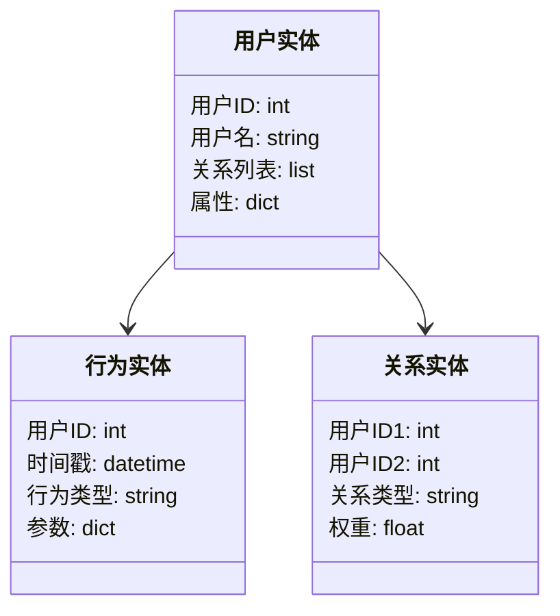
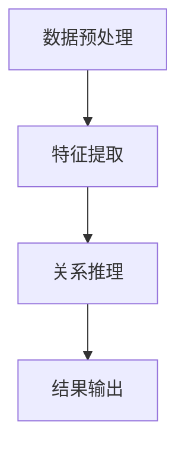
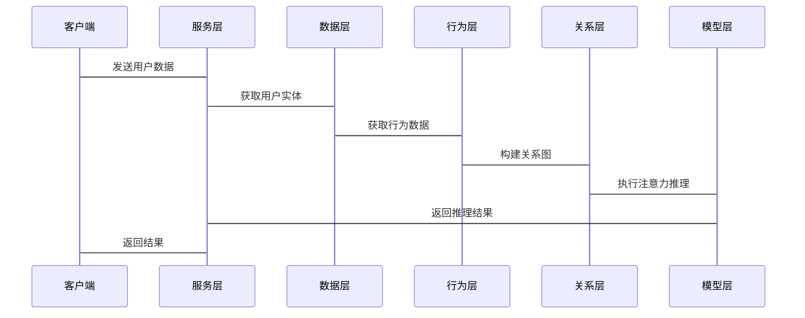

                 

# 第四章: 系统分析与架构设计

## 第4章: 系统分析与架构设计

### 4.1 问题场景

#### 4.1.1 数据结构与输入输出描述

#### 4.1.2 问题描述与约束条件
- **输入数据**：用户实体、行为实体、关系实体。
- **输出**：推理后的用户关系列表。
- **约束**：关系推理的实时性、准确性、可扩展性。

### 4.2 系统功能设计

#### 4.2.1 功能模块划分
1. 数据预处理模块
2. 特征提取模块
3. 关系推理模块
4. 结果输出模块

#### 4.2.2 功能流程与交互

#### 4.2.3 领域模型设计

### 4.3 系统架构设计

#### 4.3.1 架构分层
1. 数据层：数据存储和预处理。
2. 模型层：关系推理模型。
3. 服务层：API接口和服务管理。
4. 接口层：与外部系统的交互。

#### 4.3.2 架构模式与优化

#### 4.3.3 实现方式
- **数据层**：使用数据库存储用户、行为和关系数据。
- **模型层**：基于图注意力网络实现关系推理。
- **服务层**：提供RESTful API接口。
- **接口层**：通过HTTP请求与外部系统交互。

### 4.4 系统接口与交互

#### 4.4.1 API接口设计
1. 获取用户数据：`GET /api/users/{id}`
2. 提取特征：`POST /api/feature/extract`
3. 执行关系推理：`POST /api/relation/inference`
4. 返回结果：`GET /api/result/{task_id}`

#### 4.4.2 系统交互流程

## 第4章 小结
本章详细分析了基于图注意力网络的AI Agent关系推理系统的架构设计，包括问题场景、功能设计、架构分层和系统接口设计。通过Mermaid图表展示了系统的数据结构、功能流程和交互方式，为后续的项目实现提供了理论基础和设计依据。

