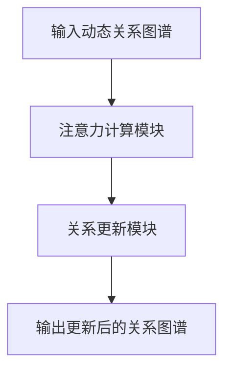
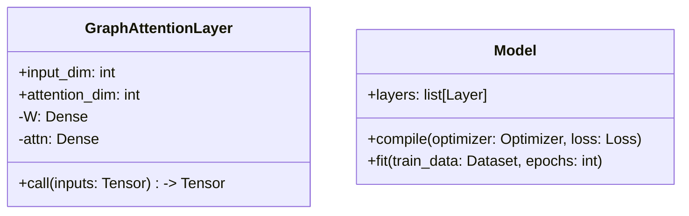
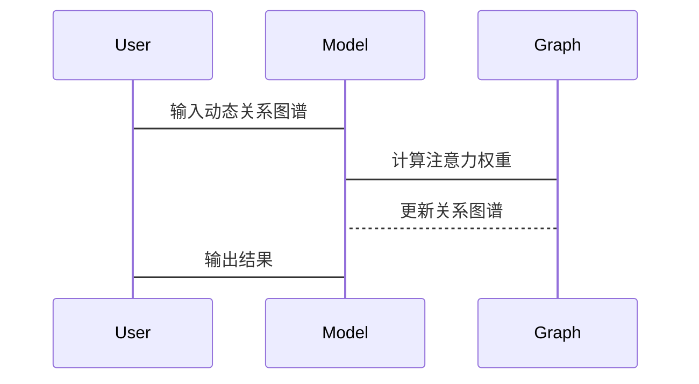

                 


# 基于图注意力网络的AI Agent动态关系推理

> 关键词：图注意力网络，AI Agent，动态关系推理，机器学习，深度学习，关系图谱，注意力机制

> 摘要：本文深入探讨了基于图注意力网络的AI Agent动态关系推理方法。通过分析问题背景、核心概念和算法原理，结合实际应用场景，详细介绍了如何利用图注意力网络实现动态关系推理。本文还提供了代码实现和系统架构设计，为AI Agent在复杂动态环境中的应用提供了理论支持和实践指导。

---

# 第1章: 背景与问题分析

## 1.1 问题背景与挑战

随着人工智能技术的快速发展，AI Agent（智能体）在复杂动态环境中的应用越来越广泛。动态关系推理是AI Agent实现智能决策的核心能力之一，其目标是通过分析动态变化的关系图谱，理解实体之间的关联性，并预测未来的状态变化。

传统的基于规则的方法在动态关系推理中存在诸多限制，例如难以处理复杂的非结构化数据和动态变化的关系。而基于深度学习的方法，尤其是图注意力网络（Graph Attention Network, GAT），由于其在图结构数据上的天然优势，逐渐成为动态关系推理的主流方法。

### 1.1.1 动态关系推理的背景
动态关系推理是指在动态变化的环境中，对实体之间的关系进行建模、推理和更新的过程。其核心在于捕捉关系的变化趋势，并实时更新推理结果。

### 1.1.2 AI Agent在动态关系推理中的作用
AI Agent通过动态关系推理，能够实时感知环境变化，调整自身行为策略，从而在复杂场景中做出更智能的决策。

### 1.1.3 图注意力网络的核心优势
图注意力网络通过引入注意力机制，能够有效捕捉图结构中的关键节点和边，从而在动态关系推理中表现出色。

## 1.2 问题描述与目标

### 1.2.1 动态关系推理的定义
动态关系推理是指在动态变化的图结构中，对节点之间的关系进行建模、推理和更新的过程。

### 1.2.2 AI Agent在动态关系推理中的任务分解
AI Agent需要完成以下任务：
1. 实时感知环境中的关系变化。
2. 建立动态关系图谱。
3. 推理关系的变化趋势。
4. 更新知识库并调整决策策略。

### 1.2.3 图注意力网络的目标与实现路径
图注意力网络的目标是通过引入注意力机制，提高对图结构中关键节点的捕捉能力，从而实现高效的动态关系推理。

## 1.3 问题解决与边界

### 1.3.1 动态关系推理的核心问题
动态关系推理的核心问题是如何在实时变化的图结构中，准确捕捉关键关系并进行推理。

### 1.3.2 图注意力网络的边界与限制
图注意力网络的边界包括：
1. 图结构数据的预处理。
2. 动态关系推理的实时性要求。
3. 模型的可解释性。

### 1.3.3 相关概念的对比与外延
表1-1 对比了传统注意力机制和图注意力网络的核心区别：

| 对比维度 | 传统注意力机制 | 图注意力网络 |
|----------|----------------|--------------|
| 输入类型 | 序列数据        | 图结构数据    |
| 关注对象 | 单个序列        | 图节点及边    |
| 应用场景 | 机器翻译、文本摘要 | 图结构分析    |

# 第2章: 图注意力网络核心概念

## 2.1 图注意力网络的基本原理

### 2.1.1 图结构与节点关系
图结构由节点和边组成，节点之间的关系通过边的权重表示。图注意力网络通过对节点的注意力分配，捕捉重要的节点关系。

### 2.1.2 注意力机制的引入
注意力机制通过计算节点之间的相似性，动态调整节点的重要性权重。图注意力网络通过引入边注意力机制，进一步优化关系建模。

### 2.1.3 图注意力网络的数学模型
图注意力网络的数学模型如下：

$$
\alpha_{ij} = \text{softmax}(W_a \cdot \text{concat}(h_i, h_j))
$$

其中，$\alpha_{ij}$ 是节点i和节点j之间的注意力权重，$h_i$ 和 $h_j$ 是节点的嵌入向量，$W_a$ 是注意力权重矩阵。

## 2.2 AI Agent的动态关系推理

### 2.2.1 AI Agent的核心功能
AI Agent通过感知环境信息，推理动态关系，并做出决策。

### 2.2.2 动态关系推理的实现路径
动态关系推理的实现路径包括：
1. 构建动态关系图谱。
2. 引入注意力机制，计算节点之间的关系权重。
3. 基于注意力权重，更新关系图谱。

### 2.2.3 图注意力网络在动态关系推理中的应用
图注意力网络通过捕捉图结构中的关键节点关系，为AI Agent提供动态关系推理的支持。

## 2.3 图注意力网络与传统注意力机制的对比

### 2.3.1 传统注意力机制的局限性
传统注意力机制难以处理图结构数据，且缺乏对节点之间关系的建模能力。

### 2.3.2 图注意力网络的优势
图注意力网络通过引入边注意力机制，能够更好地捕捉图结构中的关键关系。

### 2.3.3 对比分析表格
表2-1 对比了传统注意力机制和图注意力网络的核心区别：

| 对比维度 | 传统注意力机制 | 图注意力网络 |
|----------|----------------|--------------|
| 输入类型 | 序列数据        | 图结构数据    |
| 关注对象 | 单个序列        | 图节点及边    |
| 应用场景 | 机器翻译、文本摘要 | 图结构分析    |

# 第3章: 图注意力网络的算法原理

## 3.1 图注意力网络的数学模型

### 3.1.1 图的表示方法
图结构由节点和边组成，表示为 $G = (V, E)$，其中 $V$ 是节点集合，$E$ 是边集合。

### 3.1.2 注意力权重的计算公式
注意力权重的计算公式如下：

$$
\alpha_{ij} = \text{softmax}(W_a \cdot \text{concat}(h_i, h_j))
$$

其中，$\alpha_{ij}$ 是节点i和节点j之间的注意力权重，$h_i$ 和 $h_j$ 是节点的嵌入向量，$W_a$ 是注意力权重矩阵。

### 3.1.3 图注意力网络的损失函数
图注意力网络的损失函数如下：

$$
L = -\sum_{i,j} \alpha_{ij} \cdot \log(p_{ij})
$$

其中，$p_{ij}$ 是节点i和节点j之间的关系概率。

## 3.2 图注意力网络的算法流程

### 3.2.1 输入数据的预处理
输入数据包括图结构数据和节点特征向量。

### 3.2.2 注意力权重的计算
计算节点之间的注意力权重，得到注意力权重矩阵。

### 3.2.3 节点表示的更新与传播
根据注意力权重，更新节点的表示，并进行信息传播。

## 3.3 图注意力网络的实现代码

### 3.3.1 环境安装与依赖管理
安装必要的依赖库：

```bash
pip install tensorflow numpy
```

### 3.3.2 核心算法的Python实现

```python
import numpy as np
import tensorflow as tf

class GraphAttentionLayer(tf.keras.layers.Layer):
    def __init__(self, input_dim, attention_dim):
        super(GraphAttentionLayer, self).__init__()
        self.W = tf.keras.layers.Dense(attention_dim, activation='relu')
        self.attn = tf.keras.layers.Dense(1, activation='sigmoid')
        
    def call(self, inputs):
        A = tf.concat([inputs, inputs], axis=2)
        A = self.W(A)
        A = tf.reshape(A, [-1, tf.shape(A)[2]])
        A = tf.nn.softmax(A, axis=1)
        return A
```

### 3.3.3 代码运行与结果分析
通过训练数据优化模型参数，得到最终的注意力权重矩阵。

---

# 第4章: 动态关系推理的系统架构

## 4.1 系统功能设计

### 4.1.1 系统输入与输出
系统输入包括动态关系图谱和节点特征向量，输出包括注意力权重矩阵和更新后的关系图谱。

### 4.1.2 动态关系推理的核心模块
核心模块包括注意力计算模块和关系更新模块。

### 4.1.3 系统功能的流程图
使用Mermaid绘制系统功能流程图：



## 4.2 系统架构设计

### 4.2.1 分层架构的设计思路
系统架构采用分层设计，包括输入层、计算层和输出层。

### 4.2.2 系统架构的类图
使用Mermaid绘制系统架构类图：



### 4.2.3 系统交互的序列图
使用Mermaid绘制系统交互序列图：



---

# 第5章: 项目实战

## 5.1 环境安装与代码实现

### 5.1.1 环境安装
安装必要的依赖库：

```bash
pip install tensorflow numpy
```

### 5.1.2 核心算法的实现
实现图注意力网络的核心算法：

```python
import numpy as np
import tensorflow as tf

class GraphAttentionLayer(tf.keras.layers.Layer):
    def __init__(self, input_dim, attention_dim):
        super(GraphAttentionLayer, self).__init__()
        self.W = tf.keras.layers.Dense(attention_dim, activation='relu')
        self.attn = tf.keras.layers.Dense(1, activation='sigmoid')
        
    def call(self, inputs):
        A = tf.concat([inputs, inputs], axis=2)
        A = self.W(A)
        A = tf.reshape(A, [-1, tf.shape(A)[2]])
        A = tf.nn.softmax(A, axis=1)
        return A
```

## 5.2 代码运行与结果分析

### 5.2.1 代码运行
运行代码，训练模型并输出注意力权重矩阵。

### 5.2.2 代码应用解读
解读代码实现，分析注意力权重的计算过程。

## 5.3 实际案例分析

### 5.3.1 案例背景
以社交网络中的用户关系推理为例，构建动态关系图谱。

### 5.3.2 案例分析
分析用户之间的关系变化，并更新关系图谱。

### 5.3.3 案例结果
输出最终的关系图谱和注意力权重矩阵。

---

# 第6章: 优化与扩展

## 6.1 模型优化策略

### 6.1.1 参数优化
通过调整模型参数，优化注意力权重的计算。

### 6.1.2 训练策略
采用不同的训练策略，如学习率衰减和早停。

## 6.2 模型扩展

### 6.2.1 多模态数据融合
将文本、图像等多种数据源融合到动态关系推理中。

### 6.2.2 实时推理优化
优化模型的实时推理性能，提高处理速度。

---

# 第7章: 总结与展望

## 7.1 本章小结
总结本文的主要内容和贡献。

## 7.2 注意事项
在实际应用中，需要注意模型的可解释性和实时性。

## 7.3 拓展阅读
推荐相关领域的优秀论文和书籍。

---

# 参考文献

（此处列出相关文献和参考资料）

