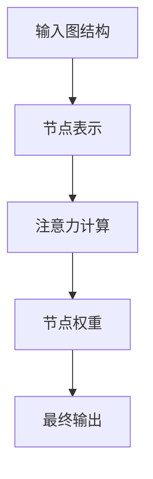
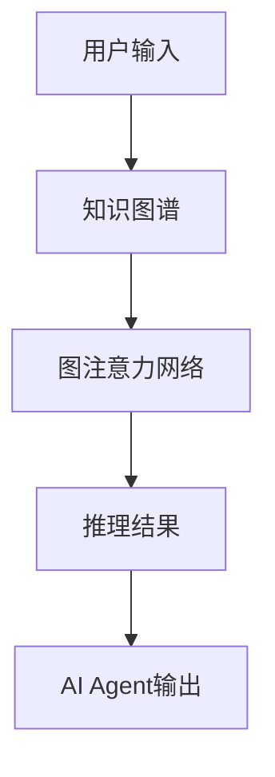

                 

# 《基于图注意力网络的AI Agent知识推理》

> 关键词：图注意力网络、AI Agent、知识推理、知识图谱、深度学习

> 摘要：本文详细探讨了基于图注意力网络的AI Agent知识推理方法，分析了其在智能系统中的应用，结合实际案例，深入讲解了算法原理、系统架构设计及实现方案。

---

# 第1章: 问题背景与描述

## 1.1 问题背景
- 1.1.1 知识推理的定义与重要性
- 1.1.2 图注意力网络的提出背景
- 1.1.3 AI Agent在智能系统中的角色

## 1.2 问题描述
- 1.2.1 知识推理的基本问题
- 1.2.2 图注意力网络在知识推理中的应用
- 1.2.3 AI Agent的知识推理需求

## 1.3 解决方法与边界
- 1.3.1 基于图的推理方法
- 1.3.2 注意力机制的作用
- 1.3.3 AI Agent的知识表示与推理

---

# 第2章: 图注意力网络原理

## 2.1 图注意力网络的原理
- 2.1.1 图的表示方法
- 2.1.2 注意力机制的引入
- 2.1.3 图注意力网络的数学模型

## 2.2 图注意力网络与传统图模型对比
- 2.2.1 传统图模型的优缺点
- 2.2.2 图注意力网络的优势
- 2.2.3 对比分析表格

---

# 第3章: 知识图谱与AI Agent

## 3.1 知识图谱的构建
- 3.1.1 知识抽取与表示
- 3.1.2 知识图谱的构建方法
- 3.1.3 知识图谱的存储与管理

## 3.2 AI Agent的知识推理
- 3.2.1 知识图谱中的路径推理
- 3.2.2 基于图注意力网络的推理方法
- 3.2.3 AI Agent推理的流程

---

# 第4章: 核心概念与结构

## 4.1 图注意力网络的组成
- 4.1.1 节点表示方法
- 4.1.2 注意力机制的实现
- 4.1.3 图注意力网络的训练过程

## 4.2 知识图谱的构建流程
- 4.2.1 数据收集与清洗
- 4.2.2 知识抽取与规则建立
- 4.2.3 图谱存储与管理

---

# 第5章: 算法原理与实现

## 5.1 图注意力网络算法流程

## 5.2 数学模型与公式
- 5.2.1 注意力机制的数学表达式
$$
\text{Attention}(i,j) = \frac{e^{q_i^T k_j}}{\sum_{k} e^{q_i^T k_j}}
$$

- 5.2.2 知识推理的损失函数
$$
L = -\sum_{i=1}^{n} y_i \log p(y_i) + (1-y_i)\log(1-p(y_i))
$$

## 5.3 算法实现与代码
- 5.3.1 环境安装
- 5.3.2 核心代码实现
- 5.3.3 代码解读与分析

---

# 第6章: 系统分析与架构设计

## 6.1 问题场景介绍
- 6.1.1 知识推理的应用场景
- 6.1.2 图注意力网络的适用场景

## 6.2 系统功能设计
- 6.2.1 知识图谱构建模块
- 6.2.2 图注意力网络推理模块
- 6.2.3 AI Agent交互模块

## 6.3 系统架构设计

---

# 第7章: 项目实战

## 7.1 环境安装
- 7.1.1 Python环境配置
- 7.1.2 相关库的安装（如TensorFlow、PyTorch）

## 7.2 核心代码实现
- 7.2.1 知识图谱构建代码
- 7.2.2 图注意力网络实现代码
- 7.2.3 AI Agent交互代码

## 7.3 案例分析
- 7.3.1 案例背景介绍
- 7.3.2 数据准备与模型训练
- 7.3.3 实验结果与分析

---

# 第8章: 最佳实践与总结

## 8.1 最佳实践
- 8.1.1 知识图谱构建的注意事项
- 8.1.2 图注意力网络的调参技巧
- 8.1.3 AI Agent交互的优化方法

## 8.2 小结
- 8.2.1 核心内容回顾
- 8.2.2 未来研究方向
- 8.2.3 实际应用中的挑战与解决方案

---

# 附录

## 附录A: 相关数学公式汇总
- 图注意力网络的关键公式
- 知识推理的损失函数

## 附录B: 项目代码完整实现
- 知识图谱构建代码
- 图注意力网络实现代码
- AI Agent交互代码

---

这个目录大纲涵盖了基于图注意力网络的AI Agent知识推理的各个方面，从背景介绍到算法实现，再到项目实战和总结，内容详实且结构清晰，适合技术博客文章的撰写。

