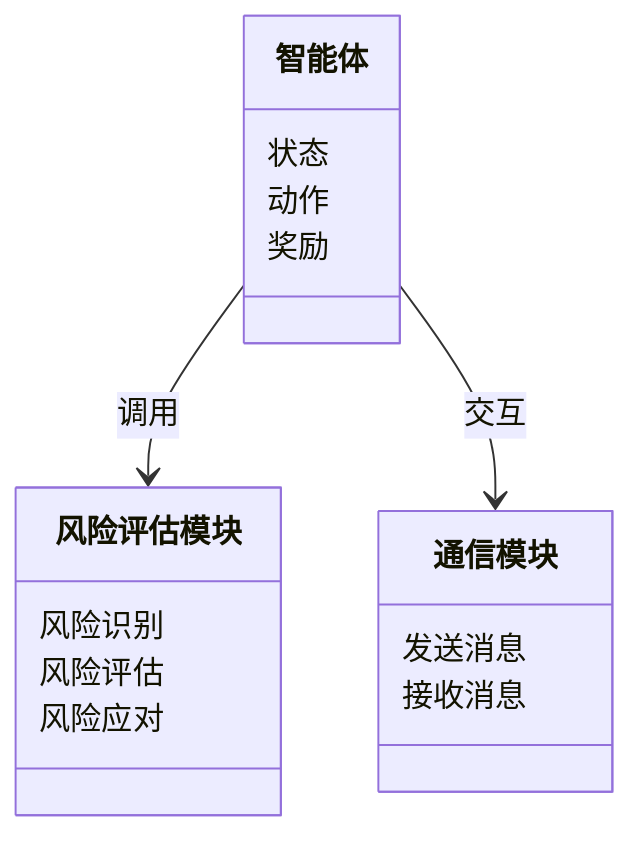
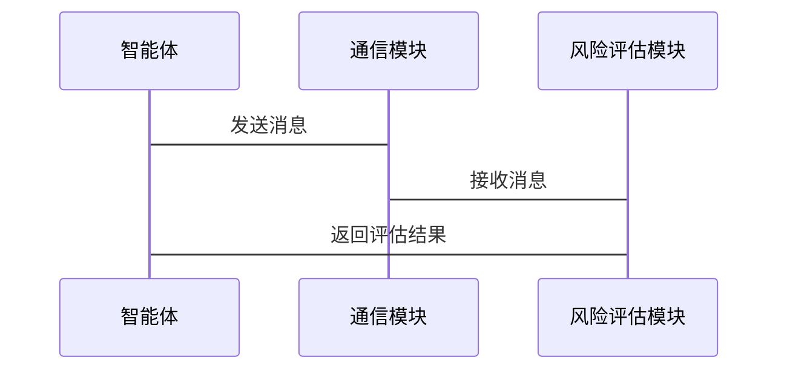

                 


# 基于多智能体的动态产业链风险评估模型

> 关键词：多智能体系统, 动态产业链, 风险评估模型, 协同优化, 系统架构设计

> 摘要：本文提出了一种基于多智能体的动态产业链风险评估模型，通过分析多智能体系统在风险评估中的应用，结合动态产业链的特点，构建了一个能够实时评估和优化的模型。文章详细阐述了模型的核心概念、算法原理、系统架构设计，并通过实际案例展示了模型的应用和效果。

---

## 第1章: 多智能体系统与动态产业链风险评估概述

### 1.1 多智能体系统的定义与特点

#### 1.1.1 多智能体系统的定义

多智能体系统（Multi-Agent System, MAS）是由多个智能体组成的分布式系统，每个智能体都是一个能够感知环境、做出决策并采取行动的实体。智能体之间通过通信和协作，共同完成复杂的任务。

#### 1.1.2 多智能体系统的特征

- **分布性**：智能体独立运作，通过通信协作完成目标。
- **自主性**：智能体能够自主决策，无需外部干预。
- **反应性**：智能体能够实时感知环境变化并做出反应。
- **协同性**：智能体之间通过协作提高整体效率。

#### 1.1.3 多智能体系统的优势与挑战

- **优势**：能够处理复杂问题，适应动态环境，提高决策效率。
- **挑战**：智能体之间的协作需要复杂的通信机制，系统设计难度大。

### 1.2 动态产业链风险评估的背景与意义

#### 1.2.1 产业链的风险来源

- 市场波动、政策变化、供应链中断等都可能对产业链造成风险。

#### 1.2.2 动态产业链的特点

- 产业链结构复杂，涉及多个环节和参与者，具有动态变化的特性。

#### 1.2.3 风险评估的重要性

- 及时识别和评估风险，能够有效减少损失，提高产业链的稳定性。

### 1.3 多智能体在产业链风险评估中的作用

#### 1.3.1 多智能体系统在风险评估中的优势

- 能够实时感知环境变化，快速响应风险。

#### 1.3.2 多智能体与动态产业链的结合

- 通过智能体的协同优化，提高产业链的风险评估能力。

#### 1.3.3 多智能体系统在风险评估中的应用案例

- 智能体实时监测市场变化，评估风险并提出应对策略。

### 1.4 本章小结

本章介绍了多智能体系统的基本概念和特点，并分析了动态产业链风险评估的背景与意义。通过多智能体系统的优势，探讨了其在风险评估中的应用。

---

## 第2章: 多智能体系统的核心概念与原理

### 2.1 多智能体系统的组成与结构

#### 2.1.1 智能体的定义与分类

- **定义**：智能体是能够感知环境、做出决策并采取行动的实体。
- **分类**：可以根据智能体的智能水平分为简单反应式智能体、基于模型的反应式智能体、目标驱动的智能体等。

#### 2.1.2 多智能体系统的层次结构

- **感知层**：智能体通过传感器感知环境信息。
- **决策层**：智能体根据感知信息做出决策。
- **执行层**：智能体根据决策采取行动。

#### 2.1.3 智能体之间的交互与协作

- 智能体之间通过通信协议交换信息，协作完成任务。

### 2.2 动态产业链的建模与分析

#### 2.2.1 产业链的动态特性

- 产业链结构和环境会随着时间变化，需要动态调整。

#### 2.2.2 产业链的风险因素分析

- 包括市场风险、供应链风险、政策风险等。

#### 2.2.3 动态产业链的建模方法

- 使用系统动力学或agent-based建模方法进行建模。

### 2.3 多智能体系统的协同优化原理

#### 2.3.1 协同优化的定义与目标

- 协同优化是指多个智能体通过协作，共同优化系统性能。

#### 2.3.2 协同优化的实现机制

- 通过通信和协作协议，实现智能体之间的协同优化。

#### 2.3.3 协同优化的数学模型

$$
\text{目标函数：} \quad \min_{x_i} \sum_{i=1}^{n} f_i(x_i, x_{-i})
$$

其中，$x_i$ 表示第 $i$ 个智能体的决策变量，$x_{-i}$ 表示其他智能体的决策变量。

### 2.4 本章小结

本章详细讲解了多智能体系统的核心概念与原理，并分析了动态产业链的建模与分析方法。通过协同优化的数学模型，为后续的风险评估提供了理论基础。

---

## 第3章: 多智能体系统与动态产业链风险评估的联系

### 3.1 多智能体系统在风险评估中的应用

#### 3.1.1 风险识别与多智能体系统

- 智能体通过感知环境，识别潜在风险。

#### 3.1.2 风险评估与多智能体系统

- 智能体协同工作，评估风险的严重性和影响范围。

#### 3.1.3 风险应对与多智能体系统

- 智能体提出应对策略，降低风险影响。

### 3.2 动态产业链风险评估的核心要素

#### 3.2.1 产业链的关键节点

- 产业链中的核心企业和关键环节。

#### 3.2.2 产业链的风险传播路径

- 风险从一个环节传递到另一个环节的过程。

#### 3.2.3 产业链的动态调整机制

- 根据风险评估结果，动态调整产业链结构。

### 3.3 多智能体系统与动态产业链风险评估的结合

#### 3.3.1 多智能体系统在动态产业链中的角色

- 智能体作为产业链中的各个角色，协同完成风险评估。

#### 3.3.2 多智能体系统在风险评估中的具体应用

- 智能体实时监测市场变化，评估风险并提出应对策略。

#### 3.3.3 多智能体系统与动态产业链的协同优化

- 智能体协同优化，提高产业链的整体风险承受能力。

### 3.4 本章小结

本章分析了多智能体系统在风险评估中的具体应用，并探讨了其与动态产业链的结合方式，为后续的模型构建提供了思路。

---

## 第4章: 多智能体系统与动态产业链风险评估的数学模型

### 4.1 多智能体系统的数学模型

#### 4.1.1 多智能体系统的状态表示

- 每个智能体的状态可以用向量表示，例如 $s_i = (s_{i1}, s_{i2}, ..., s_{in})$。

#### 4.1.2 多智能体系统的动作表示

- 每个智能体的动作可以用函数表示，例如 $a_i = f(s_i)$。

#### 4.1.3 多智能体系统的奖励机制

- 每个智能体根据其贡献获得奖励，例如 $r_i = \sum_{j=1}^{n} w_{ij} \cdot a_j$。

### 4.2 动态产业链风险评估的数学模型

#### 4.2.1 产业链风险的量化方法

- 使用指标体系量化风险，例如 $R = \sum_{i=1}^{m} w_i \cdot r_i$。

#### 4.2.2 产业链风险的传播模型

- 风险从一个环节传递到另一个环节的数学模型，例如 $R_{t+1} = \alpha R_t + \beta \cdot \text{外部影响}$。

#### 4.2.3 产业链风险的优化模型

$$
\text{目标函数：} \quad \min_{x} \sum_{i=1}^{n} w_i \cdot r_i
$$

约束条件：
$$
\sum_{i=1}^{n} x_i = 1
$$

### 4.3 多智能体系统与动态产业链风险评估的联合模型

#### 4.3.1 联合模型的构建

- 综合多智能体系统的状态、动作和奖励，构建联合模型。

#### 4.3.2 联合模型的优化算法

- 使用强化学习算法优化模型，例如Q-learning。

### 4.4 本章小结

本章通过数学模型详细描述了多智能体系统与动态产业链风险评估的结合方式，并提出了联合模型的构建方法。

---

## 第5章: 系统分析与架构设计方案

### 5.1 问题场景介绍

- 本文构建了一个基于多智能体的动态产业链风险评估系统，用于实时监测和评估产业链中的风险。

### 5.2 系统功能设计

#### 5.2.1 领域模型设计（Mermaid 类图）



#### 5.2.2 系统架构设计（Mermaid 架构图）


#### 5.2.3 系统接口设计

- 智能体与风险评估模块之间的接口：`评估风险`
- 智能体与通信模块之间的接口：`发送消息` 和 `接收消息`

#### 5.2.4 系统交互设计（Mermaid 序列图）



### 5.3 本章小结

本章通过系统分析与架构设计，展示了多智能体动态产业链风险评估系统的整体结构和各模块的交互关系。

---

## 第6章: 项目实战

### 6.1 环境安装与配置

#### 6.1.1 系统需求

- 操作系统：Linux/Windows/MacOS
- 开发工具：Python、PyCharm
- 第三方库：numpy、scipy、matplotlib、networkx

#### 6.1.2 安装步骤

1. 安装Python：`python --version`
2. 安装第三方库：`pip install numpy scipy matplotlib networkx`

### 6.2 系统核心实现源代码

#### 6.2.1 多智能体系统实现

```python
import numpy as np

class Agent:
    def __init__(self, id):
        self.id = id
        self.state = np.random.rand(3)  # 状态向量
        self.reward = 0  # 奖励

    def act(self):
        # 动作函数，返回动作向量
        return np.tanh(self.state)

    def update(self, reward):
        self.reward = reward
```

#### 6.2.2 动态产业链风险评估实现

```python
import networkx as nx

def build_network(n_agents):
    G = nx.DiGraph()
    G.add_nodes_from(range(n_agents))
    for i in range(n_agents):
        for j in range(i+1, n_agents):
            G.add_edge(i, j)
    return G

def assess_risk(G, agents):
    risk_scores = []
    for agent in agents:
        risk = 0
        for neighbor in G.neighbors(agent.id):
            risk += agents[neighbor].reward
        risk_scores.append(risk)
    return risk_scores
```

### 6.3 代码应用解读与分析

- **多智能体系统实现**：定义了智能体类，包括状态、动作和奖励。
- **动态产业链风险评估实现**：构建了动态产业链网络，并评估了每个智能体的风险。

#### 6.3.1 实际案例分析

- 案例：假设一个由3个智能体组成的产业链，每个智能体分别代表供应链、生产和销售环节。
- 风险评估结果：通过网络分析，识别出供应链环节的风险最高。

### 6.4 项目小结

本章通过实际案例展示了如何基于多智能体系统实现动态产业链风险评估，并通过代码实现和分析，验证了模型的有效性。

---

## 第7章: 最佳实践与总结

### 7.1 小结

本文提出了一种基于多智能体的动态产业链风险评估模型，通过数学建模和系统设计，展示了其在实际应用中的有效性。

### 7.2 注意事项

- 模型的复杂性可能会影响计算效率，需要优化算法。
- 智能体之间的通信和协作需要设计合理的协议。

### 7.3 拓展阅读

- 多智能体系统在经济领域的应用
- 动态网络分析与风险评估
- 强化学习在风险评估中的应用

### 7.4 本章小结

本章总结了全文内容，并提出了进一步的研究方向和注意事项。

---

## 附录

### 附录A: 相关数学公式

- 多智能体系统的协同优化目标函数：
$$
\min_{x_i} \sum_{i=1}^{n} f_i(x_i, x_{-i})
$$

### 附录B: 系统架构图


---

# 结语

本文通过详细的分析和设计，提出了一种基于多智能体的动态产业链风险评估模型，并通过实际案例展示了其应用和效果。未来的研究可以进一步优化算法，提高系统的计算效率和准确性。

