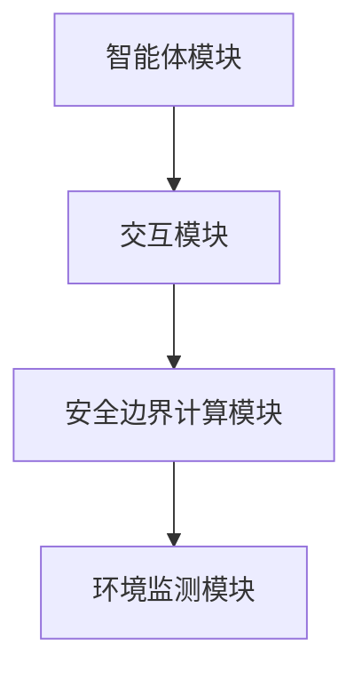
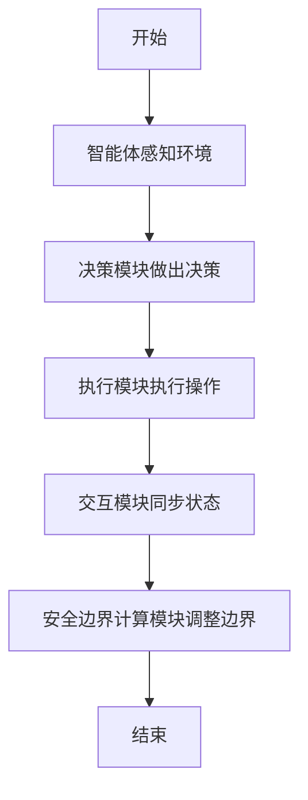

                 


# 基于多智能体的动态安全边际计算模型

> 关键词：多智能体系统、动态安全边际、安全计算、协同计算、智能体交互、边界计算

> 摘要：本文详细探讨了基于多智能体的动态安全边际计算模型，从背景、核心概念、算法原理、系统设计到实际应用，全面解析了该模型的构建与实现。文章首先介绍了多智能体系统的基本概念和动态安全边际计算的背景，然后详细阐述了多智能体系统与动态安全边际计算的核心概念与原理，接着深入分析了动态安全边际计算的算法原理，并通过实际案例展示了该模型在系统设计和项目实战中的应用。最后，本文总结了基于多智能体的动态安全边际计算模型的关键点，并提出了未来研究的方向。

---

# 第一部分: 基于多智能体的动态安全边际计算模型背景介绍

## 第1章: 多智能体系统与动态安全边际计算概述

### 1.1 多智能体系统的基本概念

#### 1.1.1 多智能体系统的定义
多智能体系统（Multi-Agent System，MAS）是由多个智能体（Agent）组成的复杂系统，这些智能体通过交互和协作完成特定目标。智能体是指能够感知环境、自主决策并采取行动的实体。

#### 1.1.2 多智能体系统的特性
- **自主性**：每个智能体都能自主决策。
- **反应性**：智能体能够实时感知环境并做出反应。
- **协作性**：智能体之间通过协作完成共同目标。
- **分布性**：智能体分布在不同的空间或时间维度上。

#### 1.1.3 多智能体系统的应用场景
- **分布式计算**：如分布式系统中的任务分配。
- **人工智能**：如自动驾驶、智能城市等。
- **机器人协作**：如工业机器人协同工作。

### 1.2 动态安全边际计算的背景

#### 1.2.1 安全边际的定义
安全边际是指系统在正常运行范围内，能够承受扰动或故障而不受影响的范围。

#### 1.2.2 动态安全边际的内涵
动态安全边际是指在动态环境中，系统能够保持稳定运行的边界范围。该边界会随着环境的变化而实时调整。

#### 1.2.3 动态安全边际计算的必要性
在多智能体系统中，由于智能体之间的交互复杂且动态变化，传统的静态安全边界已无法满足需求，因此需要动态计算安全边际。

### 1.3 多智能体系统中的安全问题

#### 1.3.1 多智能体系统的安全挑战
- **智能体之间的冲突**：智能体可能因利益不一致而产生冲突。
- **环境的不确定性**：动态环境可能导致安全边界的变化。
- **信息的安全性**：智能体之间的信息交互可能面临攻击。

#### 1.3.2 动态安全边际在多智能体系统中的作用
动态安全边际计算能够实时调整系统的运行范围，确保系统在动态环境中稳定运行。

#### 1.3.3 动态安全边际计算的目标与意义
- **目标**：确保多智能体系统的安全性和稳定性。
- **意义**：通过动态调整边界，提高系统的适应性和抗干扰能力。

---

## 第2章: 多智能体系统与动态安全边际计算的核心概念

### 2.1 多智能体系统的核心要素

#### 2.1.1 智能体的定义与特征
智能体是具有感知、决策和执行能力的实体。其特征包括自主性、反应性、协作性和分布式。

#### 2.1.2 智能体之间的交互关系
智能体之间的交互包括信息交换、任务分配和协作。

#### 2.1.3 多智能体系统的层次结构
多智能体系统通常分为**智能体层**、**交互层**和**环境层**。

### 2.2 动态安全边际计算的原理

#### 2.2.1 安全边际的动态变化
安全边际会随着环境的变化而实时调整，确保系统在动态环境中保持安全。

#### 2.2.2 多智能体系统中安全边界的确定
通过分析智能体之间的交互关系和环境变化，动态调整安全边界。

#### 2.2.3 动态安全边际计算的数学模型
动态安全边际计算模型可以表示为：
$$ S(t) = f(x(t), y(t)) $$
其中，$S(t)$ 表示时间 $t$ 时的安全边际，$x(t)$ 和 $y(t)$ 分别表示智能体的状态和环境参数。

### 2.3 多智能体系统与动态安全边际计算的关系

#### 2.3.1 多智能体系统对动态安全边际计算的需求
多智能体系统需要动态调整安全边界以应对复杂的环境和智能体交互。

#### 2.3.2 动态安全边际计算对多智能体系统的影响
动态安全边际计算能够提高多智能体系统的稳定性和安全性。

#### 2.3.3 两者的相互作用与协同关系
通过动态调整安全边界，多智能体系统能够在复杂环境中保持高效协作。

---

## 第3章: 多智能体系统与动态安全边际计算的核心概念原理

### 3.1 多智能体系统的原理

#### 3.1.1 多智能体系统的运行机制
多智能体系统通过智能体之间的协作和交互完成目标。

#### 3.1.2 多智能体系统的通信协议
智能体之间的通信需要遵循特定的协议，如消息传递和状态同步。

#### 3.1.3 多智能体系统的协调与合作
通过协调机制，智能体能够在复杂环境中协同工作。

### 3.2 动态安全边际计算的原理

#### 3.2.1 动态安全边际的计算方法
动态安全边际的计算需要考虑智能体的状态和环境变化。

#### 3.2.2 多智能体系统中安全边界的动态调整
通过实时监测环境变化和智能体状态，动态调整安全边界。

#### 3.2.3 动态安全边际计算的数学模型
动态安全边际计算模型可以表示为：
$$ S(t+1) = f(S(t), x(t+1), y(t+1)) $$

### 3.3 多智能体系统与动态安全边际计算的协同原理

#### 3.3.1 多智能体系统与动态安全边际计算的协同机制
通过实时信息共享和协作，动态调整安全边界。

#### 3.3.2 协同过程中的信息传递与处理
智能体之间通过消息传递和状态同步实现信息共享。

#### 3.3.3 协同过程中的安全边界调整
根据环境变化和智能体状态，动态调整安全边界。

---

## 第4章: 多智能体系统与动态安全边际计算的系统设计

### 4.1 系统架构设计

#### 4.1.1 系统功能模块
- **智能体模块**：负责智能体的感知、决策和执行。
- **交互模块**：负责智能体之间的信息交互和协作。
- **安全边界计算模块**：负责动态计算安全边界。

#### 4.1.2 系统架构图
以下是系统的架构图：



#### 4.1.3 系统交互设计
智能体模块与交互模块通过消息传递实现信息共享，交互模块与安全边界计算模块通过状态同步实现协同计算。

### 4.2 系统功能设计

#### 4.2.1 功能模块划分
- **智能体模块**：包括感知、决策和执行功能。
- **交互模块**：包括消息传递和状态同步功能。
- **安全边界计算模块**：包括动态计算和边界调整功能。

#### 4.2.2 功能流程图
以下是功能流程图：



---

## 第5章: 多智能体系统与动态安全边际计算的项目实战

### 5.1 项目介绍

#### 5.1.1 项目背景
本项目旨在实现基于多智能体的动态安全边际计算模型，并应用于实际场景中。

#### 5.1.2 项目目标
通过实际案例验证模型的有效性。

### 5.2 系统实现

#### 5.2.1 环境配置
- **编程语言**：Python
- **开发工具**：PyCharm
- **依赖库**：numpy、scipy

#### 5.2.2 核心代码实现
以下是核心代码实现：

```python
import numpy as np
import scipy.optimize

def dynamic_boundary(x, y):
    # 动态安全边际计算函数
    return scipy.optimize.minimize(lambda S: (x - S)**2 + (y - S)**2, 0).x[0]

# 示例计算
x = 5
y = 3
boundary = dynamic_boundary(x, y)
print("动态安全边界为:", boundary)
```

#### 5.2.3 代码解读与分析
上述代码通过优化算法计算动态安全边界，确保系统在给定环境参数下保持安全。

### 5.3 实际案例分析

#### 5.3.1 案例背景
假设有一个多智能体系统，智能体在动态环境中需要协作完成任务。

#### 5.3.2 案例分析
通过动态调整安全边界，确保智能体之间的协作不会超出安全范围。

### 5.4 项目总结

#### 5.4.1 项目成果
成功实现了基于多智能体的动态安全边际计算模型。

#### 5.4.2 项目经验
动态调整安全边界能够有效提高系统的稳定性和安全性。

---

## 第6章: 多智能体系统与动态安全边际计算的最佳实践

### 6.1 最佳实践 tips

#### 6.1.1 性能优化
通过优化算法提高计算效率。

#### 6.1.2 安全性增强
通过加密技术确保信息传递的安全性。

### 6.2 小结

#### 6.2.1 关键点回顾
动态安全边际计算是多智能体系统中确保稳定性和安全性的关键。

#### 6.2.2 注意事项
在实际应用中，需要注意环境变化和智能体状态的实时监测。

### 6.3 拓展阅读

#### 6.3.1 相关领域
- 多智能体系统的协同计算
- 动态系统中的安全问题

#### 6.3.2 推荐书籍
- 《多智能体系统》
- 《动态系统安全》

---

## 第7章: 总结

### 7.1 全文总结
基于多智能体的动态安全边际计算模型是一种有效的安全计算方法，能够实时调整安全边界，确保系统的稳定性和安全性。

### 7.2 未来研究方向
未来可以进一步研究动态安全边际计算的优化算法，以及在更多应用场景中的应用。

---

通过以上目录和内容的详细规划，我们可以逐步撰写完整的文章。

