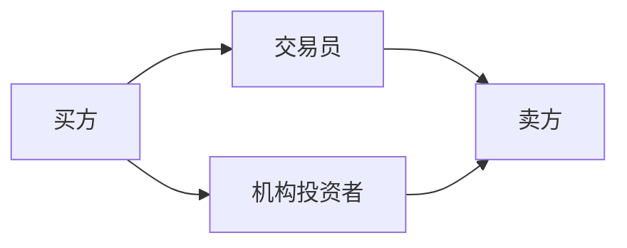
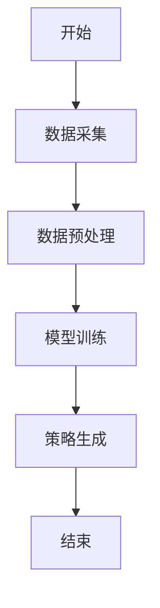
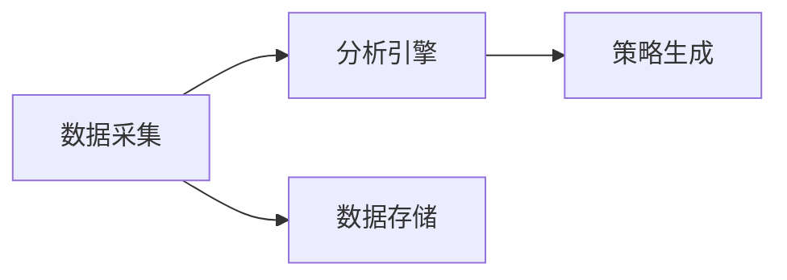

                 


# 基于多智能体的动态市场微观结构分析在价值投资中的应用

## 关键词：多智能体系统, 动态市场微观结构, 价值投资, 交易策略, 金融市场分析

## 摘要：本文深入探讨了多智能体系统在动态市场微观结构分析中的应用，特别是其在价值投资中的潜力。通过分析市场参与者的行为、构建数学模型、设计算法和系统架构，本文展示了如何利用多智能体技术来优化投资决策，并提出了具体的实现方法和实际案例。

---

## 第1章: 多智能体系统与动态市场微观结构概述

### 1.1 多智能体系统的基本概念

#### 1.1.1 多智能体系统的定义与特点
多智能体系统（Multi-Agent System, MAS）是由多个智能体组成的分布式系统，这些智能体能够通过交互和协作完成复杂任务。其特点包括自主性、反应性、社会性和分布性。多智能体系统在金融领域的应用广泛，例如在算法交易、风险管理等领域。

#### 1.1.2 多智能体系统的核心要素
多智能体系统的核心要素包括：
1. **智能体**：具有感知环境和自主决策的能力。
2. **通信机制**：智能体之间通过通信进行信息交换。
3. **协作协议**：定义智能体之间的协作规则。
4. **环境模型**：描述智能体所处的环境。

#### 1.1.3 多智能体系统在金融领域的应用前景
多智能体系统在金融领域的应用前景广阔，尤其是在动态市场分析、风险管理和智能投资领域。通过模拟市场参与者的复杂行为，多智能体系统能够提供更精准的市场预测和投资策略。

---

### 1.2 动态市场微观结构分析

#### 1.2.1 市场微观结构的基本概念
市场微观结构研究市场的交易机制、参与者行为和价格形成过程。动态市场微观结构分析关注市场的实时变化，例如订单簿、交易量和价格波动。

#### 1.2.2 动态市场微观结构的特征
动态市场微观结构的特征包括：
1. **实时性**：市场状态不断变化，需要实时分析。
2. **复杂性**：市场参与者众多，行为多样。
3. **动态性**：市场环境随时间变化。

#### 1.2.3 动态市场微观结构分析的必要性
动态市场微观结构分析的必要性在于帮助投资者理解市场的瞬时变化，从而做出更明智的投资决策。

---

### 1.3 价值投资的基本原理

#### 1.3.1 价值投资的定义与核心理念
价值投资是一种投资策略，强调以低于内在价值的价格买入优质资产。其核心理念是寻找市场中的估值偏差，利用市场非理性行为获利。

#### 1.3.2 价值投资的关键要素
价值投资的关键要素包括：
1. **内在价值**：资产的真实价值。
2. **市场估值**：市场对资产的定价。
3. **安全边际**：买入价格与内在价值的差距。

#### 1.3.3 价值投资与市场微观结构的关系
价值投资与市场微观结构密切相关，因为市场的微观结构决定了价格的形成机制。通过分析市场微观结构，价值投资者可以更好地识别估值偏差。

---

## 第2章: 多智能体系统与动态市场微观结构的核心概念

### 2.1 多智能体系统的实体关系图

#### 2.1.1 实体关系图的构建
通过构建实体关系图，我们可以清晰地看到市场中的参与者及其关系。例如，买方、卖方、交易员和机构投资者之间的互动。

#### 2.1.2 实体关系图的属性特征对比
| 实体 | 属性 | 特征 |
|------|------|------|
| 买方 | 需求 | 主动性高 |
| 卖方 | 供给 | 反应性高 |
| 交易员 | 操作 | 快速决策 |

#### 2.1.3 实体关系图的Mermaid流程图


---

### 2.2 动态市场微观结构的数学模型

#### 2.2.1 市场微观结构的数学模型
市场微观结构可以用以下数学模型描述：
$$ P(t) = \alpha \cdot D(t) + \beta \cdot S(t) $$
其中，$P(t)$ 是价格，$D(t)$ 是需求，$S(t)$ 是供给，$\alpha$ 和 $\beta$ 是系数。

#### 2.2.2 市场参与者的行为模型
市场参与者的行为可以用博弈论模型描述，例如：
$$ U(i) = \text{收益} - \text{成本} $$
其中，$U(i)$ 是效用函数。

#### 2.2.3 市场动态的数学表达
市场动态可以用微分方程描述：
$$ \frac{dP}{dt} = k \cdot (D(t) - S(t)) $$
其中，$k$ 是比例常数。

---

## 第3章: 多智能体系统与动态市场微观结构的算法原理

### 3.1 动态市场微观结构分析的算法流程

#### 3.1.1 算法流程的Mermaid图


#### 3.1.2 算法流程的详细步骤
1. **数据采集**：收集市场数据，例如订单簿、交易量和价格。
2. **数据预处理**：清洗数据，去除异常值。
3. **模型训练**：利用机器学习算法训练市场行为模型。
4. **策略生成**：根据模型生成交易策略。

#### 3.1.3 算法流程的优化建议
优化建议包括：
- 使用分布式计算加速数据处理。
- 定期更新模型以适应市场变化。

---

### 3.2 多智能体系统的协同算法

#### 3.2.1 协同算法的数学模型
协同算法可以用以下数学模型描述：
$$ \text{收益} = \sum_{i=1}^n \text{收益}_i $$
其中，$n$ 是市场参与者的数量。

#### 3.2.2 协同算法的实现步骤
1. **初始化**：设置智能体的初始状态。
2. **通信**：智能体之间交换信息。
3. **决策**：基于信息做出交易决策。
4. **更新**：更新市场状态。

#### 3.2.3 协同算法的优化策略
优化策略包括：
- 使用强化学习优化智能体的决策策略。
- 增强智能体之间的通信效率。

---

## 第4章: 多智能体系统与动态市场微观结构的数学模型

### 4.1 市场微观结构的数学模型

#### 4.1.1 市场微观结构的数学表达
市场微观结构可以用以下公式描述：
$$ Q(t) = \sum_{i=1}^n q_i(t) $$
其中，$Q(t)$ 是总交易量，$q_i(t)$ 是第$i$个参与者在时间$t$的交易量。

#### 4.1.2 市场微观结构的参数设定
参数设定包括：
- 时间步长$t$。
- 参与者数量$n$。
- 交易量系数$q_i$。

#### 4.1.3 市场微观结构的验证方法
验证方法包括：
- 数据拟合：将模型输出与实际数据对比。
- 仿真测试：模拟市场环境，验证模型的准确性。

---

### 4.2 多智能体系统的协同模型

#### 4.2.1 多智能体系统的协同模型
协同模型可以用以下公式描述：
$$ P(t+1) = P(t) + \sum_{i=1}^n \Delta P_i(t) $$
其中，$\Delta P_i(t)$ 是第$i$个参与者对价格的影响。

#### 4.2.2 协同模型的数学推导
通过推导可以发现，协同模型能够有效反映市场参与者的集体行为对价格的影响。

#### 4.2.3 协同模型的实例分析
实例分析包括：
- 模拟股票市场的价格波动。
- 分析不同参与者对市场的影响。

---

## 第5章: 多智能体系统与动态市场微观结构的系统分析与架构设计

### 5.1 系统分析

#### 5.1.1 系统分析的背景与目标
系统分析的背景是金融市场日益复杂，目标是通过多智能体系统优化市场微观结构分析。

#### 5.1.2 系统分析的关键问题
关键问题包括：
- 如何实现智能体之间的高效通信。
- 如何保证系统的实时性。

#### 5.1.3 系统分析的方法与工具
系统分析的方法包括：
- 需求分析：明确系统功能需求。
- 问题分析：识别系统中的关键问题。

---

### 5.2 系统架构设计

#### 5.2.1 系统架构的设计原则
系统架构设计原则包括：
- 分层设计：将系统划分为数据层、逻辑层和应用层。
- 可扩展性：确保系统易于扩展。

#### 5.2.2 系统架构的模块划分
系统架构的模块包括：
- 数据采集模块：收集市场数据。
- 分析引擎模块：进行市场分析。
- 策略生成模块：生成交易策略。

#### 5.2.3 系统架构的Mermaid图


---

### 5.3 系统接口设计

#### 5.3.1 系统接口的设计要求
系统接口的设计要求包括：
- 标准化接口：确保不同模块之间的兼容性。
- 高效性：保证接口的响应速度。

#### 5.3.2 系统接口的实现方法
系统接口的实现方法包括：
- 使用REST API进行模块间通信。
- 使用消息队列进行异步通信。

#### 5.3.3 系统接口的测试方案
测试方案包括：
- 接口功能测试：验证接口的正确性。
- 性能测试：评估接口的处理能力。

---

## 第6章: 项目实战

### 6.1 环境安装与配置

#### 6.1.1 环境配置的基本要求
环境配置的基本要求包括：
- 安装Python和相关库（如NumPy、Pandas）。
- 安装多智能体系统框架（如Multi-Agent System框架）。

#### 6.1.2 环境配置的具体步骤
具体步骤包括：
1. 安装Python：`python --version`
2. 安装库：`pip install numpy pandas`
3. 安装框架：`pip install multi-agent-system`

#### 6.1.3 环境配置的注意事项
注意事项包括：
- 确保Python版本兼容。
- 检查库的安装是否成功。

---

### 6.2 核心算法实现

#### 6.2.1 核心算法的代码实现
以下是核心算法的代码实现：
```python
import numpy as np
import pandas as pd

def market_analysis(data):
    # 数据预处理
    data = data.dropna()
    # 计算价格变化
    price_change = data['price'].diff()
    # 计算交易量变化
    volume_change = data['volume'].diff()
    # 返回分析结果
    return price_change, volume_change

# 示例数据
data = pd.DataFrame({
    'price': [100, 101, 102, 103],
    'volume': [1000, 2000, 1500, 1200]
})

result = market_analysis(data)
print(result)
```

#### 6.2.2 核心算法的代码解读
代码解读：
- `market_analysis`函数接受数据输入，计算价格和交易量的变化。
- 使用Pandas进行数据处理，结果输出价格变化和交易量变化。

#### 6.2.3 核心算法的优化建议
优化建议包括：
- 使用并行计算加速数据处理。
- 定期更新算法以适应市场变化。

---

### 6.3 实际案例分析

#### 6.3.1 实际案例的背景与数据
案例背景：假设我们分析一个股票市场的动态微观结构。

#### 6.3.2 案例分析的过程
1. 数据采集：收集股票的订单簿数据。
2. 数据预处理：清洗数据。
3. 模型训练：训练市场行为模型。
4. 策略生成：生成交易策略。

#### 6.3.3 案例分析的结果
分析结果表明，基于多智能体系统的动态市场微观结构分析能够有效识别市场中的估值偏差，为价值投资者提供可靠的决策支持。

---

## 第7章: 总结与展望

### 7.1 项目总结
通过本项目，我们验证了多智能体系统在动态市场微观结构分析中的有效性，尤其是在价值投资中的潜力。

### 7.2 最佳实践 tips
- 在实际应用中，建议结合多种技术优化系统性能。
- 定期更新模型以适应市场变化。

### 7.3 项目小结
本项目展示了多智能体系统在金融领域的广泛应用，为未来的金融分析提供了新的思路。

### 7.4 注意事项
- 确保系统的实时性和高效性。
- 定期进行系统维护和更新。

### 7.5 拓展阅读
推荐阅读相关书籍和论文，深入理解多智能体系统和动态市场微观结构的理论与实践。

---

# 结语
通过本文的探讨，我们可以看到，基于多智能体的动态市场微观结构分析在价值投资中的应用具有广阔前景。未来，随着技术的进步，这一领域将更加成熟，为投资者提供更强大的工具和方法。

