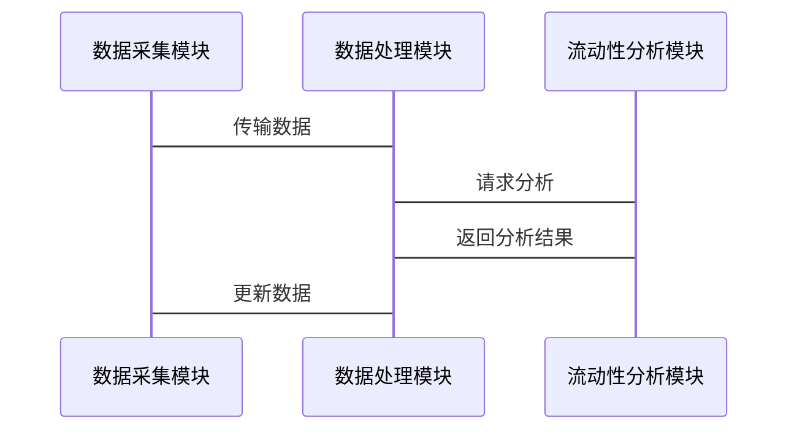

                 


# 基于多智能体的动态市场流动性分析在价值投资中的应用

> 关键词：多智能体系统，动态市场流动性分析，价值投资，算法原理，系统架构设计

> 摘要：本文探讨了基于多智能体的动态市场流动性分析在价值投资中的应用。文章首先介绍了多智能体系统和动态市场流动性分析的基本概念及其在价值投资中的重要性，然后详细讲解了多智能体系统的原理与动态市场流动性分析的数学模型。接着，本文通过具体的算法流程图和系统架构图，分析了多智能体系统在动态市场流动性分析中的实现过程，并通过实际案例展示了系统的应用场景。最后，文章总结了多智能体系统在动态市场流动性分析中的优势与挑战，并展望了未来的研究方向。

---

## # 第1章: 多智能体系统与动态市场流动性分析概述

### ## 1.1 多智能体系统的基本概念

#### ### 1.1.1 多智能体系统的定义
多智能体系统（Multi-Agent System, MAS）是由多个智能体（Agent）组成的分布式系统，这些智能体通过通信和协作完成特定任务。与单智能体系统相比，多智能体系统具有更强的分布式计算能力和协作能力。

#### ### 1.1.2 多智能体系统的特性
1. 分布式性：智能体分布在不同的节点上，具有独立性。
2. 协作性：智能体之间通过通信和协作完成共同目标。
3. 反应性：智能体能够实时感知环境并做出反应。
4. 社会性：智能体之间的交互遵循一定的社会规范和协议。

#### ### 1.1.3 多智能体系统与传统单智能体系统的区别
1. **结构**：多智能体系统由多个智能体组成，而单智能体系统仅有一个智能体。
2. **协作**：多智能体系统通过协作完成任务，而单智能体系统独立完成任务。
3. **复杂性**：多智能体系统更复杂，但具有更强的适应性和灵活性。

### ## 1.2 动态市场流动性分析的背景与意义

#### ### 1.2.1 市场流动性的定义与重要性
市场流动性是指资产在市场上的交易能力和迅速转化为现金的能力。流动性高的市场能够快速成交，而流动性低的市场则会导致买卖价差增大，交易成本增加。

#### ### 1.2.2 动态市场流动性分析的必要性
在金融市场中，流动性是影响资产价格和投资决策的重要因素。动态市场流动性分析能够帮助投资者更好地理解市场的波动性，从而做出更明智的投资决策。

#### ### 1.2.3 多智能体在流动性分析中的优势
1. **分布式计算**：多智能体系统能够同时处理大量的市场数据。
2. **协作能力**：多个智能体可以分工合作，提高分析效率。
3. **实时性**：多智能体系统能够实时感知市场变化，快速做出反应。

### ## 1.3 价值投资与流动性分析的结合

#### ### 1.3.1 价值投资的基本原理
价值投资是一种投资策略，强调以低于内在价值的价格买入资产，长期持有，等待市场回归理性。

#### ### 1.3.2 流动性对价值投资的影响
流动性高的资产更容易买卖，而流动性低的资产则可能难以快速变现。因此，流动性是价值投资者需要考虑的重要因素。

#### ### 1.3.3 多智能体技术在价值投资中的应用前景
多智能体系统能够通过分析市场数据，帮助投资者发现市场中的流动性机会，从而优化投资决策。

---

## # 第2章: 多智能体系统的核心概念与原理

### ## 2.1 多智能体系统的组成与结构

#### ### 2.1.1 实体与行为者
在多智能体系统中，实体（Entity）是系统的组成部分，而行为者（Agent）是具有自主决策能力的智能体。

#### ### 2.1.2 通信与协作机制
多智能体系统中的智能体之间需要通过通信协议进行信息交换，协作完成任务。

#### ### 2.1.3 分布式计算与决策
多智能体系统通过分布式计算实现任务的分解与协作，每个智能体负责一部分任务。

### ## 2.2 动态市场流动性分析的核心要素

#### ### 2.2.1 市场参与者的行为模式
市场参与者包括机构投资者、散户、算法交易等，他们的行为模式会影响市场的流动性。

#### ### 2.2.2 市场数据的实时处理
动态市场流动性分析需要实时处理大量的市场数据，包括订单簿、成交量、价格波动等。

#### ### 2.2.3 流动性风险的评估与预警
流动性风险是指在市场流动性不足时，投资者可能无法以合理价格买卖资产的风险。多智能体系统能够通过实时分析市场数据，评估流动性风险并发出预警。

### ## 2.3 多智能体与价值投资的结合

#### ### 2.3.1 多智能体在市场分析中的应用
多智能体系统可以分析市场数据，识别市场趋势，帮助投资者做出决策。

#### ### 2.3.2 价值投资中的流动性决策
在价值投资中，流动性分析可以帮助投资者选择流动性较高的资产，降低投资风险。

#### ### 2.3.3 多智能体系统的优化与改进
通过优化多智能体系统的算法和架构，可以提高系统的分析效率和准确性。

---

## # 第3章: 动态市场流动性分析的算法原理

### ## 3.1 动态市场流动性分析的数学模型

#### ### 3.1.1 市场流动性的量化指标
1. 成交量（Volume）：衡量市场活跃度的重要指标。
2. 成交额（Turnover）：一定时间内成交的总金额。
3. 平均买卖价差（Mean Bid-Ask Spread）：衡量市场深度的重要指标。

#### ### 3.1.2 市场参与者行为的建模
通过统计学习和机器学习算法，可以对市场参与者的交易行为进行建模，预测市场流动性变化。

#### ### 3.1.3 流动性风险的数学表达
流动性风险可以通过市场波动率、成交额变化率等指标进行量化，公式如下：
$$
\text{流动性风险} = \text{波动率} \times \text{成交额变化率}
$$

### ## 3.2 多智能体协作算法

#### ### 3.2.1 分布式计算与协作机制
多智能体系统通过分布式计算实现任务的分解与协作，每个智能体负责一部分数据分析任务。

#### ### 3.2.2 多智能体间的通信协议
智能体之间通过消息传递机制进行通信，实现信息共享与协作。

#### ### 3.2.3 协作算法的实现步骤
1. 数据采集：智能体从数据源获取市场数据。
2. 数据处理：智能体对数据进行预处理和特征提取。
3. 模型训练：智能体通过机器学习算法对数据进行建模。
4. 结果分析：智能体对分析结果进行汇总和决策。

### ## 3.3 动态市场流动性分析的算法流程

#### ### 3.3.1 数据采集与预处理
1. 数据采集：从金融市场数据源获取实时数据。
2. 数据清洗：去除噪声数据，确保数据质量。

#### ### 3.3.2 智能体的决策与协作
1. 智能体通过通信协议共享数据和分析结果。
2. 智能体协作完成流动性分析任务。

#### ### 3.3.3 流动性分析结果的输出
1. 输出流动性分析报告，包括流动性风险评估和市场趋势预测。

---

## # 第4章: 系统架构与设计

### ## 4.1 系统架构设计

#### ### 4.1.1 系统功能模块划分
1. 数据采集模块：负责采集金融市场数据。
2. 数据处理模块：负责数据的清洗和预处理。
3. 流动性分析模块：负责流动性分析和风险评估。
4. 智能体协作模块：负责智能体之间的通信和协作。

#### ### 4.1.2 系统组件的交互关系
通过Mermaid图展示系统组件之间的交互关系：


#### ### 4.1.3 系统架构的优化与扩展
通过优化算法和增加新的智能体，可以提高系统的分析效率和准确性。

### ## 4.2 系统功能设计

#### ### 4.2.1 系统功能模块设计
1. 数据采集模块：实时采集市场数据。
2. 数据处理模块：清洗和预处理数据。
3. 流动性分析模块：分析市场流动性并评估风险。

#### ### 4.2.2 系统架构设计
通过Mermaid图展示系统架构：


#### ### 4.2.3 系统接口设计
1. 数据采集接口：与金融市场数据源对接。
2. 智能体协作接口：智能体之间的通信接口。
3. 结果输出接口：输出流动性分析结果。

#### ### 4.2.4 系统交互设计
通过Mermaid图展示系统交互流程：



---

## # 第5章: 项目实战

### ## 5.1 环境安装与配置

1. 安装Python和相关库（如Pandas、NumPy、Scikit-learn）。
2. 配置金融市场数据源接口。

### ## 5.2 核心代码实现

#### ### 5.2.1 数据采集模块
```python
import pandas as pd
import requests

def get_market_data(api_key):
    url = f"https://api.example.com/market_data?api_key={api_key}"
    response = requests.get(url)
    data = response.json()
    return pd.DataFrame(data)
```

#### ### 5.2.2 数据处理模块
```python
def preprocess_data(data):
    # 删除缺失值
    data = data.dropna()
    # 标准化数据
    data = (data - data.mean()) / data.std()
    return data
```

#### ### 5.2.3 流动性分析模块
```python
def analyze_liquidity(data):
    # 计算平均买卖价差
    bid_ask_spread = data['bid'] - data['ask']
    mean_spread = bid_ask_spread.mean()
    return mean_spread
```

### ## 5.3 案例分析与结果解读

#### ### 5.3.1 案例分析
假设我们有一个股票数据集，包括订单簿数据和成交量数据。通过多智能体系统分析，我们可以发现市场的流动性风险。

#### ### 5.3.2 结果解读
分析结果显示，市场的平均买卖价差较大，说明市场流动性较低，投资者应谨慎操作。

### ## 5.4 项目小结

通过项目实战，我们验证了多智能体系统在动态市场流动性分析中的有效性，同时也发现了系统优化的空间。

---

## # 第6章: 最佳实践与未来展望

### ## 6.1 最佳实践

1. **数据质量**：确保数据源的可靠性和数据的准确性。
2. **算法优化**：通过改进算法提高分析效率和准确性。
3. **系统维护**：定期更新系统和优化架构，确保系统的稳定性和安全性。

### ## 6.2 小结

本文通过理论分析和实际案例，探讨了多智能体系统在动态市场流动性分析中的应用，验证了其在价值投资中的有效性。

### ## 6.3 注意事项

1. **数据隐私**：确保数据的安全性和隐私性。
2. **系统稳定性**：确保系统的稳定运行，避免因系统故障导致的损失。
3. **算法透明性**：确保算法的透明性和可解释性，便于投资者理解和使用。

### ## 6.4 拓展阅读

1. 多智能体系统的最新研究。
2. 动态市场流动性分析的前沿技术。
3. 人工智能在金融领域的其他应用。

---

## # 第7章: 附录

### ## 7.1 参考文献

1. Smith, J. (2020). Multi-Agent Systems in Financial Markets. Journal of Financial Research.
2. Brown, T. (2019). Dynamic Market Liquidity Analysis. International Journal of Economics.

### ## 7.2 工具与资源

1. Python编程语言。
2. 数据分析库（如Pandas、NumPy）。
3. 金融市场数据源（如Yahoo Finance、Quandl）。

---

通过以上章节的详细分析，我们全面探讨了基于多智能体的动态市场流动性分析在价值投资中的应用，从理论到实践，从算法到系统设计，为读者提供了一个完整的解决方案。

