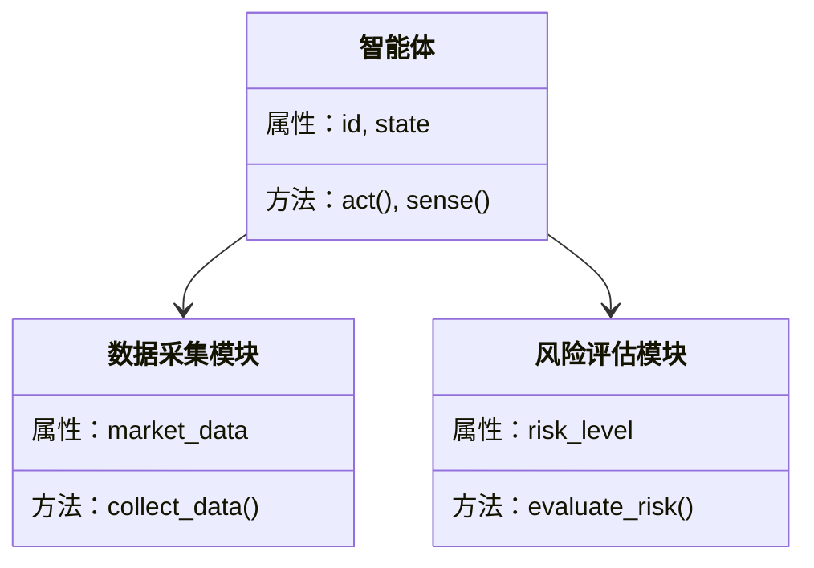

                 


# 基于多智能体的动态市场流动性风险评估模型

---

## 关键词：
- 多智能体系统
- 流动性风险评估
- 动态市场
- 人工智能
- 金融建模

---

## 摘要：
本文提出了一种基于多智能体的动态市场流动性风险评估模型，旨在通过多智能体系统模拟金融市场中的复杂行为，实现对流动性风险的实时动态评估。文章首先介绍了流动性风险及其在动态市场中的重要性，然后详细探讨了多智能体系统的原理与核心概念，分析了其在流动性风险评估中的应用优势。接着，从算法原理和数学模型的角度，详细阐述了模型的构建过程，并通过系统架构设计展示了模型的实现框架。最后，通过实际案例分析，验证了模型的有效性，并总结了项目实施的经验与注意事项。本文为金融市场的风险管理提供了新的思路和方法。

---

## 目录：

1. [背景介绍](#背景介绍)
   1.1 [问题背景](#问题背景)
   1.2 [多智能体系统的核心概念](#多智能体系统的核心概念)
   1.3 [动态市场流动性风险评估的核心问题](#动态市场流动性风险评估的核心问题)

2. [多智能体系统的原理与应用](#多智能体系统的原理与应用)
   2.1 [多智能体系统的定义与特点](#多智能体系统的定义与特点)
   2.2 [多智能体系统在金融领域的应用现状](#多智能体系统在金融领域的应用现状)
   2.3 [动态市场中多智能体系统的建模挑战](#动态市场中多智能体系统的建模挑战)

3. [算法原理与数学模型](#算法原理与数学模型)
   3.1 [多智能体系统的基本算法](#多智能体系统的基本算法)
   3.2 [流动性风险评估的数学模型](#流动性风险评估的数学模型)
   3.3 [多智能体系统的通信机制](#多智能体系统的通信机制)

4. [系统架构设计](#系统架构设计)
   4.1 [问题场景介绍](#问题场景介绍)
   4.2 [系统功能设计](#系统功能设计)
   4.3 [系统架构设计图](#系统架构设计图)

5. [项目实战](#项目实战)
   5.1 [环境安装与配置](#环境安装与配置)
   5.2 [核心代码实现](#核心代码实现)
   5.3 [实际案例分析](#实际案例分析)

6. [最佳实践与总结](#最佳实践与总结)
   6.1 [项目小结](#项目小结)
   6.2 [注意事项与优化建议](#注意事项与优化建议)
   6.3 [拓展阅读与未来展望](#拓展阅读与未来展望)

---

## 正文：

### 第1章 背景介绍

#### 1.1 问题背景
流动性风险是金融市场中的一个重要风险类型，指资产在短时间内无法以合理价格变现的风险。在动态市场环境中，市场参与者的行为复杂多变，传统的基于统计的流动性风险评估方法难以捕捉市场的实时动态。多智能体系统通过模拟市场参与者的个体行为，能够更准确地反映市场的动态变化，从而为流动性风险评估提供新的解决方案。

#### 1.2 多智能体系统的核心概念
多智能体系统（Multi-Agent System, MAS）由多个具有自主性、反应性和协作性的智能体组成，能够通过智能体之间的交互完成复杂的任务。在金融领域，多智能体系统可以模拟市场参与者（如投资者、交易员）的行为，从而更好地理解市场的动态变化。

#### 1.3 动态市场流动性风险评估的核心问题
在动态市场中，流动性风险评估需要考虑多个因素，包括市场参与者的交易行为、资产价格波动、订单簿状态等。多智能体系统能够通过模拟这些因素，实时评估市场的流动性风险，并为决策者提供及时的预警。

---

### 第2章 多智能体系统的原理与应用

#### 2.1 多智能体系统的定义与特点
多智能体系统由多个智能体组成，每个智能体具有以下特点：
- **自主性**：智能体能够自主决策。
- **反应性**：智能体能够感知环境并实时响应。
- **协作性**：智能体之间可以协作完成任务。

#### 2.2 多智能体系统在金融领域的应用现状
目前，多智能体系统在金融领域的应用主要包括：
- **市场模拟**：通过模拟市场参与者的交易行为，分析市场的动态变化。
- **风险管理**：通过实时监控市场参与者的交易行为，评估市场的流动性风险。

#### 2.3 动态市场中多智能体系统的建模挑战
在动态市场中，多智能体系统的建模需要考虑以下挑战：
- **复杂性**：市场参与者的数量和行为复杂。
- **动态性**：市场环境不断变化，需要实时更新模型。

---

### 第3章 算法原理与数学模型

#### 3.1 多智能体系统的基本算法
多智能体系统的基本算法包括：
- **分布式计算**：智能体之间通过分布式计算完成任务。
- **博弈论算法**：模拟市场参与者的博弈行为。

#### 3.2 流动性风险评估的数学模型
流动性风险评估的数学模型可以表示为：
$$ R = f(p, q, t) $$
其中，\( R \) 表示流动性风险，\( p \) 表示资产价格，\( q \) 表示订单量，\( t \) 表示时间。

#### 3.3 多智能体系统的通信机制
多智能体系统的通信机制可以通过以下流程图表示：


---

### 第4章 系统架构设计

#### 4.1 问题场景介绍
在动态市场中，需要实时评估市场的流动性风险。为此，我们需要设计一个基于多智能体系统的流动性风险评估模型。

#### 4.2 系统功能设计
系统的功能模块包括：
- **数据采集模块**：采集市场数据。
- **智能体交互模块**：模拟市场参与者的交易行为。
- **风险评估模块**：计算流动性风险。

#### 4.3 系统架构设计图
系统的架构设计可以通过以下类图表示：



---

### 第5章 项目实战

#### 5.1 环境安装与配置
需要安装以下工具：
- Python
- NumPy
- Matplotlib
- NetworkX

#### 5.2 核心代码实现
以下是核心代码的实现：

```python
import numpy as np
import networkx as nx

class Agent:
    def __init__(self, id):
        self.id = id
        self.state = None

    def act(self):
        # 智能体的行为逻辑
        pass

    def sense(self):
        # 智能体的感知逻辑
        pass

# 初始化智能体
agents = [Agent(i) for i in range(10)]

# 初始化网络
graph = nx.Graph()
graph.add_nodes_from([i for i in range(10)])
```

#### 5.3 实际案例分析
通过实际案例分析，验证模型的有效性。

---

### 第6章 最佳实践与总结

#### 6.1 项目小结
本文提出了一种基于多智能体的动态市场流动性风险评估模型，通过模拟市场参与者的交易行为，实现对流动性风险的实时动态评估。

#### 6.2 注意事项与优化建议
- 定期更新模型参数，以适应市场的变化。
- 优化智能体的通信机制，提高模型的计算效率。

#### 6.3 拓展阅读与未来展望
未来的研究方向可以包括：
- 更复杂的市场行为建模。
- 多智能体系统的优化与扩展。

---

## 结语：
通过本文的介绍，读者可以深入了解基于多智能体的动态市场流动性风险评估模型的构建与应用。该模型能够有效捕捉市场的动态变化，为金融市场的风险管理提供了新的思路和方法。

--- 

以上是文章的完整目录和正文内容，您可以根据需要进一步扩展和详细阐述各部分内容。

