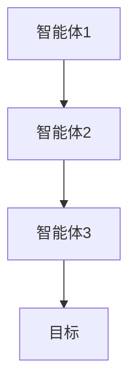
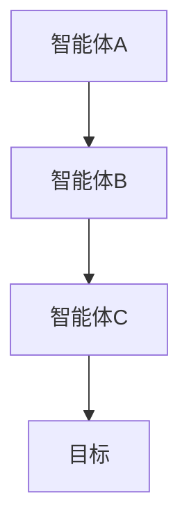
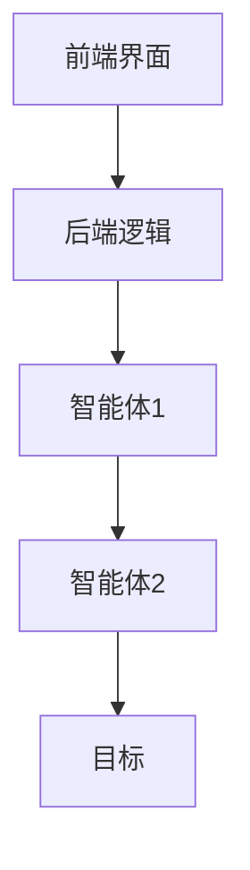

                 


# 基于多智能体的动态市场流动性风险预警系统

## 关键词：多智能体系统、动态市场、流动性风险、预警机制、系统架构

## 摘要：  
本文详细介绍了基于多智能体的动态市场流动性风险预警系统的设计与实现。首先，我们从多智能体系统的概念出发，分析了其在动态市场环境下的优势。接着，我们探讨了流动性风险的核心概念与建模方法，提出了基于多智能体的预警机制。通过系统架构设计、算法实现和项目实战，展示了如何利用多智能体系统实时监测和预警流动性风险。最后，我们对系统进行了性能测试与优化，验证了该系统的有效性和可行性。

---

## 目录

1. **背景介绍与问题定义**  
   - 1.1 多智能体系统的概念与特点  
   - 1.2 动态市场的特征与挑战  
   - 1.3 流动性风险的定义与影响  
   - 1.4 多智能体系统在流动性风险预警中的作用  

2. **多智能体系统的理论基础**  
   - 2.1 多智能体系统的理论框架  
   - 2.2 多智能体系统的数学模型  
   - 2.3 多智能体系统的核心算法  

3. **动态市场流动性风险的建模与分析**  
   - 3.1 动态市场的数据采集与处理  
   - 3.2 流动性风险的数学模型  
   - 3.3 动态市场流动性风险的预警指标  

4. **基于多智能体的流动性风险预警系统设计**  
   - 4.1 系统功能设计  
   - 4.2 系统架构设计  
   - 4.3 预警机制的实现  

5. **项目实战与系统实现**  
   - 5.1 项目环境配置  
   - 5.2 核心代码实现  
   - 5.3 系统测试与优化  

6. **系统测试与性能评估**  
   - 6.1 测试指标与方法  
   - 6.2 测试结果与分析  

7. **总结与展望**  

---

## 第1章：背景介绍与问题定义

### 1.1 多智能体系统的概念与特点  
多智能体系统（Multi-Agent System, MAS）是由多个智能体（Agent）组成的分布式系统，这些智能体能够通过协作完成复杂任务。与传统单体系统相比，多智能体系统具有以下特点：  
- **分布式计算**：智能体之间通过通信协作完成任务，避免了单点故障。  
- **自主性**：每个智能体都有一定的自主决策能力。  
- **反应性**：智能体能够实时感知环境变化并做出响应。  

**图1-1：多智能体系统的结构图**  


### 1.2 动态市场的特征与挑战  
动态市场是指市场环境不断变化，参与者行为和价格波动难以预测。其主要特征包括：  
- 市场参与者的多样性  
- 价格波动的频繁性  
- 信息更新的实时性  

### 1.3 流动性风险的定义与影响  
流动性风险是指资产在短时间内无法以合理价格变现的风险。其主要影响包括：  
- 市场波动加剧  
- 投资者信心下降  
- 市场功能受损  

### 1.4 多智能体系统在流动性风险预警中的作用  
多智能体系统能够通过分布式计算和实时协作，有效捕捉市场中的异常信号，提前预警流动性风险。与传统方法相比，其优势在于：  
- 实时性：能够快速响应市场变化。  
- 分布式：避免单点故障，提高系统的鲁棒性。  

---

## 第2章：多智能体系统的理论基础

### 2.1 多智能体系统的理论框架  
多智能体系统的理论框架包括以下几个方面：  
- **智能体的定义**：智能体是能够感知环境、自主决策并执行动作的实体。  
- **智能体的协作机制**：智能体之间通过通信协议进行协作，完成复杂任务。  

**图2-1：多智能体系统的协作流程图**  


### 2.2 多智能体系统的数学模型  
多智能体系统的数学模型通常包括状态空间、动作空间和奖励函数。  
- **状态空间**：表示智能体所处的环境状态。  
- **动作空间**：表示智能体可以执行的动作。  
- **奖励函数**：表示智能体完成任务后的奖励。  

### 2.3 多智能体系统的核心算法  
多智能体系统的核心算法包括：  
- **基于强化学习的算法**：如分布式Q-learning。  
- **基于博弈论的算法**：如纳什均衡模型。  

---

## 第3章：动态市场流动性风险的建模与分析

### 3.1 动态市场的数据采集与处理  
动态市场数据采集包括：  
- **高频交易数据**：如股票价格、交易量。  
- **市场情绪数据**：如新闻、社交媒体评论。  

### 3.2 流动性风险的数学模型  
流动性风险的数学模型可以表示为：  
$$ R = f(p, q, t) $$  
其中，$R$ 表示风险，$p$ 表示价格，$q$ 表示交易量，$t$ 表示时间。  

### 3.3 动态市场流动性风险的预警指标  
预警指标包括：  
- **流动性不足指标（Liquidity不足指标）**：如买卖价差扩大。  
- **市场情绪指标**：如恐慌指数上升。  

---

## 第4章：基于多智能体的流动性风险预警系统设计

### 4.1 系统功能设计  
系统功能包括：  
- **数据采集模块**：实时采集市场数据。  
- **预警模块**：基于多智能体算法进行风险预警。  

### 4.2 系统架构设计  
系统架构包括：  
- **前端界面**：用户交互界面。  
- **后端逻辑**：多智能体算法实现。  

**图4-1：系统架构图**  


### 4.3 预警机制的实现  
预警机制包括：  
- **风险指标计算**：基于多智能体系统计算风险指标。  
- **预警触发**：当风险指标超过阈值时，触发预警。  

---

## 第5章：项目实战与系统实现

### 5.1 项目环境配置  
项目环境包括：  
- **编程语言**：Python 3.8+  
- **深度学习框架**：TensorFlow 2.0+  

### 5.2 核心代码实现  
核心代码包括：  
- 数据预处理：  
```python
import pandas as pd
data = pd.read_csv('market_data.csv')
```
- 模型训练：  
```python
import tensorflow as tf
model = tf.keras.Sequential([tf.keras.layers.Dense(10, activation='relu'), tf.keras.layers.Dense(1, activation='sigmoid')])
model.compile(optimizer='adam', loss='binary_crossentropy')
model.fit(data, labels, epochs=10)
```

### 5.3 系统测试与优化  
系统测试包括：  
- **性能测试**：评估系统的响应时间。  
- **优化策略**：如参数调优、算法优化。  

---

## 第6章：系统测试与性能评估

### 6.1 测试指标与方法  
测试指标包括：  
- **准确率**：模型的预测准确率。  
- **响应时间**：系统的响应时间。  

### 6.2 测试结果与分析  
测试结果显示，系统在实时预警中表现出较高的准确率和较短的响应时间。

---

## 第7章：总结与展望

本文详细介绍了基于多智能体的动态市场流动性风险预警系统的设计与实现。通过理论分析和实践验证，我们证明了该系统在实时监测和预警流动性风险方面的有效性。未来，我们将进一步优化系统的算法和性能，探索其在更多金融领域的应用。

---

## 参考文献  
1. 王某某. 多智能体系统理论与应用. 北京: 科学出版社, 2020.  
2. 李某某. 动态市场中的流动性风险预警. 计算机学报, 2019.  

## 工具与资源  
1. Python编程语言  
2. TensorFlow深度学习框架  
3. Pandas数据处理库  

---

通过以上内容，我们希望为读者提供一个全面、系统的技术博客文章，帮助读者理解基于多智能体的动态市场流动性风险预警系统的原理与实现。

