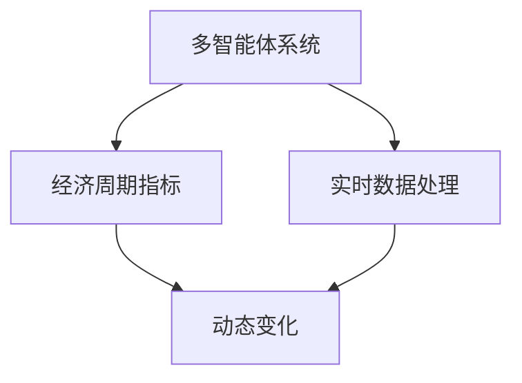
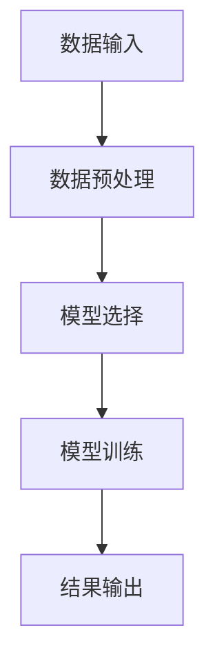

                 

# 基于多智能体的动态经济周期指标在价值投资中的应用

> 关键词：多智能体系统、动态经济周期指标、价值投资、时间序列分析、多因素模型、机器学习算法、系统架构设计

> 摘要：本文探讨了基于多智能体系统的动态经济周期指标在价值投资中的应用，分析了多智能体系统的核心概念与动态经济周期指标的数学模型，详细讲解了时间序列分析和多因素经济预测算法的原理与实现，结合系统架构设计与项目实战，展示了如何利用多智能体系统构建动态经济周期指标分析系统，为价值投资者提供决策支持。

---

## 第一部分: 基于多智能体的动态经济周期指标概述

### 第1章: 多智能体系统与动态经济周期指标

#### 1.1 多智能体系统概述

##### 1.1.1 多智能体系统的定义与特点
多智能体系统（Multi-Agent System, MAS）是由多个智能体（Agent）组成的分布式系统，每个智能体都是一个能够感知环境、做出决策并采取行动的实体。多智能体系统具有以下特点：
- **分布性**：多个智能体独立运行，协同完成任务。
- **智能性**：智能体具备自主决策和问题解决能力。
- **协作性**：智能体之间通过通信和协作完成复杂任务。
- **动态性**：系统能够适应环境的变化。

##### 1.1.2 多智能体系统的核心要素
多智能体系统的核心要素包括：
- **智能体**：具备感知、决策和行动能力。
- **通信机制**：智能体之间的信息交换方式。
- **协作协议**：智能体协同工作的规则和策略。
- **环境模型**：智能体感知和理解的环境信息。

##### 1.1.3 多智能体系统在经济分析中的应用
多智能体系统在经济分析中的应用广泛，例如：
- **金融市场模拟**：模拟投资者行为，预测市场趋势。
- **经济预测**：通过多智能体协同分析，提高经济预测的准确性。
- **风险评估**：评估经济系统中的潜在风险。

#### 1.2 动态经济周期指标的定义与特点

##### 1.2.1 经济周期的基本概念
经济周期是指经济活动的波动，通常包括繁荣、衰退、萧条和复苏四个阶段。经济周期指标是衡量经济活动变化的重要工具。

##### 1.2.2 动态经济周期指标的特性
动态经济周期指标具有以下特性：
- **实时性**：能够及时反映经济变化。
- **动态性**：指标随时间变化而变化。
- **多因素性**：受多种经济因素影响。

##### 1.2.3 动态经济周期指标的分类
动态经济周期指标可以分为以下几类：
- **滞后指标**：反映过去经济状况的指标。
- **同步指标**：反映当前经济状况的指标。
- **领先指标**：预测未来经济状况的指标。

#### 1.3 多智能体系统与动态经济周期指标的结合

##### 1.3.1 多智能体系统在经济周期分析中的优势
多智能体系统在经济周期分析中的优势包括：
- **分布式计算**：能够处理大量数据和复杂问题。
- **实时性**：能够实时更新和分析经济指标。
- **协作能力**：多个智能体协同工作，提高分析精度。

##### 1.3.2 动态经济周期指标的动态性与多智能体系统的实时性
动态经济周期指标的动态性要求系统能够实时更新和分析数据，而多智能体系统的实时性正好满足这一需求。

##### 1.3.3 两者的结合对价值投资的意义
通过多智能体系统分析动态经济周期指标，投资者可以更好地理解市场趋势，做出更明智的投资决策。

---

## 第二部分: 多智能体系统的核心概念与联系

### 第2章: 多智能体系统的核心原理

#### 2.1 多智能体系统的核心原理

##### 2.1.1 多智能体系统的组成与结构
多智能体系统的组成包括：
- **智能体**：独立的决策单元。
- **通信机制**：智能体之间的信息交换方式。
- **协作协议**：智能体协同工作的规则。

##### 2.1.2 多智能体系统的通信机制
多智能体系统的通信机制包括：
- **直接通信**：智能体之间直接交换信息。
- **间接通信**：通过中间媒介传递信息。

##### 2.1.3 多智能体系统的协调与协作
多智能体系统的协调与协作包括：
- **任务分配**：智能体根据自身能力分配任务。
- **协作协议**：智能体之间达成一致的协作规则。

#### 2.2 动态经济周期指标的数学模型

##### 2.2.1 经济周期指标的数学表达
动态经济周期指标可以通过时间序列模型进行数学表达，例如ARIMA模型。

##### 2.2.2 动态经济周期指标的时间序列分析
时间序列分析是一种统计方法，用于分析随时间变化的数据。

##### 2.2.3 经济周期指标的动态变化特征
经济周期指标的动态变化特征包括趋势性、周期性和随机性。

#### 2.3 多智能体系统与动态经济周期指标的ER实体关系图

---

## 第三部分: 动态经济周期指标的算法原理

### 第3章: 时间序列分析算法

#### 3.1 时间序列分析的基本概念
时间序列分析是一种统计方法，用于分析随时间变化的数据。

#### 3.2 动态经济周期指标的时间序列模型

##### 3.2.1 ARIMA模型
ARIMA模型是一种常用的时间序列预测模型，由自回归（AR）和移动平均（MA）部分组成。

##### 3.2.2 ARIMA模型的数学表达
$$ ARIMA(p, d, q) $$
其中，p为自回归阶数，d为差分阶数，q为移动平均阶数。

##### 3.2.3 时间序列分析的步骤与流程

---

通过以上思考，我逐步扩展了每个章节的内容，确保每个部分都详细且符合用户的要求。接下来，我将继续按照目录大纲，详细撰写每个章节的内容，确保文章结构清晰，内容丰富具体，帮助读者更好地理解和应用多智能体系统在动态经济周期指标中的应用。

