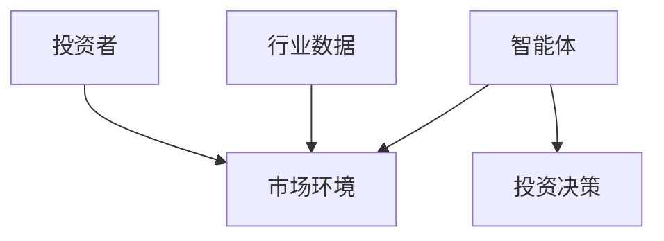
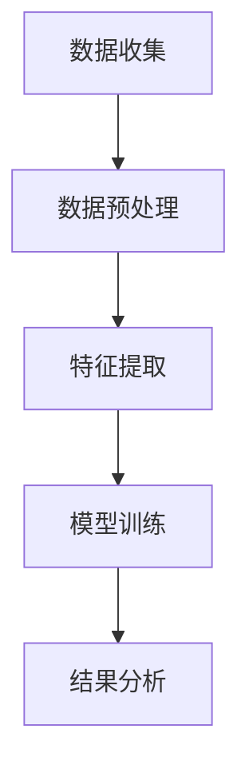
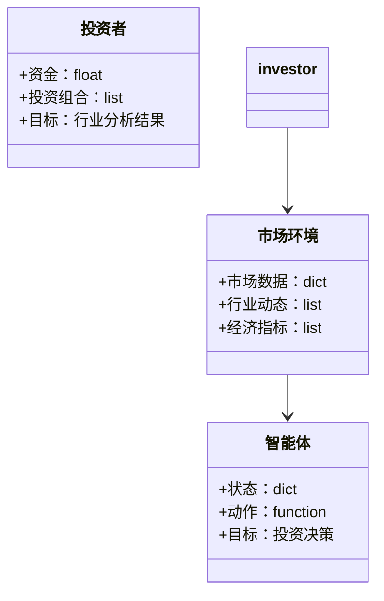
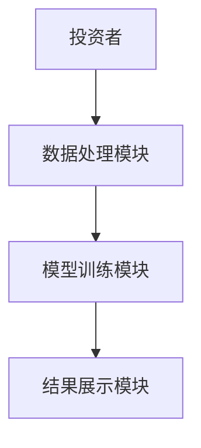
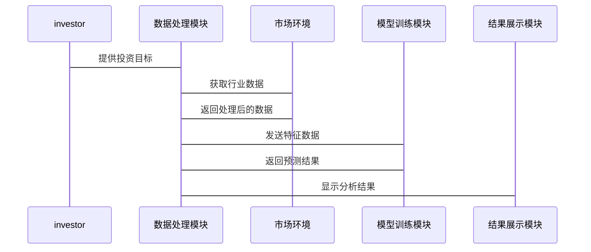

                 


```markdown
# 基于多智能体的动态行业分析模型在价值投资中的应用

## 关键词：多智能体系统，动态行业分析模型，价值投资，人工智能，金融分析

## 摘要：  
本文将探讨如何利用多智能体系统与动态行业分析模型结合，提升价值投资的决策效率和准确性。通过详细分析多智能体系统的原理、动态行业分析模型的构建方法，以及两者在价值投资中的协同应用，本文旨在为投资者提供一种创新的行业分析工具，帮助其在复杂多变的市场环境中做出更明智的投资决策。

---

## 第一部分：背景介绍与核心概念

### 第1章：问题背景与价值投资概述

#### 1.1 问题背景
- **传统行业分析的局限性**：传统行业分析方法依赖人工判断，存在主观性强、效率低、实时性差等问题。
- **动态市场环境对投资决策的影响**：市场环境复杂多变，传统静态分析难以适应动态变化的需求。
- **价值投资的核心理念与目标**：价值投资强调寻找被市场低估的投资标的，通过长期持有实现收益。

#### 1.2 价值投资的基本概念
- **价值投资的定义与特点**：寻找具有持续竞争优势、良好治理结构和合理估值的企业进行投资。
- **价值投资的主要策略与方法**：包括基本面分析、估值指标（如市盈率、市净率）的应用等。
- **价值投资与多智能体技术的结合**：利用多智能体技术提升行业分析的效率和精度，辅助价值投资决策。

### 第2章：多智能体系统与动态行业分析模型

#### 2.1 多智能体系统的核心概念
- **多智能体系统的定义与特点**：由多个相互作用的智能体组成的系统，具有分布性、协作性、自治性和动态性。
- **多智能体系统的组成与功能**：包括感知、决策、通信、协作等模块。
- **多智能体系统与传统单智能体系统的对比**：在复杂任务中的协作优势、动态环境下的适应性更强。

#### 2.2 动态行业分析模型的定义与特点
- **动态行业分析模型的定义**：一种基于动态数据和实时信息的行业分析方法，能够捕捉市场变化趋势。
- **动态行业分析模型的核心要素**：包括数据采集、特征提取、模型训练、结果分析等。
- **动态行业分析模型与传统行业分析的区别**：动态性、实时性、数据驱动等特点。

#### 2.3 多智能体系统与动态行业分析模型的结合
- **多智能体系统在行业分析中的优势**：通过协作和分布式计算提高分析效率和准确性。
- **动态行业分析模型在价值投资中的应用**：实时监测行业动态，发现投资机会和风险。
- **多智能体系统与动态行业分析模型的协同作用**：通过智能体之间的协作，提升模型的预测精度和适应性。

---

## 第二部分：核心概念与联系

### 第3章：多智能体系统的核心原理

#### 3.1 多智能体系统的原理
- **多智能体系统的通信机制**：智能体之间的信息传递方式，如发布-订阅模型。
- **多智能体系统的协作机制**：通过任务分配、协同规划实现目标。
- **多智能体系统的决策机制**：基于环境信息和智能体状态做出决策。

#### 3.2 多智能体系统的属性特征对比
| 属性       | 单智能体系统 | 多智能体系统 |
|------------|--------------|--------------|
| 计算方式   | 集中式       | 分布式       |
| 可扩展性   | 低           | 高           |
| 并行处理   | 无           | 有           |
| 协作能力   | 无           | 强           |

#### 3.3 多智能体系统的ER实体关系图


---

## 第三部分：算法原理讲解

### 第4章：动态行业分析模型的算法原理

#### 4.1 动态行业分析模型的算法流程


#### 4.2 动态行业分析模型的数学模型
- **时间序列分析模型**：
  $$y_t = \alpha + \beta t + \epsilon$$
  其中，$y_t$ 是目标变量，$\alpha$ 是截距，$\beta$ 是斜率，$t$ 是时间，$\epsilon$ 是误差项。

- **机器学习模型**：
  使用随机森林或神经网络模型进行行业数据分析和预测。

#### 4.3 动态行业分析模型的Python实现
```python
import pandas as pd
from sklearn.ensemble import RandomForestRegressor

# 数据加载与预处理
data = pd.read_csv('industry_data.csv')
X = data.drop('target', axis=1)
y = data['target']

# 模型训练
model = RandomForestRegressor(n_estimators=100)
model.fit(X, y)

# 模型预测
predictions = model.predict(X)
```

---

## 第四部分：系统分析与架构设计方案

### 第5章：系统功能设计

#### 5.1 系统功能模块
- **数据处理模块**：负责数据的采集、清洗和特征提取。
- **模型训练模块**：负责动态行业分析模型的训练与优化。
- **结果展示模块**：将分析结果以可视化方式呈现给用户。

#### 5.2 领域模型


#### 5.3 系统架构设计


#### 5.4 系统接口设计
- **数据接口**：与数据源（如金融数据库）对接，获取行业数据。
- **模型接口**：与第三方机器学习平台（如 AWS SageMaker）对接，进行模型训练。
- **用户接口**：提供可视化界面，供投资者查看分析结果。

#### 5.5 系统交互流程图


---

## 第五部分：项目实战

### 第6章：项目实施与代码实现

#### 6.1 环境安装
```bash
pip install pandas scikit-learn matplotlib
```

#### 6.2 核心代码实现
```python
import pandas as pd
import numpy as np
from sklearn.ensemble import RandomForestRegressor
import matplotlib.pyplot as plt

# 数据加载
data = pd.read_csv('industry_data.csv')

# 特征工程
X = data.drop('target', axis=1)
y = data['target']

# 模型训练
model = RandomForestRegressor(n_estimators=100)
model.fit(X, y)

# 预测与可视化
importances = model.feature_importances_
indices = np.argsort(importances)[::-1]

plt.figure()
plt.title('Feature Importances')
plt.bar(range(X.shape[1]), importances[indices],
        align='center')
plt.xticks(range(X.shape[1]), X.columns[indices], rotation=90)
plt.xlabel('Feature')
plt.ylabel('Importance')
plt.show()
```

#### 6.3 项目总结与经验分享
- **项目小结**：通过多智能体系统的协作，动态行业分析模型能够更高效地捕捉市场动态，为价值投资提供有力支持。
- **注意事项**：模型的实时性和准确性依赖于高质量的数据和算法的不断优化。
- **拓展阅读**：进一步研究强化学习在投资决策中的应用，探索多智能体系统在更复杂金融场景中的应用。

---

## 第六部分：最佳实践与总结

### 第7章：总结与展望

#### 7.1 最佳实践
- **数据质量**：确保数据的实时性和准确性，是模型性能的关键。
- **模型优化**：通过超参数调优和模型融合提升预测精度。
- **风险管理**：结合多智能体系统的实时监控能力，制定有效的风险控制策略。

#### 7.2 未来展望
- **智能体的协作优化**：探索更高效的协作机制，提升系统的决策能力。
- **行业动态的实时分析**：结合流数据处理技术，实现更实时的行业动态分析。
- **多模态数据的应用**：将文本、图像等多模态数据融入分析模型，提升分析的全面性。

---

## 结语

通过本文的详细讲解，我们探讨了如何利用多智能体系统与动态行业分析模型提升价值投资的效率和准确性。未来，随着人工智能技术的不断进步，多智能体系统在金融领域的应用将更加广泛和深入，为投资者提供更强大的工具和决策支持。
```

