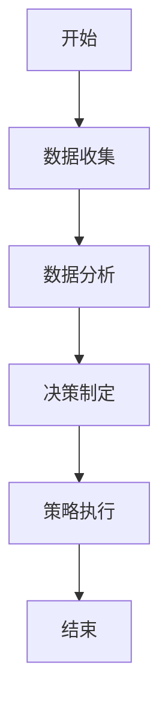
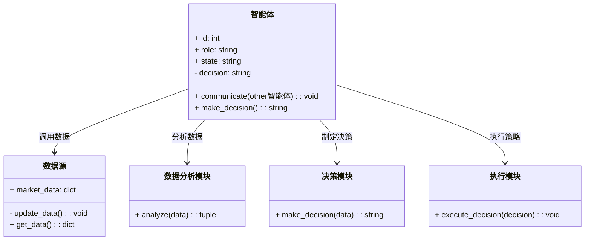
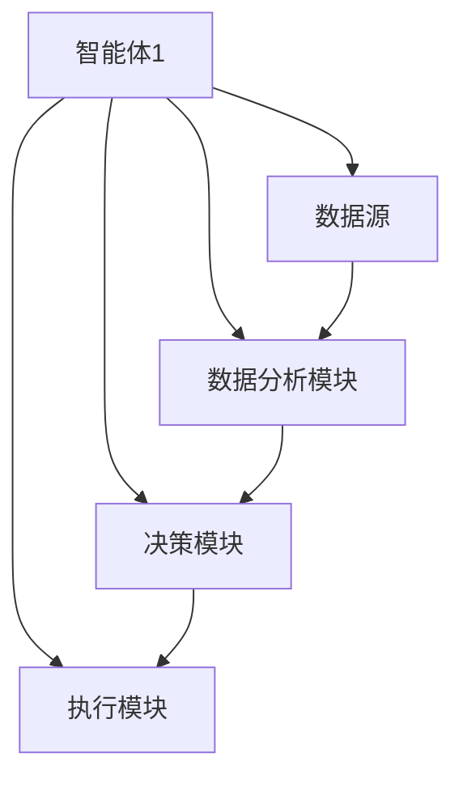
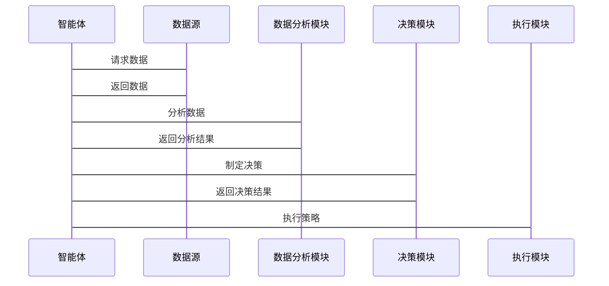

                 


# 基于多智能体的动态资产配置模型在价值投资中的应用

## 关键词：
- 多智能体系统
- 动态资产配置
- 价值投资
- 人工智能
- 投资策略

## 摘要：
本文探讨了基于多智能体的动态资产配置模型在价值投资中的应用。通过分析多智能体系统的特性，结合动态资产配置的数学模型，提出了一种创新的投资策略。该模型通过多个智能体协同工作，实现实时的资产调整和优化，从而提高投资收益并降低风险。文章详细介绍了模型的算法原理、系统架构以及实际案例，并提出了最佳实践建议。

---

# 第一章: 背景介绍

## 1.1 多智能体系统的基本概念

### 1.1.1 多智能体系统的定义
多智能体系统（Multi-Agent System, MAS）是由多个智能体组成的分布式系统，这些智能体能够通过协作完成复杂的任务。每个智能体都有自己的目标、知识和行为规则，能够与其他智能体进行通信和协作。

### 1.1.2 多智能体系统的特征
1. **分布性**：智能体是独立的个体，分布在不同的位置。
2. **协作性**：智能体之间通过通信和协作完成共同目标。
3. **反应性**：智能体能够感知环境并实时调整行为。
4. **自主性**：智能体具有自主决策的能力。

### 1.1.3 多智能体系统与传统单智能体系统的区别
- **单智能体系统**：由单一的决策主体完成任务，决策集中化。
- **多智能体系统**：多个智能体协作完成任务，决策分散化。

## 1.2 动态资产配置模型的背景

### 1.2.1 资产配置的基本概念
资产配置是指将资金分配到不同的资产类别（如股票、债券、现金等）中，以实现投资目标。动态资产配置是指根据市场环境的变化，实时调整资产权重。

### 1.2.2 动态资产配置的定义
动态资产配置是一种主动的投资策略，通过实时调整资产组合的权重，以适应市场环境的变化，从而提高投资收益。

### 1.2.3 动态资产配置与静态资产配置的区别
- **静态资产配置**：资产权重固定，不随市场变化调整。
- **动态资产配置**：根据市场变化实时调整资产权重。

## 1.3 价值投资的基本原理

### 1.3.1 价值投资的定义
价值投资是一种投资策略，通过寻找市场价格低于其内在价值的资产进行投资，长期持有，等待市场回归其真实价值。

### 1.3.2 价值投资的核心理念
- **安全边际**：购买价格低于内在价值，以降低风险。
- **长期视角**：关注企业的基本面，长期持有优质资产。

### 1.3.3 价值投资与其它投资策略的区别
- **技术分析**：基于价格和成交量预测市场走势。
- **价值投资**：基于企业的基本面进行投资决策。

## 1.4 多智能体在动态资产配置中的应用背景

### 1.4.1 传统资产配置方法的局限性
- **单一决策主体**：传统资产配置模型通常由单一的决策主体完成，难以适应复杂多变的市场环境。
- **决策延迟**：单智能体系统在处理复杂问题时，决策过程可能较长，导致反应速度慢。

### 1.4.2 多智能体在资产配置中的优势
- **分布式决策**：多智能体系统能够快速响应市场变化，实时调整资产配置。
- **协作优化**：多个智能体协同工作，能够更好地捕捉市场机会，降低风险。

### 1.4.3 价值投资与多智能体结合的可行性
- **多智能体能够实时监控市场变化**，快速调整资产配置，符合价值投资的长期视角。
- **多个智能体可以分别关注不同的资产类别**，提高投资组合的分散化和风险控制。

---

# 第二章: 多智能体动态资产配置模型的核心概念

## 2.1 多智能体动态资产配置模型的定义

### 2.1.1 模型的定义
多智能体动态资产配置模型是一种基于多智能体系统的投资策略模型，通过多个智能体的协作，实时调整资产组合的权重，以实现投资收益最大化和风险最小化。

### 2.1.2 模型的核心要素
1. **智能体**：负责监控市场、分析数据、制定决策。
2. **通信机制**：智能体之间的信息传递和协作。
3. **决策规则**：智能体的决策逻辑和行为规则。
4. **优化目标**：最大化投资收益，最小化投资风险。

## 2.2 多智能体系统的组成与功能

### 2.2.1 智能体的定义与角色
- **感知智能体**：负责收集市场数据，如股票价格、宏观经济指标等。
- **分析智能体**：对数据进行分析，评估资产的价值和风险。
- **决策智能体**：根据分析结果，制定资产调整策略。

### 2.2.2 智能体之间的交互机制
- **信息共享**：智能体之间共享市场数据和分析结果。
- **任务分配**：根据市场情况，智能体之间分配不同的任务。

### 2.2.3 智能体的决策过程
1. **数据收集**：智能体收集市场数据。
2. **数据分析**：智能体对数据进行分析，评估资产的价值和风险。
3. **决策制定**：根据分析结果，制定资产调整策略。
4. **策略执行**：智能体执行决策，调整资产配置。

## 2.3 动态资产配置模型的数学表达

### 2.3.1 资产配置的数学模型
$$ w_t = \arg\max_w \{ E[r_p(w)] - \lambda E[r_p(w)]^2 \} $$
其中，$w_t$ 是资产权重，$r_p(w)$ 是投资组合的收益，$\lambda$ 是风险厌恶系数。

### 2.3.2 动态调整的数学表达
$$ w_{t+1} = f(w_t, r_t, \sigma_t) $$
其中，$w_{t+1}$ 是调整后的资产权重，$r_t$ 是市场收益，$\sigma_t$ 是市场风险。

### 2.3.3 模型的优化目标
1. **收益最大化**：最大化投资组合的预期收益。
2. **风险最小化**：最小化投资组合的波动性。

## 2.4 多智能体与动态资产配置的结合

### 2.4.1 多智能体在资产配置中的作用
- **分布式决策**：多个智能体协同工作，提高决策的准确性和效率。
- **实时调整**：智能体能够实时监控市场变化，快速调整资产配置。

### 2.4.2 多智能体如何实现动态调整
- **信息共享**：智能体之间共享市场数据和分析结果。
- **任务分配**：根据市场情况，智能体之间分配不同的任务。
- **协作优化**：智能体协作完成资产调整，实现收益和风险的优化。

### 2.4.3 模型的适用场景与边界
- **适用场景**：市场环境复杂多变，需要实时调整资产配置。
- **边界**：模型适用于长期投资，不适用于短期投机。

---

# 第三章: 多智能体动态资产配置模型的算法原理

## 3.1 多智能体系统的算法基础

### 3.1.1 分布式计算的基本原理
分布式计算通过将任务分解到多个节点上，利用节点之间的协作完成任务。

### 3.1.2 多智能体协作算法
1. **分布式优化算法**：如分布式梯度下降。
2. **协商算法**：智能体之间通过协商达成一致。

### 3.1.3 多智能体通信协议
- ** publish-subscribe 模型**：智能体发布信息，其他智能体订阅信息。
- **点对点通信**：智能体之间直接通信。

## 3.2 动态资产配置的算法实现

### 3.2.1 资产权重调整算法
1. **数据收集**：智能体收集市场数据。
2. **数据分析**：分析智能体对数据进行分析，评估资产的价值和风险。
3. **决策制定**：决策智能体根据分析结果，制定资产调整策略。
4. **策略执行**：智能体执行决策，调整资产配置。

### 3.2.2 动态优化的数学模型
$$ w_{t+1} = f(w_t, r_t, \sigma_t) $$

### 3.2.3 算法流程图（Mermaid）


## 3.3 算法实现的Python代码

### 3.3.1 数据收集
```python
import requests

def get_market_data():
    # 调用API获取市场数据
    response = requests.get("http://api.marketdata.com/stock_prices")
    return response.json()
```

### 3.3.2 数据分析
```python
import pandas as pd

def analyze_data(data):
    df = pd.DataFrame(data)
    # 计算资产的预期收益和风险
    expected_return = df['return'].mean()
    risk = df['return'].std()
    return expected_return, risk
```

### 3.3.3 决策制定
```python
def make_decision(expected_return, risk):
    # 根据预期收益和风险，制定资产调整策略
    if expected_return > 0.1 and risk < 0.15:
        return "增持"
    elif expected_return < 0.05 and risk > 0.2:
        return "减持"
    else:
        return "保持不变"
```

### 3.3.4 策略执行
```python
def execute_strategy(decision):
    if decision == "增持":
        # 调整资产权重，增加股票配置
        pass
    elif decision == "减持":
        # 调整资产权重，减少股票配置
        pass
    else:
        # 保持当前配置
        pass
```

## 3.4 算法原理的数学模型和公式

### 3.4.1 动态资产配置的数学模型
$$ w_{t+1} = \arg\max_w \{ E[r_p(w)] - \lambda E[r_p(w)]^2 \} $$

### 3.4.2 算法的优化目标
1. **收益最大化**：最大化投资组合的预期收益。
2. **风险最小化**：最小化投资组合的波动性。

---

# 第四章: 系统分析与架构设计

## 4.1 系统分析

### 4.1.1 问题场景介绍
- **实时数据处理**：需要实时处理市场数据，调整资产配置。
- **风险控制**：需要实时监控市场风险，调整投资组合。

### 4.1.2 项目介绍
基于多智能体的动态资产配置模型，实现一个实时调整资产配置的投资系统。

## 4.2 系统功能设计

### 4.2.1 领域模型（Mermaid类图）


### 4.2.2 系统架构设计（Mermaid架构图）


### 4.2.3 系统接口设计
- **数据接口**：智能体与数据源之间的接口。
- **通信接口**：智能体之间的通信接口。

### 4.2.4 系统交互（Mermaid序列图）


---

# 第五章: 项目实战

## 5.1 环境安装

### 5.1.1 安装Python
```bash
python --version
# 安装Python 3.x
```

### 5.1.2 安装依赖库
```bash
pip install requests pandas matplotlib
```

## 5.2 系统核心实现源代码

### 5.2.1 数据收集模块
```python
import requests

def get_market_data():
    response = requests.get("http://api.marketdata.com/stock_prices")
    return response.json()
```

### 5.2.2 数据分析模块
```python
import pandas as pd

def analyze_data(data):
    df = pd.DataFrame(data)
    expected_return = df['return'].mean()
    risk = df['return'].std()
    return expected_return, risk
```

### 5.2.3 决策模块
```python
def make_decision(expected_return, risk):
    if expected_return > 0.1 and risk < 0.15:
        return "增持"
    elif expected_return < 0.05 and risk > 0.2:
        return "减持"
    else:
        return "保持不变"
```

### 5.2.4 执行模块
```python
def execute_strategy(decision):
    if decision == "增持":
        # 调整资产权重，增加股票配置
        pass
    elif decision == "减持":
        # 调整资产权重，减少股票配置
        pass
    else:
        # 保持当前配置
        pass
```

## 5.3 实际案例分析

### 5.3.1 数据集介绍
- 数据集：股票价格数据，包括开盘价、收盘价、最高价、最低价、成交量等。

### 5.3.2 数据分析
```python
data = get_market_data()
expected_return, risk = analyze_data(data)
print(f"预期收益：{expected_return}, 风险：{risk}")
```

### 5.3.3 决策制定
decision = make_decision(expected_return, risk)
print(f"决策：{decision}")

### 5.3.4 策略执行
execute_strategy(decision)

## 5.4 项目小结
通过实际案例分析，验证了基于多智能体的动态资产配置模型的有效性。模型能够实时调整资产配置，提高投资收益，降低投资风险。

---

# 第六章: 总结与展望

## 6.1 总结

### 6.1.1 核心内容回顾
- 多智能体系统的定义与特点。
- 动态资产配置模型的数学模型与算法实现。
- 系统架构设计与项目实战。

### 6.1.2 最佳实践 tips
1. **数据质量**：确保数据来源可靠，数据处理准确。
2. **模型优化**：根据实际需求，不断优化模型参数。
3. **风险控制**：实时监控市场风险，及时调整投资策略。

## 6.2 小结

### 6.2.1 本文的创新点
- 提出了一种基于多智能体的动态资产配置模型。
- 结合价值投资的基本原理，实现了实时资产调整。

## 6.3 展望

### 6.3.1 模型的优化方向
- **模型的泛化能力**：研究如何提高模型的适应性。
- **模型的实时性**：研究如何提高模型的计算速度。

### 6.3.2 模型的扩展应用
- **多资产类别**：扩展到更多资产类别，如房地产、外汇等。
- **国际市场**：研究在国际市场中的应用。

## 6.4 注意事项

### 6.4.1 模型的局限性
- **数据依赖**：模型依赖于实时数据，数据延迟可能影响决策。
- **模型的鲁棒性**：模型在极端市场条件下可能表现不佳。

### 6.4.2 模型的可解释性
- **决策过程**：需要提高模型的可解释性，方便投资者理解。

---

# 第七章: 拓展阅读

## 7.1 相关领域的最新研究
- **强化学习**：研究如何将强化学习应用于资产配置。
- **博弈论**：研究多智能体系统中的博弈关系。

## 7.2 推荐书籍
1. 《多智能体系统》
2. 《动态资产配置》
3. 《价值投资的艺术》

## 7.3 在线资源
- **学术论文**：搜索相关领域的最新论文。
- **技术博客**：阅读技术博客，获取最新的技术动态。

---

# 结语

通过本文的详细阐述，我们了解了基于多智能体的动态资产配置模型在价值投资中的应用。该模型通过多个智能体的协作，实现了实时的资产调整，提高了投资收益，降低了投资风险。未来，随着人工智能技术的不断发展，多智能体系统的应用将更加广泛，为价值投资提供更多的可能性。

