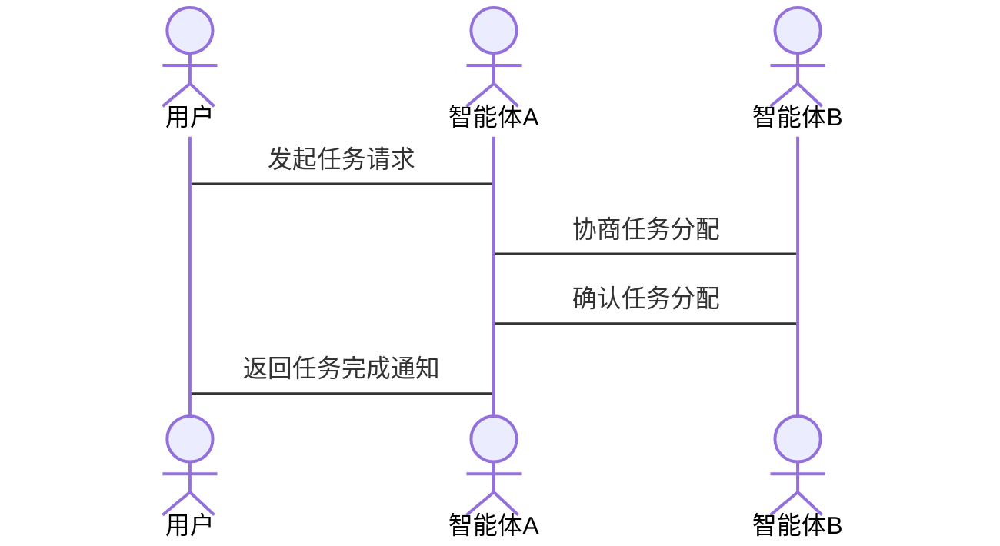

                 


# 基于多智能体的自动化产业升级趋势识别

## 关键词
多智能体、自动化升级、产业升级趋势、智能体系统、协作算法、自适应算法、系统架构

## 摘要
本文深入探讨了基于多智能体的自动化产业升级趋势识别，分析了多智能体技术在产业升级中的应用背景、核心概念、算法原理、系统架构以及实际案例。通过详细阐述多智能体系统的原理和实现，结合实际项目案例，总结了最佳实践和未来趋势。

---

# 第1章 多智能体与产业升级概述

## 1.1 多智能体技术的定义与特点
### 1.1.1 多智能体系统的定义
多智能体系统（Multi-Agent System, MAS）是由多个智能体组成的分布式系统，每个智能体能够独立感知环境、做出决策并执行动作，通过协作完成复杂任务。

### 1.1.2 多智能体系统的核心特点
- **分布式性**：多个智能体协同工作，无中心控制节点。
- **自主性**：每个智能体具有自主决策能力。
- **协作性**：智能体之间通过通信和协作完成共同目标。
- **反应性**：能够实时感知环境变化并做出响应。

### 1.1.3 多智能体技术与传统自动化技术的对比
| 特性               | 多智能体技术           | 传统自动化技术       |
|--------------------|----------------------|----------------------|
| 控制方式           | 分布式、自主         | 集中式、单一         |
| 灵活性             | 高                   | 低                   |
| 扩展性             | 强                   | 弱                   |
| 应用场景           | 复杂动态环境           | 稳定简单环境           |

## 1.2 自动化产业升级的背景与趋势
### 1.2.1 产业升级的背景分析
随着工业4.0和智能化时代的到来，传统自动化技术在复杂多变的环境中表现出局限性，亟需更灵活、智能的解决方案。

### 1.2.2 自动化技术在产业升级中的作用
多智能体技术能够提高生产效率、降低成本、增强系统的自适应能力，是推动产业升级的核心技术之一。

### 1.2.3 多智能体技术在自动化升级中的优势
- **灵活性**：能够快速适应环境变化。
- **协作性**：多个智能体协同工作，提升整体效率。
- **可扩展性**：适用于大规模复杂场景。

## 1.3 问题背景与问题描述
### 1.3.1 当前产业升级中的主要问题
- **复杂性**：传统自动化系统难以应对复杂的动态环境。
- **效率低下**：系统扩展性差，难以满足大规模需求。
- **灵活性不足**：难以快速响应市场变化。

### 1.3.2 多智能体技术如何解决这些问题
通过分布式协作和自主决策，多智能体系统能够有效应对复杂环境，提高效率和灵活性。

### 1.3.3 问题的边界与外延
- **边界**：专注于产业升级中的技术实现，不涉及具体业务流程。
- **外延**：多智能体技术不仅适用于制造业，还可应用于物流、交通等领域。

## 1.4 核心概念与联系
### 1.4.1 多智能体系统的核心要素
- **智能体**：独立决策的单元。
- **通信机制**：智能体之间的信息交互方式。
- **协作机制**：智能体协同完成任务的规则。

### 1.4.2 实体关系图（ER图）展示
```mermaid
er
    actor 多智能体系统
    actor 升级需求
    actor 技术实现
    actor 应用场景
    actor 性能指标
    actor 优化目标
    多智能体系统 --> 升级需求
    多智能体系统 --> 技术实现
    技术实现 --> 应用场景
    应用场景 --> 性能指标
    性能指标 --> 优化目标
```

## 1.5 本章小结
### 1.5.1 多智能体技术的核心作用
通过分布式协作和自主决策，多智能体技术能够有效解决产业升级中的复杂问题。

### 1.5.2 产业升级趋势的识别方法
基于多智能体技术的系统架构和协作机制，能够识别产业升级的关键趋势。

### 1.5.3 问题解决的总体框架
通过分析问题背景、提出解决方案，并结合多智能体技术的特点，构建高效的产业升级框架。

---

# 第2章 多智能体系统的核心原理

## 2.1 多智能体系统的原理
### 2.1.1 多智能体系统的组成
- **智能体**：独立决策的单元。
- **通信机制**：智能体之间的信息交互方式。
- **协作机制**：智能体协同完成任务的规则。

### 2.1.2 智能体之间的通信机制
- **消息传递**：智能体通过发送消息进行通信。
- **中间件**：使用消息队列或事件总线进行通信。

### 2.1.3 多智能体系统的协调与协作
- **分布式协调**：通过中间件实现协调。
- **任务分配**：基于智能体的能力进行任务分配。

## 2.2 多智能体系统的核心算法
### 2.2.1 分布式算法
- **分布式一致性**：确保系统中各智能体状态一致。
- **分布式决策**：基于局部信息做出全局决策。

### 2.2.2 协作算法
- **协商算法**：智能体通过协商分配任务。
- **优先级排序**：根据任务优先级动态调整协作顺序。

### 2.2.3 自适应算法
- **自适应控制**：根据环境变化动态调整系统参数。
- **自学习机制**：通过机器学习提升智能体的决策能力。

## 2.3 算法原理的数学模型与公式
### 2.3.1 分布式算法的数学模型
$$
\text{状态一致性} = \sum_{i=1}^{n} |s_i - s_{i+1}|
$$
其中，\( s_i \) 表示第i个智能体的状态，\( n \) 表示智能体数量。

### 2.3.2 协作算法的数学模型
$$
\text{任务分配} = \argmax_{i} (p_i + c_i)
$$
其中，\( p_i \) 表示智能体i的优先级，\( c_i \) 表示智能体i的能力。

## 2.4 本章小结
### 2.4.1 多智能体系统的核心算法
通过分布式算法、协作算法和自适应算法，多智能体系统能够高效地完成复杂任务。

### 2.4.2 算法的数学模型
通过数学模型和公式，详细阐述了算法的实现原理和应用场景。

### 2.4.3 算法在产业升级中的应用
多智能体系统的算法能够有效提升产业升级的效率和灵活性。

---

# 第3章 多智能体系统的实现与应用

## 3.1 系统分析与架构设计
### 3.1.1 项目场景介绍
以智能工厂为例，分析多智能体系统的应用场景。

### 3.1.2 系统功能设计
- **智能体管理**：智能体的注册、管理与监控。
- **任务分配**：根据智能体的能力动态分配任务。
- **协作机制**：智能体之间的协作与通信。

### 3.1.3 系统架构设计


### 3.1.4 系统接口设计
- **智能体接口**：提供智能体注册、任务接收和状态更新的接口。
- **通信接口**：支持智能体之间的消息传递和事件通知。

### 3.1.5 系统交互流程


## 3.2 项目实战
### 3.2.1 环境安装
- **Python环境**：安装Python 3.8及以上版本。
- **依赖库安装**：使用pip安装所需库，如`asyncio`、`websockets`。

### 3.2.2 系统核心实现
#### 3.2.2.1 智能体类的实现
```python
class Agent:
    def __init__(self, id):
        self.id = id
        self.state = "idle"
    
    async def receive_message(self, message):
        # 处理接收到的消息
        pass
    
    async def send_message(self, message, target):
        # 发送消息给目标智能体
        pass
```

#### 3.2.2.2 任务分配算法实现
```python
def distribute_task(tasks, agents):
    # 根据智能体的能力分配任务
    pass
```

### 3.2.3 案例分析
以智能工厂为例，详细分析多智能体系统的实际应用，展示系统的协作流程和实现效果。

## 3.3 本章小结
### 3.3.1 系统实现的关键点
通过智能体管理、任务分配和协作机制，实现了高效的多智能体系统。

### 3.3.2 项目实战的意义
通过实际案例，展示了多智能体技术在产业升级中的具体应用和效果。

### 3.3.3 系统设计的经验总结
总结了系统设计中的关键点和最佳实践，为后续项目提供参考。

---

# 第4章 最佳实践与未来趋势

## 4.1 最佳实践
### 4.1.1 系统设计
- **模块化设计**：确保系统的可扩展性和可维护性。
- **容错设计**：增强系统的鲁棒性。

### 4.1.2 系统优化
- **性能优化**：通过优化算法和通信机制提升系统效率。
- **资源优化**：合理分配资源，避免浪费。

## 4.2 小结
### 4.2.1 多智能体技术的核心作用
通过多智能体技术，能够实现高效、灵活的产业升级。

### 4.2.2 产业升级趋势的识别方法
基于多智能体技术的系统架构和协作机制，能够准确识别产业升级的关键趋势。

### 4.2.3 问题解决的总体框架
通过分析问题背景、提出解决方案，并结合多智能体技术的特点，构建高效的产业升级框架。

## 4.3 注意事项
- **系统安全性**：确保智能体之间的通信安全。
- **隐私保护**：保护智能体的数据隐私。

## 4.4 拓展阅读
- **相关书籍**：推荐几本关于多智能体系统和自动化技术的书籍。
- **技术博客**：推荐一些深入探讨多智能体技术的应用博客。

---

# 结语
基于多智能体的自动化产业升级趋势识别是一个复杂而重要的课题。通过本文的详细阐述，读者可以深入了解多智能体技术的核心原理、系统架构以及实际应用。未来，随着技术的不断进步，多智能体技术将在更多领域发挥重要作用。

---

# 参考文献
（此处列出参考文献）

---

# 附录
（此处列出附录内容）

---

以上是基于多智能体的自动化产业升级趋势识别的完整目录和部分章节内容的详细思考过程。

