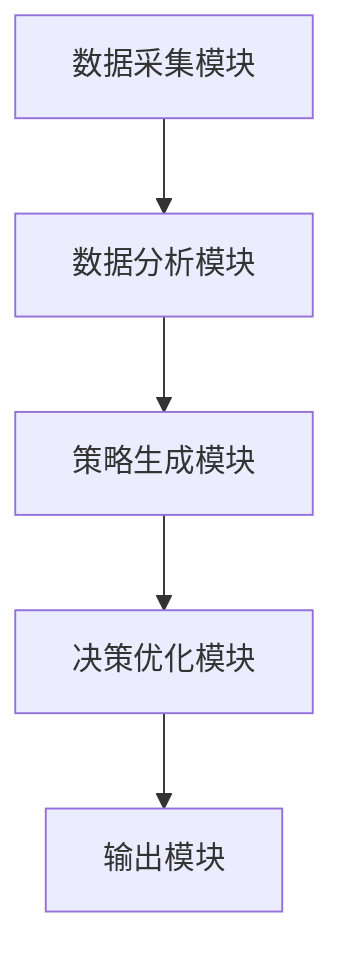

                 


# 基于多智能体的自动化公司战略规划分析系统

> 关键词：多智能体系统，战略规划，自动化，算法原理，系统架构，项目实战

> 摘要：本文探讨了基于多智能体的自动化公司战略规划分析系统的构建与实现。通过分析多智能体系统的核心概念、算法原理、系统架构设计以及项目实战，本文详细阐述了如何利用多智能体技术提升公司战略规划的自动化水平。从概念模型到系统实现，从算法设计到实际应用，本文为读者提供了一套完整的解决方案。

---

# 第一部分: 基于多智能体的自动化公司战略规划分析系统概述

## 第1章: 多智能体系统与战略规划概述

### 1.1 多智能体系统的基本概念

#### 1.1.1 多智能体系统的定义与特点
多智能体系统（Multi-Agent System, MAS）是由多个智能体（Agent）组成的分布式系统，这些智能体能够通过交互和协作完成特定任务。多智能体系统的几个关键特点包括：
- **自主性**：每个智能体都能独立感知环境并做出决策。
- **反应性**：智能体能够实时响应环境变化。
- **协作性**：多个智能体通过协作完成复杂任务。
- **分布性**：智能体分布在不同的空间或计算节点上，具有高度的并行性。

#### 1.1.2 多智能体系统的核心要素
多智能体系统的核心要素包括：
1. **智能体**：智能体是系统的基本单元，具有感知、决策和执行能力。
2. **通信机制**：智能体之间的通信是通过某种协议或接口实现的。
3. **协作机制**：智能体之间的协作是通过某种任务分配或协调机制实现的。
4. **环境模型**：智能体需要感知和理解所处的环境。

#### 1.1.3 多智能体系统与传统单智能体系统的区别
传统单智能体系统通常由一个中心化的控制单元完成任务，而多智能体系统则通过分布式的智能体协作完成任务。多智能体系统的优点在于其灵活性和扩展性，能够适应复杂的动态环境。

### 1.2 公司战略规划的基本概念

#### 1.2.1 战略规划的定义与目标
战略规划是企业在复杂环境中为实现长期目标而制定的一系列策略和行动计划。其目标是帮助企业应对不确定性，抓住机遇，规避风险。

#### 1.2.2 战略规划的核心要素
战略规划的核心要素包括：
1. **目标设定**：明确企业的长期目标。
2. **资源分配**：合理分配企业资源以实现目标。
3. **策略制定**：制定实现目标的具体策略。
4. **风险评估**：评估可能的风险并制定应对措施。

#### 1.2.3 战略规划的实施过程
战略规划的实施过程通常包括以下几个步骤：
1. **目标设定**：明确企业的战略目标。
2. **环境分析**：分析内外部环境，识别机会和威胁。
3. **策略制定**：制定实现目标的具体策略。
4. **资源分配**：分配资源以支持策略的实施。
5. **监控与调整**：监控战略执行情况，并根据需要进行调整。

### 1.3 基于多智能体的自动化战略规划系统背景

#### 1.3.1 传统战略规划的局限性
传统战略规划通常依赖于人工分析和决策，存在以下问题：
- **效率低下**：人工分析需要大量时间和资源。
- **主观性**：决策过程容易受到主观因素的影响。
- **灵活性不足**：难以快速响应环境变化。

#### 1.3.2 多智能体系统在战略规划中的优势
多智能体系统在战略规划中的优势包括：
- **高效性**：多智能体系统能够快速分析大量数据，提高决策效率。
- **准确性**：通过智能体之间的协作，能够得到更准确的分析结果。
- **灵活性**：多智能体系统能够快速适应环境变化。

#### 1.3.3 自动化战略规划系统的应用场景
自动化战略规划系统可以应用于企业战略制定、市场分析、风险评估等多个领域。特别是在复杂动态环境中，自动化战略规划系统能够帮助企业快速做出决策。

### 1.4 本章小结
本章介绍了多智能体系统的基本概念和战略规划的核心要素，分析了传统战略规划的局限性和多智能体系统在战略规划中的优势，最后讨论了自动化战略规划系统的应用场景。

---

## 第2章: 多智能体系统的核心概念与联系

### 2.1 多智能体系统的概念模型

#### 2.1.1 多智能体系统的组成结构
多智能体系统的组成结构包括以下几个部分：
- **智能体**：系统的最基本单元，具有自主性、反应性和协作性。
- **通信机制**：智能体之间的通信接口或协议。
- **协作机制**：智能体之间的任务分配和协调机制。
- **环境模型**：智能体感知和理解的环境模型。

#### 2.1.2 多智能体系统的交互机制
多智能体系统的交互机制包括以下几个方面：
- **通信**：智能体之间通过某种协议进行信息交换。
- **协作**：智能体通过协作完成特定任务。
- **协调**：智能体通过协调机制解决冲突和优化任务分配。

#### 2.1.3 多智能体系统与传统单智能体系统的区别
多智能体系统与传统单智能体系统的区别主要体现在以下几个方面：
- **系统结构**：多智能体系统是分布式的，而传统单智能体系统是集中式的。
- **协作性**：多智能体系统强调协作，而传统单智能体系统通常是独立的。
- **灵活性**：多智能体系统具有更高的灵活性和扩展性。

### 2.2 战略规划分析系统的概念模型

#### 2.2.1 战略规划分析系统的组成结构
战略规划分析系统的组成结构包括以下几个部分：
- **数据输入模块**：输入企业的内外部环境数据。
- **分析模块**：对数据进行分析，生成战略规划建议。
- **决策模块**：根据分析结果做出决策。
- **输出模块**：输出战略规划方案。

#### 2.2.2 战略规划分析系统的功能模块
战略规划分析系统的功能模块包括：
- **数据采集模块**：采集企业内外部数据。
- **数据分析模块**：对数据进行分析和处理。
- **策略生成模块**：生成战略规划策略。
- **决策优化模块**：优化决策方案。

#### 2.2.3 战略规划分析系统的数据流
战略规划分析系统的数据流包括以下几个步骤：
1. 数据采集：从外部环境和企业内部获取数据。
2. 数据处理：对数据进行清洗和预处理。
3. 数据分析：对数据进行建模和分析。
4. 策略生成：根据分析结果生成战略规划策略。
5. 决策优化：优化决策方案，确保最优解。

### 2.3 多智能体与战略规划系统的实体关系图

#### 2.3.1 实体关系图的构建
多智能体与战略规划系统的实体关系图如下：

```mermaid
erDiagram
    actor 智能体 {
        string id
        string 类型
        string 状态
    }
    actor 环境 {
        string id
        string 类型
        string 参数
    }
    actor 任务 {
        string id
        string 类型
        string 描述
    }
    智能体 --> 环境 : 感知
    智能体 --> 任务 : 执行
    环境 --> 任务 : 提供参数
```

#### 2.3.2 实体关系图的分析
从实体关系图可以看出，智能体通过感知环境并执行任务来实现战略规划。环境为任务提供参数，任务由智能体执行，智能体通过感知环境来调整任务执行策略。

#### 2.3.3 实体关系图的应用
实体关系图可以帮助我们更好地理解多智能体系统与战略规划系统的交互过程，为后续的系统设计和实现提供依据。

### 2.4 本章小结
本章通过构建多智能体系统和战略规划分析系统的概念模型，分析了多智能体系统的核心概念和实体关系图，为后续的系统设计和实现奠定了基础。

---

## 第3章: 基于多智能体的战略规划分析算法原理

### 3.1 多智能体协作算法

#### 3.1.1 多智能体协作的基本原理
多智能体协作算法的基本原理是通过智能体之间的协作完成特定任务。协作过程包括任务分配、信息共享和协同决策。

#### 3.1.2 多智能体协作的实现步骤
多智能体协作的实现步骤包括：
1. **任务分配**：根据智能体的能力和环境需求分配任务。
2. **信息共享**：智能体之间共享信息，确保协作顺利进行。
3. **协同决策**：智能体基于共享信息做出决策。

#### 3.1.3 多智能体协作的优化方法
多智能体协作的优化方法包括：
- **任务分配优化**：通过优化算法提高任务分配效率。
- **信息共享优化**：减少信息冗余，提高信息利用率。
- **协同决策优化**：通过改进决策模型提高决策准确性。

#### 3.1.4 多智能体协作的算法实现
以下是一个简单的多智能体协作算法实现示例：

```python
class Agent:
    def __init__(self, id, type):
        self.id = id
        self.type = type
        self.state = "idle"

    def感知环境(self, environment):
        # 根据环境信息调整状态
        self.state = "busy"

    def 执行任务(self, task):
        # 根据任务类型执行任务
        if task.type == self.type:
            self.感知环境(environment)
            self.execute(task)

    def execute(self, task):
        print(f"Agent {self.id} is executing task {task.id}")

# 示例用法
environment = Environment()  # 假设Environment类已定义
task = Task(id=1, type="analysis")
agent = Agent(id=1, type="analysis")
agent.感知环境(environment)
agent.执行任务(task)
```

### 3.2 战略规划分析算法

#### 3.2.1 战略规划分析算法的定义
战略规划分析算法是用于分析企业内外部环境，生成战略规划建议的算法。

#### 3.2.2 战略规划分析算法的实现流程
战略规划分析算法的实现流程包括以下几个步骤：
1. **数据采集**：从外部环境和企业内部获取数据。
2. **数据预处理**：对数据进行清洗和预处理。
3. **数据分析**：对数据进行建模和分析。
4. **策略生成**：根据分析结果生成战略规划策略。
5. **决策优化**：优化决策方案，确保最优解。

#### 3.2.3 战略规划分析算法的数学模型
战略规划分析算法的数学模型可以表示为：

$$
\text{策略} = f(\text{数据}, \text{模型参数})
$$

其中，f 表示分析算法，数据是输入数据，模型参数是算法的参数。

#### 3.2.4 战略规划分析算法的实现示例
以下是一个简单的战略规划分析算法实现示例：

```python
def 分析环境(environment_data):
    # 数据预处理
    processed_data = preprocess(environment_data)
    # 数据分析
    analysis_result = analyze(processed_data)
    # 生成策略
    策略 = generate_strategy(analysis_result)
    return 策略

# 示例用法
environment_data = {
    "市场": "增长",
    "竞争": "低",
    "资源": "充足"
}
result = 分析环境(environment_data)
print(result)
```

### 3.3 多智能体协作与战略规划分析的结合

#### 3.3.1 多智能体协作在战略规划中的应用
多智能体协作在战略规划中的应用包括：
- **任务分配**：根据智能体的能力分配任务。
- **信息共享**：智能体之间共享环境信息和任务进展。
- **协同决策**：智能体基于共享信息做出决策。

#### 3.3.2 多智能体协作与战略规划分析的结合流程
多智能体协作与战略规划分析的结合流程包括：
1. **任务分配**：根据战略规划需求分配任务。
2. **信息共享**：智能体之间共享环境信息和任务进展。
3. **协同决策**：基于共享信息生成战略规划建议。

#### 3.3.3 多智能体协作与战略规划分析的优化策略
多智能体协作与战略规划分析的优化策略包括：
- **任务分配优化**：通过改进任务分配算法提高效率。
- **信息共享优化**：减少信息冗余，提高信息利用率。
- **协同决策优化**：通过改进决策模型提高决策准确性。

### 3.4 本章小结
本章详细讲解了多智能体协作算法和战略规划分析算法的原理和实现方法，并通过示例代码展示了算法的具体实现。最后，讨论了多智能体协作与战略规划分析的结合和优化策略。

---

## 第4章: 基于多智能体的战略规划分析系统的架构设计

### 4.1 系统架构设计概述

#### 4.1.1 系统架构设计的目标
系统架构设计的目标是构建一个高效、灵活、可扩展的多智能体战略规划分析系统。

#### 4.1.2 系统架构设计的步骤
系统架构设计的步骤包括：
1. **需求分析**：明确系统的需求和目标。
2. **功能模块划分**：将系统划分为功能模块。
3. **模块交互设计**：设计模块之间的交互流程。
4. **系统架构图绘制**：绘制系统架构图。

#### 4.1.3 系统架构设计的实现方法
系统架构设计的实现方法包括：
- **模块化设计**：将系统划分为功能模块，每个模块负责特定功能。
- **接口设计**：设计模块之间的接口，确保模块之间的协作。
- **通信机制设计**：设计智能体之间的通信机制。

### 4.2 系统功能设计

#### 4.2.1 系统功能模块划分
系统功能模块划分为以下几个部分：
- **数据采集模块**：负责采集企业内外部环境数据。
- **数据分析模块**：对数据进行分析和处理。
- **策略生成模块**：根据分析结果生成战略规划策略。
- **决策优化模块**：优化决策方案，确保最优解。

#### 4.2.2 系统功能模块的交互流程
系统功能模块的交互流程包括：
1. 数据采集模块采集数据。
2. 数据分析模块对数据进行处理。
3. 策略生成模块根据分析结果生成策略。
4. 决策优化模块优化决策方案。

#### 4.2.3 系统功能模块的实现细节
系统功能模块的实现细节包括：
- 数据采集模块：通过API或数据库获取数据。
- 数据分析模块：使用机器学习或统计分析方法进行分析。
- 策略生成模块：根据分析结果生成策略。
- 决策优化模块：通过优化算法提高决策的准确性。

### 4.3 系统架构图

#### 4.3.1 系统架构图的构建
系统架构图如下：



#### 4.3.2 系统架构图的分析
从系统架构图可以看出，数据采集模块通过数据分析模块生成策略，策略生成模块通过决策优化模块优化决策方案，最后输出模块输出最终的决策方案。

#### 4.3.3 系统架构图的应用
系统架构图可以帮助我们更好地理解系统的结构和功能模块之间的交互关系，为后续的系统实现提供依据。

### 4.4 本章小结
本章通过系统架构设计，明确了系统的功能模块和交互流程，为后续的系统实现奠定了基础。

---

## 第5章: 基于多智能体的战略规划分析系统的实现

### 5.1 系统环境搭建

#### 5.1.1 系统环境的要求
系统环境的要求包括：
- **硬件要求**：需要一台性能较好的计算机，建议配置为8GB内存，2核及以上CPU。
- **软件要求**：需要安装Python编程语言和相关库（如numpy、pandas、scikit-learn等）。

#### 5.1.2 系统环境的安装步骤
系统环境的安装步骤包括：
1. 安装Python：从官方网站下载并安装Python。
2. 安装必要的库：使用pip安装numpy、pandas、scikit-learn等库。
3. 安装Mermaid：安装Mermaid CLI或使用在线工具。

### 5.2 系统核心实现

#### 5.2.1 数据采集模块的实现
数据采集模块的实现包括：
- 通过API或数据库获取企业内外部环境数据。
- 数据清洗和预处理。

#### 5.2.2 数据分析模块的实现
数据分析模块的实现包括：
- 使用机器学习或统计分析方法对数据进行分析。
- 生成分析结果。

#### 5.2.3 策略生成模块的实现
策略生成模块的实现包括：
- 根据分析结果生成战略规划策略。
- 输出策略建议。

#### 5.2.4 决策优化模块的实现
决策优化模块的实现包括：
- 通过优化算法优化决策方案。
- 确保决策方案的最优性。

### 5.3 项目实战

#### 5.3.1 案例分析
以下是一个简单的案例分析：

假设某企业面临市场竞争加剧的问题，需要制定市场扩张策略。通过多智能体战略规划分析系统，企业可以快速分析市场环境，生成市场扩张策略，并优化决策方案。

#### 5.3.2 实现步骤
实现步骤包括：
1. 数据采集：采集市场环境数据。
2. 数据分析：分析市场环境，生成市场分析报告。
3. 策略生成：根据分析结果生成市场扩张策略。
4. 决策优化：优化决策方案，确保最优解。

#### 5.3.3 代码实现

以下是一个简单的代码实现示例：

```python
import numpy as np
import pandas as pd

# 数据采集模块
def 采集数据():
    data = pd.read_csv('market_data.csv')
    return data

# 数据分析模块
def 分析数据(data):
    # 假设data是一个DataFrame
    analysis_result = data.describe()
    return analysis_result

# 策略生成模块
def 生成策略(analysis_result):
    strategy = "市场扩张"
    return strategy

# 决策优化模块
def 优化决策(strategy):
    optimized_strategy = strategy + " with optimized parameters"
    return optimized_strategy

# 示例用法
data = 采集数据()
analysis_result = 分析数据(data)
strategy = 生成策略(analysis_result)
optimized_strategy = 优化决策(strategy)
print(optimized_strategy)
```

### 5.4 本章小结
本章通过实际案例分析，详细讲解了基于多智能体的战略规划分析系统的实现过程，包括数据采集、数据分析、策略生成和决策优化等步骤，并通过代码示例展示了系统的具体实现。

---

## 第6章: 总结与展望

### 6.1 本章总结
本文详细探讨了基于多智能体的自动化公司战略规划分析系统的构建与实现。通过分析多智能体系统的核心概念、算法原理、系统架构设计以及项目实战，本文为读者提供了一套完整的解决方案。

### 6.2 未来展望
未来，随着人工智能和大数据技术的不断发展，基于多智能体的自动化战略规划系统将更加智能化和高效化。我们可以期待以下几点发展：
1. **算法优化**：通过改进算法提高系统的效率和准确性。
2. **功能扩展**：增加更多功能模块，如风险预警、市场预测等。
3. **应用拓展**：将多智能体系统应用于更多领域，如供应链管理、市场营销等。

### 6.3 注意事项
在实际应用中，需要注意以下几点：
- **数据质量**：确保数据的准确性和完整性。
- **算法选择**：根据具体需求选择合适的算法。
- **系统维护**：定期维护系统，确保系统的稳定性和安全性。

### 6.4 拓展阅读
对于感兴趣的研究者，可以进一步阅读以下文献：
1. "Multi-Agent Systems: Complexity and Cognitive Phenomena" by G. Weiss
2. "Strategy Formulation and Implementation" by J. W. Gold

### 6.5 本章小结
本章总结了本文的主要内容，并对未来的发展方向和注意事项进行了展望，为读者提供了进一步研究和实践的方向。

---

# 第二部分: 附录

## 附录A: 术语表
- **多智能体系统（Multi-Agent System, MAS）**：由多个智能体组成的分布式系统，能够通过协作完成特定任务。
- **战略规划**：企业在复杂环境中为实现长期目标而制定的一系列策略和行动计划。
- **协作机制**：智能体之间的任务分配和协调机制。
- **实体关系图（ER图）**：用于描述系统中各实体之间的关系。

## 附录B: 参考文献
1. G. Weiss, "Multi-Agent Systems: Complexity and Cognitive Phenomena," MIT Press, 1999.
2. J. W. Gold, "Strategy Formulation and Implementation," Palgrave Macmillan, 2010.
3. A. Newell, " unified theory of cognition," Harvard University Press, 1990.

---

# 结语

基于多智能体的自动化公司战略规划分析系统的构建与实现是一项具有重要意义的课题。通过本文的详细讲解，读者可以深入了解多智能体系统的核心概念和战略规划分析系统的实现方法。未来，随着人工智能和大数据技术的不断发展，基于多智能体的自动化战略规划系统将发挥更大的作用，为企业的决策提供更有力的支持。

