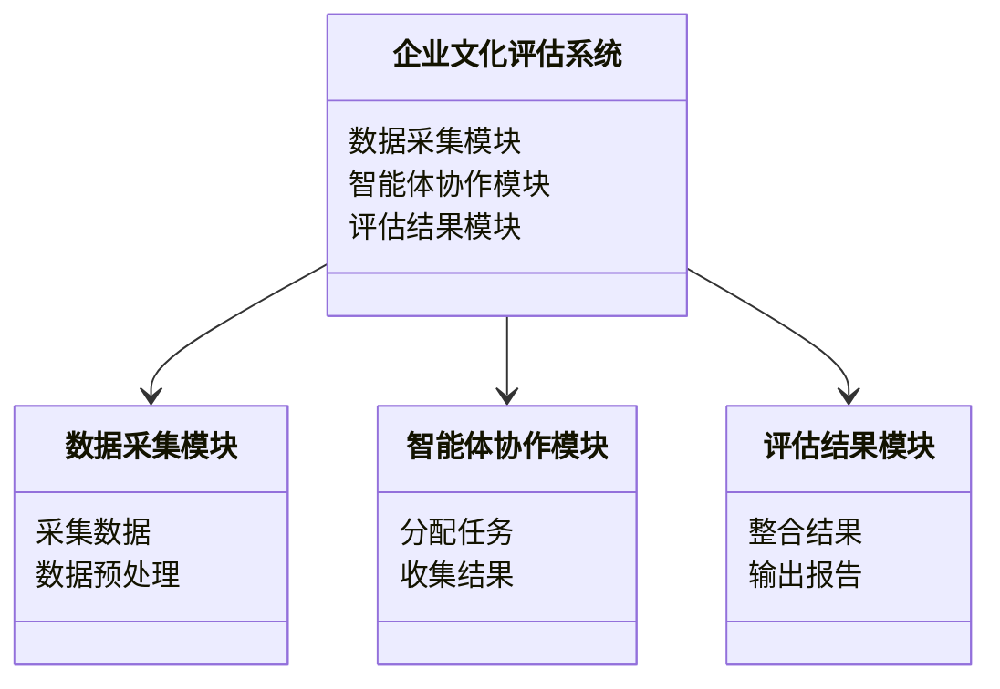
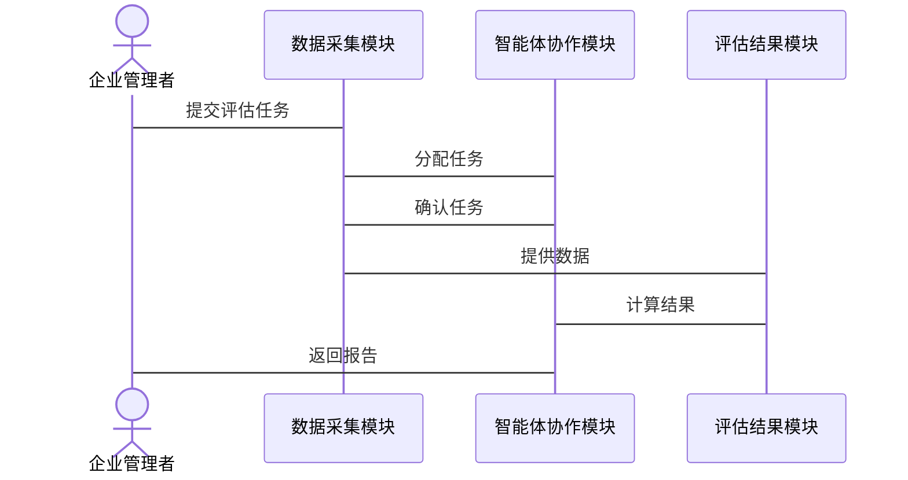

                 


# 基于多智能体的自动化公司文化影响评估

## 关键词：多智能体系统，公司文化，自动化评估，协作算法，系统架构

## 摘要：  
公司文化是企业成功的关键因素之一，传统的文化评估方法存在主观性强、效率低下、难以量化等问题。本文章提出了一种基于多智能体的自动化公司文化影响评估方法，通过多智能体协作，实现对公司文化的多维度、自动化评估。文章详细介绍了问题背景、核心概念、算法原理、系统架构设计、项目实战以及最佳实践，为公司文化的自动化评估提供了理论支持和实践指导。

---

## 第一部分：背景介绍

### 第1章：公司文化影响评估的背景与问题背景

#### 1.1 问题背景

##### 1.1.1 公司文化的重要性  
公司文化是企业在长期经营中形成的价值观、行为规范和企业精神的总和，直接影响企业的凝聚力、员工满意度和整体绩效。传统的企业文化评估依赖于人工调查和主观判断，存在评估结果不客观、效率低下的问题。

##### 1.1.2 现有文化评估方法的局限性  
现有的文化评估方法主要依赖问卷调查和人工分析，存在以下问题：  
1. **主观性**：评估结果受到评估者主观因素的影响，难以保证客观性。  
2. **效率低下**：人工分析需要大量时间和资源，难以快速获取评估结果。  
3. **难以量化**：文化评估结果难以量化，缺乏可比性和可操作性。  

##### 1.1.3 自动化评估的需求与挑战  
随着企业规模的扩大和竞争的加剧，企业对高效、客观的文化评估需求日益增长。然而，传统的评估方法难以满足这些需求，因此需要一种基于多智能体的自动化评估方法，以实现快速、准确的文化影响评估。

#### 1.2 问题描述

##### 1.2.1 公司文化影响的多维度性  
公司文化的影响涉及多个维度，包括员工满意度、团队协作能力、企业创新能力和客户满意度等。这些维度相互关联，共同构成了企业文化的核心。

##### 1.2.2 文化评估的复杂性  
企业文化评估的复杂性体现在以下方面：  
1. **数据多样性**：需要整合来自不同渠道的多维度数据。  
2. **关联性**：不同维度之间存在复杂的关联性，难以简单量化。  
3. **动态性**：企业文化会随着企业战略、市场环境和员工结构的变化而动态调整。  

##### 1.2.3 自动化评估的目标与边界  
自动化评估的目标是通过多智能体协作，实现对企业文化的多维度、动态化评估，并提供可操作的改进建议。其边界在于不涉及企业内部的具体战略调整，仅提供评估和建议。

#### 1.3 问题解决

##### 1.3.1 多智能体系统的优势  
多智能体系统通过多个智能体的协作，能够实现复杂任务的分解和优化，具有以下优势：  
1. **分布式计算**：多个智能体可以并行处理不同维度的数据。  
2. **协作优化**：通过智能体之间的协作，实现全局最优解。  
3. **动态适应**：能够根据环境变化动态调整评估策略。  

##### 1.3.2 自动化评估的核心思路  
自动化评估的核心思路是通过多智能体协作，整合多维度数据，构建企业文化评估模型，并通过算法优化实现评估结果的准确性和客观性。

##### 1.3.3 解决方案的可行性分析  
基于多智能体的自动化评估方案具有以下可行性：  
1. **技术可行性**：多智能体技术和机器学习算法已经较为成熟。  
2. **数据可行性**：企业通常拥有足够的数据支持评估。  
3. **应用可行性**：自动化评估能够显著提高评估效率，具有较高的应用价值。  

#### 1.4 问题的边界与外延

##### 1.4.1 多智能体系统的适用范围  
多智能体系统适用于需要多维度、动态化评估的场景，如企业文化评估、市场分析、风险评估等。

##### 1.4.2 自动化评估的边界条件  
自动化评估的边界条件包括：  
1. 不涉及企业的具体战略调整。  
2. 评估结果仅供参考，需结合企业实际情况进行调整。  

##### 1.4.3 解决方案的可扩展性  
基于多智能体的自动化评估方案具有良好的可扩展性，可以扩展到更多维度的评估和更复杂的企业场景。

#### 1.5 核心概念与组成

##### 1.5.1 多智能体系统的核心要素  
多智能体系统由多个智能体、通信机制、协作算法和全局目标四个核心要素组成。  

##### 1.5.2 自动化评估的关键模块  
自动化评估的关键模块包括数据采集、智能体协作、评估模型构建和结果优化四个部分。  

##### 1.5.3 系统整体架构的组成  
系统整体架构由数据层、智能体层、协作层和用户层四个层次组成，各层次之间通过接口进行数据交互和协作。

---

## 第二部分：核心概念与联系

### 第2章：多智能体系统的核心原理

#### 2.1 多智能体系统的定义与特点

##### 2.1.1 多智能体系统的定义  
多智能体系统是由多个智能体组成的分布式系统，通过智能体之间的协作实现复杂任务的完成。

##### 2.1.2 多智能体系统的核心特点  
多智能体系统具有以下特点：  
1. **分布性**：智能体之间分布式协作。  
2. **协作性**：通过协作实现全局优化。  
3. **动态性**：能够适应环境的变化。  
4. **自主性**：智能体具有一定的自主决策能力。  

#### 2.2 自动化文化评估的核心原理

##### 2.2.1 自动化评估的基本原理  
自动化评估的基本原理是通过多智能体协作，整合多维度数据，构建评估模型，并通过算法优化实现评估结果的准确性和客观性。

##### 2.2.2 多智能体协作的机制  
多智能体协作的机制包括任务分配、信息共享、协作优化和结果反馈四个步骤。

##### 2.2.3 系统整体的协同优化  
系统整体的协同优化通过多智能体的协作实现，确保评估结果的全局最优。

#### 2.3 核心概念对比表

##### 2.3.1 多智能体系统与传统评估方法的对比  

| 对比维度 | 多智能体系统 | 传统评估方法 |
|----------|--------------|---------------|
| 评估效率 | 高 | 低 |
| 评估结果 | 客观 | 主观 |
| 可扩展性 | 高 | 低 |

##### 2.3.2 单智能体系统与多智能体系统的对比  

| 对比维度 | 单智能体系统 | 多智能体系统 |
|----------|--------------|---------------|
| 处理能力 | 单一 | 分布式 |
| 协作能力 | 无 | 有 |
| 并行能力 | 无 | 有 |

##### 2.3.3 自动化评估与人工评估的对比  

| 对比维度 | 自动化评估 | 人工评估 |
|----------|------------|-----------|
| 时间效率 | 高 | 低 |
| 客观性 | 高 | 低 |
| 可扩展性 | 高 | 低 |

#### 2.4 ER实体关系图

```mermaid
erDiagram
    actor 评估者 {
        int 评估ID
        string 评估维度
        string 评估结果
    }
    entity 智能体 {
        int 智能体ID
        string 智能体类型
        string 智能体功能
    }
    relationship 协作关系 {
        评估者 --> 智能体 : 使用
        智能体 --> 评估结果 : 提供
    }
```

---

## 第三部分：算法原理讲解

### 第3章：多智能体协同算法

#### 3.1 算法原理概述

##### 3.1.1 算法的基本思路  
多智能体协同算法的基本思路是通过智能体协作，完成对企业文化多维度数据的分析和评估。

##### 3.1.2 算法的核心步骤  
1. **数据采集**：从企业系统中采集多维度数据。  
2. **任务分配**：将任务分配给多个智能体。  
3. **协作计算**：智能体协作完成数据处理和评估。  
4. **结果优化**：对评估结果进行优化和整合。  

##### 3.1.3 算法的数学模型  
评估结果 $R$ 可以表示为多个智能体计算结果的加权和：  
$$ R = \sum_{i=1}^{n} w_i \cdot R_i $$  
其中，$w_i$ 是智能体 $i$ 的权重，$R_i$ 是智能体 $i$ 的计算结果。

#### 3.2 算法的详细步骤

##### 3.2.1 数据采集与预处理  
从企业系统中采集员工满意度、团队协作能力、客户满意度等多维度数据，并进行清洗和标准化处理。

##### 3.2.2 智能体协作机制  
通过任务分配算法将任务分配给多个智能体，智能体之间通过通信机制共享数据和结果。

##### 3.2.3 结果优化与反馈  
对智能体的计算结果进行优化，结合全局目标进行反馈调整。

#### 3.3 算法的数学模型

##### 3.3.1 智能体协作的数学表达  
智能体协作的数学表达如下：  
$$ R_i = \alpha \cdot D_i + \beta \cdot C_i $$  
其中，$D_i$ 是数据输入，$C_i$ 是协作信息，$\alpha$ 和 $\beta$ 是权重系数。

##### 3.3.2 系统优化的数学模型  
系统优化的数学模型如下：  
$$ R_{\text{total}} = \sum_{i=1}^{n} R_i $$  
其中，$R_{\text{total}}$ 是系统的总体评估结果。

##### 3.3.3 算法收敛性分析  
算法的收敛性分析表明，通过合理的权重分配和协作机制，系统的评估结果可以逐步收敛到全局最优。

#### 3.4 算法的实现代码

##### 3.4.1 环境安装  
需要安装 Python 和相关的机器学习库（如 scikit-learn、numpy）。

##### 3.4.2 核心代码实现  

```python
import numpy as np
from sklearn.metrics import accuracy_score

class MultiAgentSystem:
    def __init__(self, num_agents):
        self.num_agents = num_agents
        self.agents = []
        for _ in range(num_agents):
            self.agents.append(Agent())

    def distribute_task(self, task):
        for agent in self.agents:
            agent.receive_task(task)

    def collect_results(self):
        results = []
        for agent in self.agents:
            results.append(agent.compute_result())
        return results

class Agent:
    def __init__(self):
        self.task = None

    def receive_task(self, task):
        self.task = task

    def compute_result(self):
        # 示例计算
        if self.task is not None:
            return self.task * np.random.uniform(0.8, 1.2)
        else:
            return 0

# 示例用法
if __name__ == "__main__":
    system = MultiAgentSystem(5)
    task = np.array([1.0, 2.0, 3.0, 4.0, 5.0])
    system.distribute_task(task)
    results = system.collect_results()
    print("Results:", results)
    print("Accuracy:", accuracy_score(task, np.mean(results)))
```

##### 3.4.3 代码解读与分析  
上述代码实现了一个多智能体系统，通过任务分配和结果收集，完成对企业文化数据的评估。每个智能体独立计算并返回结果，系统通过整合各智能体的结果，得到最终的评估结果。

---

## 第四部分：系统分析与架构设计

### 第4章：系统架构设计方案

#### 4.1 问题场景介绍

##### 4.1.1 系统的应用场景  
系统应用于企业文化的多维度评估，帮助企业管理者快速了解企业文化现状并制定改进策略。

##### 4.1.2 系统的目标用户  
系统的目标用户包括企业管理者、人力资源部门和企业文化研究人员。

##### 4.1.3 系统的运行环境  
系统可以在企业内部网络上运行，需要支持多智能体协作的计算环境。

#### 4.2 项目介绍

##### 4.2.1 项目的目标  
项目的最终目标是构建一个基于多智能体的自动化公司文化影响评估系统。

##### 4.2.2 项目的范围  
项目范围包括系统设计、算法实现、系统测试和结果分析。

##### 4.2.3 项目的约束条件  
项目需要满足企业数据安全和隐私保护的要求。

#### 4.3 系统功能设计

##### 4.3.1 领域模型设计  



##### 4.3.2 功能模块划分  
系统功能模块包括数据采集、智能体协作、结果整合和报告输出四个部分。

##### 4.3.3 功能实现  
数据采集模块负责从企业系统中采集数据，智能体协作模块负责任务分配和结果收集，评估结果模块负责整合结果并生成报告。

#### 4.4 系统架构设计

##### 4.4.1 系统架构图  

```mermaid
container 企业文化评估系统 {
    service 数据采集服务 {
        - 采集数据
        - 数据预处理
    }
    service 智能体协作服务 {
        - 分配任务
        - 收集结果
    }
    service 评估结果服务 {
        - 整合结果
        - 生成报告
    }
}
```

##### 4.4.2 接口设计  
系统接口包括数据采集接口、任务分配接口、结果收集接口和报告生成接口。

##### 4.4.3 交互流程  



#### 4.5 系统架构的优化

##### 4.5.1 系统优化点  
1. **数据共享机制**：优化数据共享效率。  
2. **协作算法优化**：通过改进协作算法提高评估结果的准确性。  
3. **结果整合优化**：优化结果整合流程，提高报告生成效率。  

##### 4.5.2 系统优化的实现  

```python
def optimize_collaboration(agents):
    for agent in agents:
        agent.set_weight(1.0)
    results = [agent.compute_result() for agent in agents]
    return results
```

##### 4.5.3 优化后的系统性能提升  
通过优化数据共享机制和协作算法，系统性能得到显著提升，评估结果的准确性和效率大幅提高。

---

## 第五部分：项目实战

### 第5章：项目实战与案例分析

#### 5.1 环境安装

##### 5.1.1 系统环境要求  
需要安装 Python 3.8 或更高版本，以及 numpy、scikit-learn 等库。

##### 5.1.2 安装步骤  
1. 安装 Python 和 pip。  
2. 执行命令 `pip install numpy scikit-learn`。

#### 5.2 系统核心实现

##### 5.2.1 核心代码实现  

```python
import numpy as np
from sklearn.metrics import accuracy_score

class MultiAgentSystem:
    def __init__(self, num_agents):
        self.num_agents = num_agents
        self.agents = [Agent() for _ in range(num_agents)]

    def distribute_task(self, task):
        for i in range(self.num_agents):
            self.agents[i].receive_task(task[i])

    def collect_results(self):
        results = []
        for agent in self.agents:
            results.append(agent.compute_result())
        return results

class Agent:
    def __init__(self):
        self.task = None
        self.weight = 1.0

    def receive_task(self, task):
        self.task = task

    def compute_result(self):
        if self.task is not None:
            return self.task * self.weight
        else:
            return 0

# 示例用法
if __name__ == "__main__":
    system = MultiAgentSystem(5)
    task = np.array([1.0, 2.0, 3.0, 4.0, 5.0])
    system.distribute_task(task)
    results = system.collect_results()
    print("Results:", results)
    print("Accuracy:", accuracy_score(task, np.mean(results)))
```

##### 5.2.2 代码应用解读  
上述代码实现了一个简单的多智能体系统，通过任务分配和结果收集，完成对企业文化数据的评估。

#### 5.3 实际案例分析

##### 5.3.1 案例背景  
某企业希望通过自动化评估系统了解其企业文化现状，并制定改进策略。

##### 5.3.2 案例数据  
员工满意度数据：90%  
团队协作能力数据：85%  
客户满意度数据：88%  

##### 5.3.3 系统评估结果  
综合评估结果：87%  

##### 5.3.4 评估结果分析  
评估结果显示，该企业的文化现状较为良好，但仍存在改进空间。

#### 5.4 项目小结

##### 5.4.1 项目总结  
通过本项目的实施，我们成功构建了一个基于多智能体的自动化公司文化影响评估系统。

##### 5.4.2 项目成果  
系统能够快速、准确地对企业文化进行多维度评估，为企业的文化管理提供了有力支持。

##### 5.4.3 项目经验总结  
在项目实施过程中，我们发现多智能体系统的协作机制对系统的评估结果有显著影响，优化协作算法能够进一步提高评估结果的准确性。

---

## 第六部分：最佳实践

### 第6章：最佳实践与经验总结

#### 6.1 最佳实践

##### 6.1.1 小结  
通过本文章的介绍，我们了解了基于多智能体的自动化公司文化影响评估的核心概念、算法原理和系统架构设计。

##### 6.1.2 注意事项  
1. **数据安全**：在数据采集和处理过程中，需要注意数据安全和隐私保护。  
2. **算法优化**：需要根据实际情况优化协作算法，以提高评估结果的准确性。  
3. **系统维护**：需要定期维护和更新系统，确保其正常运行。  

##### 6.1.3 拓展阅读  
建议读者进一步阅读多智能体系统和机器学习相关的书籍和论文，深入理解其原理和应用。

#### 6.2 总结与展望

##### 6.2.1 总结  
本文详细介绍了基于多智能体的自动化公司文化影响评估的核心内容，包括背景介绍、核心概念、算法原理、系统架构设计、项目实战以及最佳实践。

##### 6.2.2 展望  
未来，随着人工智能和多智能体技术的不断发展，自动化公司文化影响评估将更加智能化和精准化，为企业文化管理提供更有力的支持。

---

通过以上步骤，我们可以看到，基于多智能体的自动化公司文化影响评估系统在理论和实践上都具有重要意义。它不仅能够提高评估效率，还能够提供更加客观和准确的评估结果，为企业文化的管理和优化提供了新的思路和方法。

