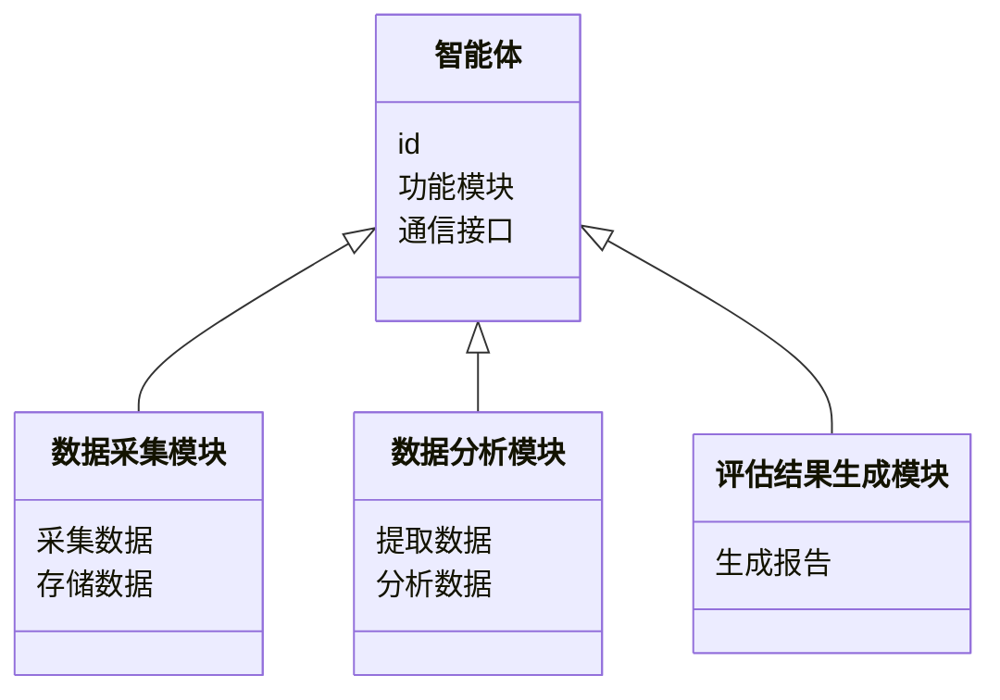

                 


# 基于多智能体的自动化公司文化评估

> 关键词：多智能体系统, 企业文化评估, 自动化评估, 智能体协作, 数据分析

> 摘要：本文探讨了基于多智能体的自动化公司文化评估方法，通过分析企业文化评估的传统挑战，提出了一种基于多智能体的创新解决方案。文章详细介绍了多智能体系统的核心原理、系统架构设计、算法实现以及实际应用场景，展示了如何利用多智能体技术提升企业文化评估的效率和准确性。通过案例分析和项目实战，本文为读者提供了从理论到实践的全面指导。

---

# 第一部分: 基于多智能体的公司文化评估背景与概念

# 第1章: 问题背景与描述

## 1.1 问题背景

### 1.1.1 企业文化评估的传统方法与挑战
企业文化的评估是企业管理和组织行为学中的重要课题。传统的企业文化评估方法主要依赖于问卷调查、访谈和数据分析等手段，这种方法虽然能够收集大量数据，但存在以下问题：
- 数据收集效率低：传统方法需要大量人工参与，耗时耗力。
- 数据分析复杂：数据种类多样，分析难度大，且容易受到主观因素影响。
- 评估结果的实时性差：传统方法难以实现对企业文化的实时监控和动态调整。

### 1.1.2 传统方法的局限性与改进需求
随着企业规模的不断扩大和组织结构的复杂化，传统的企业文化评估方法已经难以满足现代企业的需求。具体表现在以下几个方面：
- 数据来源单一：传统方法主要依赖于问卷调查，难以覆盖多维度的数据。
- 评估过程缺乏互动性：传统方法难以实现对评估过程的实时监控和动态调整。
- 评估结果的可操作性差：传统方法难以提供具体的改进方向和 actionable insights。

### 1.1.3 自动化评估的必要性与优势
自动化评估通过引入多智能体系统，能够实现对企业文化的实时监控、数据的自动采集和分析，从而提高评估效率和准确性。具体优势包括：
- 高效性：多智能体系统能够同时处理多种数据源，提高数据采集和分析效率。
- 实时性：系统能够实时监控企业文化的变化，及时发现潜在问题。
- 可扩展性：多智能体系统能够根据企业规模和需求进行灵活扩展。

## 1.2 问题描述

### 1.2.1 企业文化的核心要素与评估维度
企业文化的核心要素包括企业愿景、使命、价值观、组织结构、团队协作、员工满意度等。评估维度通常包括：
- 企业价值观的认同程度
- 团队协作的效率
- 员工满意度和幸福感
- 组织文化的适应性

### 1.2.2 评估过程中的数据收集与分析问题
企业在进行文化评估时，通常需要收集大量数据，包括员工反馈、管理数据、外部环境数据等。这些数据具有以下特点：
- 数据来源多样：包括结构化数据（如问卷调查）和非结构化数据（如文本数据）。
- 数据量大：企业规模越大，数据量越庞大。
- 数据复杂性高：不同数据源之间的关联性复杂，难以通过传统方法进行分析。

### 1.2.3 多智能体协作在评估中的潜在价值
多智能体系统通过协作完成任务，能够有效解决传统方法的局限性。具体表现为：
- 分布式数据采集：多个智能体可以同时从不同数据源采集数据，提高数据采集效率。
- 协作分析：智能体之间可以通过协作完成复杂的数据分析任务，提高分析结果的准确性。
- 实时监控：多智能体系统能够实现对企业文化的实时监控，及时发现和解决问题。

## 1.3 问题解决思路

### 1.3.1 多智能体系统的基本概念
多智能体系统（Multi-Agent System，MAS）是由多个智能体组成的系统，这些智能体能够通过协作完成特定任务。每个智能体都是一个独立的实体，具有以下特点：
- 智能性：能够感知环境并做出决策。
- 反应性：能够根据环境变化调整自身行为。
- 社会性：能够与其他智能体进行交互和协作。

### 1.3.2 多智能体在企业文化评估中的应用思路
在企业文化评估中，可以将多智能体系统应用于以下环节：
- 数据采集：智能体从不同数据源采集企业文化相关的数据。
- 数据分析：智能体协作完成数据的清洗、分析和建模。
- 结果生成：智能体根据分析结果生成企业文化评估报告。

### 1.3.3 系统边界与外延
系统边界是指多智能体系统在企业文化评估中的应用范围。外延则包括与系统相关的其他系统和环境。例如：
- 数据来源：员工反馈、管理数据、外部环境数据等。
- 数据处理：数据清洗、特征提取、数据分析等。
- 结果输出：评估报告、改进建议等。

## 1.4 核心概念与联系

### 1.4.1 多智能体系统的核心要素
多智能体系统的核心要素包括：
- 智能体：负责完成特定任务的实体。
- 通信机制：智能体之间进行信息交换的渠道。
- 协作协议：智能体之间协作的规则和策略。
- 环境：智能体所处的外部环境。

### 1.4.2 实体关系图（ER图）与系统架构
以下是一个简单的实体关系图（ER图），展示了多智能体系统在企业文化评估中的核心实体及其关系：

```mermaid
entity Relationship
    entity 智能体 {
        id
        智能体类型
        功能模块
    }
    entity 文化评估数据 {
        id
        数据类型
        数据来源
    }
    entity 评估结果 {
        id
        结果类型
        关联智能体
    }
    智能体 --> 文化评估数据: 收集和分析
    文化评估数据 --> 评估结果: 生成
```

### 1.4.3 本章小结
本章详细介绍了多智能体系统在企业文化评估中的应用背景和基本概念，分析了传统方法的局限性，并提出了基于多智能体的解决方案。通过实体关系图和系统架构图，展示了多智能体系统的核心要素及其在企业文化评估中的具体应用。

---

# 第2章: 多智能体系统的核心原理

## 2.1 多智能体系统的基本原理

### 2.1.1 多智能体系统的定义与特点
多智能体系统是由多个智能体组成的分布式系统，这些智能体通过协作完成特定任务。其特点包括：
- 分布式：智能体独立运行，通过通信机制进行协作。
- 反应式：智能体能够感知环境并做出实时响应。
- 社会性：智能体之间通过协作完成任务。

### 2.1.2 多智能体系统的核心算法
多智能体系统的核心算法包括：
- 分布式计算：智能体之间通过分布式计算完成任务。
- 任务分配：智能体根据自身能力和环境信息分配任务。
- 通信协议：智能体之间通过通信协议进行信息交换。

### 2.1.3 多智能体系统的通信机制
多智能体系统的通信机制包括：
- 消息传递：智能体通过消息传递进行信息交换。
- 事件驱动：智能体通过事件驱动进行协作。
- 协调协议：智能体之间通过协调协议实现协作。

## 2.2 多智能体系统的核心算法

### 2.2.1 分布式计算与协作机制
分布式计算是多智能体系统的核心算法之一。以下是分布式计算的流程图：

```mermaid
graph TD
    A[智能体A] --> B[智能体B]: 发送任务请求
    B --> C[智能体C]: 处理任务
    C --> D[智能体D]: 返回结果
    D --> A: 分配结果
```

以下是一个简单的分布式计算代码示例：

```python
import threading

class Agent:
    def __init__(self, id):
        self.id = id
        self.results = []

    def process_task(self, task):
        # 处理任务
        result = task + self.id
        self.results.append(result)
        return result

# 创建多个智能体
agents = [Agent(i) for i in range(4)]

# 分配任务
tasks = [1, 2, 3, 4]

# 使用多线程进行分布式计算
def distribute_tasks(tasks, agents):
    for task in tasks:
        agent = agents[task % len(agents)]
        agent.process_task(task)

# 执行任务
import concurrent.futures
with concurrent.futures.ThreadPoolExecutor() as executor:
    executor.map(distribute_tasks, tasks, agents)
```

### 2.2.2 任务分配与负载均衡
任务分配是多智能体系统中的关键问题。以下是任务分配的流程图：

```mermaid
graph TD
    C[中央协调器] --> A[智能体A]: 任务分配
    C --> B[智能体B]: 任务分配
    A --> C: 返回结果
    B --> C: 返回结果
```

### 2.2.3 状态更新与结果整合
状态更新与结果整合是多智能体系统中的另一个关键问题。以下是状态更新的流程图：

```mermaid
graph TD
    A[智能体A] --> C[中央协调器]: 更新状态
    B[智能体B] --> C[中央协调器]: 更新状态
    C --> D[智能体D]: 返回整合结果
```

## 2.3 多智能体系统的优势与挑战

### 2.3.1 高效性与灵活性
多智能体系统能够通过分布式计算和协作机制提高数据处理效率。同时，系统具有良好的灵活性，能够根据需求进行扩展和调整。

### 2.3.2 系统复杂性与维护成本
多智能体系统的复杂性较高，需要考虑智能体之间的通信、协作和协调问题。系统的维护成本较高，需要专业的技术人员进行维护和优化。

### 2.3.3 安全性与隐私保护
多智能体系统需要处理大量的企业数据，安全性与隐私保护是一个重要的问题。需要采取适当的安全措施，确保数据的安全性和隐私性。

## 2.4 本章小结
本章详细介绍了多智能体系统的核心原理，包括分布式计算、任务分配、状态更新等关键算法。同时，分析了多智能体系统的优缺点，为后续章节的系统设计和实现提供了理论基础。

---

# 第3章: 多智能体系统在企业文化评估中的应用

## 3.1 企业文化评估的维度与指标

### 3.1.1 企业价值观与文化特征
企业文化的核心要素包括企业愿景、使命、价值观、组织结构、团队协作、员工满意度等。以下是企业价值观与文化特征的对比表：

| 维度         | 描述                             |
|--------------|----------------------------------|
| 企业愿景     | 企业的长期目标和发展方向       |
| 企业使命     | 企业的核心业务和价值主张       |
| 企业价值观     | 企业的核心价值观念和行为准则   |
| 组织结构     | 企业的组织架构和管理方式       |
| 团队协作     | 团队之间的合作与沟通效率       |
| 员工满意度     | 员工对企业的满意度和幸福感       |

### 3.1.2 员工满意度与团队协作
员工满意度和团队协作是企业文化评估中的重要指标。以下是员工满意度与团队协作的对比表：

| 维度         | 描述                             |
|--------------|----------------------------------|
| 员工满意度     | 员工对工作环境和管理的满意度     |
| 团队协作     | 团队成员之间的合作与沟通效率     |

### 3.1.3 组织结构与沟通效率
组织结构和沟通效率是企业文化评估中的另一个重要维度。以下是组织结构与沟通效率的对比表：

| 维度         | 描述                             |
|--------------|----------------------------------|
| 组织结构     | 企业的组织架构和管理方式       |
| 沟通效率     | 企业内部信息传递和沟通的效率     |

## 3.2 多智能体系统的功能模块设计

### 3.2.1 数据采集模块
数据采集模块负责从多种数据源采集企业文化相关数据。以下是数据采集模块的功能流程图：

```mermaid
graph TD
    D[数据源] --> A[数据采集智能体]: 采集数据
    A --> C[数据存储]: 存储数据
```

### 3.2.2 数据分析模块
数据分析模块负责对采集到的数据进行清洗、分析和建模。以下是数据分析模块的功能流程图：

```mermaid
graph TD
    C[数据存储] --> B[数据分析智能体]: 提取数据
    B --> F[数据分析结果]: 输出结果
```

### 3.2.3 评估结果生成模块
评估结果生成模块负责根据分析结果生成企业文化评估报告。以下是评估结果生成模块的功能流程图：

```mermaid
graph TD
    F[数据分析结果] --> R[评估结果生成智能体]: 生成报告
    R --> G[评估报告]: 输出报告
```

## 3.3 多智能体系统的系统架构设计

### 3.3.1 系统功能设计
以下是系统的功能设计类图：



### 3.3.2 系统架构图
以下是系统的架构图：

```mermaid
graph TD
    A[智能体A] --> D[数据源]: 采集数据
    B[智能体B] --> D[数据源]: 采集数据
    C[智能体C] --> D[数据源]: 采集数据
    A --> M[中央协调器]: 提交数据
    B --> M[中央协调器]: 提交数据
    C --> M[中央协调器]: 提交数据
    M --> R[评估结果]: 生成报告
    R --> O[输出]: 输出报告
```

## 3.4 系统接口设计

### 3.4.1 数据采集接口
数据采集接口用于智能体从数据源采集数据。以下是数据采集接口的定义：

```python
interface DataCollector:
    def collect_data(source):
        pass
```

### 3.4.2 数据分析接口
数据分析接口用于智能体对数据进行分析。以下是数据分析接口的定义：

```python
interface DataAnalyzer:
    def analyze_data(data):
        pass
```

### 3.4.3 评估结果生成接口
评估结果生成接口用于生成企业文化评估报告。以下是评估结果生成接口的定义：

```python
interface ReportGenerator:
    def generate_report(results):
        pass
```

## 3.5 系统交互流程

### 3.5.1 数据采集与分析流程
以下是数据采集与分析的流程图：

```mermaid
graph TD
    D[数据源] --> A[智能体A]: 采集数据
    A --> M[中央协调器]: 提交数据
    M --> B[智能体B]: 分析数据
    B --> M[中央协调器]: 返回结果
    M --> R[评估结果]: 生成报告
    R --> O[输出]: 输出报告
```

## 3.6 本章小结
本章详细介绍了多智能体系统在企业文化评估中的应用，包括系统的功能模块设计、系统架构设计和系统接口设计。通过流程图和类图，展示了系统的整体架构和各模块之间的关系。

---

# 第4章: 项目实战

## 4.1 项目背景

### 4.1.1 项目介绍
本项目旨在开发一个基于多智能体的自动化公司文化评估系统。系统将通过智能体协作完成数据采集、分析和评估报告生成。

### 4.1.2 项目目标
- 实现多智能体系统在企业文化评估中的应用。
- 提高企业文化评估的效率和准确性。
- 提供可扩展的解决方案，适用于不同规模的企业。

## 4.2 系统核心实现

### 4.2.1 环境安装
以下是系统环境安装的步骤：
1. 安装Python 3.8及以上版本。
2. 安装必要的Python库，如`concurrent.futures`、`pandas`、`numpy`等。

### 4.2.2 核心代码实现

#### 4.2.2.1 数据采集模块
以下是数据采集模块的代码实现：

```python
import requests
import json

class DataCollector:
    def __init__(self, id):
        self.id = id

    def collect_data(self, source):
        try:
            response = requests.get(source)
            data = json.loads(response.text)
            return data
        except Exception as e:
            print(f"Error collecting data from {source}: {e}")
            return None
```

#### 4.2.2.2 数据分析模块
以下是数据分析模块的代码实现：

```python
import pandas as pd
import numpy as np

class DataAnalyzer:
    def __init__(self):
        pass

    def analyze_data(self, data):
        df = pd.DataFrame(data)
        # 计算员工满意度
        satisfaction = df['满意度'].mean()
        # 计算团队协作效率
        collaboration = df['协作效率'].mean()
        return {
            '员工满意度': satisfaction,
            '团队协作效率': collaboration
        }
```

#### 4.2.2.3 评估结果生成模块
以下是评估结果生成模块的代码实现：

```python
class ReportGenerator:
    def __init__(self):
        pass

    def generate_report(self, results):
        report = {}
        report['员工满意度'] = results['员工满意度']
        report['团队协作效率'] = results['团队协作效率']
        return report
```

### 4.2.3 代码应用解读与分析
以下是代码的解读与分析：
- 数据采集模块通过`requests`库从指定数据源采集数据。
- 数据分析模块使用`pandas`和`numpy`库对数据进行清洗和分析。
- 评估结果生成模块根据分析结果生成企业文化评估报告。

## 4.3 实际案例分析

### 4.3.1 案例介绍
某企业希望通过基于多智能体的自动化系统进行企业文化评估。以下是具体案例分析：

## 4.4 项目小结
本章通过实际案例分析，展示了多智能体系统在企业文化评估中的应用。通过代码实现和案例分析，验证了系统的可行性和有效性。

---

# 第5章: 最佳实践与总结

## 5.1 最佳实践 Tips

### 5.1.1 系统设计
- 确保系统的可扩展性和灵活性。
- 采用模块化设计，便于后续优化和维护。

### 5.1.2 数据处理
- 确保数据的完整性和准确性。
- 处理非结构化数据时，采用自然语言处理技术。

### 5.1.3 系统安全
- 采取适当的安全措施，确保数据的安全性和隐私性。
- 定期进行系统安全检查和漏洞修复。

## 5.2 项目小结
本项目通过多智能体系统实现了企业文化评估的自动化，提高了评估效率和准确性。系统的模块化设计和分布式计算能够适应不同规模的企业需求。

## 5.3 注意事项
- 系统的维护和优化需要专业的技术人员进行。
- 数据的安全性和隐私性需要特别注意。
- 系统的可扩展性和灵活性需要在设计阶段充分考虑。

## 5.4 拓展阅读
以下是推荐的拓展阅读资料：
- 多智能体系统的相关书籍和论文。
- 自然语言处理技术在企业文化评估中的应用。
- 分布式计算和协作机制的最新研究。

---

# 结语
本文详细介绍了基于多智能体的自动化公司文化评估方法，通过理论分析和实际案例，展示了多智能体系统在企业文化评估中的应用价值。希望本文能够为读者提供有价值的参考，帮助企业在企业文化管理中实现自动化和智能化。

---

# 参考文献
（此处列出相关参考文献）

