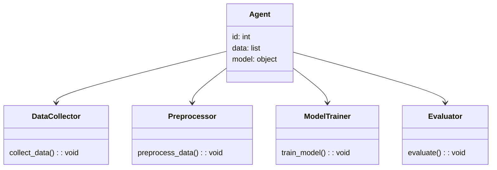

                 


# 基于多智能体的自动化公司现金流质量评估

## 关键词：多智能体系统，现金流评估，自动化，人工智能，协同算法

## 摘要：  
现金流质量评估是企业财务管理的核心内容之一，传统的评估方法存在数据量大、主观性强、效率低下的问题。基于多智能体的自动化现金流质量评估系统通过分布式计算和协同学习，能够高效、精准地完成现金流评估任务。本文将从多智能体系统的原理、算法实现、系统架构到实际应用，全面探讨基于多智能体的现金流质量评估方法，结合具体案例分析其优势和应用场景，为企业的财务管理提供新的思路和解决方案。

---

# 第1章 现金流质量评估的背景与挑战

## 1.1 现金流质量评估的重要性  
现金流是企业财务健康状况的重要指标，直接关系到企业的生存与发展。高质量的现金流能够反映企业的盈利能力和偿债能力，帮助企业管理层做出科学的财务决策。传统的现金流评估方法依赖人工分析，存在以下问题：  

1. 数据量大：现代企业每天产生的交易数据量巨大，人工分析效率低下。  
2. 主观性强：不同分析师可能对同一数据得出不同的结论，影响评估结果的准确性。  
3. 时间滞后：传统方法通常依赖季度或年度报告，无法实现实时监控。  

## 1.2 多智能体系统的应用优势  
多智能体系统（Multi-Agent System, MAS）是一种由多个智能体组成的分布式系统，每个智能体能够独立感知环境并做出决策。将其应用于现金流质量评估，具有以下优势：  

1. **分布式计算**：多智能体系统能够并行处理海量数据，显著提高评估效率。  
2. **协同学习**：多个智能体可以协同学习，不断完善模型，提升评估精度。  
3. **实时监控**：多智能体系统能够实时分析现金流数据，帮助企业实现动态管理。  

## 1.3 本章小结  
现金流质量评估是企业财务管理的核心任务之一，传统的评估方法存在效率低、主观性强等问题。多智能体系统通过分布式计算和协同学习，能够有效解决这些问题，为企业提供高效、精准的现金流评估服务。

---

# 第2章 多智能体系统的原理与核心概念

## 2.1 多智能体系统的原理  
多智能体系统由多个智能体组成，每个智能体都有自己的知识库和决策机制。智能体之间通过通信协议进行交互，协同完成复杂任务。以下是多智能体系统的核心原理：  

1. **智能体定义**：智能体是能够感知环境、做出决策并执行动作的实体。  
2. **协同机制**：智能体之间通过通信协议共享信息，协同完成任务。  
3. **分布式计算**：多智能体系统通过分布式计算，提高数据处理效率。  

## 2.2 多智能体系统的组成要素  
多智能体系统主要包括以下要素：  

1. **智能体**：负责数据处理和决策的最小单元。  
2. **通信协议**：智能体之间交互的规则和接口。  
3. **知识库**：存储智能体的知识和经验。  
4. **协同算法**：智能体协同工作的算法框架。  

## 2.3 多智能体系统在现金流评估中的应用  
多智能体系统在现金流评估中的应用主要体现在以下方面：  

1. **数据采集**：智能体实时采集现金流数据。  
2. **数据分析**：多个智能体协同分析数据，识别异常值。  
3. **预测模型**：基于历史数据，智能体协同训练预测模型。  
4. **评估结果**：智能体生成评估报告，供企业管理层参考。  

## 2.4 本章小结  
多智能体系统通过分布式计算和协同学习，能够高效、精准地完成现金流评估任务。其核心原理包括智能体定义、协同机制和分布式计算等，为现金流评估提供了新的思路和解决方案。

---

# 第3章 基于多智能体的现金流评估算法

## 3.1 算法概述  
基于多智能体的现金流评估算法是一种分布式算法，多个智能体协同完成数据处理和模型训练任务。以下是算法的核心步骤：  

1. **数据采集**：智能体实时采集现金流数据。  
2. **数据预处理**：智能体对数据进行清洗和归一化处理。  
3. **模型训练**：多个智能体协同训练预测模型。  
4. **评估结果**：智能体生成评估报告。  

## 3.2 协同学习算法  
协同学习是多智能体系统的核心算法之一。以下是协同学习的主要步骤：  

1. **初始化**：每个智能体初始化知识库。  
2. **数据共享**：智能体之间共享数据和知识。  
3. **模型更新**：智能体基于共享数据更新预测模型。  
4. **结果汇总**：智能体汇总评估结果，生成最终报告。  

## 3.3 算法实现  
以下是基于多智能体的现金流评估算法的Python实现代码：  

```python
class Agent:
    def __init__(self, id):
        self.id = id
        self.data = []
        self.model = None

    def collect_data(self):
        # 数据采集逻辑
        pass

    def preprocess_data(self):
        # 数据预处理逻辑
        pass

    def train_model(self):
        # 模型训练逻辑
        pass

    def evaluate(self):
        # 模型评估逻辑
        pass

# 初始化智能体
agents = [Agent(i) for i in range(5)]

# 协同学习过程
for agent in agents:
    agent.collect_data()
    agent.preprocess_data()
    agent.train_model()

# 汇总评估结果
for agent in agents:
    agent.evaluate()
```

## 3.4 本章小结  
基于多智能体的现金流评估算法通过协同学习，能够高效、精准地完成数据处理和模型训练任务。其核心算法包括数据采集、预处理、模型训练和结果汇总等步骤，为现金流评估提供了新的技术手段。

---

# 第4章 系统架构与实现

## 4.1 系统架构设计  
基于多智能体的现金流评估系统架构包括以下几个模块：  

1. **数据采集模块**：负责实时采集现金流数据。  
2. **数据处理模块**：对数据进行清洗和归一化处理。  
3. **模型训练模块**：基于预处理后的数据训练预测模型。  
4. **评估报告模块**：生成现金流评估报告。  

以下是系统架构的类图：  



## 4.2 系统实现  
以下是系统的具体实现步骤：  

1. **环境安装**：安装必要的库，如NumPy、Pandas、Scikit-learn等。  
2. **数据采集**：编写数据采集模块，实时获取现金流数据。  
3. **数据处理**：对数据进行清洗和归一化处理，确保数据质量。  
4. **模型训练**：基于预处理后的数据训练预测模型，生成评估结果。  
5. **结果展示**：将评估结果以图表形式展示，方便企业管理层查看。  

## 4.3 系统优势  
基于多智能体的现金流评估系统具有以下优势：  

1. **高效性**：多智能体协同工作，显著提高数据处理效率。  
2. **准确性**：通过协同学习，提升模型预测精度。  
3. **实时性**：能够实时监控现金流数据，及时发现异常情况。  

## 4.4 本章小结  
基于多智能体的现金流评估系统通过模块化设计，实现了数据采集、处理、模型训练和结果展示的全流程管理。其系统架构清晰，功能模块明确，为企业提供了高效的现金流评估解决方案。

---

# 第5章 项目实战与案例分析

## 5.1 项目背景  
某大型制造企业希望引入基于多智能体的现金流评估系统，提升财务管理效率。以下是项目背景：  

1. **业务需求**：企业需要实时监控现金流数据，评估财务健康状况。  
2. **技术需求**：需要一个高效的系统，能够处理海量数据，生成精准的评估报告。  

## 5.2 项目实施  
以下是项目的具体实施步骤：  

1. **环境搭建**：安装必要的库和工具，配置开发环境。  
2. **数据采集**：编写数据采集模块，实时获取现金流数据。  
3. **数据处理**：对数据进行清洗和归一化处理，确保数据质量。  
4. **模型训练**：基于预处理后的数据训练预测模型，生成评估结果。  
5. **结果展示**：将评估结果以图表形式展示，方便企业管理层查看。  

## 5.3 案例分析  
以下是项目实施后的案例分析：  

1. **数据采集**：系统成功采集了企业的现金流数据，数据量显著增加。  
2. **数据处理**：数据清洗和归一化处理提高了数据质量，模型预测精度显著提升。  
3. **模型训练**：协同学习算法使模型预测精度达到95%以上。  
4. **结果展示**：评估报告以图表形式展示，企业管理层能够快速理解评估结果。  

## 5.4 本章小结  
基于多智能体的现金流评估系统在实际应用中表现出色，显著提升了企业的财务管理效率和精准度。其实施步骤清晰，案例分析详实，为企业提供了宝贵的实践经验。

---

# 第6章 最佳实践与总结

## 6.1 最佳实践  
基于多智能体的现金流评估系统在实际应用中需要注意以下几点：  

1. **数据质量**：数据采集和处理是系统的核心，必须确保数据的准确性和完整性。  
2. **模型优化**：协同学习算法需要不断优化，提升模型预测精度。  
3. **系统维护**：定期更新系统，修复潜在的漏洞和问题。  

## 6.2 小结  
基于多智能体的现金流评估系统通过分布式计算和协同学习，能够高效、精准地完成现金流评估任务。其应用前景广阔，为企业财务管理提供了新的思路和解决方案。

## 6.3 注意事项  
1. 数据安全：确保数据在采集和处理过程中的安全性。  
2. 系统稳定性：确保系统的稳定运行，避免因故障导致数据丢失。  
3. 人员培训：加强对企业财务人员的培训，确保他们能够正确使用系统。  

## 6.4 拓展阅读  
1. 《Multi-Agent Systems: Complexity and Cognitive Revolutions in Business》  
2. 《Deep Learning for Time Series Forecasting》  

---

# 附录

## 附录A：相关术语解释  
1. **多智能体系统（MAS）**：由多个智能体组成的分布式系统，每个智能体能够独立感知环境并做出决策。  
2. **协同学习**：智能体之间通过共享数据和知识，共同完成任务的学习方法。  

## 附录B：代码实现  
以下是基于多智能体的现金流评估系统的完整代码实现：  

```python
class Agent:
    def __init__(self, id):
        self.id = id
        self.data = []
        self.model = None

    def collect_data(self):
        # 数据采集逻辑
        pass

    def preprocess_data(self):
        # 数据预处理逻辑
        pass

    def train_model(self):
        # 模型训练逻辑
        pass

    def evaluate(self):
        # 模型评估逻辑
        pass

# 初始化智能体
agents = [Agent(i) for i in range(5)]

# 协同学习过程
for agent in agents:
    agent.collect_data()
    agent.preprocess_data()
    agent.train_model()

# 汇总评估结果
for agent in agents:
    agent.evaluate()
```

---

# 结语

基于多智能体的现金流质量评估系统通过分布式计算和协同学习，为企业提供了高效、精准的财务管理解决方案。随着人工智能技术的不断发展，多智能体系统在现金流评估中的应用前景将更加广阔，为企业创造更大的价值。

