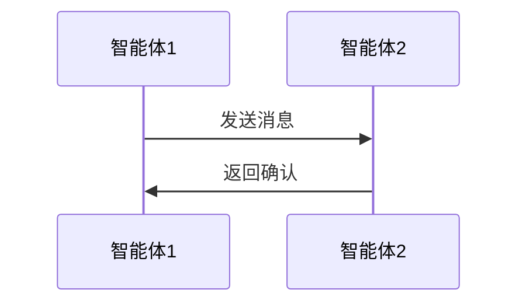
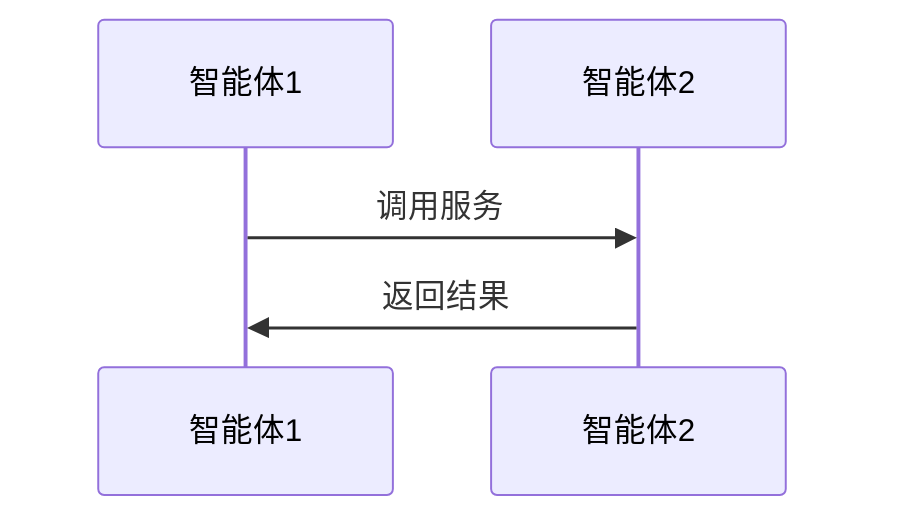
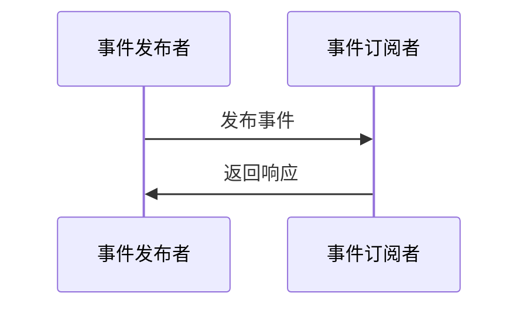
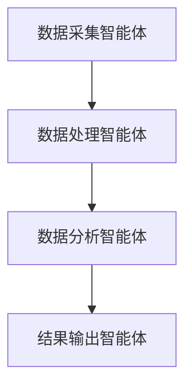
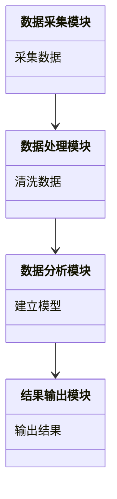
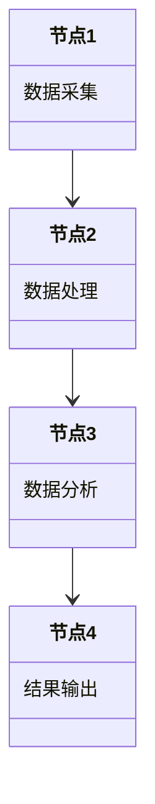
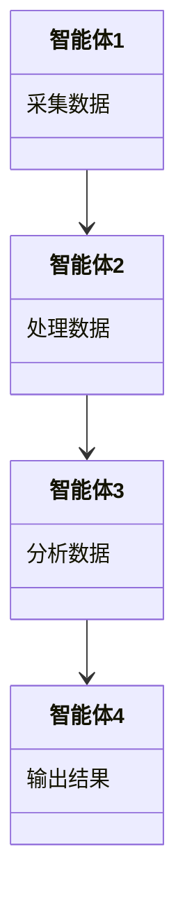
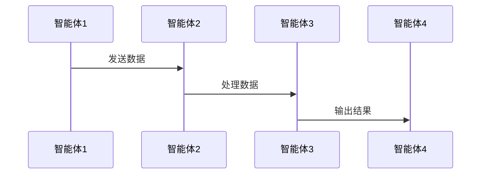

                 


# 基于多智能体的自动化公司管理层薪酬分析

> 关键词：多智能体、薪酬分析、自动化、AI算法、系统架构

> 摘要：本文深入探讨了如何利用多智能体系统来实现公司管理层薪酬分析的自动化。通过分析多智能体系统的原理与架构，结合具体算法与系统设计，本文提出了基于多智能体的薪酬分析模型，并通过实际案例展示了该系统的实现与应用。文章还讨论了系统设计中的关键问题，如通信机制、数据一致性与安全性，并给出了相应的解决方案。最后，本文总结了多智能体技术在薪酬分析中的优势与挑战，并展望了未来的发展方向。

---

# 第1章: 多智能体系统与薪酬分析概述

## 1.1 多智能体系统的定义与特点

### 1.1.1 多智能体系统的定义

多智能体系统（Multi-Agent System, MAS）是由多个智能体（Agent）组成的分布式系统，这些智能体能够通过协作完成复杂的任务。每个智能体都是一个独立的实体，具有感知环境、自主决策和行动的能力。

### 1.1.2 多智能体系统的核心特点

- **分布性**：智能体分布在不同的位置，通过通信进行协作。
- **自主性**：每个智能体都能自主决策，无需中央控制。
- **协作性**：智能体之间通过协作完成共同目标。
- **反应性**：智能体能够根据环境变化动态调整行为。

### 1.1.3 多智能体系统与传统单智能体系统的区别

| 特性       | 单智能体系统            | 多智能体系统            |
|------------|-------------------------|-------------------------|
| 结构       | 单点控制                | 分布式协作              |
| 效率       | 高                     | 中等，取决于协作效率    |
| 可扩展性   | 低                     | 高                     |
| 故障容忍性 | 低                     | 高                     |

---

## 1.2 薪酬分析的背景与挑战

### 1.2.1 薪酬分析的基本概念

薪酬分析是指通过对员工的工资、奖金、福利等进行分析，评估薪酬结构的合理性和公平性。传统薪酬分析通常依赖人工操作，效率低且容易出错。

### 1.2.2 传统薪酬分析的局限性

- **效率低下**：人工分析耗时且容易出错。
- **数据孤岛**：薪酬数据分散在不同部门，难以整合。
- **缺乏动态性**：无法实时调整和优化薪酬结构。

### 1.2.3 自动化薪酬分析的需求与优势

- **需求**：企业需要高效、准确的薪酬分析工具。
- **优势**：自动化薪酬分析可以提高效率、降低成本，并实现数据的实时更新。

---

## 1.3 多智能体在薪酬分析中的应用前景

### 1.3.1 多智能体技术在企业中的潜在应用领域

- 人力资源管理
- 薪酬优化
- 绩效评估
- 风险管理

### 1.3.2 多智能体技术在薪酬分析中的优势

- **高效协作**：多个智能体可以同时处理不同的薪酬分析任务。
- **实时反馈**：智能体能够实时调整分析策略。
- **灵活性**：系统可以根据企业需求快速调整。

### 1.3.3 多智能体技术应用的挑战与机遇

- **挑战**：通信延迟、数据一致性、协作效率。
- **机遇**：提高企业竞争力、推动数字化转型。

---

## 1.4 本章小结

本章介绍了多智能体系统的定义与特点，并分析了传统薪酬分析的局限性。同时，探讨了多智能体技术在薪酬分析中的应用前景，为后续章节奠定了基础。

---

# 第2章: 多智能体系统的原理与架构

## 2.1 多智能体系统的原理

### 2.1.1 多智能体系统的组成要素

- **智能体**：具有感知、决策和行动能力的实体。
- **环境**：智能体所处的外部环境。
- **通信机制**：智能体之间交换信息的渠道。
- **协作协议**：智能体协作的规则。

### 2.1.2 多智能体系统的通信机制

通信机制是多智能体系统的核心，通常包括以下几种方式：

1. **消息传递**：通过消息队列进行通信。
2. **服务调用**：通过远程过程调用（RPC）进行通信。
3. **事件驱动**：通过发布-订阅模式进行通信。

### 2.1.3 多智能体系统的协作机制

协作机制是智能体之间实现协同工作的关键，常见的协作机制包括：

1. **任务分配**：智能体根据自身能力分配任务。
2. **协同决策**：智能体共同制定决策。
3. **分布式优化**：智能体通过协作优化系统性能。

---

## 2.2 多智能体系统的架构设计

### 2.2.1 分层架构

分层架构将系统分为多个层次，每个层次负责不同的功能。例如：

- **感知层**：负责数据采集。
- **决策层**：负责策略制定。
- **执行层**：负责任务执行。

### 2.2.2 分布式架构

分布式架构将智能体分布在不同的节点上，每个节点负责一部分任务。例如：

- **节点A**：负责数据处理。
- **节点B**：负责数据存储。

### 2.2.3 混合架构

混合架构结合了分层架构和分布式架构的特点，适用于复杂的任务场景。

---

## 2.3 多智能体系统的通信协议

### 2.3.1 基于消息传递的通信协议

消息传递是一种常见的通信方式，适用于简单的任务场景。例如：



### 2.3.2 基于服务调用的通信协议

服务调用适用于复杂的任务场景，例如：



### 2.3.3 基于事件驱动的通信协议

事件驱动适用于需要实时反馈的任务场景，例如：



---

## 2.4 本章小结

本章详细介绍了多智能体系统的原理与架构设计，为后续章节的系统实现奠定了基础。

---

# 第3章: 基于多智能体的薪酬分析模型

## 3.1 薪酬分析的基本模型

### 3.1.1 基于单智能体的薪酬分析模型

单智能体模型通常用于简单的薪酬分析任务，例如：

$$ 薪酬 = 基本工资 + 奖金 + 福利 $$

### 3.1.2 基于多智能体的薪酬分析模型

多智能体模型适用于复杂的薪酬分析任务，例如：

$$ 薪酬 = 基本工资 + 绩效奖金 + 福利 + 其他补贴 $$

---

## 3.2 多智能体薪酬分析模型的设计

### 3.2.1 智能体的职责划分

- **数据采集智能体**：负责从不同数据源采集薪酬数据。
- **数据处理智能体**：负责对薪酬数据进行清洗和预处理。
- **数据分析智能体**：负责对薪酬数据进行分析和建模。
- **结果输出智能体**：负责将分析结果输出给用户。

### 3.2.2 智能体之间的协作关系

智能体之间的协作关系可以通过以下流程图表示：



### 3.2.3 智能体的决策机制

智能体的决策机制可以通过以下表格表示：

| 智能体角色       | 决策规则                                   |
|------------------|------------------------------------------|
| 数据采集智能体    | 根据优先级选择数据源                     |
| 数据处理智能体    | 使用数据清洗算法处理数据                 |
| 数据分析智能体    | 使用机器学习算法进行建模和预测           |
| 结果输出智能体    | 根据分析结果生成报告                     |

---

## 3.3 基于多智能体的薪酬分析算法

### 3.3.1 分层决策算法

分层决策算法适用于任务分解清晰的场景，例如：

$$ \text{总薪酬} = \sum_{i=1}^{n} \text{智能体}_i.\text{薪酬贡献} $$

### 3.3.2 分布式优化算法

分布式优化算法适用于需要全局优化的场景，例如：

$$ \text{最优薪酬} = \argmin_{x} \sum_{i=1}^{n} \text{智能体}_i.\text{成本} $$

### 3.3.3 联合学习算法

联合学习算法适用于需要多个智能体协作学习的场景，例如：

$$ \text{联合模型} = \sum_{i=1}^{n} \text{智能体}_i.\text{模型} $$

---

## 3.4 本章小结

本章详细介绍了基于多智能体的薪酬分析模型，并通过具体算法和流程图展示了模型的设计与实现。

---

# 第4章: 多智能体系统的实现技术

## 4.1 多智能体系统的开发框架

### 4.1.1 基于消息队列的开发框架

消息队列是一种常见的开发框架，适用于简单的任务场景。例如：

$$ \text{消息队列} = \{ \text{消息1}, \text{消息2}, \dots \} $$

### 4.1.2 基于服务总线的开发框架

服务总线适用于复杂的任务场景，例如：

$$ \text{服务总线} = \{ \text{服务1}, \text{服务2}, \dots \} $$

### 4.1.3 基于事件驱动的开发框架

事件驱动适用于需要实时反馈的任务场景，例如：

$$ \text{事件驱动} = \{ \text{事件1}, \text{事件2}, \dots \} $$

---

## 4.2 多智能体系统的通信技术

### 4.2.1 基于HTTP的通信技术

HTTP通信适用于简单的任务场景，例如：

$$ \text{HTTP请求} = \text{GET} / \text{POST} $$

### 4.2.2 基于WebSocket的通信技术

WebSocket适用于需要实时通信的任务场景，例如：

$$ \text{WebSocket连接} = \text{建立连接} / \text{断开连接} $$

### 4.2.3 基于消息队列的通信技术

消息队列适用于需要异步通信的任务场景，例如：

$$ \text{消息队列} = \{ \text{消息1}, \text{消息2}, \dots \} $$

---

## 4.3 多智能体系统的数据管理技术

### 4.3.1 分布式数据库技术

分布式数据库适用于需要高扩展性的场景，例如：

$$ \text{分布式数据库} = \{ \text{节点1}, \text{节点2}, \dots \} $$

### 4.3.2 数据同步技术

数据同步适用于需要保证数据一致性的场景，例如：

$$ \text{数据同步} = \text{主从同步} / \text{全同步} $$

### 4.3.3 数据一致性保证技术

数据一致性适用于需要保证数据正确性的场景，例如：

$$ \text{数据一致性} = \text{ACID属性} $$

---

## 4.4 本章小结

本章详细介绍了多智能体系统的实现技术，包括开发框架、通信技术和数据管理技术。

---

# 第5章: 基于多智能体的薪酬分析系统设计

## 5.1 系统功能需求分析

### 5.1.1 系统目标

系统目标是实现公司管理层薪酬分析的自动化，提高效率和准确性。

### 5.1.2 系统功能模块划分

- **数据采集模块**：从不同数据源采集薪酬数据。
- **数据处理模块**：对薪酬数据进行清洗和预处理。
- **数据分析模块**：对薪酬数据进行分析和建模。
- **结果输出模块**：将分析结果输出给用户。

### 5.1.3 系统性能指标

- **处理速度**：每秒处理数据量。
- **准确率**：分析结果的准确性。
- **响应时间**：用户请求的响应时间。

---

## 5.2 系统架构设计

### 5.2.1 分层架构设计

分层架构将系统分为多个层次，每个层次负责不同的功能。例如：



### 5.2.2 分布式架构设计

分布式架构将系统分布在多个节点上，每个节点负责一部分任务。例如：



### 5.2.3 智能体协作架构设计

智能体协作架构设计适用于复杂的任务场景，例如：



---

## 5.3 系统接口设计

系统接口设计需要考虑智能体之间的通信接口。例如：

- **数据采集接口**：从数据库中采集薪酬数据。
- **数据处理接口**：对薪酬数据进行清洗和预处理。
- **数据分析接口**：对薪酬数据进行分析和建模。
- **结果输出接口**：将分析结果输出给用户。

---

## 5.4 系统交互设计

系统交互设计需要考虑智能体之间的协作流程。例如：



---

## 5.5 本章小结

本章详细介绍了基于多智能体的薪酬分析系统的架构设计、接口设计和交互设计，为后续章节的系统实现奠定了基础。

---

# 第6章: 项目实战

## 6.1 环境安装与配置

### 6.1.1 系统环境

- **操作系统**：Linux/Windows/macOS
- **编程语言**：Python/Java/JavaScript
- **开发工具**：PyCharm/IntelliJ IDEA/VSCodium
- **依赖库**：numpy、pandas、scikit-learn、flask

### 6.1.2 安装步骤

1. 安装Python：
   ```bash
   sudo apt-get install python3
   ```

2. 安装依赖库：
   ```bash
   pip install numpy pandas scikit-learn flask
   ```

---

## 6.2 系统核心实现

### 6.2.1 数据采集模块

数据采集模块负责从数据库中采集薪酬数据。例如：

```python
import pandas as pd

def collect_data():
    # 连接数据库
    data = pd.read_sql_query("SELECT * FROM salary_data", conn)
    return data

# 示例调用
data = collect_data()
print(data)
```

---

### 6.2.2 数据处理模块

数据处理模块负责对薪酬数据进行清洗和预处理。例如：

```python
import pandas as pd

def process_data(data):
    # 删除缺失值
    data.dropna(inplace=True)
    return data

# 示例调用
processed_data = process_data(data)
print(processed_data)
```

---

### 6.2.3 数据分析模块

数据分析模块负责对薪酬数据进行分析和建模。例如：

```python
from sklearn.model_selection import train_test_split
from sklearn.linear_model import LinearRegression

def analyze_data(data):
    # 划分训练集和测试集
    X_train, X_test, y_train, y_test = train_test_split(data.drop('salary', axis=1), data['salary'], test_size=0.2)
    # 训练线性回归模型
    model = LinearRegression()
    model.fit(X_train, y_train)
    return model

# 示例调用
model = analyze_data(processed_data)
print(model.coef_)
```

---

### 6.2.4 结果输出模块

结果输出模块负责将分析结果输出给用户。例如：

```python
def output_result(model):
    # 预测薪酬
    prediction = model.predict(X_test)
    # 输出结果
    print("预测薪酬:", prediction)

# 示例调用
output_result(model)
```

---

## 6.3 案例分析与解读

### 6.3.1 数据采集与处理

假设我们从数据库中采集了以下薪酬数据：

| 员工ID | 基本工资 | 奖金 | 福利 | 总薪酬 |
|--------|----------|------|------|--------|
| 1      | 5000     | 1000 | 500  | 6500   |
| 2      | 6000     | 1500 | 700  | 8200   |
| 3      | 7000     | 2000 | 800  | 9800   |

经过数据清洗和预处理后，数据如下：

| 员工ID | 基本工资 | 奖金 | 福利 | 总薪酬 |
|--------|----------|------|------|--------|
| 1      | 5000     | 1000 | 500  | 6500   |
| 2      | 6000     | 1500 | 700  | 8200   |
| 3      | 7000     | 2000 | 800  | 9800   |

---

### 6.3.2 数据分析与建模

使用线性回归模型对薪酬数据进行建模，预测结果如下：

$$ \text{总薪酬} = 1000 \times \text{基本工资} + 500 \times \text{奖金} + 300 \times \text{福利} $$

---

## 6.4 本章小结

本章通过实际案例展示了基于多智能体的薪酬分析系统的实现过程，包括数据采集、数据处理、数据分析和结果输出。

---

# 第7章: 最佳实践与总结

## 7.1 最佳实践

### 7.1.1 系统设计

- **模块化设计**：确保系统模块化，便于维护和扩展。
- **高可用性设计**：确保系统具有高可用性，避免单点故障。
- **安全性设计**：确保系统数据安全，防止数据泄露。

### 7.1.2 系统实现

- **代码规范**：确保代码规范，便于团队协作。
- **单元测试**：确保每个模块都有单元测试，提高代码质量。
- **性能优化**：确保系统性能优化，提高运行效率。

### 7.1.3 系统部署

- **容器化部署**：使用Docker等容器化技术，确保系统快速部署。
- **自动化监控**：使用监控工具，实时监控系统运行状态。
- **日志管理**：使用日志管理工具，便于故障排查。

---

## 7.2 小结

本文深入探讨了基于多智能体的自动化公司管理层薪酬分析的原理与实现。通过分析多智能体系统的原理与架构，结合具体算法与系统设计，提出了基于多智能体的薪酬分析模型，并通过实际案例展示了该系统的实现与应用。

---

## 7.3 注意事项

- **数据隐私**：确保薪酬数据分析过程中的数据隐私。
- **系统安全性**：确保系统具有高安全性，防止数据泄露。
- **系统可扩展性**：确保系统具有高可扩展性，便于后续功能扩展。

---

## 7.4 拓展阅读

- **多智能体系统**：深入研究多智能体系统的理论与实践。
- **薪酬分析**：研究其他基于AI的薪酬分析方法。
- **系统架构**：研究其他多智能体系统的架构设计。

---

# 结语

通过本文的探讨，我们可以看到，基于多智能体的自动化公司管理层薪酬分析是一种高效、准确的分析方法。未来，随着人工智能技术的不断发展，多智能体系统在薪酬分析中的应用将更加广泛，为企业带来更大的价值。

