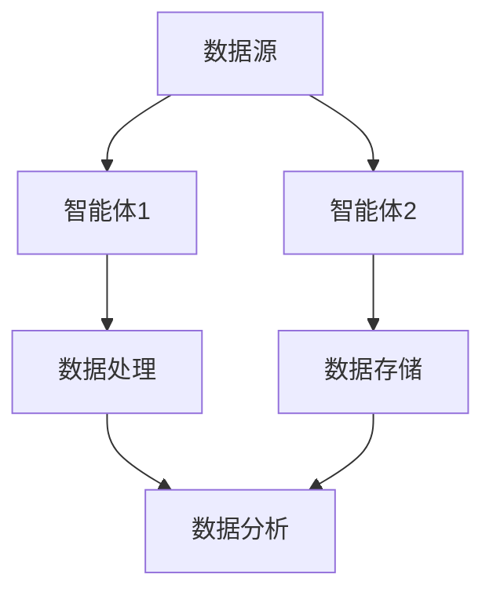

                 


# 基于多智能体的自动化公司调研系统

## 关键词：多智能体系统、自动化调研、分布式计算、联合学习、系统架构、Python实现

## 摘要

在当今快速变化的商业环境中，公司调研的效率和准确性对企业决策至关重要。传统的调研方法依赖于人工操作，耗时且容易出错。基于多智能体的自动化公司调研系统通过分布式计算和智能协作，显著提高了调研效率和准确性。本文详细探讨了多智能体系统的核心原理、算法实现、系统架构设计以及项目实战，旨在为读者提供一个全面的解决方案。

---

# 第一部分: 基于多智能体的自动化公司调研系统概述

## 第1章: 自动化公司调研系统的背景与需求

### 1.1 问题背景

#### 1.1.1 传统公司调研的痛点
传统公司调研依赖人工操作，存在以下问题：
- 数据收集耗时且成本高。
- 数据处理容易出错，缺乏准确性。
- 信息孤岛，数据难以共享。
- 缺乏实时性，难以应对快速变化的市场环境。

#### 1.1.2 自动化调研的必要性
随着人工智能和分布式技术的进步，自动化调研成为可能。自动化调研可以显著提高效率、降低成本，并增强数据的准确性和实时性。

#### 1.1.3 多智能体协作的优势
多智能体系统通过协作实现任务的分解和并行处理，提高了系统的效率和容错性。多个智能体可以同时处理不同数据源，确保数据的全面性。

### 1.2 问题描述

#### 1.2.1 公司调研的核心任务
公司调研的核心任务包括：
- 数据采集：从多个来源收集数据。
- 数据处理：清洗、整理和分析数据。
- 数据存储：将数据存储在数据库中。
- 数据分析：生成报告和洞察。

#### 1.2.2 多智能体协作的目标
多智能体协作的目标是通过分布式计算和联合学习，实现数据的高效采集、处理和分析。

#### 1.2.3 系统边界与外延
系统的边界包括数据源、智能体、数据存储和用户界面。外延则涉及数据安全、系统扩展性和容错性。

### 1.3 核心概念与系统架构

#### 1.3.1 多智能体系统的定义
多智能体系统由多个智能体组成，每个智能体都有自己的任务和目标，通过通信协作完成整体目标。

#### 1.3.2 自动化调研的实现方式
自动化调研通过智能体协作完成数据采集、处理和分析。

#### 1.3.3 系统核心要素组成
系统的核心要素包括智能体、通信协议、数据源、数据存储和用户界面。

---

## 第2章: 多智能体系统的核心概念与联系

### 2.1 多智能体系统的基本原理

#### 2.1.1 多智能体系统的组成
多智能体系统由智能体、通信协议、任务分配机制和协调机制组成。

#### 2.1.2 智能体的定义与特征
智能体是具有感知和行动能力的实体，能够独立完成任务。

#### 2.1.3 多智能体系统的通信机制
智能体之间的通信可以通过消息传递、共享内存或事件驱动的方式实现。

### 2.2 多智能体与自动化调研的结合

#### 2.2.1 多智能体在调研中的角色分配
智能体负责数据采集、处理和分析。

#### 2.2.2 智能体协作的实现方式
智能体通过分布式计算和联合学习协作完成任务。

#### 2.2.3 系统的整体架构设计
系统架构包括数据源层、智能体层、数据存储层和用户界面层。

### 2.3 多智能体系统的ER实体关系图



---

## 第3章: 多智能体协作算法

### 3.1 分布式计算与通信协议

#### 3.1.1 分布式计算的基本原理
分布式计算将任务分解为多个子任务，由不同的智能体并行处理。

#### 3.1.2 多智能体间的通信协议
通信协议定义了智能体之间消息的格式和传输方式。

#### 3.1.3 系统的同步与异步机制
同步机制确保智能体之间的数据一致性，异步机制提高效率。

### 3.2 联合学习与数据共享

#### 3.2.1 联合学习的定义与特点
联合学习允许智能体在不共享数据的情况下进行模型训练。

#### 3.2.2 数据共享的安全性问题
数据共享需要考虑隐私保护和数据安全。

#### 3.2.3 联合学习的实现流程
联合学习的实现流程包括数据预处理、模型训练和结果汇总。

### 3.3 算法实现的数学模型

#### 3.3.1 分布式计算的数学公式
$$f(x) = \sum_{i=1}^{n} f_i(x)$$

#### 3.3.2 联合学习的优化算法
$$\theta_{new} = \frac{1}{n}\sum_{i=1}^{n}\theta_i$$

---

## 第4章: 系统分析与架构设计

### 4.1 系统分析与架构设计

#### 4.1.1 问题场景介绍
系统需要处理多个数据源，完成数据采集、处理和分析。

#### 4.1.2 项目介绍
项目目标是开发一个基于多智能体的自动化公司调研系统。

#### 4.1.3 系统功能设计
系统功能包括数据采集、数据处理、数据分析和报告生成。

#### 4.1.4 系统架构设计
系统架构包括数据源层、智能体层、数据存储层和用户界面层。

### 4.2 系统架构图


---

## 第5章: 项目实战

### 5.1 环境安装

#### 5.1.1 系统需求
需要安装Python、分布式计算库和机器学习框架。

#### 5.1.2 环境配置
配置Python虚拟环境，安装必要的依赖库。

### 5.2 系统核心实现

#### 5.2.1 智能体通信模块
智能体之间的通信模块实现消息传递和状态同步。

#### 5.2.2 数据处理模块
数据处理模块负责数据清洗和转换。

#### 5.2.3 数据分析模块
数据分析模块基于机器学习模型生成报告和洞察。

### 5.3 代码实现

#### 5.3.1 智能体通信代码
```python
import zmq

context = zmq.Context()
socket = context.socket(zmq.PAIR)
socket.bind("tcp://*:5555")

while True:
    message = socket.recv()
    print(f"Received message: {message}")
    socket.send("ACK")
```

#### 5.3.2 数据处理代码
```python
import pandas as pd

data = pd.read_csv('input.csv')
processed_data = data.dropna()
processed_data.to_csv('output.csv', index=False)
```

### 5.4 案例分析

#### 5.4.1 数据源选择
从多个数据源收集公司信息。

#### 5.4.2 数据分析结果
生成公司调研报告，提供市场趋势和竞争分析。

### 5.5 项目小结

---

## 第6章: 最佳实践与总结

### 6.1 小结

#### 6.1.1 核心观点总结
多智能体系统通过协作提高调研效率和准确性。

#### 6.1.2 关键成功因素
系统的成功取决于智能体的协作机制和通信协议的设计。

### 6.2 注意事项

#### 6.2.1 数据安全
确保数据在传输和存储过程中的安全性。

#### 6.2.2 系统扩展性
设计灵活的架构以支持系统的扩展。

#### 6.2.3 系统容错性
确保系统在部分智能体故障时仍能正常运行。

### 6.3 拓展阅读

#### 6.3.1 推荐书籍
- 《分布式系统：原理与设计》
- 《多智能体系统：理论与应用》

#### 6.3.2 推荐技术博客
- [分布式计算技术博客](https://example.com)
- [多智能体系统应用博客](https://example.com)

---

## 附录: 参考文献

1. 智能体与多智能体系统
2. 分布式计算与通信协议
3. 机器学习与数据处理

---

通过以上内容，我们详细介绍了基于多智能体的自动化公司调研系统的原理、实现和应用。希望读者能够通过本文理解多智能体系统在自动化调研中的重要作用，并能够实际应用到自己的项目中。

