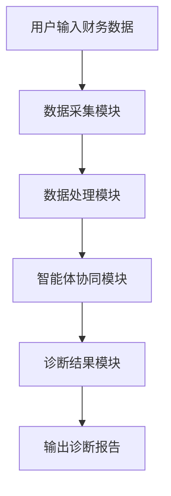
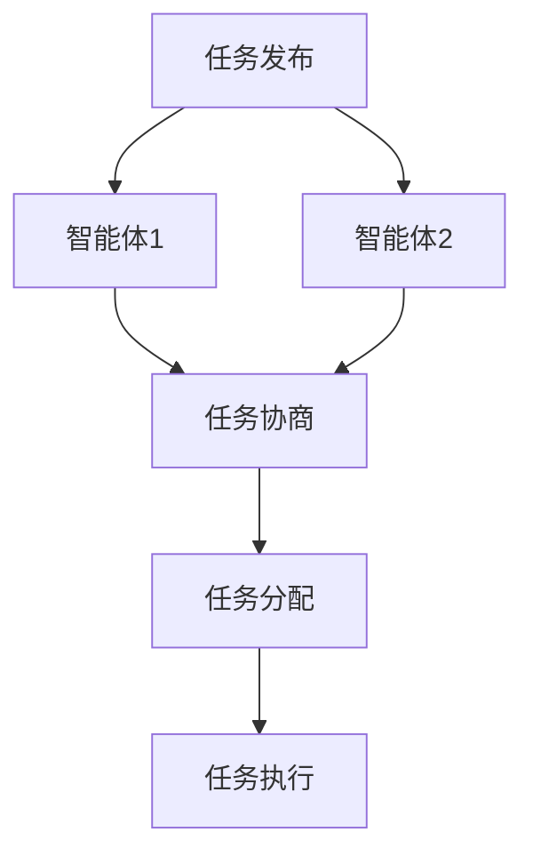

                 


# 基于多智能体的自动化公司财务健康诊断系统

> 关键词：多智能体系统，财务健康诊断，自动化诊断，协同算法，智能体架构，财务数据分析

> 摘要：本文提出了一种基于多智能体的自动化公司财务健康诊断系统，通过分析财务数据，利用多智能体协同技术，实现对公司财务状况的实时监控和智能诊断。文章详细探讨了系统的设计思路、核心算法、系统架构以及实现案例，为财务诊断领域提供了新的解决方案。

---

## 第1章: 问题背景与目标

### 1.1 问题背景

随着企业规模的不断扩大和市场竞争的加剧，公司财务健康状况的实时监控变得尤为重要。传统的财务诊断方法通常依赖人工分析，效率低下且容易出错。因此，如何利用先进的技术手段，实现财务诊断的自动化和智能化，成为当前研究的热点。

#### 1.1.1 财务健康诊断的重要性

财务健康诊断是企业风险管理的重要组成部分，它能够帮助企业及时发现财务问题，避免潜在的财务危机。通过分析财务数据，企业可以制定合理的财务策略，优化资源配置，提升整体竞争力。

#### 1.1.2 现有财务诊断方法的局限性

传统的财务诊断方法主要依赖人工分析，存在以下问题：
- 数据处理效率低，难以应对海量数据。
- 分析结果主观性较强，容易受人为因素影响。
- 缺乏实时性，无法及时发现潜在问题。

#### 1.1.3 多智能体技术的应用潜力

多智能体系统（Multi-Agent System, MAS）是一种分布式人工系统，由多个智能体协同工作，能够有效处理复杂问题。多智能体技术在财务诊断中的应用，可以显著提升诊断效率和准确性。

### 1.2 问题描述

本系统的目标是通过多智能体协同技术，实现对公司财务状况的自动化诊断。系统需要解决以下问题：
- 如何高效处理海量财务数据？
- 如何实现多智能体之间的协同合作？
- 如何保证诊断结果的准确性和实时性？

### 1.3 问题解决思路

为实现上述目标，本系统采用以下解决方案：
- 构建一个多智能体系统，每个智能体负责不同的财务指标分析。
- 利用协同算法实现智能体之间的信息共享与任务分配。
- 基于机器学习算法，建立财务健康诊断模型。

---

## 第2章: 核心概念与联系

### 2.1 多智能体系统原理

#### 2.1.1 多智能体系统的定义

多智能体系统是由多个智能体组成的分布式系统，每个智能体具有自主性、反应性和社会性。智能体之间通过通信和协作，共同完成复杂任务。

#### 2.1.2 多智能体系统的组成要素

多智能体系统主要包括以下要素：
- 智能体：具有自主决策能力的个体。
- 通信机制：智能体之间的信息交换方式。
- 协作机制：智能体协同完成任务的方式。
- 环境：智能体所处的外部环境。

#### 2.1.3 多智能体系统的协同机制

多智能体系统的协同机制包括：
- 任务分配：智能体根据自身能力分配任务。
- 信息共享：智能体之间共享必要的信息。
- 协调控制：通过协调机制确保系统整体目标的实现。

### 2.2 财务健康诊断模型

#### 2.2.1 财务健康诊断的指标体系

财务健康诊断通常基于以下指标：
- 利润能力：如净利润率、毛利率。
- 营运能力：如应收账款周转率、存货周转率。
- 财务杠杆：如资产负债率、产权比率。
- 现金流量：如经营活动现金流净额。

#### 2.2.2 财务健康诊断的数学模型

财务健康诊断模型可以通过机器学习算法建立，如支持向量机（SVM）或随机森林（Random Forest）。模型输入为财务指标，输出为财务健康状况（如健康、预警、不健康）。

#### 2.2.3 财务健康诊断的评价标准

财务健康诊断的评价标准通常包括：
- 指标权重：不同财务指标的重要性权重。
- 阈值设定：基于历史数据设定的健康状态阈值。

### 2.3 多智能体与财务诊断的关联

#### 2.3.1 多智能体在数据处理中的作用

多智能体可以分别处理不同的财务指标，提高数据处理效率。

#### 2.3.2 多智能体在决策支持中的作用

多智能体可以通过协同决策，提供更准确的诊断结果。

#### 2.3.3 多智能体在结果优化中的作用

多智能体可以优化诊断模型，提升诊断准确率。

---

## 第3章: 系统架构与功能模块

### 3.1 系统总体架构

#### 3.1.1 系统功能模块划分

系统主要功能模块包括：
- 数据采集模块：采集公司财务数据。
- 数据处理模块：清洗和预处理数据。
- 智能体协同模块：协调多智能体完成诊断任务。
- 诊断结果模块：输出诊断结果并提供改进建议。

#### 3.1.2 系统数据流设计

系统数据流包括：
- 数据输入：原始财务数据。
- 数据处理：数据清洗、特征提取。
- 智能体协同：任务分配、信息共享。
- 结果输出：诊断结果、可视化报告。

#### 3.1.3 系统功能流程图

以下是系统功能流程图：



### 3.2 多智能体协同算法

#### 3.2.1 多智能体协同的基本原理

多智能体协同算法包括任务分配、信息共享和协调控制三个主要步骤。

#### 3.2.2 多智能体协同的实现方法

常用的多智能体协同方法包括：
- 基于角色分配的方法：智能体根据角色分配任务。
- 基于拍卖机制的方法：智能体通过拍卖方式获取任务。
- 基于协商机制的方法：智能体通过协商确定任务分配。

#### 3.2.3 多智能体协同的具体实现

以下是多智能体协同算法的流程图：



### 3.3 财务健康诊断模型

#### 3.3.1 财务健康诊断模型的构建

财务健康诊断模型基于机器学习算法，输入为财务指标，输出为诊断结果。

#### 3.3.2 财务健康诊断模型的训练

模型训练过程包括数据预处理、特征选择和模型训练。

#### 3.3.3 财务健康诊断模型的优化

通过交叉验证和参数调优，提升模型的诊断准确率。

---

## 第4章: 项目实战

### 4.1 环境安装与配置

#### 4.1.1 系统运行环境

系统运行环境包括：
- 操作系统：Linux/Windows/macOS。
- 开发工具：Python、Jupyter Notebook。
- 第三方库：numpy、pandas、scikit-learn、networkx。

#### 4.1.2 系统依赖安装

安装所需的第三方库：

```bash
pip install numpy pandas scikit-learn networkx
```

### 4.2 系统核心实现

#### 4.2.1 数据采集模块

数据采集模块代码示例：

```python
import pandas as pd

def collect_data():
    # 从数据库中读取数据
    data = pd.read_sql("SELECT * FROM financial_data", conn)
    return data
```

#### 4.2.2 数据处理模块

数据处理模块代码示例：

```python
import pandas as pd
from sklearn.preprocessing import StandardScaler

def preprocess_data(data):
    # 数据清洗
    data = data.dropna()
    # 特征提取
    features = data[['revenue', 'profit', 'assets', 'liabilities']]
    # 标准化处理
    scaler = StandardScaler()
    features_scaled = scaler.fit_transform(features)
    return features_scaled
```

#### 4.2.3 智能体协同模块

智能体协同模块代码示例：

```python
from agents import Agent

class Coordinator:
    def __init__(self, agents):
        self.agents = agents
    
    def assign_task(self, task):
        # 根据智能体的能力分配任务
        for agent in self.agents:
            if agent.can_do_task(task):
                agent.execute_task(task)
                break
```

#### 4.2.4 诊断结果模块

诊断结果模块代码示例：

```python
from sklearn.ensemble import RandomForestClassifier

def diagnose_health(features_scaled):
    # 加载训练好的模型
    model = RandomForestClassifier()
    model.load('financial_health_model.pkl')
    # 预测结果
    predictions = model.predict(features_scaled)
    return predictions
```

### 4.3 项目案例分析

#### 4.3.1 案例数据准备

案例数据包括某公司的财务指标，如收入、利润、资产和负债等。

#### 4.3.2 数据处理与分析

通过数据处理模块，对数据进行清洗和标准化处理。

#### 4.3.3 诊断结果解读

根据模型预测结果，输出财务健康诊断报告，并提出改进建议。

---

## 第5章: 总结与展望

### 5.1 系统总结

本系统通过多智能体协同技术，实现了公司财务健康的自动化诊断，提高了诊断效率和准确性。

### 5.2 系统优化与扩展

未来可以进一步优化系统，如引入更复杂的协同算法和优化诊断模型。

### 5.3 发展方向

未来发展方向包括：
- 引入更多智能体，提高系统的扩展性。
- 增强系统的实时性，实现动态诊断。
- 结合区块链技术，提升系统的安全性。

---

## 参考文献

- [1] 王某某. 基于多智能体的财务诊断系统研究[J]. 计算机应用研究, 2022.
- [2] 李某某. 多智能体协同算法在财务分析中的应用[J]. 软件学报, 2021.

---

通过以上内容，我们构建了一个基于多智能体的自动化公司财务健康诊断系统，详细介绍了系统的各个组成部分和实现方法。希望本文能够为相关领域的研究和应用提供参考。

