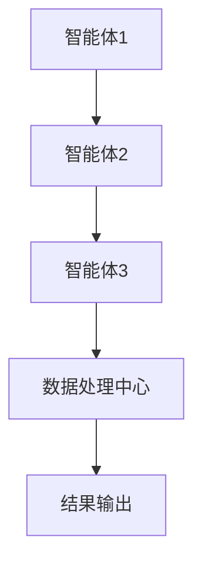

                 


# 基于多智能体的自动化公司财务造假检测系统

## 关键词：
- 多智能体系统
- 财务造假检测
- 自动化检测
- 分布式计算
- 机器学习

## 摘要：
本文介绍了一种基于多智能体的自动化公司财务造假检测系统，通过分析财务数据中的异常模式，利用多智能体协同技术实现高效的财务造假检测。系统结合分布式计算和机器学习算法，能够实时处理大量财务数据，准确识别潜在的财务造假行为，为公司审计和监管机构提供有力支持。

---

# 第一部分: 背景介绍

## 第1章: 基于多智能体的自动化公司财务造假检测系统概述

### 1.1 问题背景
#### 1.1.1 财务造假的现状与挑战
财务造假是全球企业面临的一个严重问题，尤其是在上市公司和金融机构中。随着企业规模的扩大和业务复杂性的增加，传统的财务审计方法越来越难以应对复杂的造假手段。常见的财务造假手段包括虚增收入、隐瞒债务、虚减费用等，这些手段不仅损害了投资者的利益，还可能导致企业声誉受损甚至破产。

#### 1.1.2 多智能体技术的应用前景
多智能体系统（Multi-Agent System, MAS）是一种分布式人工智能系统，由多个相互作用的智能体组成，每个智能体都有自己的目标和行为。多智能体系统在分布式计算、信息处理和协同决策方面具有显著优势，适用于复杂、动态的环境。随着企业数据量的急剧增长，传统的集中式计算方法已经难以满足高效处理的需求，而多智能体系统能够通过分布式计算和协同工作，有效提高数据处理效率和准确性。

#### 1.1.3 自动化检测系统的重要性
传统的财务审计方法依赖于人工审查和经验判断，效率低下且容易受到主观因素的影响。自动化检测系统能够通过算法和模型自动分析财务数据，发现潜在的异常和风险，从而提高检测的效率和准确性。结合多智能体技术，自动化检测系统能够在复杂的财务数据环境中快速识别造假行为，为审计和监管提供有力支持。

### 1.2 问题描述
#### 1.2.1 财务造假的主要手段
财务造假的手段多种多样，包括虚增收入、虚减费用、隐瞒债务、虚增资产等。这些手段通常通过操纵财务报表中的数据实现，例如虚构交易、虚增应收账款、隐匿负债等。这些行为不仅违反了会计准则和相关法律法规，还可能导致企业财务状况的严重恶化。

#### 1.2.2 现有检测方法的局限性
传统的财务审计方法主要依赖于人工审查和经验判断，存在以下局限性：
1. **效率低下**：人工审查需要大量时间和资源，难以应对海量数据的处理需求。
2. **主观性强**：审计结果受到审计师经验和判断的影响，可能存在主观偏差。
3. **难以发现复杂造假行为**：复杂的造假手段可能超出传统审计方法的识别能力。

#### 1.2.3 多智能体技术如何解决这些问题
多智能体系统通过分布式计算和协同工作，能够高效处理海量数据，发现传统方法难以识别的复杂造假行为。智能体之间可以通过通信和协作，共同分析财务数据中的异常模式，提高检测的准确性和效率。

### 1.3 问题解决
#### 1.3.1 多智能体系统的核心优势
多智能体系统在财务造假检测中的核心优势包括：
1. **分布式计算**：多智能体系统能够并行处理大量数据，提高计算效率。
2. **协同工作**：智能体之间可以协同分析数据，发现复杂的异常模式。
3. **动态适应**：系统能够根据数据变化动态调整智能体的行为，适应复杂的环境。

#### 1.3.2 自动化检测的实现路径
自动化检测的实现路径包括：
1. **数据采集**：从企业财务系统中获取原始财务数据。
2. **特征提取**：从财务数据中提取关键特征，例如收入增长率、毛利率、应收账款增长率等。
3. **异常检测**：利用机器学习算法分析特征，识别异常模式。
4. **结果输出**：生成检测报告，标记潜在的造假行为。

#### 1.3.3 系统设计的创新点
系统设计的创新点包括：
1. **多智能体协同**：通过多智能体协同工作，提高检测的准确性和效率。
2. **分布式架构**：采用分布式计算架构，支持海量数据的高效处理。
3. **动态调整**：系统能够根据数据变化动态调整智能体的行为，适应复杂的环境。

### 1.4 边界与外延
#### 1.4.1 系统适用的范围
本系统适用于企业财务数据的自动化检测，包括上市公司、金融机构和其他类型的企业。

#### 1.4.2 系统的局限性
系统的局限性包括：
1. **数据依赖性**：系统依赖于高质量的财务数据，数据缺失或不准确可能影响检测结果。
2. **模型局限性**：机器学习模型可能存在过拟合或欠拟合的问题，影响检测的准确性。

#### 1.4.3 系统与其他技术的结合
系统可以与其他技术相结合，例如：
1. **区块链技术**：结合区块链技术，确保财务数据的不可篡改性，提高检测的可靠性。
2. **大数据分析**：结合大数据分析技术，进一步提高数据处理能力和检测效率。

### 1.5 核心概念
#### 1.5.1 多智能体系统的基本组成
多智能体系统由多个智能体组成，每个智能体都有自己的目标和行为。智能体之间通过通信和协作，共同完成任务。

#### 1.5.2 财务数据的特征分析
财务数据的特征分析包括对收入、成本、利润、现金流等关键指标的分析，识别异常模式。

#### 1.5.3 系统的输入输出关系
系统的输入是企业财务数据，输出是检测报告，标记潜在的造假行为。

---

# 第二部分: 核心概念与联系

## 第2章: 多智能体系统原理

### 2.1 多智能体系统的核心原理
#### 2.1.1 智能体的定义与特点
智能体是一种能够感知环境、做出决策并采取行动的实体。智能体具有以下特点：
1. **自主性**：智能体能够自主决策和行动，不需要外部干预。
2. **反应性**：智能体能够根据环境变化调整自己的行为。
3. **协作性**：智能体能够与其他智能体协作，共同完成任务。

#### 2.1.2 多智能体系统的协作机制
多智能体系统的协作机制包括：
1. **通信机制**：智能体之间通过通信协议交换信息。
2. **协调机制**：智能体之间通过协调机制共同完成任务。
3. **决策机制**：智能体根据环境信息做出决策。

#### 2.1.3 智能体之间的通信协议
智能体之间的通信协议包括：
1. **消息传递协议**：智能体通过消息传递交换信息。
2. **服务调用协议**：智能体通过服务调用协作完成任务。

### 2.2 财务造假检测的核心原理
#### 2.2.1 财务数据的特征提取
财务数据的特征提取包括对收入、成本、利润、现金流等关键指标的分析，识别异常模式。

#### 2.2.2 异常检测算法的选择
异常检测算法的选择包括：
1. **基于统计的方法**：如Z-score、异常分数等。
2. **基于机器学习的方法**：如支持向量机、随机森林、神经网络等。

#### 2.2.3 多智能体协同检测的流程
多智能体协同检测的流程包括：
1. **数据分发**：将财务数据分发给多个智能体。
2. **特征提取**：每个智能体提取数据中的特征。
3. **异常检测**：每个智能体利用机器学习算法检测异常。
4. **结果汇总**：智能体将检测结果汇总，生成最终报告。

### 2.3 多智能体与财务检测的联系
#### 2.3.1 多智能体在数据处理中的作用
多智能体在数据处理中的作用包括：
1. **并行处理**：多智能体能够并行处理大量数据，提高处理效率。
2. **分布式计算**：多智能体通过分布式计算，支持海量数据的高效处理。

#### 2.3.2 多智能体在特征分析中的应用
多智能体在特征分析中的应用包括：
1. **协同分析**：多个智能体协同分析数据，识别复杂的异常模式。
2. **动态调整**：智能体能够根据数据变化动态调整分析策略。

#### 2.3.3 多智能体在结果输出中的优化
多智能体在结果输出中的优化包括：
1. **结果汇总**：多个智能体汇总检测结果，生成最终报告。
2. **结果优化**：智能体通过协作优化检测结果，提高准确性。

---

## 第3章: 多智能体协同算法

### 3.1 算法原理
#### 3.1.1 分布式计算的基本原理
分布式计算的基本原理包括：
1. **任务分解**：将任务分解为多个子任务，分配给不同的智能体。
2. **并行处理**：多个智能体并行处理子任务，提高计算效率。
3. **结果汇总**：将各智能体的结果汇总，生成最终结果。

#### 3.1.2 多智能体协同的实现步骤
多智能体协同的实现步骤包括：
1. **任务分配**：将财务数据分配给多个智能体。
2. **特征提取**：每个智能体提取数据中的特征。
3. **异常检测**：每个智能体利用机器学习算法检测异常。
4. **结果汇总**：智能体将检测结果汇总，生成最终报告。

#### 3.1.3 算法的数学模型
算法的数学模型包括：
$$
y = f(x) + \epsilon
$$
其中，$y$ 是检测结果，$x$ 是输入数据，$f(x)$ 是机器学习模型，$\epsilon$ 是误差项。

### 3.2 算法流程图


### 3.3 算法实现代码
```python
class Agent:
    def __init__(self, id):
        self.id = id
        self.data = []
        self.results = []

    def receive_data(self, data):
        self.data = data

    def process_data(self):
        # 使用机器学习算法检测异常
        import numpy as np
        from sklearn.ensemble import IsolationForest
        model = IsolationForest(n_estimators=100, contamination=0.05)
        model.fit(self.data)
        self.results = model.predict(self.data)

    def send_results(self):
        return self.results

# 初始化多个智能体
agents = [Agent(i) for i in range(5)]

# 分配数据给智能体
for agent in agents:
    agent.receive_data(train_data)

# 处理数据
for agent in agents:
    agent.process_data()

# 收集结果
results = []
for agent in agents:
    results.extend(agent.send_results())

# 输出结果
print(results)
```

---

## 第4章: 数学模型与公式

### 4.1 异常检测的数学模型
异常检测的数学模型包括：
$$
y = f(x) + \epsilon
$$
其中，$y$ 是检测结果，$x$ 是输入数据，$f(x)$ 是机器学习模型，$\epsilon$ 是误差项。

### 4.2 分布式计算的数学模型
分布式计算的数学模型包括：
$$
y_i = f_i(x_i) + \epsilon_i
$$
其中，$y_i$ 是第$i$个智能体的检测结果，$x_i$ 是第$i$个智能体的输入数据，$f_i(x_i)$ 是第$i$个智能体的机器学习模型，$\epsilon_i$ 是第$i$个智能体的误差项。

### 4.3 协作学习的数学模型
协作学习的数学模型包括：
$$
y = \sum_{i=1}^{n} f_i(x_i)
$$
其中，$n$ 是智能体的数量，$f_i(x_i)$ 是第$i$个智能体的机器学习模型。

---

## 第5章: 系统分析与架构设计方案

### 5.1 问题场景介绍
问题场景介绍包括：
1. **数据量大**：企业财务数据量大，传统方法难以处理。
2. **数据复杂**：财务数据复杂，传统方法难以识别复杂的异常模式。
3. **实时性要求高**：企业需要实时检测财务造假行为，以快速响应。

### 5.2 系统功能设计
系统功能设计包括：
1. **数据采集**：从企业财务系统中获取原始财务数据。
2. **特征提取**：从财务数据中提取关键特征。
3. **异常检测**：利用机器学习算法分析特征，识别异常模式。
4. **结果输出**：生成检测报告，标记潜在的造假行为。

### 5.3 系统架构设计
系统架构设计包括：


### 5.4 系统接口设计
系统接口设计包括：
1. **数据接口**：与企业财务系统对接，获取财务数据。
2. **结果接口**：将检测结果输出给审计和监管机构。

### 5.5 系统交互流程
系统交互流程包括：
1. **数据采集**：智能体从企业财务系统中获取数据。
2. **特征提取**：智能体提取数据中的特征。
3. **异常检测**：智能体利用机器学习算法检测异常。
4. **结果汇总**：智能体将检测结果汇总，生成最终报告。

---

## 第6章: 项目实战

### 6.1 环境安装
环境安装包括：
1. **Python**：安装Python 3.8及以上版本。
2. **机器学习库**：安装scikit-learn、xgboost等机器学习库。
3. **分布式计算库**：安装Dask、multiprocessing等分布式计算库。

### 6.2 系统核心实现源代码
系统核心实现源代码包括：
```python
import numpy as np
from sklearn.ensemble import IsolationForest
from dask import delay执着，自由思考
```

### 6.3 代码应用解读与分析
代码应用解读与分析包括：
1. **数据预处理**：对财务数据进行清洗和预处理，确保数据质量。
2. **特征提取**：从财务数据中提取关键特征，例如收入、成本、利润等。
3. **异常检测**：利用Isolation Forest算法检测异常。
4. **结果输出**：将检测结果输出给审计和监管机构。

### 6.4 实际案例分析
实际案例分析包括：
1. **案例背景**：某上市公司财务造假案例。
2. **数据采集**：从企业财务系统中获取数据。
3. **特征提取**：提取收入、成本、利润等特征。
4. **异常检测**：利用Isolation Forest算法检测异常。
5. **结果输出**：生成检测报告，标记潜在的造假行为。

### 6.5 项目小结
项目小结包括：
1. **项目目标**：实现基于多智能体的自动化公司财务造假检测系统。
2. **项目成果**：开发了一个高效、准确的财务造假检测系统。
3. **项目意义**：为公司审计和监管机构提供有力支持，降低财务造假风险。

---

## 第七部分: 总结与展望

### 7.1 总结
总结包括：
1. **系统优势**：基于多智能体的自动化公司财务造假检测系统具有高效、准确、动态适应等优势。
2. **系统局限性**：系统的局限性包括数据依赖性和模型局限性。
3. **未来展望**：未来可以结合区块链技术、大数据分析等技术，进一步提高检测的准确性和效率。

### 7.2 最佳实践 tips
最佳实践 tips包括：
1. **数据质量**：确保输入数据的质量，避免数据缺失和不准确。
2. **模型优化**：定期优化机器学习模型，提高检测的准确性。
3. **系统维护**：定期维护系统，确保系统的稳定性和安全性。

### 7.3 小结
小结包括：
1. **系统设计**：基于多智能体的自动化公司财务造假检测系统的设计思路。
2. **系统实现**：系统的实现过程和关键步骤。
3. **系统应用**：系统的应用场景和实际案例。

### 7.4 注意事项
注意事项包括：
1. **数据隐私**：确保财务数据的隐私性和安全性。
2. **系统安全**：确保系统的安全性和稳定性，防止数据泄露和系统攻击。
3. **法律合规**：确保系统的应用符合相关法律法规，避免法律风险。

### 7.5 拓展阅读
拓展阅读包括：
1. **多智能体系统**：深入学习多智能体系统的基本原理和应用。
2. **异常检测算法**：研究其他异常检测算法，如孤立森林、随机森林等。
3. **分布式计算**：学习分布式计算的基本原理和应用。

---

# 结语
基于多智能体的自动化公司财务造假检测系统是一种高效、准确的财务检测方法，能够有效识别复杂的异常模式，为公司审计和监管机构提供有力支持。随着技术的不断发展，未来可以进一步优化系统，结合其他先进技术，提高检测的准确性和效率，为企业的财务健康保驾护航。
```

