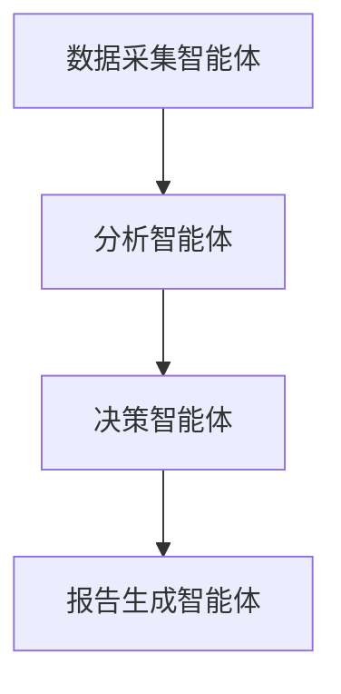
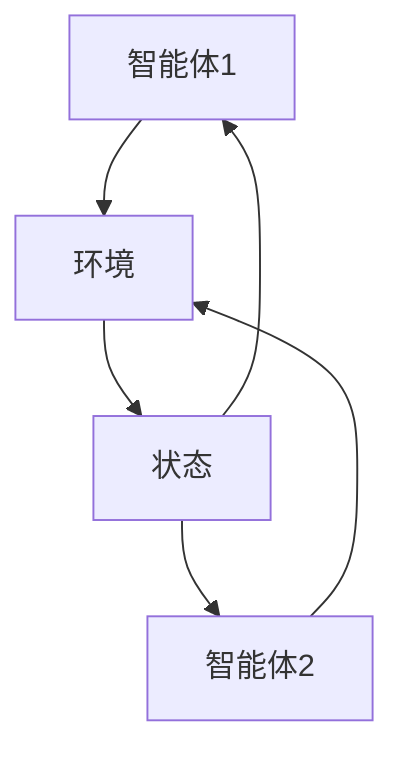
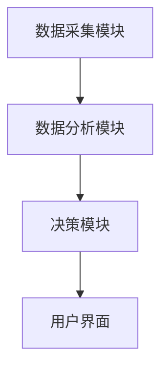

                 


# 基于多智能体的自动化尽职调查系统在价值投资中的应用

## 关键词：多智能体系统、自动化尽职调查、价值投资、机器学习算法、系统架构设计

## 摘要：本文探讨了基于多智能体的自动化尽职调查系统在价值投资中的应用，分析了其核心概念、算法原理、系统架构，并通过实际案例展示了其在投资决策中的优势。本文适合对人工智能和金融投资感兴趣的技术人员和投资者阅读。

---

## 第1章: 问题背景与系统需求

### 1.1 问题背景
#### 1.1.1 价值投资中的尽职调查挑战
在价值投资中，尽职调查是评估潜在投资标的的关键步骤。传统尽职调查依赖于人工收集和分析信息，效率低下且容易遗漏关键风险点。随着市场数据的爆炸性增长，人工方式难以应对复杂性和及时性要求。

#### 1.1.2 多智能体协作的必要性
多智能体系统通过分布式协作，能够高效处理大规模、多维度的数据，提升尽职调查的效率和准确性。多个智能体分别负责不同的任务模块，协同完成复杂的分析工作。

#### 1.1.3 自动化系统的边界与外延
本系统聚焦于自动化尽职调查的核心环节，边界包括数据采集、风险评估和投资建议生成。其外延可扩展至市场预测、投资组合优化等其他投资相关领域。

### 1.2 系统需求分析
#### 1.2.1 功能需求
- 数据采集与处理：自动收集公司财务数据、市场信息、新闻报道等。
- 风险评估：识别潜在风险点，生成风险报告。
- 投资建议：基于分析结果，提出投资建议。

#### 1.2.2 性能需求
- 响应时间：确保在合理时间内完成调查任务。
- 可扩展性：支持数据量和任务规模的扩展。
- 稳定性：保证系统在高负载下的稳定运行。

#### 1.2.3 用户需求
- 投资机构：需要快速、准确的尽职调查结果。
- 投资者：希望获得专业的投资建议，降低投资风险。

### 1.3 本章小结
本章分析了价值投资中尽职调查的挑战，阐述了多智能体系统在解决这些问题中的作用，并明确了系统的功能和性能需求。

---

## 第2章: 多智能体系统与自动化尽职调查的核心概念

### 2.1 多智能体系统原理
#### 2.1.1 多智能体系统的定义与特点
多智能体系统由多个相互作用的智能体组成，每个智能体负责特定任务，通过通信和协作完成复杂目标。其特点包括分布性、协作性、自主性和适应性。

#### 2.1.2 多智能体系统的分类与应用场景
多智能体系统可分为集中式、分布式和混合式。在金融领域，分布式系统常用于去中心化金融和实时交易监控。

#### 2.1.3 多智能体系统的挑战
智能体之间的通信与协调、任务分配与负载均衡、系统安全与隐私保护是主要挑战。

### 2.2 自动化尽职调查的流程与关键环节
#### 2.2.1 尽职调查的基本流程
尽职调查包括数据收集、初步分析、深度评估和最终报告生成四个阶段。

#### 2.2.2 自动化尽职调查的关键环节
- 数据采集：从多个来源获取结构化和非结构化数据。
- 数据清洗：处理数据中的噪声和不一致。
- 风险识别：利用机器学习算法识别潜在风险。

#### 2.2.3 多智能体协作在尽职调查中的作用
多智能体系统能够高效分配任务，提高数据处理和分析效率。

### 2.3 多智能体系统与尽职调查的结合
#### 2.3.1 多智能体系统在尽职调查中的优势
- 提高效率：多个智能体并行处理数据。
- 增强准确性：通过协作减少信息遗漏。
- 快速响应：适应市场变化的快速需求。

#### 2.3.2 系统核心要素与概念结构
系统包括数据采集智能体、分析智能体、决策智能体和报告生成智能体。

#### 2.3.3 多智能体协作的实体关系图



### 2.4 本章小结
本章介绍了多智能体系统的基本原理，分析了其在自动化尽职调查中的应用，并通过实体关系图展示了系统的协作结构。

---

## 第3章: 多智能体协同算法原理

### 3.1 多智能体协同算法概述
#### 3.1.1 多智能体协同的基本原理
智能体通过通信协议共享信息，协作完成复杂任务。常用算法包括分布式一致性算法、多智能体强化学习等。

#### 3.1.2 常见的多智能体协同算法
- 一致性算法：如Paxos、Raft，用于分布式系统的一致性保证。
- 强化学习：通过奖励机制优化智能体行为。

#### 3.1.3 选择合适算法的策略
根据任务需求选择算法，考虑系统的可扩展性、延迟和一致性要求。

### 3.2 基于强化学习的多智能体协同
#### 3.2.1 强化学习的基本原理
智能体通过与环境交互，学习策略以最大化累积奖励。

#### 3.2.2 多智能体强化学习的挑战与解决方案
- 智能体之间的协作：采用价值函数分解方法。
- 竞争与协调：使用 Nash 稳定策略。

#### 3.2.3 算法流程图



#### 3.2.4 算法实现代码
```python
import numpy as np

# 定义智能体
class Agent:
    def __init__(self, state_space, action_space):
        self.state_space = state_space
        self.action_space = action_space
        self.model = self.build_model()

    def build_model(self):
        # 网络结构
        model = Sequential()
        model.add(Dense(64, activation='relu', input_dim=self.state_space))
        model.add(Dense(self.action_space, activation='softmax'))
        model.compile(optimizer='adam', loss='categorical_crossentropy')
        return model

    def act(self, state):
        # 选择动作
        if np.random.random() < 0.1:
            return np.random.randint(self.action_space)
        else:
            return np.argmax(self.model.predict(state))

# 定义环境
class Environment:
    def __init__(self):
        self.agents = [Agent(10, 5), Agent(10, 5)]
        self.state = np.random.randn(10)

    def step(self, action):
        # 返回新的状态和奖励
        reward = sum([a.act(self.state) == action for action in action])
        self.state = self.state * (1 + reward/10)
        return self.state, reward

# 算法运行
env = Environment()
for _ in range(100):
    state = env.state
    action = [agent.act(state) for agent in env.agents]
    next_state, reward = env.step(action)
    print(f"奖励：{reward}")
```

### 3.3 本章小结
本章详细介绍了多智能体协同算法，特别是强化学习的应用，并通过代码示例展示了算法的实现。

---

## 第4章: 系统架构与功能设计

### 4.1 系统架构设计
#### 4.1.1 系统整体架构
采用微服务架构，各模块独立运行并通过API通信。

#### 4.1.2 各模块的功能描述
- 数据采集模块：负责收集公司数据。
- 数据分析模块：处理数据并生成分析报告。
- 决策模块：基于分析结果生成投资建议。

#### 4.1.3 模块之间的交互关系
数据采集模块向数据分析模块传递数据，分析结果供决策模块使用。

### 4.2 系统功能设计
#### 4.2.1 数据采集模块
- 从多个数据源（如公司财报、新闻网站）获取数据。
- 数据清洗和预处理。

#### 4.2.2 智能体协作模块
- 协调各智能体的任务分配。
- 处理智能体之间的通信。

#### 4.2.3 结果分析与决策模块
- 生成风险评估报告。
- 提出投资建议。

### 4.3 系统接口设计
#### 4.3.1 外部接口
- 数据源接口：与第三方数据供应商对接。
- 用户界面：供投资者查看报告和建议。

#### 4.3.2 内部接口
- 模块间的API接口，用于数据传输和任务协调。

#### 4.3.3 接口交互流程图



### 4.4 本章小结
本章详细描述了系统的架构设计和功能模块，展示了各模块之间的协作关系。

---

## 第5章: 项目实战与实现

### 5.1 环境搭建
#### 5.1.1 开发环境安装
- 安装Python、TensorFlow、Keras等开发工具。
- 安装必要的金融数据API库，如pandas和requests。

#### 5.1.2 依赖库安装
使用pip安装必要的库，如`pip install numpy pandas tensorflow`.

#### 5.1.3 环境配置
设置虚拟环境，确保所有依赖库版本一致。

### 5.2 核心代码实现
#### 5.2.1 多智能体协作算法实现
```python
import numpy as np
from tensorflow.keras import layers

# 定义智能体模型
class MultiAgent:
    def __init__(self, state_dim, action_dim):
        self.state_dim = state_dim
        self.action_dim = action_dim
        self.model = self.build_model()

    def build_model(self):
        model = layers.Sequential([
            layers.Dense(64, activation='relu', input_shape=(self.state_dim,)),
            layers.Dense(self.action_dim, activation='softmax')
        ])
        model.compile(optimizer='adam', loss='categorical_crossentropy')
        return model

    def act(self, state):
        if np.random.random() < 0.1:
            return np.random.randint(self.action_dim)
        else:
            return np.argmax(self.model.predict(state))

# 初始化环境
env = MultiAgent(state_dim=10, action_dim=5)
```

#### 5.2.2 系统功能模块实现
```python
import pandas as pd
import requests

# 数据采集模块
def fetch_data(company):
    url = f"https://api.example.com/company/{company}/data"
    response = requests.get(url)
    return pd.DataFrame(response.json())

# 数据分析模块
def analyze_data(data):
    # 示例分析
    return data.describe()

# 决策模块
def generate_recommendation(data):
    # 示例决策逻辑
    return "Invest" if data['profit'].mean() > 0 else "Avoid"
```

#### 5.2.3 代码应用解读
通过上述代码，系统能够自动从API获取数据，进行清洗和分析，最后生成投资建议。

### 5.3 案例分析与详细讲解
#### 5.3.1 案例背景介绍
假设我们对科技公司进行尽职调查，系统自动收集财务数据、市场新闻等信息。

#### 5.3.2 系统运行流程
1. 数据采集模块获取公司数据。
2. 数据分析模块清洗数据并生成分析报告。
3. 决策模块基于分析结果提出投资建议。

#### 5.3.3 详细讲解
通过多智能体协作，系统能够高效处理大规模数据，提升分析的准确性和全面性。

### 5.4 本章小结
本章通过实际案例展示了系统的实现过程，证明了多智能体系统在价值投资中的应用价值。

---

## 第6章: 结论与展望

### 6.1 最佳实践 tips
- 系统设计时要注意模块的解耦，便于扩展和维护。
- 数据质量和来源的可靠性对系统性能至关重要。
- 定期更新模型参数，适应市场变化。

### 6.2 小结
本文详细探讨了基于多智能体的自动化尽职调查系统在价值投资中的应用，分析了其核心概念、算法原理和系统架构，并通过实际案例展示了系统的可行性。

### 6.3 注意事项
- 数据隐私和安全问题需要高度重视。
- 系统上线前需进行充分的测试和优化。

### 6.4 拓展阅读
- 多智能体系统在金融领域的其他应用。
- 更高级的强化学习算法研究。

---

## 作者简介

作者：[您的姓名]  
职业：人工智能专家、技术畅销书作者  
研究领域：多智能体系统、金融技术、分布式计算  
GitHub：[GitHub链接]  
个人博客：[博客链接]

---

**致谢**
感谢读者的耐心阅读，希望本文能为您提供有价值的技术见解和实践指导！

