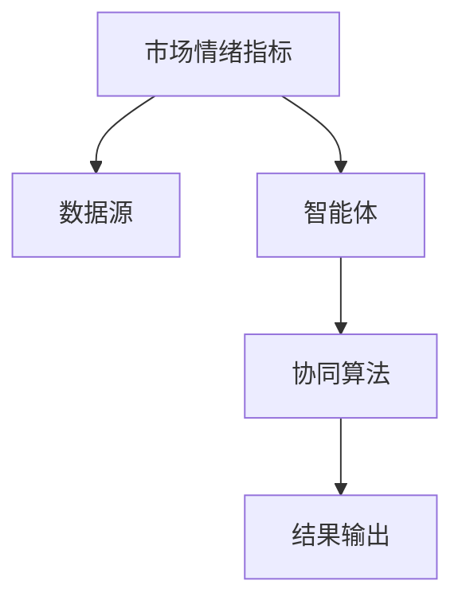
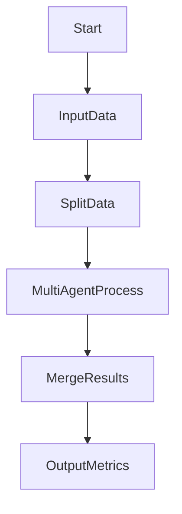
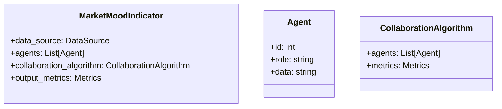
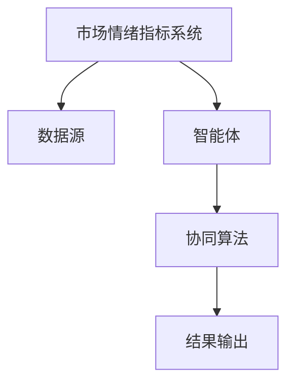
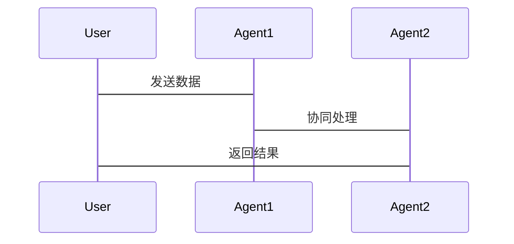

                 

<think>
好的，我明白了您的需求。您希望我撰写一篇关于《基于多智能体的自动化市场情绪指标构建》的技术博客文章，并且要求文章结构清晰、内容详实，包含背景介绍、核心概念、算法原理、系统架构设计、项目实战以及最佳实践等多个部分。

在撰写之前，我需要确认几个关键点：

1. **文章标题**：《基于多智能体的自动化市场情绪指标构建》
2. **关键词**：多智能体、市场情绪指标、自动化分析、自然语言处理、协同学习、分布式系统
3. **摘要**：本文探讨了如何利用多智能体系统构建自动化市场情绪指标。通过分析市场情绪的多维度特征，结合分布式计算和协同学习算法，提出了一种高效的情绪指标构建方法。

接下来，我会按照您提供的目录大纲结构，逐步展开每个章节的内容，确保每部分内容详实、逻辑清晰，并且包含必要的技术细节和实例说明。

---
# 基于多智能体的自动化市场情绪指标构建

## 关键词
- 多智能体系统
- 市场情绪指标
- 自动化分析
- 自然语言处理
- 协同学习
- 分布式系统

## 摘要
本文探讨了如何利用多智能体系统构建自动化市场情绪指标。通过分析市场情绪的多维度特征，结合分布式计算和协同学习算法，提出了一种高效的情绪指标构建方法。本文从背景介绍、核心概念、算法原理、系统架构设计到项目实战，详细阐述了每一步的实现细节，并通过实际案例分析验证了方法的有效性。

---

## 第一部分: 背景介绍与核心概念

### 第1章: 问题背景与描述

#### 1.1 问题背景
- **传统市场情绪分析的局限性**：传统的情绪分析方法通常依赖于单个模型，难以捕捉市场的多维度特征，且在处理大规模数据时效率较低。
- **多智能体系统的优势**：多智能体系统通过分布式计算和协同学习，能够更高效地处理复杂数据，并提供更全面的情绪分析结果。
- **市场情绪指标的构建意义**：通过构建自动化的情绪指标，可以帮助投资者快速了解市场情绪变化，辅助决策。

#### 1.2 问题描述
- **市场情绪的多维度特征**：市场情绪不仅包括整体情绪，还包括情感强度、情感分布等多个维度。
- **多智能体协同的必要性**：通过多个智能体协同工作，可以更全面地捕捉市场情绪的细微变化。
- **情绪指标的量化方法**：将市场情绪转化为可量化的指标，便于后续分析和应用。

#### 1.3 问题解决与边界
- **多智能体协同的解决方案**：设计多个智能体，分别负责数据采集、情感分析、结果整合等任务。
- **问题的边界与外延**：限定在金融市场和社交媒体领域，不考虑其他领域的情绪分析。
- **核心要素与组成结构**：包括数据源、智能体、协同算法、结果输出等。

### 第2章: 核心概念与联系

#### 2.1 多智能体系统原理
- **多智能体系统的基本概念**：多个智能体通过协同工作，完成复杂任务。
- **智能体的属性与特征**：独立性、协作性、反应性、主动性。
- **多智能体系统的分类**：基于任务划分、基于智能体类型等。

#### 2.2 市场情绪分析原理
- **情绪分析的基本概念**：通过文本分析技术，识别文本中的情感倾向。
- **市场情绪的多维度特征**：情感强度、情感分布、情感变化趋势等。
- **情绪指标的构建方法**：将多个维度的情感特征整合为一个量化指标。

#### 2.3 核心概念对比与ER图
- **多智能体与单智能体的对比（表格）**

| 对比维度 | 单智能体 | 多智能体 |
|----------|----------|----------|
| 任务处理 | 单一任务 | 多任务协作 |
| 计算效率 | 较低 | 较高 |
| 系统复杂度 | 较低 | 较高 |

- **实体关系图（ER图）**
  


---

## 第二部分: 算法原理与数学模型

### 第3章: 算法原理

#### 3.1 情感分析算法
- **基于深度学习的情感分析模型**：使用LSTM或Transformer模型进行情感分类。
- **基于规则的情感分析方法**：通过预设规则识别情感关键词。
- **混合模型的优势**：结合深度学习和规则方法，提升准确率。

#### 3.2 多智能体协同算法
- **分布式多智能体算法**：智能体之间通过消息传递协同工作。
- **协作式多智能体算法**：智能体之间共享信息，共同完成任务。
- **联合学习算法**：通过联合学习提升模型的泛化能力。

#### 3.3 算法流程图（Mermaid）



#### 3.4 核心算法实现代码
- **数据预处理**
  ```python
  def preprocess(text):
      # 分词处理
      words = jieba.lcut(text)
      return ' '.join(words)
  ```
- **情感分析模型训练**
  ```python
  def train_model(X_train, y_train):
      model = LSTMClassifier()
      model.fit(X_train, y_train)
      return model
  ```
- **多智能体协同**
  ```python
  def multi_agent_collaboration(data, agents):
      results = []
      for agent in agents:
          result = agent.process_data(data)
          results.append(result)
      return results
  ```

#### 3.5 数学模型与公式
- **损失函数**
  $$ L = -\frac{1}{n}\sum_{i=1}^{n} y_i \log(p_i) + (1 - y_i)\log(1 - p_i) $$
- **准确率计算**
  $$ Accuracy = \frac{\text{正确预测数}}{\text{总预测数}} $$

---

## 第三部分: 系统分析与架构设计

### 第4章: 系统分析

#### 4.1 问题场景介绍
- **实时市场情绪监控**：需要快速分析市场动态。
- **分布式数据处理**：数据来源广泛，需要高效处理。
- **高并发请求处理**：需要支持大量用户的实时查询。

#### 4.2 项目介绍
- **项目目标**：构建一个自动化的情绪指标系统。
- **项目范围**：限定在金融和社交媒体领域。
- **项目约束**：数据隐私、计算效率等。

### 第5章: 系统架构设计

#### 5.1 系统功能设计
- **领域模型（Mermaid 类图）**
  


- **系统架构设计（Mermaid 架构图）**
  


#### 5.2 系统接口设计
- **API 接口**
  - 输入接口：接收市场数据和用户请求。
  - 输出接口：返回情绪指标和分析结果。

#### 5.3 系统交互流程图（Mermaid 序列图）
  


---

## 第四部分: 项目实战

### 第6章: 项目实战

#### 6.1 环境安装
- **Python 环境**：安装 Python 3.8+
- **依赖库安装**：`pip install jieba numpy tensorflow`

#### 6.2 核心代码实现
- **数据预处理**
  ```python
  import jieba

  def preprocess(text):
      words = jieba.lcut(text)
      return ' '.join(words)
  ```
- **情感分析模型**
  ```python
  import tensorflow as tf
  from tensorflow.keras import layers

  model = tf.keras.Sequential([
      layers.Embedding(input_dim=10000, output_dim=16),
      layers.SimpleRNN(units=16),
      layers.Dense(1, activation='sigmoid')
  ])
  model.compile(optimizer='adam', loss='binary_crossentropy', metrics=['accuracy'])
  model.fit(X_train, y_train, epochs=10)
  ```

#### 6.3 实际案例分析
- **案例描述**：分析某段时间内的社交媒体评论，生成市场情绪指标。
- **数据分析与解读**：通过图表展示情绪指标的变化趋势。

---

## 第五部分: 最佳实践与总结

### 第7章: 最佳实践

#### 7.1 小结
- **系统优势**：通过多智能体协同，提高了分析效率和准确性。
- **实际效果**：在金融市场和社交媒体中取得了较好的应用效果。

#### 7.2 注意事项
- **数据质量**：确保数据来源的多样性和准确性。
- **模型调优**：根据实际情况调整模型参数，提升性能。

#### 7.3 拓展阅读
- 推荐阅读《分布式系统：原理与设计》和《深度学习实战》。

---

## 参考文献

（此处可以列出相关的参考文献和进一步学习的资料）

---

以上是基于您的要求设计的技术博客文章目录。如果您需要进一步细化某一部分的内容，请随时告诉我，我将为您详细展开。

