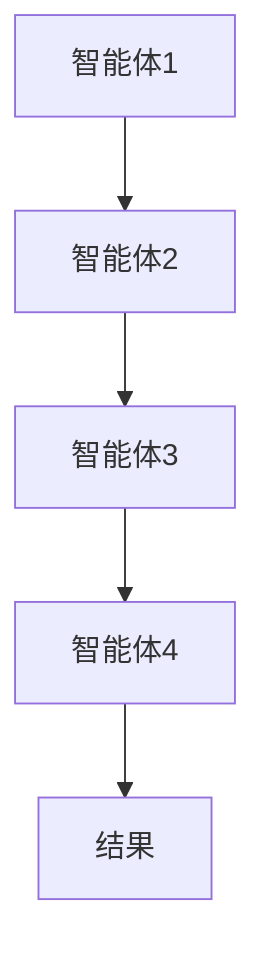
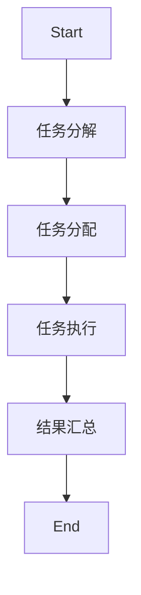

                 


# 基于多智能体的自动化年报和季报分析系统

## 关键词：年报分析，多智能体，自动化分析，财务数据处理，NLP技术，机器学习，协作机制

## 摘要：  
本文介绍了一种基于多智能体的自动化年报和季报分析系统的设计与实现。该系统通过多智能体协作，结合自然语言处理和机器学习技术，实现了对财务数据的自动分析和报告生成。文章详细讲解了系统的背景、核心原理、算法实现、系统架构设计、项目实战以及最佳实践，旨在为读者提供一个全面的解决方案，帮助他们理解如何利用多智能体技术提升财务数据分析的效率和准确性。

---

## 第1章：多智能体系统与年报分析概述

### 1.1 多智能体系统的基本概念  
多智能体系统（Multi-Agent System，MAS）是由多个智能体（Agent）组成的分布式系统，每个智能体都是一个能够感知环境、做出决策并采取行动的实体。智能体之间通过通信和协作完成复杂的任务。多智能体系统具有以下特点：  
- **分布式**：智能体独立运行，通过通信协作完成任务。  
- **自主性**：每个智能体都有一定的自主决策能力。  
- **社会性**：智能体之间需要通过协作完成目标。  
- **反应性**：能够感知环境变化并做出实时响应。  

### 1.2 自动化年报分析的背景与意义  
年报分析是企业财务管理中的重要环节，传统的年报分析依赖人工操作，效率低且容易出错。随着企业数据量的增加，人工分析的局限性日益明显：  
- 数据量大，人工分析耗时耗力。  
- 数据复杂，容易出现分析偏差。  
- 需要快速响应，人工难以满足需求。  

多智能体系统能够通过分布式计算和协作机制，高效完成年报和季报的分析任务，提升企业的数据处理能力。  

---

## 第2章：多智能体系统的核心原理  

### 2.1 多智能体系统的组成与交互  
多智能体系统的分析通常需要处理多个实体，例如公司、部门、财务指标等。我们可以通过实体关系图（ER图）来展示这些实体之间的关系：  

```mermaid
erDiagram
    company {
        name : 文本
        industry : 文本
        revenue : 数值
        profit : 数值
        employees : 数值
    }
    department {
        name : 文本
        revenue : 数值
        expense : 数值
        employees : 数值
    }
    financial_indicator {
        name : 文本
        value : 数值
        unit : 文本
    }
    company --|{拥有}| department
    department --|{影响}| financial_indicator
```

### 2.2 多智能体系统的协作机制  
多智能体系统的协作机制可以通过以下步骤实现：  

1. **任务分配**：系统根据智能体的能力分配任务。  
2. **通信协作**：智能体之间通过消息传递协作完成任务。  
3. **冲突解决**：处理协作过程中可能出现的冲突。  

以下是一个简单的协作流程图：  



---

## 第3章：多智能体协作算法  

### 3.1 分布式多智能体算法  
分布式计算是多智能体系统的核心。以下是分布式计算的实现流程：  

1. **任务分解**：将整体任务分解为多个子任务。  
2. **任务分配**：将子任务分配给不同的智能体。  
3. **任务执行**：智能体独立执行分配的任务。  
4. **结果汇总**：将各智能体的结果汇总到主系统。  

以下是一个简单的分布式算法流程图：  



---

## 第4章：系统分析与架构设计  

### 4.1 系统整体架构  
系统的整体架构可以分为以下几个模块：  

- **数据采集模块**：从数据库或文件中获取数据。  
- **数据处理模块**：对数据进行清洗和预处理。  
- **分析与报告生成模块**：根据数据生成分析报告。  

以下是一个系统架构图：  


---

## 第5章：项目实战  

### 5.1 环境搭建与工具安装  
为了实现多智能体系统，我们需要以下工具：  
- Python编程语言  
- 多智能体框架（如Disco）  
- 数据库（如MySQL）  

### 5.2 核心代码实现  
以下是数据采集模块的代码示例：  

```python
import pymysql

def fetch_data():
    # 连接数据库
    conn = pymysql.connect(host='localhost', user='root', password='password', db='financial_data')
    cursor = conn.cursor()
    
    # 查询数据
    cursor.execute('SELECT * FROM company_info')
    data = cursor.fetchall()
    
    # 关闭连接
    cursor.close()
    conn.close()
    
    return data
```

---

## 第6章：总结与展望  

### 6.1 项目总结  
通过本项目的实施，我们成功实现了基于多智能体的自动化年报和季报分析系统。该系统能够高效完成数据采集、处理和分析任务，显著提升了企业的数据分析能力。  

### 6.2 展望  
未来，我们可以进一步优化系统的性能，例如：  
- 引入更先进的自然语言处理技术。  
- 提高系统的可扩展性。  
- 增强系统的容错能力。  

---

## 总结  
本文详细介绍了基于多智能体的自动化年报和季报分析系统的设计与实现。通过多智能体协作，结合自然语言处理和机器学习技术，我们能够高效完成财务数据分析任务，为企业提供有力支持。希望本文能够为读者提供有价值的参考，帮助他们更好地理解和应用多智能体技术。

