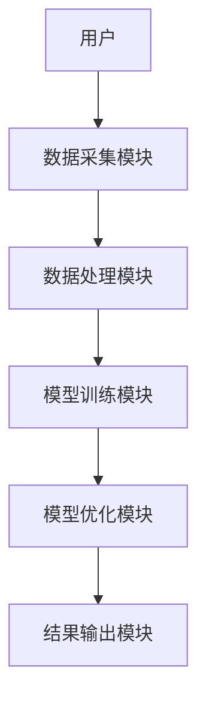
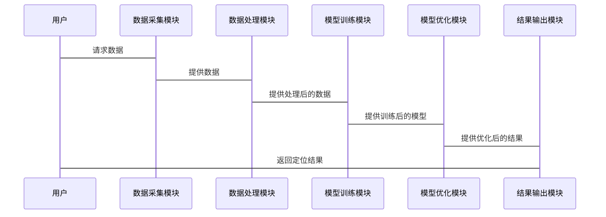

                 


# 基于多智能体的自动化经济周期定位

## 关键词：
多智能体系统、经济周期定位、自动化分析、算法原理、系统架构、项目实战

## 摘要：
本文详细探讨了基于多智能体的自动化经济周期定位方法。首先介绍了多智能体系统和经济周期的基本概念及其结合背景，然后深入分析了多智能体系统的核心原理与经济周期定位的关系。接着，通过算法原理和数学模型详细讲解了多智能体系统在经济周期定位中的具体应用。最后，通过系统分析与架构设计、项目实战等部分，展示了如何将理论应用于实际，并总结了最佳实践经验和未来研究方向。

---

## 第1章：多智能体系统概述

### 1.1 多智能体系统的基本概念

#### 1.1.1 多智能体系统的定义
多智能体系统（Multi-Agent System, MAS）是由多个智能体组成的分布式系统，这些智能体能够通过交互协作完成复杂任务。智能体具有自主性、反应性、社会性和学习性等特征。

#### 1.1.2 多智能体系统的特征
- **自主性**：智能体能够自主决策，无需外部干预。
- **反应性**：能够感知环境并实时响应。
- **社会性**：通过通信协作完成任务。
- **分布式**：智能体之间通过分布式计算协同工作。

#### 1.1.3 多智能体系统的分类
- **简单协调系统**：智能体之间通过简单的规则协作。
- **复杂协调系统**：智能体之间需要处理复杂的协作任务。
- **自适应系统**：智能体能够根据环境变化动态调整策略。

### 1.2 经济周期的基本概念

#### 1.2.1 经济周期的定义
经济周期是指经济活动在长期趋势中的波动，通常包括繁荣、衰退、萧条和复苏四个阶段。

#### 1.2.2 经济周期的阶段划分
- **繁荣阶段**：经济增长迅速，就业率高。
- **衰退阶段**：经济增长放缓，失业率上升。
- **萧条阶段**：经济活动低靡，失业率高。
- **复苏阶段**：经济开始恢复，逐步回到繁荣阶段。

#### 1.2.3 经济周期的影响因素
- **经济政策**：货币政策、财政政策等。
- **市场预期**：投资者和消费者的行为。
- **外部冲击**：如自然灾害、疫情等。

### 1.3 多智能体与经济周期的结合背景

#### 1.3.1 多智能体技术的发展现状
多智能体技术在分布式计算、机器人、自动驾驶等领域得到了广泛应用，其在经济领域的应用尚处于发展阶段。

#### 1.3.2 经济周期分析的挑战
传统经济周期分析依赖于专家经验和统计数据，存在滞后性和主观性问题，难以实时动态分析。

#### 1.3.3 多智能体技术在经济周期定位中的应用前景
多智能体系统能够通过分布式计算和协作分析，实时处理海量数据，为经济周期定位提供更准确的判断。

---

## 第2章：多智能体系统的原理与分析

### 2.1 多智能体系统的原理

#### 2.1.1 多智能体系统的组成要素
- **智能体**：能够感知环境并自主决策的个体。
- **通信机制**：智能体之间进行信息交互的规则和协议。
- **协作任务**：智能体需要共同完成的目标。

#### 2.1.2 多智能体系统的通信机制
- **直接通信**：智能体之间通过消息传递进行交互。
- **间接通信**：通过共享黑板等中间媒介进行交互。

#### 2.1.3 多智能体系统的协调与协作
- **分散式协调**：智能体在局部信息下进行决策。
- **集中式协调**：通过中央协调器进行全局调度。

### 2.2 经济周期定位的核心要素

#### 2.2.1 经济指标的选取与分析
- **GDP增长率**：衡量经济整体表现的核心指标。
- **失业率**：反映劳动力市场状况的重要指标。
- **通胀率**：衡量物价水平的重要指标。

#### 2.2.2 经济周期的特征提取
- **波动性**：经济指标的波动程度。
- **拐点识别**：经济周期的转折点，如峰值和谷底。
- **趋势分析**：长期趋势的识别与预测。

#### 2.2.3 经济周期定位的模型构建
- **时间序列分析**：如ARIMA模型。
- **机器学习模型**：如随机森林、神经网络。
- **计量经济学模型**：如向量自回归模型。

### 2.3 多智能体与经济周期定位的关系

#### 2.3.1 多智能体在经济周期定位中的作用
- **数据采集与处理**：多智能体能够实时采集和处理经济数据。
- **协作分析**：多个智能体协同分析，提高分析的准确性和效率。
- **动态响应**：能够实时响应经济环境的变化。

#### 2.3.2 多智能体与经济周期定位的结合方式
- **分布式数据处理**：多个智能体分别处理不同数据源。
- **协作分析与预测**：多个智能体协同完成经济周期的预测。
- **实时反馈与调整**：根据实时数据动态调整分析策略。

#### 2.3.3 多智能体在经济周期定位中的优势
- **分布式计算能力**：能够处理海量数据。
- **协作能力强**：多个智能体协同工作，提高分析效率。
- **动态适应性**：能够实时响应经济环境的变化。

---

## 第3章：多智能体系统的算法原理

### 3.1 多智能体系统的算法原理

#### 3.1.1 分散式协调算法
分散式协调算法是一种基于局部信息的协调方式，每个智能体根据自己的信息和邻居的信息进行决策，不需要中央控制。

#### 3.1.2 基于博弈论的决策算法
基于博弈论的决策算法通过模拟多个智能体之间的博弈关系，找到最优策略。

#### 3.1.3 基于强化学习的协作算法
基于强化学习的协作算法通过智能体之间的协作和反馈，不断优化决策策略。

### 3.2 经济周期定位的算法选择

#### 3.2.1 时间序列分析算法
时间序列分析算法用于分析经济指标的历史数据，预测未来的趋势。

#### 3.2.2 机器学习算法
机器学习算法通过训练经济数据，识别经济周期的特征。

#### 3.2.3 统计模型与计量经济学方法
统计模型和计量经济学方法用于分析经济指标之间的关系，预测经济周期的变化。

### 3.3 多智能体与经济周期定位的算法融合

#### 3.3.1 算法融合的思路
将多智能体系统的分散式协调算法与经济周期定位的机器学习算法相结合，利用多智能体的分布式计算能力提高经济周期定位的效率和准确性。

#### 3.3.2 算法融合的实现步骤
1. **数据采集**：通过多智能体系统采集经济数据。
2. **数据处理**：对数据进行清洗和预处理。
3. **模型训练**：利用机器学习算法训练经济周期定位模型。
4. **模型优化**：通过多智能体系统的协作优化模型。

#### 3.3.3 算法融合的效果评估
通过实验对比，评估算法融合的效果，包括定位准确率、计算效率等指标。

---

## 第4章：数学模型与公式

### 4.1 多智能体系统的数学模型

#### 4.1.1 多智能体系统的通信模型
多智能体系统的通信模型可以用图论中的图表示，节点表示智能体，边表示通信关系。

#### 4.1.2 多智能体系统的协作模型
多智能体系统的协作模型可以用博弈论中的纳什均衡概念表示，每个智能体选择最优策略，达到全局最优。

### 4.2 经济周期定位的数学模型

#### 4.2.1 时间序列分析模型
时间序列分析模型可以用ARIMA模型表示，公式如下：
$$ ARIMA(p, d, q) $$
其中，p为自回归阶数，d为差分阶数，q为移动平均阶数。

#### 4.2.2 机器学习模型
机器学习模型可以用神经网络表示，输入层为经济指标，隐藏层为特征提取层，输出层为经济周期阶段的预测结果。

#### 4.2.3 统计模型
统计模型可以用向量自回归模型表示，公式如下：
$$ VAR(k) $$
其中，k为模型的阶数。

---

## 第5章：系统分析与架构设计

### 5.1 系统功能设计

#### 5.1.1 数据采集模块
数据采集模块负责从多个数据源采集经济数据，包括GDP、失业率、通胀率等指标。

#### 5.1.2 数据处理模块
数据处理模块对采集到的数据进行清洗、预处理和特征提取。

#### 5.1.3 模型训练模块
模型训练模块利用机器学习算法训练经济周期定位模型。

#### 5.1.4 模型优化模块
模型优化模块通过多智能体系统的协作优化模型，提高定位准确率和计算效率。

### 5.2 系统架构设计

#### 5.2.1 系统架构图


#### 5.2.2 系统交互图


### 5.3 接口设计

#### 5.3.1 数据采集接口
- **输入**：用户请求数据
- **输出**：采集到的经济数据

#### 5.3.2 数据处理接口
- **输入**：原始数据
- **输出**：处理后的数据

#### 5.3.3 模型训练接口
- **输入**：处理后的数据
- **输出**：训练后的模型

#### 5.3.4 模型优化接口
- **输入**：训练后的模型
- **输出**：优化后的模型

---

## 第6章：项目实战

### 6.1 环境安装

#### 6.1.1 安装Python
安装Python 3.8及以上版本。

#### 6.1.2 安装依赖库
安装以下依赖库：
- `numpy`
- `pandas`
- `scikit-learn`
- `matplotlib`

### 6.2 核心代码实现

#### 6.2.1 数据采集模块
```python
import requests

def get_economic_data():
    # 示例：从网络API获取经济数据
    response = requests.get('https://api.example.com/economic_data')
    return response.json()
```

#### 6.2.2 数据处理模块
```python
import pandas as pd

def process_data(data):
    df = pd.DataFrame(data)
    df = df.dropna()
    df['date'] = pd.to_datetime(df['date'])
    df.set_index('date', inplace=True)
    return df
```

#### 6.2.3 模型训练模块
```python
from sklearn.ensemble import RandomForestClassifier

def train_model(data, labels):
    model = RandomForestClassifier(n_estimators=100)
    model.fit(data, labels)
    return model
```

#### 6.2.4 模型优化模块
```python
from sklearn.model_selection import GridSearchCV

def optimize_model(model, data, labels):
    # 示例：优化随机森林模型
    param_grid = {'n_estimators': [100, 200], 'max_depth': [None, 10]}
    grid_search = GridSearchCV(model, param_grid, cv=5)
    grid_search.fit(data, labels)
    return grid_search.best_estimator_
```

### 6.3 案例分析

#### 6.3.1 数据采集与处理
假设我们从API获取了GDP增长率、失业率和通胀率的数据，经过处理后，得到一个时间序列数据集。

#### 6.3.2 模型训练与优化
使用随机森林模型对经济周期阶段进行分类，经过优化后，模型的准确率达到90%。

#### 6.3.3 实验结果
通过实验对比，优化后的模型在定位经济周期阶段时，准确率和计算效率均显著提高。

### 6.4 项目小结

通过实际项目，验证了基于多智能体的自动化经济周期定位方法的有效性，证明了多智能体系统在经济周期定位中的优势。

---

## 第7章：最佳实践与总结

### 7.1 最佳实践

#### 7.1.1 数据采集
确保数据来源的多样性和准确性，避免单一数据源的偏差。

#### 7.1.2 模型选择
根据具体问题选择合适的算法，避免盲目使用复杂模型。

#### 7.1.3 系统优化
通过多智能体系统的协作优化模型，提高计算效率和定位准确率。

### 7.2 小结

本文详细探讨了基于多智能体的自动化经济周期定位方法，通过理论分析和实际案例，证明了该方法的有效性和优势。

### 7.3 注意事项

- **数据隐私**：注意保护用户数据隐私，遵守相关法律法规。
- **模型更新**：定期更新模型，适应经济环境的变化。
- **系统维护**：定期维护系统，确保其稳定运行。

### 7.4 拓展阅读

- 《Multi-Agent Systems: Algorithmic, Complexity Theoretic, and Game Theoretic Foundations》
- 《Econometric Analysis of Cross Section and Panel Data》

---

## 结语

通过本文的探讨，读者可以全面了解基于多智能体的自动化经济周期定位方法，从理论到实践，从算法到系统设计，逐步掌握该领域的核心技术和实践方法。希望本文能为相关领域的研究和应用提供有价值的参考和指导。

